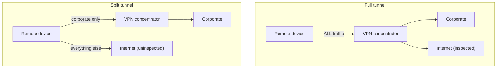

# 🚇 VPNs & Encrypted Tunnels

> [!abstract] Note of [[Network Security Architecture]]
> A VPN carries private traffic across an untrusted network by wrapping it in encryption — packets inside packets. This note explains tunnelling as encapsulation, compares the protocols that do it, and confronts the security tension at the heart of the VPN: the same tunnel that protects a remote worker also extends the trusted network to wherever that worker's device happens to be.

## Parent Learning Order
Firewall Architecture & Policy -> Network Segmentation & Zero Trust -> VPNs & Encrypted Tunnels -> Intrusion Detection & Network Monitoring -> Egress Control & Web Proxies -> Network Access Control

## A Private Network Over a Public One

> *Your packet carries a private source address that no Internet router can deliver a reply to. How does it cross the Internet?*
>
> Hold your answer — the section below is the response.

A **VPN (Virtual Private Network)** makes two endpoints on an untrusted network — usually the Internet — behave as if they were on one private network, by building an encrypted **tunnel** between them. Traffic entering the tunnel is encrypted, carried across the public path unreadable, and decrypted at the far end.

The mechanism is **encapsulation**: the original packet, with its private addresses and payload, is encrypted and then placed *inside* a new packet addressed between the two tunnel endpoints. To the public network, it sees only tunnel-endpoint-to-tunnel-endpoint traffic; the real conversation is hidden inside.

```text
Original packet:   [ private src | private dst | payload ]
After tunnelling:  [ public src | public dst | ENCRYPTED( private src | private dst | payload ) ]
```

This is the same encapsulation principle from the foundations branch, now used deliberately for security. And it carries the same cost noted there: each layer of wrapping consumes bytes, so a tunnel reduces the usable payload size, which is why VPNs are a classic source of MTU problems and why the encapsulation and PMTU material matters here in practice.

Two topologies cover most uses:

- **Site-to-site** joins two networks — two offices, or an office and a cloud environment — through gateway devices, so hosts on each side reach the other transparently.
- **Remote-access** connects a single device — a laptop — into a network, which is the work-from-anywhere case.

**Prerequisites:** encapsulation, IP routing, and TLS.

> [!tip] The analogy, and where it breaks
> Sending a sealed diplomatic bag through the ordinary postal system: outsiders see only a bag moving between two embassies, never its contents. The analogy breaks on the consequence people forget — the bag also extends embassy privileges to whoever is at the far end. If that remote office is compromised, the tunnel faithfully carries the intruder straight into the building it was protecting.

## The Protocols

Different protocols make the tunnel, and they differ in a way that matters.

**IPsec** operates at the network layer and is the long-standing standard, especially for site-to-site. It authenticates and encrypts IP traffic, negotiating security associations through a key-exchange protocol. It is powerful and interoperable, and it is complex — many moving parts (phases, proposals, identities) that must agree, which is why "IPsec won't come up" is a common and fiddly troubleshooting exercise. Because it integrates with the OS network stack, a packet can match routing and firewall policy yet still fail because peer authentication or proposal negotiation disagreed.

**WireGuard** is the modern design: deliberately minimal, using fixed modern cryptography and a tiny codebase. Its small size is a security argument in itself — less code is less attack surface and is auditable — and it connects far faster than IPsec's multi-phase negotiation. It authenticates peers by public key, and its simplicity has made it the default choice for new deployments.

**TLS-based VPNs** (often called SSL VPNs) tunnel over TLS, typically on port 443. Their advantage is traversal: because they look like HTTPS, they pass through restrictive firewalls and captive networks that block IPsec. This makes them convenient for remote access from arbitrary networks, at the cost of the TLS-termination considerations from the web branch.

| Protocol | Layer | Character | Best for |
| --- | --- | --- | --- |
| **IPsec** | Network | Powerful, complex, interoperable | Site-to-site, standards environments |
| **WireGuard** | Network | Minimal, fast, modern | New deployments, performance |
| **TLS VPN** | Above transport | Firewall-friendly (looks like HTTPS) | Remote access through restrictive networks |

```bash
sudo wg show
```

Expected excerpt:

```text
interface: wg0
  public key: <redacted>
  listening port: 51820
peer: <peer key>
  endpoint: 203.0.113.44:51820
  allowed ips: 10.10.60.0/24
  latest handshake: 41 seconds ago
  transfer: 1.24 MiB received, 892 KiB sent
```

`allowed ips` is the security-critical field: it defines exactly which addresses this peer may send and receive through the tunnel. A too-broad value here (`0.0.0.0/0` for a peer that should reach one subnet) is an over-permissive tunnel — the VPN equivalent of a broad firewall rule.

## Split Tunnel Versus Full Tunnel

A remote-access VPN must decide what traffic goes through the tunnel, and this choice is a genuine security trade-off with no free answer.

**Full tunnel** routes *all* the device's traffic through the VPN, including its general Internet browsing. The organization sees and can filter everything, applying its egress controls and monitoring to the remote device as if it were on-site. The cost is performance (all traffic detours through the VPN concentrator) and privacy (the employer sees personal browsing).

**Split tunnel** routes only traffic destined for the organization's network through the tunnel, sending everything else directly to the Internet. This is faster and lighter, but the device's general Internet traffic bypasses organizational inspection — and a compromised remote device now has one interface into the corporate network and another straight to the attacker, which can be used to bridge the two.



There is no universally correct choice; it depends on whether the priority is visibility and control (full) or performance and scale (split), and on how much the remote device is otherwise hardened and monitored.

**The deliberate break:** a VPN reads as a security control. The tunnel is encrypted and both ends authenticated, so the connection is secure and the matter is settled.

It secures the transport and, in the same motion, **extends the trust boundary to a device the organisation does not control**. A compromised home machine that completes a tunnel is now on the internal network, and the VPN carries the attacker's traffic inward over an encrypted, authenticated, entirely trusted channel — faithfully, exactly as designed. Nothing about the tunnel failed. The question a VPN answers is whether the transport is protected; the question it silently decides is what the far end is now attached to.

**How you'd spot it:** ask what the tunnel granted rather than what it protected. A VPN that drops a connecting device onto a flat internal network has extended the perimeter to that endpoint; one that grants access per application, by identity and device posture, has not. Two concrete checks follow: whether MFA is enforced at the concentrator, since without it the whole path is one phished credential wide, and whether split tunnel was an argued decision or an inherited default.

## Security Implications

**A VPN extends the trust boundary to the remote device.** This is the central tension. The tunnel authenticates and encrypts the connection, but once established, the remote device is *on the network*. If that device is compromised — malware, a hostile home network, a shared family computer — the VPN faithfully carries the attacker's traffic straight into the corporate network over an encrypted, trusted channel. The VPN secured the transport and, in doing so, extended the perimeter to an endpoint the organization does not fully control. This is precisely the weakness that motivates zero trust: rather than trusting a device because it completed a VPN tunnel, verify each access by identity and device posture regardless of the tunnel.

**The VPN concentrator is critical infrastructure and a prime target.** It is the front door for remote access, it terminates encryption, and it has a route into the internal network. VPN gateway vulnerabilities have been among the most exploited entry points in real breaches, because compromising the concentrator yields authenticated network access directly. It deserves priority patching, strong authentication, and monitoring.

**Multi-factor authentication on the VPN is essential.** A VPN authenticated by password alone is one phished or stuffed credential away from giving an attacker network access. MFA on every VPN login is a baseline control, and its absence is a serious, common finding.

**Split tunnel is a deliberate visibility trade-off.** Choosing split tunnel accepts that remote devices' general traffic is uninspected and that a compromised device bridges two networks. That may be an acceptable trade for performance if devices are well-hardened and monitored independently, but it must be a conscious decision, not a default.

**Tunnels can hide malicious traffic and defeat controls.** The same encapsulation that protects legitimate traffic lets an attacker tunnel out past egress controls — data exfiltration inside an encrypted tunnel to an attacker's endpoint passes a firewall that sees only an encrypted flow. Detecting unsanctioned tunnels (unexpected encrypted flows to unknown endpoints, protocol anomalies) is part of egress monitoring.

All VPN configuration and testing described here must target only systems within an authorized scope. Establishing tunnels into networks you do not control, or probing VPN concentrators, requires explicit authorization.

## Summary

You should now be able to:

- Explain what a VPN does and how encapsulation carries private traffic across a public network; distinguish site-to-site from remote-access.
- Compare IPsec, WireGuard, and TLS VPNs by layer and character; read tunnel state, explain the `allowed ips` control, and describe the split-versus-full-tunnel trade-off.
- Explain why a VPN extends the trust boundary to the remote device and how that motivates zero trust; argue why the concentrator is a prime target requiring MFA and priority patching, and how the same encapsulation that protects traffic can hide exfiltration past egress controls.

---
> 🔼 Up: [[Network Security Architecture]]
