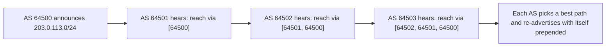

# 🌐 BGP & Internet Routing

> [!abstract] Note of [[Routing & the Network Layer]]
> The Internet is not one network but tens of thousands of independent ones that agree, moment to moment, on how to reach each other. The protocol that negotiates that agreement runs on trust between strangers, which is why a single false announcement has repeatedly rerouted large parts of the Internet. This note explains how BGP works, why it is fragile, and what is being done about it.

## Parent Learning Order
IP Forwarding & the Routing Table -> Static Routing & Default Gateways -> Interior Gateway Protocols -> BGP & Internet Routing -> First-Hop Redundancy & Gateway Failover -> Routing Security & Path Validation

## A Network of Networks

> *Inside one company, every router trusts every other router. What replaces that trust on the Internet?*
>
> Hold your answer — the section below is the response.

Interior protocols route inside one organization, where every router is trusted because one owner controls them all. The Internet has no single owner. It is a mesh of about a hundred thousand **autonomous systems (AS)** — independently operated networks, each identified by an **AS number** — that must exchange reachability information without trusting each other the way routers inside one company do.

**BGP (Border Gateway Protocol)** is the protocol they use. It is the **exterior gateway protocol** that glues the Internet together, and it works on a fundamentally different principle from interior protocols: instead of computing shortest paths over a shared map, BGP is a **path-vector** protocol in which each AS *announces* which blocks of addresses it can reach and *through which sequence of autonomous systems*. Its neighbours accept those announcements, prepend their own AS number, and pass them on.



The **AS-path** — the list of autonomous systems a route has traversed — serves two purposes. It lets each AS apply policy (prefer this neighbour, avoid that one), and it prevents loops: an AS that sees its own number already in a path rejects the announcement. Crucially, path selection is driven by **policy**, not by shortest distance. An AS chooses routes based on business relationships — which neighbours it pays, which pay it, which it peers with for free — so the path a packet takes across the Internet reflects commercial agreements as much as geography.

**Prerequisites:** interior routing protocols and longest-prefix match.

> [!tip] The analogy, and where it breaks
> Independent postal companies in different countries agreeing, contract by contract, whose mail they will carry and to whom they will pass it on — each announcing 'I can reach these addresses, via this chain of companies'. The analogy breaks because a real contract is verified: no postal firm could simply declare it serves another country's addresses and have the world believe it. BGP historically had no such check, which is exactly why prefix hijacking works.

## Why BGP Is Fragile

BGP's design assumes announcements are truthful. It has, historically, **no built-in mechanism to verify that an AS is actually entitled to announce the address blocks it claims.** When an AS announces a prefix, its neighbours largely take that claim on faith.

This produces two structural failure classes.

**Prefix hijacking — claiming address space you do not own.** If an AS announces a prefix belonging to someone else, neighbours that accept the announcement will send that prefix's traffic toward the announcer. Combined with longest-prefix match, a hijacker announcing a *more specific* prefix than the legitimate owner attracts traffic globally, because more specific always wins. The traffic can be blackholed (dropped, causing an outage for the victim) or intercepted (forwarded on after inspection, an on-path position at Internet scale).

**Route leaks — propagating routes you should not.** An AS that learns routes from one neighbour and improperly re-announces them to another can pull traffic that had no business flowing through it, causing congestion, latency, or exposure. Unlike a hijack, the addresses are announced by their real owner; the fault is in who the routes are leaked *to*.

Both have caused real, large-scale incidents in which traffic for major services was rerouted through unintended networks — sometimes by accident from a configuration error, sometimes deliberately. The defining characteristic, as with all routing manipulation, is that **connectivity often still works.** Users reach the service; the traffic simply travelled somewhere it should not have, where it could be observed or delayed. This is what makes routing attacks insidious: the usual "is it up?" test passes.

## The Slow Path to Security

Because BGP's trust problem is architectural, fixing it means adding verification without breaking a system that must never stop running. The effort has proceeded in layers.

**RPKI (Resource Public Key Infrastructure)** lets an address holder cryptographically declare which AS is authorized to originate its prefixes, in a signed object called a **Route Origin Authorization (ROA)**. Networks that perform **Route Origin Validation** then check announcements against these signed records and can reject or deprioritize a route whose origin AS is not authorized. RPKI directly addresses the "wrong AS is announcing this prefix" case — the origin of a hijack.

RPKI's limitation is that it validates only the *origin*, not the whole *path*. It confirms the right AS originated the prefix but does not prove the AS-path is genuine, so a sophisticated attacker who forges a path ending in the legitimate origin can still evade origin validation. Path-validation efforts (such as BGPsec and, more pragmatically, coordinated filtering frameworks like MANRS) aim at the remaining gap, but full path security is not yet universal. The honest state of affairs is that origin validation is deploying steadily and meaningfully reduces accidental and unsophisticated hijacks, while complete path integrity remains an open, incrementally-addressed problem.

**Filtering and route registries** remain the workaday defense: networks filter which prefixes and AS-paths they accept from each neighbour, using published intent in routing registries. This is unglamorous and imperfect — it depends on every network doing its part — but it prevents a large share of leaks and hijacks in practice.

## Worked Example: Reading a Path, and Watching a More-Specific Win

BGP's failure mode is easier to believe once you have watched the routing table
prefer the wrong announcement without anything reporting an error.

> [!note] Representative output
> Reconstructed from a lab of this shape rather than copied from one capture. Field layouts and flag names match the named tool; addresses and identifiers are synthetic.

**The legitimate route.** From a router three autonomous systems away, the path
back to the origin is written out in full:

```shell-session
operator@router-c:~$ sudo vtysh -c "show ip bgp 203.0.113.0/24"
BGP routing table entry for 203.0.113.0/24
Paths: (1 available, best #1, table default)
  64501 64500
    192.0.2.23 from 192.0.2.23 (192.0.2.2)
      Origin IGP, valid, external, best (First path received)
      Last update: Sun Apr 12 09:41:18 2026
```

`64501 64500` is the AS-path read right to left: AS 64500 originated the prefix,
AS 64501 passed it along. That list is the entire basis on which the rest of the
Internet decides this route is genuine — a claim, propagated by other people's
routers, with no cryptographic backing at all.

**A more-specific announcement appears.** A second AS announces a /25 inside
that /24, and the table changes without complaint:

```shell-session
operator@router-c:~$ sudo vtysh -c "show ip bgp"
   Network          Next Hop      Metric LocPrf Weight Path
*> 203.0.113.0/24   192.0.2.23                       0 64501 64500 i
*> 203.0.113.0/25   192.0.2.13                       0 64511 i
```

Both routes are marked `*>` — valid and best *for their own prefix*. Nothing is
in conflict as far as BGP is concerned, because they are different prefixes. But
forwarding uses longest-prefix match, so every packet for the first half of that
range now leaves toward AS 64511:

```shell-session
operator@router-c:~$ sudo vtysh -c "show ip route 203.0.113.20"
Routing entry for 203.0.113.0/25
  Known via "bgp", distance 20, metric 0, best
  * 192.0.2.13, via eth1
```

This is the shape of almost every real hijack. Nothing was overwritten, no alarm
fired, and the destination still appears reachable — traffic simply goes
somewhere else first. Because the announcement is more specific it wins
everywhere it propagates, which is why a hijack of a /25 out of someone else's
/24 is both effective and hard to notice from inside the affected network.

**What origin validation catches.** With RPKI enabled and a ROA declaring AS
64500 as the only authorized origin, the router can now express an opinion:

```shell-session
operator@router-c:~$ sudo vtysh -c "show bgp ipv4 unicast rpki invalid"
   Network          Next Hop      Path
*  203.0.113.0/25   192.0.2.13     64511 i
```

The route is now marked `invalid` and, with a policy that acts on that state, is
never selected. Note what this does *not* prove: RPKI validates that the origin
AS is entitled to announce the prefix, not that the AS-path is truthful. An
attacker who forges a path ending in `64500` while still carrying the traffic
themselves produces a route that validates cleanly — which is exactly the residual
gap path validation exists to close.

**The deliberate break:** BGP reads as somebody else's infrastructure. You do not operate an autonomous system, you cannot configure any of it, and so it files itself under trivia rather than under threat model.

Your traffic can be redirected by networks you have no relationship with and no leverage over — which puts BGP firmly inside the threat model while remaining outside your control, an uncomfortable combination that is exactly why it gets skipped. Two things are within reach regardless of whether you run an AS: **monitoring** for your own prefixes being originated by an unexpected network, and **publishing ROAs** for the address space you hold so that a hijack of it is more likely to be rejected globally.

**How you'd spot it:** a hijack presents as an origin change, never as an outage — the hijacker forwards traffic onward, so services stay up and every reachability check passes throughout. Watch public route-monitoring feeds for your prefixes appearing under an AS that is not yours, and for sudden shifts in the AS path to your own services. The absence of a symptom is the defining property here, which is why detection has to be subscribed to rather than waited for.

## Security Implications

**BGP is critical infrastructure with a trust model from an earlier Internet.** The protocol predates the adversarial environment it now operates in, and its security is being retrofitted while it carries essentially all inter-domain traffic. For a defender, this means BGP-level events are largely outside your control but very much within your threat model: your traffic can be rerouted by networks you have no relationship with.

**Detection is monitoring, not prevention, for most organizations.** Unless you operate your own AS, you cannot configure BGP. What you can do is monitor. Public route-monitoring services and BGP telemetry detect when your prefixes are announced by an unexpected origin or when paths to your services change suddenly. A prefix you own suddenly originated by a foreign AS is a hijack in progress, and early detection enables a response (contacting upstreams, announcing more specifics) before damage compounds.

**Encryption is the backstop, exactly as at Layer 2.** A BGP hijack can put an adversary on-path for your traffic, but a properly validated TLS session remains confidential and integrity-protected regardless of the path it takes. This is the same principle that makes end-to-end encryption non-negotiable: you cannot guarantee the path, so you must secure the payload. Certificate validation, HSTS, and increasingly encrypted transport by default are what keep a routing-level interception from becoming a data compromise.

**Availability depends on others' hygiene.** Because a route leak or hijack can blackhole your prefixes, your service availability partly depends on the filtering discipline of networks you do not control. Publishing ROAs for your own prefixes is the concrete step an address holder can take to reduce the chance that a hijack of your space is accepted globally.

No lab in this note touches the real Internet's routing. All experimentation is confined to isolated autonomous systems you own, because a BGP announcement that escapes into the global table affects networks worldwide.

## Summary

You should now be able to:

- Explain why the Internet needs a different protocol than a single organization does, what an autonomous system is, and what the AS-path represents.
- Read a BGP route and its AS-path, explain why path selection follows policy rather than shortest distance, and describe how to monitor for a hijack of your own prefixes when you cannot configure BGP yourself.
- Explain how more-specific announcements combined with an unauthenticated origin enable global traffic redirection; describe precisely what RPKI origin validation does and does not cover, and why end-to-end encryption is the necessary backstop for a routing layer you cannot fully trust.

---
> 🔼 Up: [[Routing & the Network Layer]]
