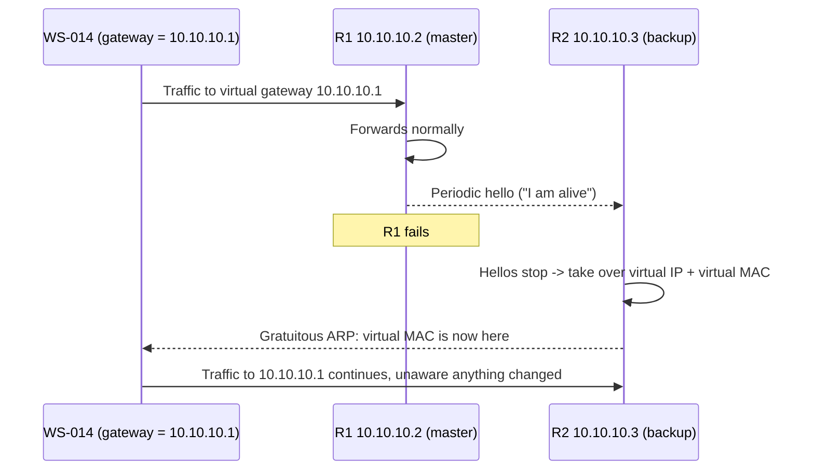

# 🔀 First-Hop Redundancy & Gateway Failover

> [!abstract] Note of [[Routing & the Network Layer]]
> A host has one default gateway, so if that gateway fails, the host is cut off from everything beyond its segment — no matter how redundant the rest of the network is. This note explains how two routers share a single virtual gateway so the failure is invisible to hosts, and why the protocol that provides this resilience is also a clean path to an on-path position.

## Parent Learning Order
IP Forwarding & the Routing Table -> Static Routing & Default Gateways -> Interior Gateway Protocols -> BGP & Internet Routing -> First-Hop Redundancy & Gateway Failover -> Routing Security & Path Validation

## The Single Point of Failure Hosts Cannot See Past

> *A host knows exactly one default gateway, and that router dies. Three healthy routers sit on the same segment. Can the host use them?*
>
> Hold your answer — the section below is the response.

A host learns exactly one default gateway. Every packet it sends off-segment goes to that one address. This creates a problem that all the redundancy in the core cannot solve: if the host's gateway router fails, the host is isolated from everything beyond its own subnet, even though other routers are sitting right there, healthy, on the same segment.

The naive fix — give hosts two gateways — does not work well, because hosts do not fail over gateways quickly or reliably on their own, and reconfiguring thousands of hosts when a router changes is untenable. The problem must be solved by the routers, transparently, so the host keeps using one unchanging gateway address while the routers arrange who actually answers for it.

This is what a **FHRP (First-Hop Redundancy Protocol)** does. The two dominant protocols are **VRRP (Virtual Router Redundancy Protocol)**, an open standard, and **HSRP (Hot Standby Router Protocol)**, a vendor equivalent. They differ in detail but are identical in concept.

**Prerequisites:** default gateways, ARP, and how a host forwards off-segment traffic.

> [!tip] The analogy, and where it breaks
> A shop counter with one published bell: whichever staff member is on duty answers it, and if they step away a colleague quietly takes over the same bell, so customers never learn there are two people. The analogy breaks because the colleague also inherits the *same name badge* — the virtual MAC — which is precisely what makes the handover invisible and why no customer has to re-learn anything.

## The Virtual Gateway

The mechanism is elegant: two or more physical routers cooperate to present a single **virtual IP address** and a single **virtual MAC address** as the gateway. Hosts are configured with the virtual IP as their default gateway and never know that more than one router exists.

On Meridian's workstation VLAN that is three addresses, and only one of them is ever typed into a host:

| Address | What it is | Who configures it |
|:--|:--|:--|
| `10.10.10.2` | `R1`, a real interface on a real router | the network team |
| `10.10.10.3` | `R2`, likewise — reachable in its own right, usable for management | the network team |
| `10.10.10.1` | owned by neither; a claim the current master answers for | every host on the VLAN, as its default gateway |

`WS-014` knows only the third row. That is the point of the design and also the reason the third row is worth attacking: it is the one address whose owner is decided by a protocol rather than by a person.

- One router is elected **active** (or **master**) and actually forwards traffic sent to the virtual gateway. It answers ARP for the virtual IP with the virtual MAC.
- The other is **standby** (or **backup**), monitoring the active router through periodic hello messages and ready to take over.
- If the standby stops hearing the active router's hellos, it concludes the active has failed and **assumes the virtual IP and virtual MAC** itself.



The critical detail is the **virtual MAC**. Because the standby takes over not just the virtual IP but the same virtual MAC, the host's ARP cache is still correct after failover — the gateway is still at the same MAC address, just reachable through a different physical router now. The host does not need to re-resolve ARP, which is what makes failover fast and transparent. The standby sends a gratuitous ARP so the switches update which port leads to the virtual MAC, and traffic continues within seconds.

That virtual MAC is not chosen by the operator. VRRP for IPv4 derives it from the group number: `00:00:5E:00:01:XX`, where `XX` is the **VRID** in hex. A group configured as VRID 1 uses `00:00:5E:00:01:01` and there is no configuration option to make it anything else. HSRP does the same thing with a different constant, `0000.0c07.ac{group}` for version 1.

The consequence is worth stating plainly, because it is the first thing an attacker on the segment gets for free. Reading a host's ARP cache tells you the gateway is virtual — the OUI gives away that it is not a NIC's burned-in address — *and* tells you the group number, which is a parameter you must match to take part in the election. One passive lookup on a machine you already control hands you half the configuration you would otherwise have to guess.

> [!note] The lab's MACs and this one
> Everywhere else in this corpus, Meridian's MACs come from the documentation block `00:00:5E:00:53:xx`, and `00:00:5E:00:53:01` is what the gateway resolves to. That is a lab convention, not protocol. Real VRRP has no such freedom: the virtual MAC follows the VRID by specification. Both facts are worth carrying — the corpus address so the examples stay consistent, and the derivation because it is what you will actually read off a wire.

Inspect a VRRP instance on a Linux router running keepalived:

```bash
sudo journalctl -u keepalived --no-pager | tail -4
```

Expected excerpt:

```text
Keepalived_vrrp: VRRP_Instance(VI_1) Entering MASTER STATE
Keepalived_vrrp: VRRP_Instance(VI_1) setting protocol VIPs.
Keepalived_vrrp: Sending gratuitous ARP on eth0 for 10.10.10.1
```

`Entering MASTER STATE` followed by the gratuitous ARP is a failover in the logs: this router has taken over the virtual IP and told the segment where it now lives.

The claim the whole mechanism rests on is that the host notices nothing. Check it from `WS-014`, before and after the failover above:

```bash
ip neigh show 10.10.10.1
```

Before, and again after:

```text
10.10.10.1 dev eth0 lladdr 00:00:5e:00:53:01 REACHABLE
10.10.10.1 dev eth0 lladdr 00:00:5e:00:53:01 REACHABLE
```

Two identical lines across a complete router failure. The host did not re-resolve ARP, did not time an entry out, and has no record that anything happened — its gateway is at the same address with the same MAC, and the only thing that changed is which physical box answers to them. Compare this with the diagnosis in [[Static Routing & Default Gateways]], where a dead next hop shows up as `FAILED` in exactly this command: FHRP's success is measured by that line *not* changing.

## Election, Preemption, and Tracking

Which router is active is decided by a configurable **priority** — highest wins. Two refinements matter operationally.

**Preemption** decides what happens when a failed higher-priority router returns. With preemption enabled, it reclaims the active role; without it, the current active keeps the role to avoid a second disruption. The choice trades a brief extra failover against always running on the preferred router.

**Interface tracking** addresses a subtle failure. The gateway router can be perfectly healthy on the segment side while its *uplink* — the path to the rest of the network — has failed. Without tracking, it keeps the active role and forwards host traffic into a dead uplink, a black hole. Tracking lets the router lower its own priority when its uplink fails, triggering failover to the standby whose uplink still works. Omitting tracking is a classic design gap: the FHRP protects against the router dying but not against the router becoming useless.

**The deliberate break:** FHRP reads as availability plumbing — it exists so that a failed router does not strand a subnet, and it belongs to the resilience conversation rather than the security one.

It is another **unauthenticated election**, and winning it is cleaner than poisoning caches one host at a time. An attacker who advertises a higher priority becomes the active router and inherits the virtual gateway address, so every host on the segment sends its off-segment traffic through them at once — not because anything was tricked, but because the hosts were built to trust whoever currently holds that address. One protocol message achieves what ARP spoofing needs a poisoned cache per victim to accomplish.

**How you'd spot it:** alarm on mastership changes and know which device should hold the role. `Entering MASTER STATE` in `keepalived`'s log is not an error, does not raise a severity, and is the entire finding when the router printing it is not one of yours — so the detection has to be an allowlist of which devices may ever emit that line, not a search for something that looks wrong. From the host side there is nothing to see: `ip neigh show` returns the same virtual MAC it always did, because a legitimate failover and a hostile takeover are the same event to a host. Repeated transitions with no matching hardware or link fault are the denial-of-service form, and they read as flapping until someone asks what keeps winning the elections.

## Security Implications

The property that makes FHRP transparent — routers claim the gateway role by announcement — is also its vulnerability. FHRP hello messages are, in default or weak configurations, unauthenticated.

**Malicious active takeover.** An attacker on the segment who speaks the FHRP protocol can advertise a higher priority than the legitimate routers, win the election, and become the active router. The virtual gateway now resolves to the attacker, and every host's off-segment traffic flows through the attacker's device — a clean on-path position for the entire subnet, achieved by winning a protocol election rather than poisoning individual ARP caches. It is more elegant than ARP spoofing and affects every host at once, because the hosts were designed to trust whoever holds the virtual gateway.

**Denial of service through instability.** An attacker who repeatedly claims and releases the active role, or floods hello messages, causes constant failovers. Each failover briefly disrupts traffic, and continuous failover makes the gateway unusable — a denial of service against the segment's only exit.

The controls parallel the other Layer 2 and routing defenses:

- **FHRP authentication** requires a shared key on hello messages, so an attacker cannot participate in the election. This is the direct fix and its absence is a common finding.
- **Control-plane filtering** on switches can restrict which ports may source FHRP messages, keeping the protocol to the intended router ports — the same philosophy as passive interfaces for routing protocols and BPDU Guard for spanning tree.
- **Monitoring** for unexpected mastership changes turns a takeover attempt into a detectable event; an election won by an unknown device is an alarm.

The recurring theme across this branch holds here too: transport-layer encryption survives an FHRP takeover. The attacker gains an on-path position, but a validated TLS session across the compromised gateway remains confidential. The gateway is a place traffic passes through, not automatically a place its contents are exposed.

All FHRP configuration and takeover testing described here must be confined to an isolated lab you own. Winning a gateway election on a production segment redirects every host's traffic and disrupts connectivity for the whole subnet.

## Summary

You should now be able to:

- Explain why a single default gateway is a single point of failure that host-side redundancy cannot fix, and what a virtual gateway is.
- Read FHRP state and logs to identify the active router and a failover event; explain why the shared virtual MAC keeps failover transparent and why interface tracking is needed for a router that is alive but cut off from its uplink.
- Explain how an unauthenticated FHRP election lets an attacker become the active gateway for an entire subnet in one move; justify authentication and control-plane filtering as the controls, and explain why transport encryption remains the backstop against the resulting on-path position.

---
> 🔼 Up: [[Routing & the Network Layer]]
