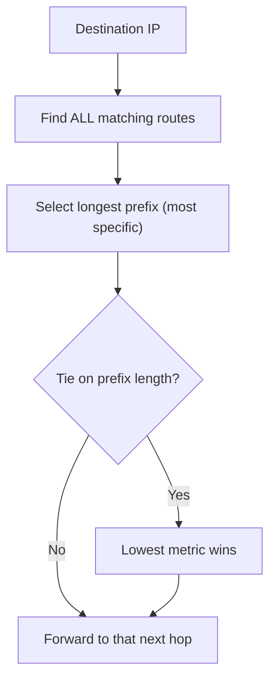

# 🚦 IP Forwarding & the Routing Table

> [!abstract] Note of [[Routing & the Network Layer]]
> Every device that touches an IP packet makes the same decision: consult a table, pick the most specific matching route, and send the packet to the next hop. This note builds that decision from first principles, explains longest-prefix match rigorously, and shows why a single injected route can silently redirect traffic while everything still appears to work.

## Parent Learning Order
IP Forwarding & the Routing Table -> Static Routing & Default Gateways -> Interior Gateway Protocols -> BGP & Internet Routing -> First-Hop Redundancy & Gateway Failover -> Routing Security & Path Validation

## Every Host Routes

> *How many routing decisions does your laptop make while loading one web page?*
>
> Hold your answer — the section below is the response.

Routing is not something only routers do. Every device with an IP stack consults a routing table for every packet it sends, to answer one question: **is this destination directly reachable, or must I hand the packet to a gateway?**

The decision uses the destination IP and the host's own routes. If the destination falls within a directly connected network, the host delivers it at the link layer. Otherwise it forwards the packet to the **next hop** — a gateway — trusting that gateway to move it closer. The gateway then repeats the identical decision with its own table. Routing is this decision, made independently, hop after hop, with no single device knowing the whole path.

So: one lookup per packet sent, which makes the opening question arithmetic rather than rhetoric. A typical page pulls roughly 2 MB across about 70 requests. The bytes arrive in segments of about 1,448, so around 1,400 segments come back, and the laptop acknowledges roughly every second one — call it 700 ACKs. Add the 70 requests themselves, a TCP handshake and a TLS handshake per connection, and a DNS query or two. The laptop sends on the order of **a thousand packets** to load one page, and performs a routing-table lookup for every one of them.

The number is not the point; the ratio is. Nothing in that page load involved a router doing anything the laptop did not also do, a thousand times, before the packets ever left the building.

```bash
ip route
```

Expected excerpt:

```text
default via 10.10.10.1 dev eth0 proto dhcp metric 100
10.10.10.0/24 dev eth0 proto kernel scope link src 10.10.10.14
10.10.20.0/24 via 10.10.10.254 dev eth0 proto static metric 50
```

Three route types appear here, and reading them fluently is the whole skill:

- **`10.10.10.0/24 dev eth0 scope link`** — a directly connected network. `scope link` means these destinations are reachable without a gateway; the kernel added this automatically when the interface got its address.
- **`default via 10.10.10.1`** — the route of last resort, `0.0.0.0/0`, matching anything not matched more specifically. Its next hop is the gateway.
- **`10.10.20.0/24 via 10.10.10.254`** — a specific route to a particular network through a different next hop, added by an administrator (`proto static`).

**Prerequisites:** IP addressing, subnet masks, and the idea of a default gateway.

> [!tip] The analogy, and where it breaks
> Road signs at every junction listing only the next town, never the whole route — each driver asks one question and moves one hop closer. The analogy breaks on specificity: if two signs point to the same destination, a road network has no rule preferring the more detailed one, whereas routing *always* takes the longest prefix. That rule is why a single injected specific route silently captures traffic while every broader, correct route remains in place.

**The deliberate break:** "routers route, hosts send" is how most people picture it — your laptop hands the packet to the gateway and the clever decisions happen elsewhere.

Your laptop makes a routing decision on **every single packet it sends**. It consults a table, applies longest-prefix match, and picks an interface and a next hop, exactly as a router does. The only difference is table size. This matters practically: a machine that "cannot reach" something often has a perfectly healthy network and a wrong local route, and no amount of investigating the router will show it.

**How you'd spot it:** `ip route get <destination>` reports the decision the kernel will actually make, resolving every overlapping route for you. If it names an unexpected interface or next hop, the problem is on this host.

## Longest-Prefix Match: The One Rule

When several routes match a destination, the router does **not** pick the first, the cheapest, or the newest. It picks the one with the **longest prefix** — the most specific route, the one with the most network bits fixed. Metric only breaks ties between routes of equal prefix length.

Consider a destination `10.10.20.50` against this table:

```text
0.0.0.0/0        via 10.10.10.1     (prefix length 0)
10.10.0.0/16     via 10.10.10.253   (prefix length 16)
10.10.20.0/24    via 10.10.10.254   (prefix length 24)
10.10.20.50/32   via 10.10.10.252   (prefix length 32)
```

All four match `10.10.20.50` — the default matches everything, `/16` matches all of `10.10.x`, `/24` matches `10.10.20.x`, and `/32` matches this exact host. Longest-prefix match selects the `/32`. Ask the kernel to confirm the decision without sending anything:

```bash
ip route get 10.10.20.50
```

Expected excerpt:

```text
10.10.20.50 via 10.10.10.252 dev eth0 src 10.10.10.14
```

`ip route get` is the single most valuable routing diagnostic: it reports the exact decision the kernel will make for a destination, resolving all the overlapping routes for you. Trace several destinations and the rule becomes concrete:

```text
10.10.20.50   -> via .252   (matched the /32, most specific)
10.10.20.77   -> via .254   (matched the /24)
10.10.99.5    -> via .253   (matched the /16)
192.0.2.10    -> via .1     (matched only the default)
```

Read the second and third lines together. `10.10.20.77` and `10.10.99.5` differ in one octet and leave by different next hops, because one of them falls inside `10.10.20.0/24` and the other does not. Nothing about the addresses says so; only the table does.



## RIB and FIB: Knowledge versus Action

Two tables lurk behind "the routing table."

The **RIB (Routing Information Base)** is the full collection of everything the device has learned — from connected interfaces, static configuration, and every routing protocol running. It may contain several routes to the same destination from different sources, each with a preference.

The **FIB (Forwarding Information Base)** is the distilled result: the single best route to each destination, installed into the fast-path forwarding hardware or kernel structure that actually moves packets. `ip route` on Linux shows what is effectively the FIB; a full router distinguishes the two explicitly.

The distinction matters during troubleshooting. A route can exist in the RIB — the device *knows* it — yet not be in the FIB because a more preferred route won, so the device does not *use* it. "The route is there but traffic doesn't take it" is almost always a RIB/FIB or longest-prefix issue, not a broken route.

You can produce that situation on one host in a few seconds. Install a second route to the same prefix with a worse metric:

```bash
sudo ip route add 10.10.20.0/24 via 10.10.10.253 metric 200
ip route show 10.10.20.0/24
ip route get 10.10.20.77
```

Expected output:

```text
10.10.20.0/24 via 10.10.10.254 dev eth0 proto static metric 50
10.10.20.0/24 via 10.10.10.253 dev eth0 metric 200

10.10.20.77 via 10.10.10.254 dev eth0 src 10.10.10.14
```

Both routes are listed. Neither is invalid, neither is flagged, and nothing distinguishes them but the metric. Yet every packet to `10.10.20.77` takes `.254`, because equal prefix lengths are broken by metric and 50 beats 200. The `.253` route is knowledge the host has and does not act on — RIB without FIB.

This is why `ip route` and `ip route get` are different questions, and why an engineer who confirms a route exists has not confirmed it is used. On a full router the two tables are named and displayed separately; on Linux they are collapsed into one command, which makes the confusion easier and the habit of asking `ip route get` more valuable.

## Security Implications

The forwarding rule that makes routing work is exactly what makes route injection dangerous.

**More specific always wins, silently.** Because longest-prefix match unconditionally prefers the most specific route, an attacker or a misconfiguration that installs a `/32` or a narrow prefix for a target captures that traffic, overriding every broader legitimate route. Nothing errors. The victim's connectivity continues, because the attacker forwards the traffic onward after inspecting it. Detection cannot rely on "is it reachable" — it is — but must watch for unexpected specific routes and for path changes. This is the local, small-scale version of the redirection that, at Internet scale, is BGP hijacking.

**A poisoned default is a total redirect.** The default route handles everything not matched specifically, so changing it — via a rogue DHCP lease, a forged router advertisement, or local compromise — sends a host's entire off-segment traffic through an attacker. The blast radius of a single wrong default route is the host's whole external world.

**Source-based trust rides on routing assumptions.** Controls that trust "internal" source addresses assume packets from those addresses actually originated internally and followed expected paths. Routing manipulation and source spoofing break that assumption, which is why routing integrity and ingress filtering are security controls, not merely operational ones.

Inspecting and modifying routing tables must be confined to systems within an authorized scope. Routing tables reveal internal topology, and altering a route on a shared device affects everyone whose traffic it carries.

## Summary

You should now be able to:

- Explain that every host routes, not just routers, and describe the direct-versus-gateway decision a host makes for each packet.
- Read a routing table and classify each route; use `ip route get` to predict the exact next hop for any destination and explain the choice by longest-prefix match.
- Distinguish the RIB from the FIB and explain "the route is known but not used"; describe why longest-prefix match lets an injected specific route redirect traffic invisibly, and why a poisoned default route has a host-wide blast radius.

---
> 🔼 Up: [[Routing & the Network Layer]]
