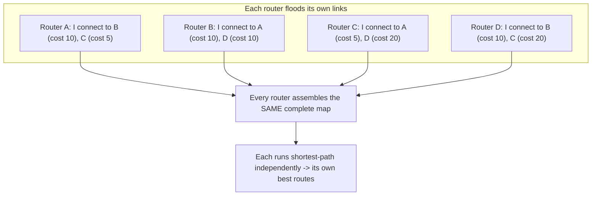

# 🗺️ Interior Gateway Protocols

> [!abstract] Note of [[Routing & the Network Layer]]
> When a network grows past the point where humans can maintain every route, routers must describe reality to each other and compute paths automatically. This note explains the two families that do this inside one organization, how link-state routing builds a shared map, and why a protocol that trusts its neighbours is a protocol an attacker can lie to.

## Parent Learning Order
IP Forwarding & the Routing Table -> Static Routing & Default Gateways -> Interior Gateway Protocols -> BGP & Internet Routing -> First-Hop Redundancy & Gateway Failover -> Routing Security & Path Validation

## Why Routers Must Talk

> *A link fails at 03:00 on a statically routed network. Who notices?*
>
> Hold your answer — the section below is the response.

Static routing fails at scale for one reason: it cannot react to change. When a link goes down, someone must notice and reconfigure. **Dynamic routing** removes the human from the loop — routers exchange information about the networks they can reach, and when the topology changes, they recompute paths automatically within seconds.

An **IGP (Interior Gateway Protocol)** is a dynamic routing protocol used *within* a single administrative domain — one company, one campus, one autonomous system. It contrasts with an exterior protocol used *between* organizations, covered separately. "Interior" means all the routers trust each other because they belong to the same owner, and that trust assumption is central to both how IGPs work and how they fail.

Two philosophies exist for how routers share what they know, and almost every difference between the protocols in this note follows from which one they chose:

| | Distance-vector (RIP) | Link-state (OSPF) |
|---|---|---|
| What a router sends | its whole list of destinations and distances | a description of its own links only |
| Who it sends it to | its direct neighbours | every router in the area, by flooding |
| What a router knows | what neighbours told it | the complete topology, identical on every router |
| How a path is chosen | trust a neighbour's number, add one | run shortest-path over the map yourself |
| Reaction to a failure | propagates one router per update cycle | flooded immediately, recomputed locally |
| Characteristic failure | loops and count-to-infinity | flooding load and map corruption |
| What injection buys an attacker | a false distance to one destination | a false link in everyone's map |

Read the last row before the rest of the note. Both families are injectable, but they are injectable at different scales: a lie to a distance-vector router is a lie about one destination, while a lie flooded into a link-state area is a lie about the shape of the network, and every router in that area recomputes on it.

**Prerequisites:** static routing, the routing table, and why manual routes cannot react to failure.

> [!tip] The analogy, and where it breaks
> Two ways for a delivery firm to learn its own road network: drivers phoning depots to say 'the north road is 3 hours away' (distance-vector rumour), or every depot publishing only the roads it personally touches so all of them can draw the identical map (link-state). The analogy breaks because no depot would accept a road report from an unknown caller without checking — but an unauthenticated routing protocol does exactly that, which is the whole injection problem.

## Distance Vector: Routing by Rumour

A **distance-vector** protocol has each router tell its neighbours the entire list of destinations it can reach and how far away each is (the "distance," usually a hop count). A router does not know the topology; it only knows what its neighbours told it, and it trusts them. **RIP (Routing Information Protocol)** is the classic example.

The mental model is rumour propagation: "I heard network X is 3 hops away," passed router to router, each adding its own distance. This is simple to implement and simple to reason about, but it has serious weaknesses:

- **Slow convergence.** Changes propagate one router at a time, so a large network can take a long time to stabilize after a failure.
- **Limited scale.** RIP caps distance at 15 hops; 16 means unreachable. This deliberately bounds a problem below but also bounds the network's size.
- **Count-to-infinity.** Under certain failures, routers can keep incrementing a distance toward the cap while bad routing information circulates, misdirecting traffic until the cap is reached.

That last one is worth watching happen rather than taking on trust. Put three routers in a line — `A — B — C` — with VLAN 30 (`10.10.30.0/24`) attached to `C`. Before anything fails, `C` is 1 hop from it, `B` is 2 via `C`, and `A` is 3 via `B`. Now `C` loses the link:

```text
round            A     B     C    next hop each router believes in
before           3     2     1    A->B  B->C  C->direct
C's link dies    3     2    16    A->B  B->C  C->none
round 1          3     4     3    A->B  B->A  C->B
round 2          5     4     5    A->B  B->A  C->B
round 3          5     6     5    A->B  B->A  C->B
...
round 13        15    16    15    A->B  B->none  C->B
round 14        16    16    16    A->none  B->none  C->none
```

Read round 1 closely, because everything follows from it. `C` knows its own link is gone — but before it can tell anyone, `B`'s regular update arrives still advertising the old "I can reach VLAN 30 in 2 hops." `B` learned that route *from* `C` and is now selling it back. `C` has no way to know that, believes it, and installs a 3-hop route pointing at `B`. `B` then hears `C`'s new 3 and revises itself to 4, still pointing at `A`.

Look at the next-hop column from round 1 onward: `A->B` and `B->A`. That is a routing loop, and it stays there for thirteen more rounds while the numbers climb by two. Packets for VLAN 30 are not dropped during this — they are forwarded, endlessly, between two routers that each believe the other has the answer, until the TTL kills them.

The cap is what ends it. At round 14 every router reaches 16 and declares the network unreachable. RIP's default update timer is 30 seconds, so those fourteen rounds are roughly seven minutes of a live loop — and the only thing that finally stops it is a hard-coded ceiling, not the protocol working out what happened. Split horizon and route poisoning exist to attack this specific pathology, and none of them remove it in every topology.

RIP survives in small and legacy networks for its simplicity, but its convergence behaviour makes it unsuitable for anything large. It is worth understanding mainly because its failure modes illuminate why link-state routing was invented.

## Link-State: Routing by Shared Map

A **link-state** protocol takes the opposite approach. Each router describes only its *own* directly connected links and floods that description to every other router. Every router thus receives everyone's descriptions and independently assembles an identical **map** of the entire topology. It then runs a shortest-path calculation over that map to compute its own best route to each destination. **OSPF (Open Shortest Path First)** is the dominant example.



The advantages follow directly from every router having the whole map:

- **Fast convergence.** A change is flooded everywhere quickly, and each router recomputes locally.
- **Loop-free by construction.** Because every router computes over the same consistent map, they agree on paths and do not form the loops that plague distance-vector rumour.
- **Scales well** through hierarchy: OSPF divides a network into **areas** so that detailed maps stay local and only summaries cross area boundaries, keeping the computation and the map size manageable in large networks.

Cost is configurable and typically reflects link bandwidth, so the "shortest" path is the fastest, not merely the fewest hops. **EIGRP** is a third protocol, historically vendor-specific, that blends distance-vector mechanics with faster convergence and richer metrics; conceptually it sits between the two families.

Inspect learned routes on a Linux router running a routing daemon:

```bash
ip route show proto ospf
```

Expected excerpt:

```text
10.10.20.0/24 via 10.10.250.2 dev eth1 proto ospf metric 20
10.10.30.0/24 via 10.10.250.6 dev eth2 proto ospf metric 30
```

`proto ospf` marks these as learned dynamically rather than configured by hand. The metrics reflect the computed path cost, and if a link fails, these entries update automatically as the protocol reconverges — the behaviour static routing cannot provide.

## Neighbor Relationships and Convergence

Link-state protocols form **adjacencies** with neighbours before exchanging maps. Routers discover each other with hello messages, verify compatible parameters, synchronize their map databases, and only then trust each other's link descriptions. Hello messages continue as a heartbeat; when they stop, the neighbour is declared down and the topology is recomputed.

This adjacency step is where an operator spends troubleshooting time. Two routers that should be neighbours but are not adjacent — because of mismatched parameters, an interface problem, or an authentication failure — will not exchange routes, and destinations behind the missing neighbour become unreachable while both routers appear healthy in isolation.

Two questions to ask a router, in this order — who am I adjacent to, and where am I willing to become adjacent:

```bash
sudo vtysh -c "show ip ospf neighbor"
sudo vtysh -c "show ip ospf interface brief"
```

Expected excerpt:

```text
Neighbor ID     Pri State     Up Time   Dead Time  Address       Interface
10.10.250.2       1 Full/DR   02:14:31    38.192s  10.10.250.2   eth1:10.10.250.1
10.10.250.6       1 Full/DR   01:57:08    36.415s  10.10.250.6   eth2:10.10.250.5

Interface   PfxLen  State  Up  Down  Nbrs  Area
eth1            30  DR      1     0     1  0.0.0.0
eth2            30  DR      1     0     1  0.0.0.0
eth0            24  DR      0     0     0  0.0.0.0
```

The first command looks healthy: two neighbours, both `Full`, dead timers counting down normally. The second command is the one that matters. `eth1` and `eth2` are the router interconnects — OSPF belongs there. `eth0` is the workstation VLAN, and it is in area `0.0.0.0` with zero neighbours.

Zero neighbours is not reassurance. It means nothing on that segment has spoken OSPF *yet*. The interface is enabled, sending hellos to `224.0.0.5` and willing to form an adjacency with whatever answers — and the segment on the other side of it is full of workstations, one bad email away from running an attacker's code. The healthy-looking first command would not change at all until the adjacency had already formed.

**The deliberate break:** an IGP reads as automation for reachability — machinery that keeps traffic flowing when a link fails, and otherwise looks after itself.

It is a **distributed database that every participating router writes into**, and without authentication it accepts writes from anything sitting on a segment where the protocol is enabled. A false advertisement does not break the network: the network reconverges around it, all destinations remain reachable, and traffic simply travels through somewhere it should not. That graceful absorption is what makes injection dangerous, because the protocol's greatest strength — recovering smoothly from a changed map — is exactly what hides a map that was changed deliberately.

**How you'd spot it:** check where the protocol is enabled before examining what it is advertising. `show ip ospf interface brief` answers that in one line per interface, and any interface facing endpoints that is not passive is the injection surface — a configuration question you can settle in seconds without waiting for an incident. During an event, watch `show ip ospf neighbor` and alert on adjacencies appearing rather than on reachability failing. Reachability is preserved by the attack: a connectivity check reports a healthy network for its entire duration, and a new line in the neighbour table is the first and possibly only signal that a router you do not own has joined the conversation.

## Security Implications

Every IGP shares one assumption: **the routers speaking the protocol are trustworthy.** That assumption is the vulnerability.

**Unauthenticated updates let an attacker inject routes.** If routing updates are not authenticated, a device on a segment where a routing protocol runs can inject false link information. In a link-state protocol, false link descriptions corrupt every router's map; in distance-vector, false distances propagate as rumour. The attacker can advertise an attractive path to a target network, drawing traffic through their device for an on-path position, or advertise unreachability to blackhole a destination. Because the network reconverges around the false information, everything continues to "work" — traffic simply flows through the wrong place.

**Passive interface configuration limits exposure.** Routing protocols should run only on links between trusted routers. An interface facing endpoints has no business sending or accepting routing updates, and configuring it as **passive** — or not enabling the protocol on it at all — removes an entire injection surface. A protocol running on a user-facing segment is an open invitation to inject.

**Authentication is the direct control.** Modern IGPs support cryptographic authentication of their messages, so a router accepts updates only from peers that share a key. This defeats update injection from an unauthenticated device. It is standard hardening and its absence is a common finding, because protocols often work fine without it — until someone abuses the gap.

**Convergence itself is a target.** Flooding rapid, conflicting updates can force constant recomputation, degrading the network without injecting any single false route — a denial of service against the control plane rather than the data plane. Rate limits and dampening exist to blunt this.

All routing-protocol configuration and testing described here must occur only on an isolated lab or authorized infrastructure. Injecting routing updates on a production network can redirect or blackhole traffic for every system that depends on the affected paths.

## Summary

You should now be able to:

- Explain why routers need to exchange routing information, and the difference between "routing by rumour" (distance-vector) and "routing by shared map" (link-state).
- Read dynamically learned routes and inspect both halves of a router's OSPF state — who it is adjacent to, and which interfaces it is willing to become adjacent on; trace count-to-infinity through a three-router line and identify the routing loop it opens; explain why an adjacency that fails to form makes destinations unreachable while both routers look healthy.
- Explain how unauthenticated updates let an attacker inject routes for interception or blackholing in both protocol families; justify passive interfaces and cryptographic authentication as the controls, and describe how flooding updates attacks the control plane itself.

---
> 🔼 Up: [[Routing & the Network Layer]]
