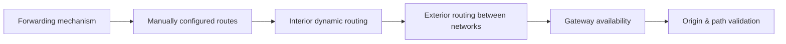

# 🧭 Routing & the Network Layer

> [!abstract] Routing branch
> How a packet crosses networks it has never seen, chosen by tables built either by hand or by protocols that routers use to describe reality to each other. Because those descriptions are trusted, routing is also where traffic can be redirected without anything appearing to break.

## 🗺️ Zero-to-Mastery Learning Path

1. [[IP Forwarding & the Routing Table]] — trace how a packet matches a prefix and exits on the correct interface
2. [[Static Routing & Default Gateways]] — configure manual routes; know when they are right and when they break
3. [[Interior Gateway Protocols]] — compare OSPF and EIGRP convergence, metric, and failure-domain design
4. [[BGP & Internet Routing]] — understand AS relationships, route advertisement, and prefix-hijack risk
5. [[First-Hop Redundancy & Gateway Failover]] — deploy HSRP, VRRP, or GLBP for transparent default-gateway failure
6. [[Routing Security & Path Validation]] — apply prefix filters, RPKI, and route authentication to defeat hijacks

---
> 🔼 Up: [[Networking]]
