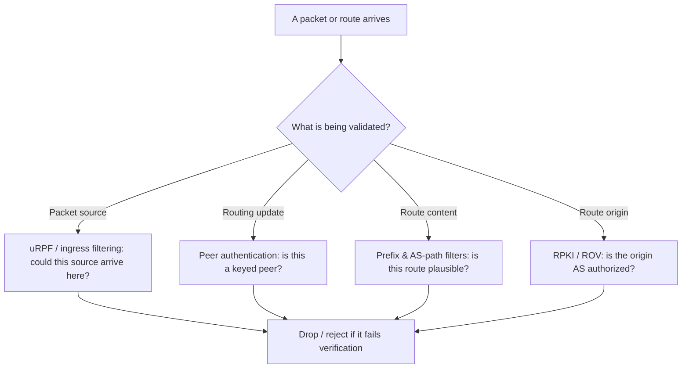

# 🔒 Routing Security & Path Validation

> [!abstract] Note of [[Routing & the Network Layer]]
> Every attack in this branch redirects traffic without breaking it, and every defense rests on the same idea: do not trust a route, a source address, or a path without verification. This note assembles the routing-layer controls into a coherent posture, from filtering forged sources at the edge to validating route origin, and explains why "it still works" is the wrong test for routing integrity.

## Parent Learning Order
IP Forwarding & the Routing Table -> Static Routing & Default Gateways -> Interior Gateway Protocols -> BGP & Internet Routing -> First-Hop Redundancy & Gateway Failover -> Routing Security & Path Validation

## The Shared Weakness

> *What in IP verifies that a packet's source address is real?*
>
> Hold your answer — the section below is the response.

The network layer was designed to move packets, not to prove anything about them. Two assumptions baked into IP are the root of routing insecurity:

1. **A packet's source address is whatever the sender wrote.** Nothing in IP verifies it.
2. **A routing advertisement is believed because it was received.** The protocols trust their peers.

Everything in this note follows from attacking or defending those two assumptions. The controls fall into two groups, and every control in this note belongs to exactly one of them:

| Assumption | What it buys an attacker | Which branch note showed it | The control group |
|:--|:--|:--|:--|
| A source address is whatever the sender wrote | reflection and amplification; an untraceable origin | this note | validating **where a packet came from** |
| A routing advertisement is believed because it was received | an injected route in an IGP; a stolen prefix in BGP; a stolen gateway on a segment | [[Interior Gateway Protocols]], [[BGP & Internet Routing]], [[First-Hop Redundancy & Gateway Failover]] | validating **what a route claims** |

A mature posture applies both, because they cover different attacks and neither degrades gracefully into the other. Ingress filtering will not notice a hijacked prefix; RPKI will not notice a spoofed packet.

The unifying diagnostic insight: **a compromised route usually preserves connectivity.** Traffic reaches its destination, so uptime monitoring stays green. The evidence of compromise is in the *path* and the *origin*, not in reachability. Any detection strategy that only asks "can I reach it?" is blind to the entire class.

**Prerequisites:** routing tables, dynamic routing protocols, and IP source addresses.

> [!tip] The analogy, and where it breaks
> A courier network that finally starts checking two things it long assumed: that a parcel's stated sender could plausibly have come from that direction, and that a depot claiming to serve a city is actually entitled to. The analogy breaks on incentives — checking your outbound parcels' return addresses mostly protects *other* networks from being flooded, not you, which is exactly why this control is under-deployed.

## Source Validation: Ingress Filtering

**IP source address spoofing** is the foundation of reflection and amplification denial-of-service attacks and of hiding an attacker's origin. Because the source address is unverified, a host can send packets claiming to be from anywhere. In an amplification attack, the attacker spoofs the *victim's* address as the source of requests to servers that reply with much larger responses, drowning the victim in traffic it never asked for.

**Ingress filtering** (the practice codified as BCP 38) directly attacks spoofing: a network drops packets whose source address could not legitimately have originated from the direction they arrived. A packet arriving on a customer link with a source address that does not belong to that customer is discarded at the edge, before it can be used to spoof.

The router-level mechanism is **uRPF (unicast Reverse Path Forwarding)**. For each arriving packet, the router checks its own routing table: *if I had to send a reply to this source address, would I send it back out the interface this packet arrived on?* If not, the source is implausible and the packet is dropped.

```text
Strict uRPF:  the reverse route must point back out the exact arrival interface
Loose uRPF:   the source must merely exist somewhere in the routing table
```

Strict mode is stronger but breaks under asymmetric routing, where the return path legitimately differs from the arrival path; loose mode tolerates asymmetry at the cost of catching fewer spoofs. The choice depends on whether the network's routing is symmetric, which is why deployment requires understanding the traffic, not just enabling a feature.

```bash
sysctl net.ipv4.conf.all.rp_filter net.ipv4.conf.eth1.rp_filter
```

Expected output:

```text
net.ipv4.conf.all.rp_filter = 1
net.ipv4.conf.eth1.rp_filter = 0
```

A value of 1 is strict reverse-path filtering, 2 is loose mode, 0 is off. On an edge interface facing untrusted networks, strict mode drops packets with implausible source addresses automatically.

Read both lines, because one of them alone will mislead you. Linux takes the **larger** of `conf.all` and the interface's own setting, not the interface's setting. The output above does not mean filtering is off on `eth1` — the effective value is `max(1, 0)`, so `eth1` is in strict mode. The consequence runs the wrong way round from the intuition: setting an interface to `0` cannot turn filtering off while `all` is `1`, and an operator who disables it on the one interface with asymmetric routing will find the packets still dropped and the setting still reading `0`. Only lowering `conf.all` changes anything, which lowers it everywhere.

This is worth knowing before you deploy strict mode rather than after. A single asymmetric path that appears later has no per-interface escape hatch.

Ingress filtering is one of the few controls where deploying it protects *others* more than yourself — it stops *your* network from being used to attack someone else. This is precisely why it is under-deployed and why coordinated efforts exist to encourage it: the benefit is collective.

## Route and Update Validation

The second group verifies routing information rather than packets.

**Authenticate routing updates.** Interior protocols support cryptographic authentication so a router accepts updates only from peers sharing a key, defeating update injection from an unauthenticated device. This was covered for IGPs and FHRPs; the principle is uniform — a routing peer must prove it is a legitimate peer.

**Filter what you accept and announce.** Prefix filters and AS-path filters limit which routes a router will believe from a neighbour and which it will pass on. This is the practical backbone of inter-domain routing security: even without cryptographic path validation, disciplined filtering blocks most leaks and hijacks, because a network that only accepts the prefixes a neighbour is known to own rejects a claim to unrelated space.

**Validate route origin.** RPKI and Route Origin Validation let a network reject announcements whose origin AS is not the authorized one, addressing the origin half of hijacking. Its limitation — it does not validate the full path — is the reason filtering remains necessary alongside it, and the reason path validation is an active frontier.

**Prefer static on critical, trusted paths.** Where a path is few and stable, a static route participates in no protocol and cannot be poisoned by a forged update. Determinism is itself a control for a small number of high-value paths, accepting the loss of automatic failover in exchange for zero protocol attack surface.



## Detection: Watch the Path, Not the Reachability

Because routing attacks preserve connectivity, detection must observe path and origin.

- **Route monitoring** compares live announcements of your prefixes against expected origin and paths, alarming when your address space is originated by an unexpected AS or when the path to a critical destination changes abruptly.
- **Traffic-path telemetry** — traceroute baselines, flow records, latency shifts — reveals when traffic that should take one path suddenly takes another, even when it still arrives.
- **Control-plane logging** captures adjacency changes, mastership changes, and route-table churn; an unexpected new neighbour or a flood of updates is a control-plane event worth investigating.

### The two answers side by side

[[BGP & Internet Routing]] showed this hijack from inside a router's control plane: AS 64511 announcing `203.0.113.0/25`, a more specific prefix than the `203.0.113.0/24` that AS 64500 legitimately originates, and winning on specificity alone. Here is the same event as an outside observer experiences it. Take a baseline from an ordinary internet host toward Meridian's tracking site while everything is normal:

```bash
traceroute -A -n 203.0.113.20
```

```text
 1  192.0.2.41 [AS64503]   0.412 ms
 2  192.0.2.33 [AS64502]   4.118 ms
 3  192.0.2.23 [AS64501]  11.907 ms
 4  203.0.113.1 [AS64500] 12.244 ms
 5  203.0.113.20 [AS64500] 12.610 ms
```

Store that. Now run the identical command during the hijack:

```bash
traceroute -A -n 203.0.113.20
curl -s -o /dev/null -w '%{http_code}\n' https://track.meridian.test/
```

```text
 1  192.0.2.41 [AS64503]   0.398 ms
 2  192.0.2.33 [AS64502]   4.203 ms
 3  192.0.2.13 [AS64511]   9.771 ms
 4  203.0.113.1 [AS64500] 26.882 ms
 5  203.0.113.20 [AS64500] 27.104 ms
200
```

Compare the two, line by line, and notice what the incident does **not** look like. The destination is identical. The final hop is identical. The hop count is identical. The site returns `200`, so every uptime check, every synthetic monitor and every user reports the service healthy — which is not the hijacker being merciful, it is the hijacker being competent, because a hijack that drops traffic is discovered in minutes and one that forwards it is not discovered at all.

Exactly two things changed. Hop 3 is `192.0.2.13` in AS 64511 where the baseline had `192.0.2.23` in AS 64501, and the round trip roughly doubled. The latency is the weaker signal — it moves for a dozen innocent reasons and a hijacker one hop off the legitimate path may add almost none. The AS at hop 3 is the finding, and it is only a finding because you recorded what belonged there beforehand.

That is the whole discipline in one comparison. Nothing in the second capture is an error, so nothing can alarm on "something went wrong"; the alarm has to be on "this differs from the baseline", and a baseline is something you either captured while the network was healthy or do not have when you need it.

The mindset shift is the deliverable: replace "is the destination up?" with "is the destination reached the way it should be, from the origin it should be, over the path it should be?" A green uptime dashboard is consistent with an active interception — and in the capture above, it is one.

**The deliberate break:** presented as a list of controls — ingress filtering, peer authentication, origin validation, prefix filtering — the natural question is which one is strongest, and which one to deploy first.

They are not substitutes and there is no strongest. Each covers a gap the others leave open: ingress filtering stops spoofed sources but not injected routes; authentication stops injection but not a peer that has itself been compromised; origin validation catches the common hijack but not a forged AS path; prefix filtering catches implausible announcements but only as well as your intent data describes them. An attacker's task is to find the layer that was skipped, which makes "which one" the wrong question and "what does each of ours not cover" the right one.

**How you'd spot it:** audit by gap rather than by presence — for every control in place, state plainly what it does not address, then check whether anything else covers that. Two gaps hide better than the rest. The first is the control with no local symptom: ingress filtering protects other networks rather than your own, so omitting it produces no visible consequence on your side at all while contributing directly to everyone else's attack volume, and controls whose benefit accrues elsewhere are the ones that quietly never get deployed. The second is the missing baseline. A `traceroute -A` comparison catches a hijack that every other check calls healthy, but only against a capture taken while the path was known good — so the audit question is not "do we monitor paths" but "show me the recorded path for our top ten destinations, and the date it was taken". An unanswerable version of that question is itself the finding.

## Security Implications

**Defense in depth is mandatory because each control has a gap.** Ingress filtering stops spoofing but not route injection; authentication stops injection but not a compromised legitimate peer; origin validation stops the common hijack but not a forged path; filtering catches implausible routes but depends on accurate intent data. No single control is sufficient, and the attacker's job is to find the layer you skipped.

**The encryption backstop is the constant.** Across this entire branch — ARP, STP, FHRP, IGP, BGP — the recurring conclusion is that transport-layer encryption survives an on-path adversary. Routing security reduces the *likelihood* and *scope* of interception; end-to-end encryption removes the *payoff*. A defender needs both: routing integrity so traffic is not silently redirected and denied, and encryption so that redirection which does occur yields metadata rather than content.

**Availability is a shared responsibility.** Ingress filtering protects others; a network that skips it contributes to global attack capacity. Origin validation and route hygiene similarly protect the commons. Routing security has an unusual property among controls: a meaningful fraction of its benefit accrues to parties other than the deployer, which is exactly why coordinated frameworks exist to raise the collective baseline.

All configuration and testing described here must be performed only on isolated infrastructure you own or are explicitly authorized to modify. Filtering and validation changes on production routers affect every flow they carry, and a misapplied strict-mode filter can silently drop legitimate asymmetric traffic.

## Summary

You should now be able to:

- State the two IP assumptions that make routing insecure, and explain why "the destination is reachable" does not prove the route is trustworthy.
- Configure and reason about ingress filtering with strict versus loose reverse-path checking, and detect a redirected path by comparing traceroute and telemetry against a baseline rather than testing reachability.
- Assemble the routing-security controls into a defense-in-depth posture, explaining the gap each one leaves and why encryption is the invariant backstop; justify why ingress filtering and origin validation protect the commons, and why that shared-benefit structure explains their under-deployment.

---
> 🔼 Up: [[Routing & the Network Layer]]
