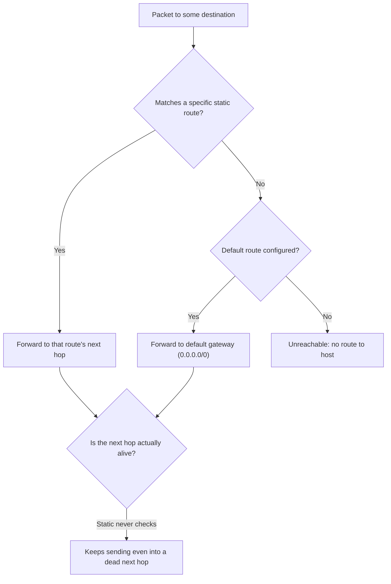

# 🧱 Static Routing & Default Gateways

> [!abstract] Note of [[Routing & the Network Layer]]
> Static routes are routing by hand — explicit, predictable, and unable to react to failure on their own. This note covers when hand-configured routes are the right choice, how the default gateway is just the least specific static route, and the failure modes unique to routes that never change even when the network does.

## Parent Learning Order
IP Forwarding & the Routing Table -> Static Routing & Default Gateways -> Interior Gateway Protocols -> BGP & Internet Routing -> First-Hop Redundancy & Gateway Failover -> Routing Security & Path Validation

## Telling a Device Exactly Where to Send

> *A static route's next hop goes down. What does the routing table say now?*
>
> Hold your answer — the section below is the response.

A **static route** is a forwarding instruction an administrator configures directly: "to reach network X, use next hop Y." The device does not learn it, calculate it, or share it — it simply obeys it until someone changes it.

The most important static route on almost every device is the **default gateway**. It is nothing special in mechanism — it is the static route `0.0.0.0/0`, the least specific route possible, matching any destination not matched more specifically. When your laptop sends a packet to a website, no specific route matches, so the default route wins and the packet goes to the gateway. "Configure the default gateway" and "add a static route for everything" are the same action.



The diagram exposes the defining weakness on its right edge: the forwarding decision is made purely from the configured table, and nothing verifies that the chosen next hop is alive. A static route is obeyed identically whether the gateway is healthy or failed.

```bash
sudo ip route add 10.20.0.0/24 via 10.10.10.254
sudo ip route add default via 10.10.10.1
```

Expected result in the table:

```text
default via 10.10.10.1 dev eth0
10.20.0.0/24 via 10.10.10.254 dev eth0 proto static
```

The `proto static` marker distinguishes these from routes the kernel derived or a protocol learned. They persist exactly as written, which is both their strength and their weakness.

**Prerequisites:** the routing table and longest-prefix match.

> [!tip] The analogy, and where it breaks
> A handwritten note taped to a junction saying 'for the north depot, turn left'. It is perfectly reliable and completely unaware — if the left road washes away, the note still says turn left. The analogy breaks in one useful direction: a driver would *see* the missing road, whereas a router keeps forwarding into a dead next hop with no error at all, because a static route's health and its next hop's health are entirely different facts.

**The deliberate break:** static routes feel like the safe choice. Nothing to converge, nothing to be poisoned, no protocol to misconfigure — you wrote it down and it stays written.

Staying written is the failure. A dynamic protocol **withdraws** a route when the path dies; a static route has no idea the path died and keeps sending traffic into it. The result is not an error message, it is a black hole: packets leave, nothing comes back, and every device reports itself healthy. Static routing does not remove failure modes, it converts loud ones into silent ones.

**How you'd spot it:** the route is present in the table and the next hop does not answer. `ip route get` will happily return a path that goes nowhere — a static route is a claim, not a measurement.

## When Static Is the Right Answer

Static routing trades adaptability for predictability, and that trade is correct in specific situations:

- **Small or stable networks** where the topology rarely changes and running a routing protocol is unjustified overhead.
- **Stub networks** — a site with only one exit has nothing to decide; a single default route out is simpler and safer than a protocol.
- **Default routes toward the Internet**, which are static almost everywhere because there is only one sensible direction: "not local? send it upstream."
- **Deterministic control** where an operator wants traffic to follow an exact path for security or compliance reasons, with no protocol free to reroute it.
- **Backup routes** with a high metric that sit idle until a preferred dynamic route disappears.

The defining advantages are predictability and zero protocol attack surface: a static route cannot be poisoned by a forged routing update because it participates in no protocol. Its defining weakness is the mirror image: it cannot react to failure, because nothing tells it the network changed.

## The Failure Modes Unique to Static

**No reaction to failure.** If the next hop in a static route goes down, the route stays in the table pointing at a dead gateway. The device keeps sending packets into a black hole, and connectivity fails with no automatic recovery. A dynamic protocol would withdraw the route and choose another path within seconds; a static route waits for a human. This is the single largest reason static routing does not scale.

**Blackhole and null routes — a double-edged tool.** A route can deliberately point traffic at a discard interface:

```bash
sudo ip route add 203.0.113.66/32 blackhole
```

This silently drops all traffic to that destination. It is a legitimate and powerful control — dropping traffic to a known-malicious address, or absorbing a flood aimed at one victim address so the rest of the network survives. But the same mechanism, configured in error or by an attacker, silently discards legitimate traffic with no error message, producing an outage that is invisible in reachability tests from elsewhere. Blackhole routes are the intended tool for one job and a stealthy denial-of-service for another.

**Manual scaling collapse.** Every network reachable through a non-default path needs its own static route on every device that must reach it. As networks multiply, the number of routes to maintain by hand grows until an omission or a typo is inevitable. A single wrong next hop creates a silent partial outage.

**Asymmetric routing from inconsistency.** If the forward path is configured on one device but the return path is forgotten or configured differently, traffic goes out one way and back another — or does not come back at all. Stateful firewalls, which expect to see both directions of a flow, drop the asymmetric traffic, producing failures that look like application bugs.

Diagnose a dead static next hop:

```bash
ip route get 10.20.0.5
ping -c 2 10.10.10.254
```

Expected excerpt when the next hop is down:

```text
10.20.0.5 via 10.10.10.254 dev eth0 src 10.10.10.14
--- 10.10.10.254 ping statistics ---
2 packets transmitted, 0 received, 100% packet loss
```

The route resolves perfectly — the configuration is intact — but the next hop is unreachable. The route's health and the next hop's health are different facts, and static routing conflates them because it never checks.

## Security Implications

**Static routes have no protocol to attack, which is a genuine strength.** In a threat model where routing-protocol manipulation is a concern, static routes on critical paths cannot be poisoned by forged updates. For a small number of high-value paths, this determinism is itself a security control.

**But a compromised device's static routes are attacker-controlled.** The absence of a protocol does not mean the absence of risk; it relocates it. An attacker with administrative access to a device can add a static route redirecting traffic through their infrastructure, and because it is static, it will not be corrected by any protocol reconvergence — it persists until a human finds it. Static routes should therefore be part of configuration monitoring, and unexpected `proto static` entries treated as a potential indicator.

**Blackhole routing is both defense and weapon.** As defense, remotely triggered blackholing is a standard response to volumetric attacks, discarding traffic to a targeted address at the network edge. As a weapon, an attacker who can install a null route for a critical destination causes a silent, hard-to-locate outage. The capability to blackhole is powerful enough that who may configure one is itself a control worth restricting.

**The default gateway is the highest-value route on any host.** Because it captures all off-segment traffic, an attacker who changes it — through the host, a rogue DHCP lease, or a forged advertisement — redirects the host's entire external communication. Verifying that the configured default matches the expected gateway is a basic but high-value integrity check.

All routing configuration described here must be performed on systems within an authorized scope. Adding or altering routes on shared infrastructure affects every device whose traffic traverses it, and a blackhole route can silently deny service.

## Summary

You should now be able to:

- Explain what a static route is and why the default gateway is just the least specific static route; state when static routing is appropriate.
- Configure static and default routes, diagnose a dead next hop by distinguishing route health from next-hop health, and explain how asymmetric routing arises from inconsistent configuration.
- Argue both sides of static routing's security posture — immunity to protocol poisoning versus persistence of an attacker-installed route; explain blackhole routing as both a volumetric-attack defense and a stealthy denial-of-service, and why the default gateway is the highest-value route on a host.

---
> 🔼 Up: [[Routing & the Network Layer]]
