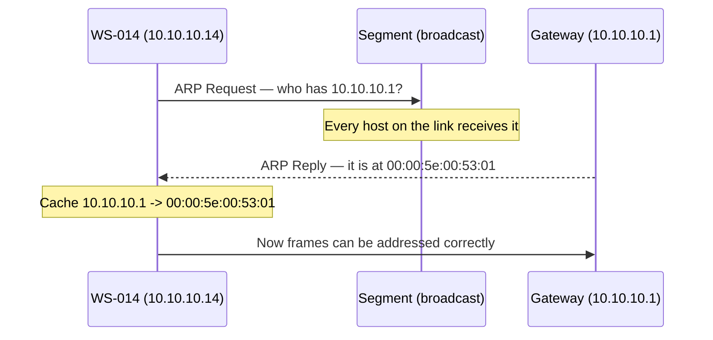
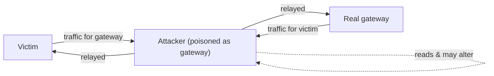

# 🧭 ARP & Neighbor Discovery

> [!abstract] Note of [[Switching & the Link Layer]]
> Before a host can send a frame to a neighbour, it must translate that neighbour's IP address into a hardware address — and the protocol that does this trusts any answer it receives. This note explains the resolution mechanism, why its trust model makes on-path attacks trivial on a local segment, and how to detect and prevent them.

## Parent Learning Order
Ethernet & Frame Structure -> MAC Addressing & Switch Operation -> ARP & Neighbor Discovery -> VLANs & Trunking -> Spanning Tree & Loop Prevention -> Link Layer Security Controls

## The Missing Translation

> *You know the destination's IP address. Why can you not build the frame yet?*
>
> Hold your answer — the section below is the response.

A host that wants to send to `10.10.10.1` knows the destination *IP* address, but a frame needs a destination *hardware* address. Something must bridge Layer 3 to Layer 2. On IPv4 that something is **ARP (Address Resolution Protocol)**.

The exchange is two messages:

1. **ARP Request** — broadcast to the whole segment: "Who has `10.10.10.1`? Tell `10.10.10.14`." — that is `WS-014` asking for its gateway. Every host receives it because it is addressed to `ff:ff:ff:ff:ff:ff`.
2. **ARP Reply** — a unicast answer from the owner: "`10.10.10.1` is at `00:00:5e:00:53:01`."

The asker caches the answer in its **ARP table** so it need not ask again for every frame.



```bash
ip neigh show
```

Expected excerpt:

```text
10.10.10.1 dev eth0 lladdr 00:00:5e:00:53:01 REACHABLE
10.10.10.30  dev eth0 lladdr 00:00:5e:00:53:1e STALE
```

`REACHABLE` means the mapping was confirmed recently; `STALE` means it is cached but unverified and will be revalidated on next use. The table is the host's belief about who its neighbours are — and belief is exactly what an attacker manipulates.

**Prerequisites:** the difference between an IP address and a MAC address, and what a broadcast is.

> [!tip] The analogy, and where it breaks
> Shouting across an open-plan office, 'who is Alice?' and writing down whoever answers. The analogy breaks in the detail that matters most: a real office would notice if a stranger answered to Alice's name, whereas ARP has no way to check. It also accepts answers to questions nobody asked, which is why a forged reply silently reroutes a victim's traffic while everything still appears to work.

## The Flaw: ARP Believes Anyone

ARP has no authentication. Three properties make it exploitable, and they are design characteristics rather than bugs:

- A host **accepts a reply it never requested**. Most implementations cache any ARP reply they see, whether or not they asked.
- A host **accepts an updated mapping** that overwrites an existing one, so a later reply wins.
- **Gratuitous ARP** — an unsolicited announcement of a mapping — is honoured, because it legitimately exists to update neighbours after a failover or address change.

Combine these and the attack writes itself. An attacker sends the victim a forged reply claiming the *gateway's* IP is at the *attacker's* MAC, and sends the gateway a forged reply claiming the *victim's* IP is at the *attacker's* MAC. Both caches are now poisoned, and both parties send their traffic to the attacker, who forwards it on to preserve connectivity. This is **ARP spoofing**, and it produces a full on-path position — the attacker reads and can modify every frame between victim and gateway.



Nothing appears broken to the victim — pages load, connections work — because the attacker relays. That silence is what makes it dangerous. The only visible symptom is in the ARP table: the gateway and some other host suddenly share one MAC address.

```bash
ip neigh show | sort -k5
```

Expected excerpt during an attack:

```text
10.10.10.1  dev eth0 lladdr 00:00:5e:00:53:de REACHABLE
10.10.10.30  dev eth0 lladdr 00:00:5e:00:53:de REACHABLE
```

Two different IP addresses resolving to the identical MAC (`00:00:5e:00:53:de`) is the signature. A legitimate configuration rarely does this, so it is a high-confidence indicator — with one honest exception.

> [!note] One legitimate cause of a shared MAC
> A router doing **proxy ARP** answers on behalf of hosts it can reach, so one hardware address deliberately covers many IP addresses; some VPN concentrators and wireless controllers behave the same way. The distinguishing feature is not the sharing but the *change*: proxy bindings are stable for days and belong to infrastructure, while poisoning shows an address that resolved to one MAC an hour ago resolving to a different one now. This is why detection is built on a baseline rather than on a single snapshot.

### The Attacker Has to Choose to Relay

Poisoning redirects frames; it does not forward them. A host that has been told the gateway is at the attacker's MAC delivers its traffic to the attacker's interface, and the attacker's operating system then decides what to do with packets that are not addressed to it. By default it drops them:

```bash
sysctl net.ipv4.ip_forward
```

```text
net.ipv4.ip_forward = 0
```

With forwarding off, a successful poisoning is a **denial of service**: the victim's traffic vanishes, pages stop loading, and the user calls the help desk within a minute. The quiet on-path position everyone associates with ARP spoofing requires the attacker to take a second, separate action — turn forwarding on — so that traffic continues to reach the real gateway and nothing appears wrong.

That gives defenders a second signature. A cluster of hosts on one segment losing connectivity at the same moment, and recovering when a device is disconnected or when the caches expire, is the shape of a *botched* poisoning attempt. It is the loudest version of the attack, and the one a beginner produces.

### Why the Attack Has to Keep Shouting

A poisoned cache entry is not a permanent write. Neighbour entries age: after a period without confirmation an entry becomes `STALE`, and the next time the host uses it, it probes the cached address to confirm the mapping is still current. The real gateway answers that probe truthfully. Left alone, the poisoning would be corrected within a minute or two by the protocol's own maintenance.

So spoofing is not a takeover — it is a **sustained overwrite race**. The attacker re-sends the forged mapping every few seconds so that its answer is always the most recent one in the victim's cache, which is exactly why "a flood of gratuitous ARP" appears in every detection list. The attack's persistence requirement *is* its noise.

```bash
sudo tcpdump -l -i eth0 -n arp and host 10.10.10.1
```

Expected excerpt during an attack:

```text
14:22:07.118 ARP, Reply 10.10.10.1 is-at 00:00:5e:00:53:de, length 28
14:22:09.121 ARP, Reply 10.10.10.1 is-at 00:00:5e:00:53:de, length 28
14:22:11.119 ARP, Reply 10.10.10.1 is-at 00:00:5e:00:53:de, length 28
14:22:11.402 ARP, Reply 10.10.10.1 is-at 00:00:5e:00:53:01, length 28
14:22:13.120 ARP, Reply 10.10.10.1 is-at 00:00:5e:00:53:de, length 28
14:22:15.121 ARP, Reply 10.10.10.1 is-at 00:00:5e:00:53:de, length 28
```

![[arp-cache-race.gif|The victim's cache entry for the gateway, read left to right as time. The bar is what the host believes; each tall stroke from above is a forged reply arriving on its metronome, and the short stroke from below is the real gateway answering a probe. Notice how little the truth buys: one narrow band, ended by the next forged reply.]]

The animation makes the shape of it plain. The forged replies land on a fixed beat and each one repaints the cache; the honest answer arrives once, out of rhythm and from a different direction, and holds for a fraction of the interval before the next forgery overwrites it. Nothing here is broken and nothing is exploited — the attacker is simply willing to speak more often than the gateway, and in a protocol where the most recent claim wins, that is the whole contest.

Read the timestamps rather than the addresses. Five of these replies arrive on an even two-second cadence from `00:00:5e:00:53:de`; one arrives out of rhythm at `.402` from `00:00:5e:00:53:01`, which is the real gateway answering a probe — and it is immediately overwritten by the next forged reply 1.7 seconds later. A machine that has genuinely changed hardware address announces itself a handful of times and stops. Anything answering for the same IP on a metronome is not a host, it is a loop.

**The deliberate break:** ARP is shaped like a question and an answer, so it reads as a lookup protocol — you ask who has an address, the owner replies, the way a DNS query works.

There is no binding between the question and the answer. A host caches replies it never requested, a later reply silently overwrites an earlier one, and an unsolicited announcement is honoured by design. That makes ARP less a query protocol than a **bulletin board any device on the segment may write to**, where the request is a courtesy rather than a precondition. Every link-layer on-path attack follows from that one property, and none of them require breaking anything — the attacker uses the protocol exactly as specified. It also explains the shape of the attack: on a bulletin board, nothing is ever taken down, so the only way to keep your notice on top is to keep pinning it there.

**How you'd spot it:** the absence of symptoms is the symptom, because a competent attacker relays traffic and nothing appears broken. Test positively instead: `ip neigh show` (and `ip -6 neigh` for NDP) with two different addresses resolving to one MAC is a signature that legitimate configuration rarely produces, and a `tcpdump` of ARP showing one MAC answering for an address on a fixed cadence confirms it. On the infrastructure side, Dynamic ARP Inspection drop counters climbing on an access port is the same event caught by the switch.

## IPv6: Neighbor Discovery Inherits the Problem

IPv6 does not use ARP. It uses **NDP (Neighbor Discovery Protocol)**, carried inside ICMPv6, with **Neighbor Solicitation** and **Neighbor Advertisement** messages that play the roles of request and reply. NDP is more capable — it also handles router discovery and address autoconfiguration — but it inherited ARP's core weakness: the messages are unauthenticated by default, so **Neighbor Advertisement spoofing** is the direct analogue of ARP spoofing.

```bash
ip -6 neigh show
```

Expected excerpt:

```text
fe80::1 dev eth0 lladdr 00:00:5e:00:53:01 router REACHABLE
2001:db8:acad:10::30 dev eth0 lladdr 00:00:5e:00:53:1e STALE
```

The same detection logic applies: two IPv6 addresses resolving to one MAC is suspicious. IPv6 additionally exposes router advertisement spoofing, a related but distinct attack covered where addressing is discussed. The lesson is that "we use IPv6" does not escape the trust problem — it renames it.

## Catching It, and Closing the Door

**Detection** watches for the signatures above and for behavioural anomalies:

- Multiple IP addresses mapping to one MAC in the neighbour table.
- A flood of gratuitous ARP or unsolicited neighbour advertisements — the metronome cadence shown above, not an occasional announcement.
- The gateway's MAC changing unexpectedly.

A passive monitor can maintain a baseline of IP-to-MAC bindings and alarm on changes:

```bash
sudo arpwatch -i eth0
```

Expected excerpt (from its log):

```text
changed ethernet address for 10.10.10.1
   from 00:00:5e:00:53:01 to 00:00:5e:00:53:de
```

A "changed ethernet address" event for the gateway is the alert that matters most; gateways do not normally change hardware address.

**Prevention** is a link-layer control, because the attack is link-layer:

- **Dynamic ARP Inspection (DAI)** on switches validates every ARP reply against a trusted binding table — typically the one built by DHCP snooping — and drops replies that do not match. An attacker's forged mapping fails validation and never reaches the victim.
- **Static ARP entries** for critical mappings (a server's gateway) cannot be overwritten by a forged reply, but do not scale beyond a few high-value bindings.
- For IPv6, the equivalent switch feature inspects neighbour advertisements against the same trusted bindings.
- **Host-side knobs help less than they appear to.** On Linux, `net.ipv4.conf.all.arp_accept` governs whether an unsolicited announcement may *create* a new cache entry; it does not stop an announcement from *overwriting* an entry that already exists — and overwriting the gateway's entry is the attack. Host hardening is worth having, but the control that actually stops this lives on the switch.

DAI is the scalable answer, and it depends on the snooping binding table — which is why the link-layer controls in this branch reinforce each other rather than standing alone.

## Security Implications

ARP and NDP spoofing are the foundation of most local on-path attacks. Once an attacker sits between a victim and its gateway, everything downstream becomes possible: reading plaintext credentials, stripping transport security by tampering with the handshake, injecting content, redirecting name lookups, and harvesting authentication material. The position is the prize; the specific payload varies.

The scope of the attack is exactly one broadcast domain — it cannot cross a router, because ARP and NDP are link-local. This is why segmentation limits the blast radius: an attacker on the guest VLAN cannot poison the finance VLAN's gateway. It is also why a flat network is so dangerous, since a single foothold can position itself between any two hosts in the entire estate.

Transport-layer security is the backstop that survives an on-path attacker. Even with a perfect on-path position, an attacker cannot read a properly validated TLS session — they can only see metadata and attempt a downgrade that certificate validation and HSTS defeat. This is precisely why "the local network is hostile" is the correct assumption and why end-to-end encryption is not optional.

All poisoning and interception described here must be performed only on an isolated lab you own. ARP spoofing intercepts other parties' traffic and is unlawful on networks you are not authorized to test.

## Summary

You should now be able to:

- Explain why ARP exists, describe the request/reply exchange, and state what an ARP table stores.
- Read a neighbour table, recognize the two-IPs-one-MAC signature of poisoning, distinguish it from a proxy-ARP router by looking for change rather than sharing, and use a monitor to detect a gateway MAC change.
- Explain why connectivity keeps working during a competent attack and collapses during an incompetent one, and why a forged mapping has to be re-sent on a cadence — so that the flood of gratuitous ARP is a consequence of the mechanism rather than a separate fact to memorize.
- Explain why ARP's acceptance of unsolicited and overwriting replies makes on-path attacks trivial; describe how Dynamic ARP Inspection uses the snooping binding table to validate replies, why the attack is confined to one broadcast domain, and why transport-layer security is the backstop that survives an on-path adversary.

---
> 🔼 Up: [[Switching & the Link Layer]]
