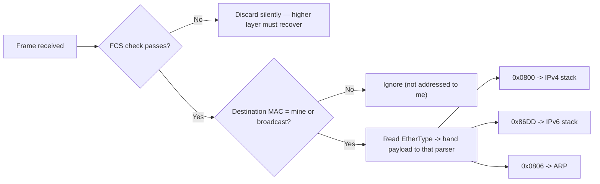

# 🧬 Ethernet & Frame Structure

> [!abstract] Note of [[Switching & the Link Layer]]
> Ethernet is the container every packet on a wired segment travels inside, and its fields decide who receives a frame, what it contains, and whether it survived transit intact. This note dissects the frame byte by byte, then shows why three of its properties — a forgeable source, an unauthenticated type field, and a fixed size limit — shape both operations and attacks.

## Parent Learning Order
Ethernet & Frame Structure -> MAC Addressing & Switch Operation -> ARP & Neighbor Discovery -> VLANs & Trunking -> Spanning Tree & Loop Prevention -> Link Layer Security Controls

## Start at Zero: The Envelope for the Local Hop

At the link layer, data does not travel as a "packet" — that word belongs to Layer 3. It travels as a **frame**: a structured sequence of bytes with a header, a payload, and a trailer, addressed to a device on *this segment only*. Every time a packet crosses a router, the old frame is discarded and a new one is built for the next hop. The IP addresses inside survive end to end; the frame around them is disposable and rebuilt at every link.

**Ethernet** is the dominant framing standard for wired networks. Understanding its layout is not trivia — it is the difference between reading a capture fluently and staring at hex.

```text
+----------+----------+----------+--------+--------------------+-----+
| Preamble | Dst MAC  | Src MAC  | Type/  | Payload            | FCS |
| + SFD    | 6 bytes  | 6 bytes  | Length | 46 - 1500 bytes    | 4 B |
| 8 bytes  |          |          | 2 B    |                    |     |
+----------+----------+----------+--------+--------------------+-----+
```

![[net_ethernet_frame.svg]]

The diagram above is worth studying before reading further: the top bar is the frame as it exists on the wire, and the bottom panel is that *same* structure as it appears in a real `tcpdump` hex dump. Being able to move between those two views — the abstract field map and the actual bytes — is the skill this note builds.

| Field | Size | Purpose |
| --- | --- | --- |
| Preamble + SFD | 8 bytes | Clock synchronization; a fixed bit pattern telling the receiver a frame is starting. Not shown by capture tools. |
| Destination MAC | 6 bytes | The hardware address of the intended recipient on this link |
| Source MAC | 6 bytes | The hardware address of the sender — **written by the sender, verified by no one** |
| EtherType / Length | 2 bytes | If ≥ 0x0600, identifies the payload protocol; if smaller, it is a length (older 802.3 framing) |
| Payload | 46–1500 bytes | The packet being carried, plus padding if under 46 |
| FCS | 4 bytes | Frame Check Sequence — a CRC over the frame for error detection |

> [!tip] The analogy, and where it breaks
> A frame is like a courier bag with a to/from label and a tamper seal. The label maps well to the addresses and the seal to the FCS. It breaks on the "from" line: a courier company verifies its sender, but Ethernet has no such check — the source address is whatever the sender chose to write, which is the root of a whole class of link-layer attacks.



Read the diagram as the receiver's decision order: integrity is checked first (a corrupt frame is dropped before anything else looks at it), then addressing decides whether to process it at all, and only then does the EtherType select which upper-layer parser receives the payload.

## The EtherType: The Demultiplexing Key

When a frame arrives, the receiver must decide what to do with the payload. The **EtherType** is that instruction.

| EtherType | Payload |
| --- | --- |
| `0x0800` | IPv4 |
| `0x86DD` | IPv6 |
| `0x0806` | ARP |
| `0x8100` | 802.1Q VLAN tag (a shim; the real EtherType follows) |
| `0x88CC` | LLDP (link-layer discovery) |

Without this field a receiver would have a payload and no parser for it. The `0x8100` value is special: it does not name a protocol but signals that a four-byte VLAN tag is inserted before the real EtherType, which is why a tagged frame is four bytes larger and why segmentation is possible at all.

## The FCS: Detection, Not Correction

The **Frame Check Sequence** is a 32-bit CRC computed over the addresses, type, and payload. The receiver recomputes it and compares. A mismatch means the frame was corrupted in transit, and the frame is silently **discarded** — Ethernet detects errors but does not correct them. Recovery is left to a higher layer: TCP will retransmit, UDP will not.

This has a direct operational consequence. A cable, port, or transceiver going bad manifests as rising FCS error counters and as performance that degrades rather than fails. TCP hides the loss by retransmitting, so users report "slowness," not "errors," and the true cause is invisible unless you read interface statistics.

```bash
ip -s link show eth0
```

Expected excerpt:

```text
2: eth0: <BROADCAST,MULTICAST,UP,LOWER_UP> mtu 1500
    RX:  bytes packets errors dropped  missed   mcast
    918273645 1204837     42       0       0    9821
    TX:  bytes packets errors dropped carrier collsns
    412938471  874622      0       0       0        0
```

The `errors` count of 42 under RX is the finding. On a healthy modern link this should be zero or nearly so. A steadily climbing value points at physical-layer trouble — a marginal cable, a dirty fibre connector, a failing port, or a duplex mismatch — well before it becomes a hard outage. `mcast` counting multicast frames is normal and not an error.

## Frame Size, MTU, and the 46-Byte Floor

The payload must be **at least 46 bytes**; shorter payloads are padded. This minimum exists because of how collision detection worked on the original shared medium: a frame had to be long enough to still be transmitting when a collision from the far end arrived. Modern switched full-duplex links have no collisions, but the minimum persists for compatibility.

The **maximum** standard payload is 1500 bytes — the Ethernet **MTU**. This single number ripples upward: it is why TCP advertises a maximum segment size of 1460 (1500 minus 20 bytes of IP and 20 of TCP header), and why every discussion of fragmentation traces back here.

**Jumbo frames** raise the payload ceiling to around 9000 bytes, used in storage and data-centre networks to cut per-frame overhead. They must be enabled consistently on every device in the path; a single device with a standard MTU in the middle silently drops the oversized frames, producing exactly the intermittent, size-dependent failures that are so hard to diagnose.

```bash
ip link show eth0 | grep -o 'mtu [0-9]*'
```

Expected output:

```text
mtu 1500
```

## Security Implications

Three properties of the frame create or shape attacks.

**The source address is forgeable.** Nothing in Ethernet authenticates the sender's MAC address. A host can transmit frames claiming any source it likes, which underpins MAC spoofing — to impersonate another device, to evade a MAC-based access control, or to poison a switch's learning. Because the field is a plain six bytes the sender writes, "the frame came from this MAC" is never a trustworthy statement on its own.

**The frame is readable by anyone who receives it.** Ethernet provides no confidentiality. On a shared medium, or when a switch is forced to flood, any station on the segment can read frame contents. This is why plaintext protocols leak and why link-layer encryption (MACsec) exists for high-assurance segments.

**Malformed frames probe parser behaviour.** Deliberately crafted frames — oversized, undersized, with inconsistent length and type fields, or with unusual tag stacking — test how a device's parser handles the unexpected. Divergent handling between an inspection device and the destination is an evasion opportunity, the same principle that makes fragment and tag ambiguity dangerous higher up the stack.

Frame crafting and interface manipulation described here belong on an isolated lab you control. Capturing frames exposes other parties' traffic, and injecting crafted frames on a network you do not own affects every device on the segment.

## Authorized Lab: Read a Frame Down to the Bytes

> [!info] Runs on one Linux machine — no second computer, no VM needed
> This builds a real two-host network inside your own kernel using **network namespaces**. Every command below is complete and copy-pasteable. Run them in order in one terminal.

### Step 1 — Build a two-host network in 6 commands

A namespace is an isolated network stack. We create one, connect it to the main system with a **veth pair** (a virtual cable with a plug at each end), and address both ends.

```bash
sudo ip netns add lab                                  # create the "remote host"
sudo ip link add veth-host type veth peer name veth-lab  # the virtual cable
sudo ip link set veth-lab netns lab                    # plug one end into the namespace
sudo ip addr add 10.99.0.1/24 dev veth-host            # address our end
sudo ip link set veth-host up
sudo ip netns exec lab sh -c 'ip addr add 10.99.0.2/24 dev veth-lab && ip link set veth-lab up'
```

Confirm it works — this is a genuine link with genuine MAC addresses:

```bash
ping -c 2 10.99.0.2
```

```text
PING 10.99.0.2 (10.99.0.2) 56(84) bytes of data.
64 bytes from 10.99.0.2: icmp_seq=1 ttl=64 time=0.061 ms
64 bytes from 10.99.0.2: icmp_seq=2 ttl=64 time=0.048 ms

--- 10.99.0.2 ping statistics ---
2 packets transmitted, 2 received, 0% packet loss, time 1015ms
```

### Step 2 — Learn the two MAC addresses you are about to see

Before capturing, find out what the answer *should* be, so the hex is not a mystery:

```bash
ip link show veth-host | grep ether
sudo ip netns exec lab ip link show veth-lab | grep ether
```

```text
    link/ether 8a:1f:2c:3d:4e:5f brd ff:ff:ff:ff:ff:ff
    link/ether 6e:9a:0b:1c:2d:3e brd ff:ff:ff:ff:ff:ff
```

Write these down. The first is **our** address (the sender), the second is the **namespace's** (the receiver). Your values will differ — veth MACs are randomly generated.

### Step 3 — Capture one frame and read its bytes

```bash
sudo tcpdump -i veth-host -e -XX -c 1 icmp &
sleep 1
ping -c 1 10.99.0.2 >/dev/null
```

```text
09:14:22.331847 8a:1f:2c:3d:4e:5f > 6e:9a:0b:1c:2d:3e, ethertype IPv4 (0x0800), length 98:
    10.99.0.1 > 10.99.0.2: ICMP echo request, id 4211, seq 1, length 64
        0x0000:  6e9a 0b1c 2d3e 8a1f 2c3d 4e5f 0800 4500
        0x0010:  0054 8f42 4000 4001 0000 0a63 0001 0a63
        0x0020:  0002 0800 4d3a 1073 0001 ...
```

**Now read line `0x0000` against the diagram above**, byte by byte:

```text
6e9a 0b1c 2d3e   <- bytes 0-5   destination MAC = the namespace (receiver)
8a1f 2c3d 4e5f   <- bytes 6-11  source MAC      = us (sender)
0800             <- bytes 12-13 EtherType: "an IPv4 header follows"
4500             <- byte 14     the IP header begins: 4=IPv4, 5=20-byte header
```

Notice the **destination comes first**, before the source — the receiver needs to know "is this for me?" before anything else. And notice `0a63 0001` further along line `0x0010`: that is `10.99.0.1` in hex (0a=10, 63=99, 00=0, 01=1), our own IP inside the payload the Ethernet header is carrying.

### Step 4 — Prove the source MAC is unverified

Change our MAC to something obviously fake and watch the frame carry the lie:

```bash
sudo ip link set veth-host down
sudo ip link set veth-host address 02:11:22:33:44:55
sudo ip link set veth-host up
sudo tcpdump -i veth-host -e -c 1 icmp &
sleep 1
ping -c 1 10.99.0.2 >/dev/null
```

```text
09:16:08.117293 02:11:22:33:44:55 > 6e:9a:0b:1c:2d:3e, ethertype IPv4 (0x0800), length 98:
    10.99.0.1 > 10.99.0.2: ICMP echo request, id 4288, seq 1, length 64
```

The frame now claims to come from `02:11:22:33:44:55`, and **nothing rejected it**. No error, no warning, delivery unaffected. That is the entire basis of MAC spoofing, demonstrated in three commands — and it is why "the frame came from this MAC" is never evidence on its own.

### Step 5 — See the 46-byte payload floor

```bash
sudo tcpdump -i veth-host -c 1 -e arp &
sleep 1
sudo ip netns exec lab ping -c 1 10.99.0.1 >/dev/null
```

```text
09:17:41.882014 6e:9a:0b:1c:2d:3e > ff:ff:ff:ff:ff:ff, ethertype ARP (0x0806),
    length 42: Request who-has 10.99.0.1 tell 10.99.0.2
```

An ARP request needs only 28 bytes of payload, yet `length 42` = 14 header + 28. On a physical wire this would be **padded to 60 bytes plus FCS**, because of the 46-byte minimum from the standard. Note also the destination `ff:ff:ff:ff:ff:ff` — the broadcast address, "everyone on this link."

### Step 6 — Check the error counters

```bash
ip -s link show veth-host | head -5
```

```text
3: veth-host@if2: <BROADCAST,MULTICAST,UP,LOWER_UP> mtu 1500 qdisc noqueue state UP
    link/ether 02:11:22:33:44:55 brd ff:ff:ff:ff:ff:ff
    RX:  bytes packets errors dropped  missed   mcast
          1284      14      0       0       0       0
```

`errors 0` is what a healthy link looks like. On real copper a rising count here — while everything still "works" because TCP retransmits — is the early warning of a failing cable or port.

### Step 7 — Cleanup (removes everything created above)

```bash
sudo ip netns del lab
ip link show veth-host 2>&1 | tail -1
```

```text
Device "veth-host" does not exist.
```

Deleting the namespace destroys both ends of the veth pair, so this single command removes the entire lab. The error message confirms it is gone.

**What you should now be able to do:** point at any byte in a hex dump and name its field, and explain from direct observation why a source MAC cannot be trusted.

6. Stop the capture. Nothing persists, so no cleanup beyond ending the process.

Expected interpretation:

```text
First 6 bytes  -> who receives this frame on this link (the gateway, not the destination host)
Next 6 bytes   -> claimed sender, unverified
EtherType 0800 -> the parser to hand the payload to
Stable errors  -> the physical layer is healthy; rising errors would precede an outage
```

## Crook → Operator → Root Checkpoint

- **Crook:** Name the fields of an Ethernet frame in order, explain what the EtherType is for, and state why a frame is rebuilt at every hop while the packet inside is not.
- **Operator:** Read a hex frame dump and identify each field; use interface statistics to distinguish a physical-layer problem from congestion, and explain why the symptom of rising FCS errors is "slowness."
- **Root:** Explain why the source MAC being unauthenticated enables spoofing and learning-table poisoning; describe how MTU inconsistency and jumbo-frame mismatches produce size-dependent failures, and why divergent frame-parser behaviour between devices is an evasion surface.

---
> 🔼 Up: [[Switching & the Link Layer]]
