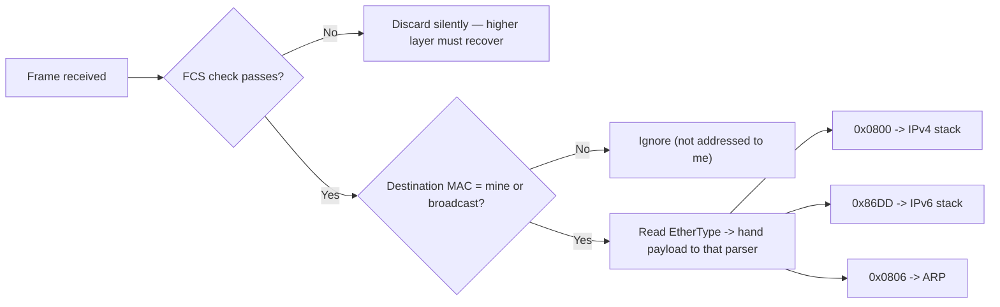
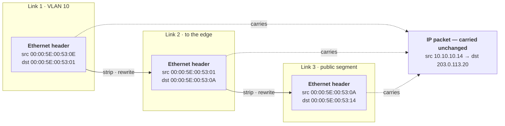

# 🧬 Ethernet & Frame Structure

> [!abstract] Note of [[Switching & the Link Layer]]
> Ethernet is the container every packet on a wired segment travels inside, and its fields decide who receives a frame, what it contains, and whether it survived transit intact. This note dissects the frame byte by byte, reads a real capture against that map, then shows why three of its properties — a forgeable source, an unauthenticated type field, and a fixed size limit — shape both operations and attacks.

## Parent Learning Order
Ethernet & Frame Structure -> MAC Addressing & Switch Operation -> ARP & Neighbor Discovery -> VLANs & Trunking -> Spanning Tree & Loop Prevention -> Link Layer Security Controls

## Why your packet gets a new address every few metres

> *You send one request. It arrives at a server twelve hops away. How many times was the destination address rewritten on the way?*
>
> Hold your answer — the section below is the response.

The intuitive answer is zero — you typed one address, and it went to one place. The real answer is twelve. Here is the first rewrite, caught on the wire:

```shell-session
analyst@lab:~$ tcpdump -i eth0 -c 1 -e -x 'tcp port 443'
14:22:07.881 00:00:5e:00:53:0e > 00:00:5e:00:53:01, ethertype IPv4 (0x0800), length 74
    0x0000:  0000 5e00 5301 0000 5e00 530e 0800 4500
```

That is `WS-014` in Meridian's workstation VLAN sending to its gateway. Count the bytes before `4500`, which is where the IP packet actually starts: `0000 5e00 5301` is six, `0000 5e00 530e` is six more, `0800` is two. Fourteen bytes sit in front of the packet you thought you sent — and they are thrown away and rebuilt at *every single hop*. The IP addresses inside survive the whole journey. The two addresses in front of them survive one link, then they are gone.

The two addresses differ only in their final byte, which is not an accident of the lab: the first three bytes of any MAC are the **OUI**, the block assigned to a vendor. Devices bought from the same vendor genuinely do look this similar on the wire, and learning to read the byte that distinguishes them is part of reading a capture.

Those fourteen bytes are an **Ethernet frame header**, and this is the distinction the rest of the note rests on. At the link layer, data does not travel as a "packet" — that word belongs to Layer 3. It travels as a **frame**: a structured sequence of bytes with a header, a payload, and a trailer, addressed to a device on *this segment only*.

**Ethernet** is the dominant framing standard for wired networks. Understanding its layout is not trivia — it is the difference between reading a capture fluently and staring at hex.

```text
+----------+----------+----------+--------+--------------------+-----+
| Preamble | Dst MAC  | Src MAC  | Type/  | Payload            | FCS |
| + SFD    | 6 bytes  | 6 bytes  | Length | 46 - 1500 bytes    | 4 B |
| 8 bytes  |          |          | 2 B    |                    |     |
+----------+----------+----------+--------+--------------------+-----+
```

Being able to move between those two views — the abstract field map above and the fourteen real bytes you just counted — is the skill this note builds, and **Reading a Real Frame, Byte by Byte** does it again at full length against a live capture.

| Field | Size | Purpose |
| --- | --- | --- |
| Preamble + SFD | 8 bytes | Clock synchronization; a fixed bit pattern telling the receiver a frame is starting. Not shown by capture tools. |
| Destination MAC | 6 bytes | The hardware address of the intended recipient on this link |
| Source MAC | 6 bytes | The hardware address of the sender — **written by the sender, verified by no one** |
| EtherType / Length | 2 bytes | If ≥ 0x0600, identifies the payload protocol; if smaller, it is a length (older 802.3 framing) |
| Payload | 46–1500 bytes | The packet being carried, plus padding if under 46 |
| FCS | 4 bytes | Frame Check Sequence — a CRC over the frame for error detection |

> [!tip] The analogy, and where it breaks
> A frame is like a courier bag with a to/from label and a tamper seal. The label maps well to the addresses and the seal to the FCS. It breaks on the "from" line: a courier company verifies its sender, but Ethernet has no such check — the source address is whatever the sender chose to write, which is the root of a whole class of link-layer attacks.



Read the diagram as the receiver's decision order: integrity is checked first (a corrupt frame is dropped before anything else looks at it), then addressing decides whether to process it at all, and only then does the EtherType select which upper-layer parser receives the payload.

**The deliberate break:** an address is the thing that gets you there. You type one destination, it names the machine that will answer, and it carries your data the whole way.

Two addressing systems are running at once, and only one of them survives the trip. The IP addresses are **end-to-end** — written once, unchanged at every hop, still identical when the server reads them. The MAC addresses are **per link**: they name the next device on *this segment*, they are stripped and rewritten by every router in the path, and twelve hops means twelve entirely different pairs. A MAC address is not the identity of your destination. It is the answer to "who do I hand this to next," and it is correct for about one cable's length.



Read the dotted lines as the point: three different frames, one packet. `WS-014` reaches Meridian's `track` server by way of the VLAN 10 gateway and `edge` — every MAC in the diagram is that hop's own last byte, and the only thing that made the whole journey is the pair of IP addresses.

**How you'd spot it:** capture at two points in the path and compare. The IP addresses will be byte-for-byte identical in both captures; the MAC addresses will share nothing at all. This is also why a MAC address in a log tells you which device was *adjacent* to the sensor, never who originated the traffic — the moment a router sits between you and the source, the source MAC you recorded belongs to the router.

## The EtherType: The Demultiplexing Key

When a frame arrives, the receiver must decide what to do with the payload. The **EtherType** is that instruction.

| EtherType | Payload |
| --- | --- |
| `0x0800` | IPv4 |
| `0x86DD` | IPv6 |
| `0x0806` | ARP |
| `0x8100` | 802.1Q VLAN tag (a shim; the real EtherType follows) |
| `0x88CC` | LLDP (link-layer discovery) |

Without this field a receiver would have a payload and no parser for it. The `0x8100` value is special: it does not name a protocol but signals that a four-byte VLAN tag is inserted before the real EtherType, which is why a tagged frame is four bytes larger and why segmentation is possible at all.

Nothing authenticates this value. A frame's EtherType is a claim by the sender about what the payload is, and the receiver acts on that claim — which is why a device that parses payloads differently from its neighbour creates an evasion surface, a theme **Security Implications** returns to.

## Reading a Real Frame, Byte by Byte

Everything above is a map. This task walks the same map across an actual capture.

> [!note] About this capture
> The frames below were captured on a virtual Ethernet pair between two network namespaces on a single Linux host — a real link with real, kernel-assigned MAC addresses, using synthetic `10.99.0.0/24` addressing. The bytes are genuine Ethernet; only the addresses are lab values.

**First, the two addresses involved.** Knowing the expected answer before reading hex is what turns a dump from a mystery into a confirmation:

```shell-session
analyst@lab:~$ ip link show veth-host | grep ether
    link/ether 8a:1f:2c:3d:4e:5f brd ff:ff:ff:ff:ff:ff
analyst@lab:~$ sudo ip netns exec lab ip link show veth-lab | grep ether
    link/ether 6e:9a:0b:1c:2d:3e brd ff:ff:ff:ff:ff:ff
```

`8a:1f:2c:3d:4e:5f` is the sender, `6e:9a:0b:1c:2d:3e` the receiver. Both are locally administered addresses the kernel generated at random when the interface was created — the second hex digit `a` and `e` both have the second-least-significant bit set, which is what marks an address as locally assigned rather than burned into hardware by a vendor.

**Now a single ICMP frame, captured with link-layer headers (`-e`) and a full hex dump (`-XX`):**

```shell-session
analyst@lab:~$ sudo tcpdump -i veth-host -e -XX -c 1 icmp
09:14:22.331847 8a:1f:2c:3d:4e:5f > 6e:9a:0b:1c:2d:3e, ethertype IPv4 (0x0800), length 98:
    10.99.0.1 > 10.99.0.2: ICMP echo request, id 4211, seq 1, length 64
        0x0000:  6e9a 0b1c 2d3e 8a1f 2c3d 4e5f 0800 4500
        0x0010:  0054 8f42 4000 4001 0000 0a63 0001 0a63
        0x0020:  0002 0800 4d3a 1073 0001 ...
```

Line `0x0000` is the first sixteen bytes on the wire. Read it against the field table in **Why your packet gets a new address every few metres**:

```text
6e9a 0b1c 2d3e   <- bytes 0-5   destination MAC = the receiver
8a1f 2c3d 4e5f   <- bytes 6-11  source MAC      = the sender
0800             <- bytes 12-13 EtherType: "an IPv4 header follows"
4500             <- byte 14     the IP header begins: 4 = IPv4, 5 = 20-byte header
```

Two details are worth pausing on. **The destination comes first, before the source** — the receiver's most urgent question is "is this for me?", and putting the answer in the first six bytes lets a NIC discard a frame that is not for it without parsing any further. And `0a63 0001` on line `0x0010` is `10.99.0.1` in hex (`0a`=10, `63`=99, `00`=0, `01`=1) — the sender's IP, sitting inside the payload that the Ethernet header is merely carrying. The frame does not know or care what those bytes mean; the EtherType told it which parser does.

Note also what is **absent**: the preamble and the FCS. The NIC strips the preamble before handing the frame up, and validates then discards the FCS. A capture tool shows you what survived, not the complete wire format — which is why an FCS error never appears as a malformed frame in `tcpdump`, only as a counter increment.

**How you'd spot trouble in a frame:** three fields carry almost all the signal. A **source MAC** that does not match the port's history is a spoof or a move. An **EtherType** you did not expect on that segment means something is speaking a protocol nobody deployed. And a frame at exactly the **60-byte floor** is usually padding around a very small payload — worth reading, because a lot of reconnaissance traffic is small.

## The FCS: Detection, Not Correction

The **Frame Check Sequence** is a 32-bit CRC computed over the addresses, type, and payload. The receiver recomputes it and compares. A mismatch means the frame was corrupted in transit, and the frame is silently **discarded** — Ethernet detects errors but does not correct them. Recovery is left to a higher layer: TCP will retransmit, UDP will not.

This has a direct operational consequence. A cable, port, or transceiver going bad manifests as rising FCS error counters and as performance that degrades rather than fails. TCP hides the loss by retransmitting, so users report "slowness," not "errors," and the true cause is invisible unless you read interface statistics.

```shell-session
analyst@lab:~$ ip -s link show eth0
2: eth0: <BROADCAST,MULTICAST,UP,LOWER_UP> mtu 1500
    RX:  bytes packets errors dropped  missed   mcast
    918273645 1204837     42       0       0    9821
    TX:  bytes packets errors dropped carrier collsns
    412938471  874622      0       0       0        0
```

The `errors` count of 42 under RX is the finding. On a healthy modern link this should be zero or nearly so. A steadily climbing value points at physical-layer trouble — a marginal cable, a dirty fibre connector, a failing port, or a duplex mismatch — well before it becomes a hard outage. `mcast` counting multicast frames is normal and not an error.

For contrast, a healthy interface with no physical layer to go wrong:

```shell-session
analyst@lab:~$ ip -s link show veth-host | head -5
3: veth-host@if2: <BROADCAST,MULTICAST,UP,LOWER_UP> mtu 1500 qdisc noqueue state UP
    link/ether 8a:1f:2c:3d:4e:5f brd ff:ff:ff:ff:ff:ff
    RX:  bytes packets errors dropped  missed   mcast
          1284      14      0       0       0       0
```

`errors 0` is the baseline. The number itself matters less than its *rate of change*: a counter that has read 42 for six months is a historical scar, while one climbing by 42 an hour is an outage forming.

## Frame Size, MTU, and the 46-Byte Floor

The payload must be **at least 46 bytes**; shorter payloads are padded. This minimum exists because of how collision detection worked on the original shared medium: a frame had to be long enough to still be transmitting when a collision from the far end arrived. Modern switched full-duplex links have no collisions, but the minimum persists for compatibility.

An ARP request makes the floor visible, because ARP needs far less space than the minimum allows:

```shell-session
analyst@lab:~$ sudo tcpdump -i veth-host -c 1 -e arp
09:17:41.882014 6e:9a:0b:1c:2d:3e > ff:ff:ff:ff:ff:ff, ethertype ARP (0x0806),
    length 42: Request who-has 10.99.0.1 tell 10.99.0.2
```

An ARP request carries 28 bytes of payload, and `length 42` is those 28 plus the 14-byte Ethernet header. On a physical wire this frame would be **padded out to 60 bytes plus the 4-byte FCS** to satisfy the 46-byte minimum — the padding is added by the NIC and is not shown here because a virtual link has no such requirement. Note the destination `ff:ff:ff:ff:ff:ff` as well: the broadcast address, meaning "every station on this link", which is how a host asks a question when it does not yet know who to ask.

![[ethernet-minimum-frame.png|Three frames carrying different amounts of data. Cyan is real payload, red is padding, and the narrow unfilled regions at each end are the header and the FCS. Top: a payload far under the floor, mostly padding. Middle: about half. Bottom: a payload that reaches the floor on its own, needing none. The three bars are the same length, which is the point.]]

Line the three up and the floor stops being a rule to memorise. A frame carrying one byte and a frame carrying forty-six occupy exactly the same space on the wire, because the padding expands to absorb the difference — so below the floor, sending less data does not cost less. This is why a network saturated by tiny frames is a real failure mode: at minimum size, an Ethernet segment spends most of its capacity on headers, padding and the gaps between frames, and almost none on anything anyone wanted to send. It is also the arithmetic behind the flooding attack in [[MAC Addressing & Switch Operation]], where each of those thousands of forged frames costs the switch a full 64 bytes regardless of how little the attacker put in it.

The **maximum** standard payload is 1500 bytes — the Ethernet **MTU**. This single number ripples upward: it is why TCP advertises a maximum segment size of 1460 (1500 minus 20 bytes of IP and 20 of TCP header), and why every discussion of fragmentation traces back here.

```shell-session
analyst@lab:~$ ip link show eth0 | grep -o 'mtu [0-9]*'
mtu 1500
```

**Jumbo frames** raise the payload ceiling to around 9000 bytes, used in storage and data-centre networks to cut per-frame overhead. They must be enabled consistently on every device in the path; a single device with a standard MTU in the middle silently drops the oversized frames, producing exactly the intermittent, size-dependent failures that are so hard to diagnose — small requests succeed, large ones vanish, and nothing logs a reason.

## Security Implications

Three properties of the frame create or shape attacks.

**The source address is forgeable.** Nothing in Ethernet authenticates the sender's MAC address. A host can transmit frames claiming any source it likes, which underpins MAC spoofing — to impersonate another device, to evade a MAC-based access control, or to poison a switch's learning.

This is not a theoretical property, and it takes three commands to demonstrate. Setting the interface to an obviously fake address and re-capturing shows the frame carrying the lie:

```shell-session
analyst@lab:~$ sudo ip link set veth-host down
analyst@lab:~$ sudo ip link set veth-host address 02:11:22:33:44:55
analyst@lab:~$ sudo ip link set veth-host up
analyst@lab:~$ sudo tcpdump -i veth-host -e -c 1 icmp
09:16:08.117293 02:11:22:33:44:55 > 6e:9a:0b:1c:2d:3e, ethertype IPv4 (0x0800), length 98:
    10.99.0.1 > 10.99.0.2: ICMP echo request, id 4288, seq 1, length 64
```

The frame now claims to originate from `02:11:22:33:44:55`, and **nothing rejected it** — no error, no warning, delivery unaffected. The receiver has no mechanism with which to object, because Ethernet defines none. That is the entire basis of MAC spoofing, and it is why "the frame came from this MAC" is never evidence on its own. A switch seeing this frame does something worse than accept it: it *learns* from it, associating that fabricated address with the port, which is the first move in a learning-table poisoning attack.

**The frame is readable by anyone who receives it.** Ethernet provides no confidentiality. On a shared medium, or when a switch is forced to flood, any station on the segment can read frame contents. This is why plaintext protocols leak and why link-layer encryption (MACsec) exists for high-assurance segments.

**Malformed frames probe parser behaviour.** Deliberately crafted frames — oversized, undersized, with inconsistent length and type fields, or with unusual tag stacking — test how a device's parser handles the unexpected. Divergent handling between an inspection device and the destination is an evasion opportunity, the same principle that makes fragment and tag ambiguity dangerous higher up the stack.

> [!warning] Authorized use
> Frame crafting and interface manipulation belong on an isolated segment you own or are explicitly permitted to test. Capturing frames exposes other parties' traffic, and injecting crafted frames on a network you do not control affects every device sharing it.

## Summary

You should now be able to:

- Name the fields of an Ethernet frame in order, explain what the EtherType selects, and state why a frame is rebuilt at every hop while the packet inside survives end to end.
- Read a hex dump byte by byte and identify each field, and explain why the destination address precedes the source and why the preamble and FCS never appear in a capture.
- Use interface statistics to separate a physical-layer fault from congestion, and explain why rising FCS errors reach users as "slowness" rather than as errors.
- Explain why an unauthenticated source MAC enables both spoofing and switch learning-table poisoning, and why an observed MAC address is never evidence of origin on its own.
- Describe how the 46-byte floor and MTU inconsistency produce size-dependent failures, and why divergent frame parsing between devices is an evasion surface.

---
> 🔼 Up: [[Switching & the Link Layer]]
