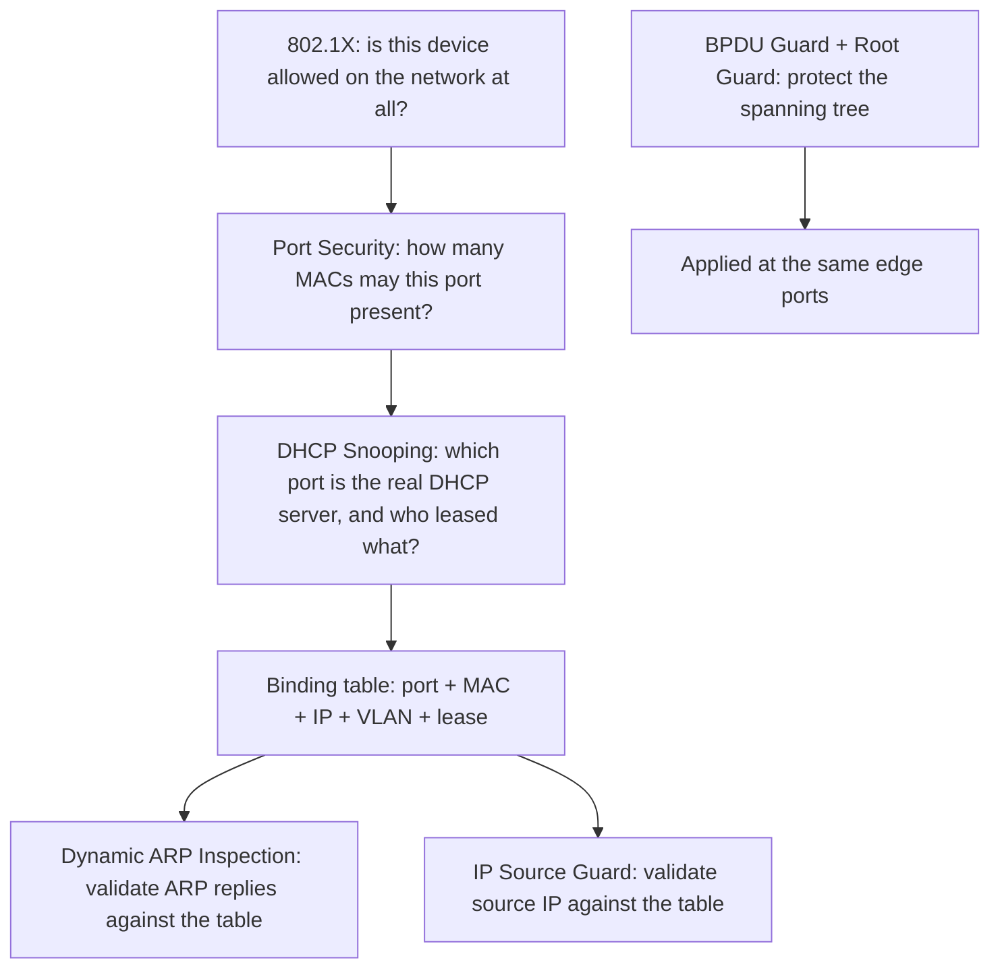

# 🛡️ Link Layer Security Controls

> [!abstract] Note of [[Switching & the Link Layer]]
> Every attack in this branch exploits the same fact — Layer 2 protocols trust whatever they are told. This note assembles the controls that replace that trust with verification, shows how they build on one another around a single binding table, and explains the order in which to deploy them so each reinforces the next.

## Parent Learning Order
Ethernet & Frame Structure -> MAC Addressing & Switch Operation -> ARP & Neighbor Discovery -> VLANs & Trunking -> Spanning Tree & Loop Prevention -> Link Layer Security Controls

## The Common Root Cause

> *MAC flooding, ARP spoofing, rogue DHCP and VLAN hopping look like four unrelated attacks. What single weakness do they share?*
>
> Hold your answer — the section below is the response.

The link-layer attacks covered in this branch look different but share one weakness:

| Attack | Exploits | The lie it tells |
| --- | --- | --- |
| MAC flooding | Finite CAM table | Thousands of fake source addresses |
| ARP spoofing | Unauthenticated replies | "The gateway is at my MAC" |
| Rogue DHCP | Unauthenticated offers | "I am your DHCP server" |
| VLAN hopping | Trunk negotiation, native VLAN | "My port is a trunk" |
| STP takeover | Unauthenticated BPDUs | "I am the root bridge" |

The pattern is always the same: a device asserts something, and the network believes it without proof. The controls in this note are, at heart, a single idea applied in several places — **establish a trusted record of what should be true, then reject anything that contradicts it.** That trusted record is the DHCP snooping binding table, and it is the keystone the other controls lean on.

**Prerequisites:** MAC flooding, ARP spoofing, rogue DHCP, VLAN hopping, and STP takeover.

> [!tip] The analogy, and where it breaks
> A building that stops trusting anyone who simply walks in, and instead issues badges at the door, records which badge entered which room, and checks every later claim against that record. The analogy breaks because the badge record is not merely a log — it is the *live* source of truth other controls query in real time, which is why deploying ARP inspection before DHCP snooping fails: you would be checking claims against an empty register.

## The Control Stack



Read the diagram top to bottom as a sequence of questions, each narrowing trust. The binding table in the middle is what makes the lower controls possible — DAI and IP Source Guard have nothing to validate against without it.

### 802.1X — Authenticate the Device

**802.1X** is port-based network access control. Before a port carries any normal traffic, the connecting device must authenticate to an authentication server (typically RADIUS) using credentials or a certificate. Until it does, the port passes only the authentication exchange and nothing else.

This is the strongest control because it addresses the root problem directly: an unauthorized device never reaches the segment, so it cannot flood, spoof, or inject anything. Where 802.1X is deployed and enforced, most of the other attacks become impossible from an unauthenticated port. Its cost is operational — every device needs a credential, and plenty of devices cannot hold one. Printers, badge readers, cameras, lift controllers and building sensors have no supplicant, so real deployments fall back to **MAC Authentication Bypass**.

Look closely at what MAB does. When 802.1X times out on a port, the switch takes the device's MAC address and submits it to the authentication server as both the username and the password. The device is admitted because of the address it claims to have.

That is the same address this branch has spent five notes establishing is a **software-settable label** — read off a sticker on the back of a printer, or off the wire with any capture tool, and set on an attacker's interface with one command. The strongest control in the stack, the one that makes every other attack impossible from an unauthenticated port, falls back for its exceptions onto the weakest identifier in the entire link layer.

This is not an argument against 802.1X, which is still the right control. It is the reason a MAB exception is a decision rather than a convenience: every device on the bypass list is a device an attacker can become by copying twelve hex digits, so the list should be short, inventoried, confined to VLANs worth little, and monitored for the same address appearing on two ports.

### Port Security — Cap the Addresses

**Port security** limits how many MAC addresses a port may learn, and acts when the limit is exceeded — restrict (drop excess), shut down (disable the port), or protect (silently drop). A limit of one or two on an access port defeats MAC flooding outright, because the flood depends on presenting thousands of source addresses through one port.

```text
switchport port-security
switchport port-security maximum 2
switchport port-security violation restrict
switchport port-security mac-address sticky
```

`sticky` learns the current addresses and pins them, so the port also resists a device being swapped for another. This is inventory enforcement as much as attack prevention.

```bash
show port-security interface GigabitEthernet0/3
```

```text
Port Security              : Enabled
Port Status                : Secure-up
Violation Mode             : Restrict
Maximum MAC Addresses      : 2
Total MAC Addresses        : 1
Sticky MAC Addresses       : 1
Last Source Address:Vlan   : 0000.5e00.53de:10
Security Violation Count   : 4831
```

`Secure-up` with a violation count in the thousands is a port doing exactly what it was configured to do and nobody noticing. `Restrict` drops the excess and stays up, which keeps the user working and keeps the incident invisible unless something is reading the counter. The `Last Source Address` names the device that has been rebuffed nearly five thousand times, and on this segment that address belongs to nothing legitimate. Note that it prints in the dotted form `0000.5e00.53de` with the VLAN appended after the colon, while the snooping table above prints the same kind of address as `00:00:5E:00:53:0E` — the two commands genuinely disagree about notation, and reading vendor output means expecting that rather than assuming one of them is wrong.

### DHCP Snooping — Establish the Truth

**DHCP snooping** classifies ports as trusted or untrusted. Only trusted ports (facing the real DHCP server or the uplink toward it) may send DHCP server messages; offers arriving on untrusted ports are dropped. This defeats rogue DHCP.

Its more important output is the **binding table** it builds by watching legitimate DHCP exchanges: for each client it records port, MAC, IP, VLAN, and lease time. This table is the trusted record of "who legitimately has which IP behind which port," and it is what the next two controls validate against.

```bash
show ip dhcp snooping binding
```

Expected excerpt — the two workstations on VLAN 10:

```text
MacAddress          IpAddress      Lease(sec)  Type          VLAN  Interface
00:00:5E:00:53:0E   10.10.10.14    84213       dhcp-snooping 10    Gi0/3
00:00:5E:00:53:1E   10.10.10.30    84102       dhcp-snooping 10    Gi0/4
------------------------------------------------------------------
Total number of bindings: 2
```

The last line is the one to check before trusting anything built on top of this table. Two bindings on a segment with two hosts is a healthy register. Two bindings on a segment with two hundred hosts means the other hundred and ninety-eight are statically addressed, never went through DHCP, and therefore have no entry — and every control that validates against this table is about to make a decision about them with nothing to go on.

### Dynamic ARP Inspection — Validate Neighbours

**DAI** intercepts every ARP reply on untrusted ports and checks it against the binding table. A reply claiming `10.10.10.1 is at 00:00:5E:00:53:DE` is dropped if the table does not have that IP-to-MAC-to-port binding. This defeats ARP spoofing, and it works only because DHCP snooping supplied the table.

The attack from **[[ARP & Neighbor Discovery]]** — the forged mapping re-sent every couple of seconds so it always wins the cache — is the same attack the counters here are counting:

```bash
show ip arp inspection statistics vlan 10
```

```text
 Vlan      Forwarded        Dropped     DHCP Drops     ACL Drops
 ----      ---------        -------     ----------     ---------
   10          14027           1832           1832             0
```

Eighteen hundred drops against fourteen thousand forwarded is not a tuning problem. Recall why that attack has to repeat itself: a poisoned entry ages out and gets reprobed, so the attacker must re-send on a cadence to keep winning. That cadence is what produced this number. The control is working, and the counter is simultaneously the alert — which is the point of the monitoring argument below.

### IP Source Guard — Validate Source Addresses

**IP Source Guard** filters traffic by source IP against the same binding table, dropping frames whose source IP does not match the address leased to that port. This prevents a host from spoofing another's IP address, closing off address-based impersonation.

### What Each Control Actually Covers

![[l2-control-coverage.png|Rows are the attacks — MAC flooding, ARP spoofing, rogue DHCP, VLAN hopping, STP takeover, IP spoofing. Columns are the controls, in the same order: 802.1X, port security, DHCP snooping, Dynamic ARP Inspection, IP Source Guard, BPDU Guard. A filled cell means that control stops that attack from an untrusted port.]]

The shape is the argument. One column is solid and every other column holds exactly one cell, because 802.1X is the only control here that addresses the cause rather than a symptom — an unauthenticated device never reaches the segment, so there is nothing for it to flood, forge or claim. Everything to the right of it is a specific answer to a specific lie.

Read it a second time as a risk register. Every single-cell column is a control you can lose without losing the others, which is the layering argument. The solid column is the one whose failure is not a gap but a hole — and, per the section above, the exceptions carved into it are exactly where that failure gets arranged.

## The Deployment Order Matters

These controls are not independent; several depend on the binding table, so the sequence of deployment is:

1. **DHCP snooping first** — it builds the binding table everything else needs.
2. **Dynamic ARP Inspection and IP Source Guard next** — they consume the table.
3. **Port security** — independent, deployable at any point, defeats flooding.
4. **BPDU Guard and Root Guard** — on the same access ports, protecting the spanning tree.
5. **802.1X** — the strongest, deployed as the program matures, subsuming much of the rest.

Deploying DAI before DHCP snooping means DAI has an empty table and either blocks all ARP (an outage) or trusts everything (no protection). The dependency is why "turn on ARP inspection" is not a standalone action.

## MACsec — Encrypt the Link

The controls above prevent forgery but do not provide confidentiality; a device with physical access to a link can still read frames. **MACsec (802.1AE)** adds hop-by-hop encryption and integrity at Layer 2, so frames on the wire are unreadable and tamper-evident between two MACsec peers. It is used on high-assurance segments and between infrastructure devices where physical interception is part of the threat model. Unlike the forgery-prevention controls, MACsec addresses the "the frame is readable by anyone who receives it" property directly.

**The deliberate break:** the controls read as a checklist of independent switch features — port security, DHCP snooping, Dynamic ARP Inspection, IP Source Guard, 802.1X — to be enabled wherever they are available.

They are a dependency chain, and the order is load-bearing. DAI and IP Source Guard do not carry their own knowledge of what is legitimate; they **query the DHCP snooping binding table**, and that table is built only as hosts acquire leases through a trusted port. Enable inspection before snooping has populated the table and every legitimate host validates against an empty register — the control either fails open and protects nothing, or fails closed and takes the segment down. The table is the keystone; the rest are consumers of it.

**How you'd spot it:** before trusting any inspection control, confirm the register it reads has entries — a binding table with a handful of rows on a segment of two hundred hosts means the controls above it are inspecting against nothing. The other tell is a wave of drops immediately after enabling DAI: that is almost always statically addressed hosts with no lease and therefore no binding, not an attack, and it is fixed with static entries rather than by disabling the control.

## Security Implications

**Layered controls fail independently, which is the point.** An attacker who somehow presents a valid MAC still faces DAI validating their ARP; one who forges an ARP reply still faces IP Source Guard on their traffic; one who reaches the port at all still faces 802.1X. Each control assumes the others might be bypassed, and together they make a link-layer foothold expensive rather than free.

**Unmanaged switches and exceptions are the gaps.** These controls live on managed switches. A consumer switch plugged in downstream of a protected port creates an unprotected micro-segment behind it, and any device on that switch bypasses the port-level controls. Similarly, every 802.1X exception and every trusted port is a deliberate hole that must be justified and monitored. Attackers look for exactly these gaps because the controls themselves are sound.

**Monitoring the controls is as important as enabling them.** A DAI drop, a port-security violation, or a BPDU Guard shutdown is a security event — it means something asserted a lie and was caught. Feeding these events to central logging turns the controls from silent prevention into active detection, and a spike in violations is often the first sign of an intrusion attempt on the wired network.

**These controls protect the wired edge, not the whole problem.** They do nothing for wireless association, nothing for an already-compromised authorized host, and nothing above Layer 2. They are one necessary layer, and treating them as sufficient is its own mistake.

All configuration and validation described here must be performed on an isolated lab or on production infrastructure you are explicitly authorized to change; enabling these controls incorrectly (DAI without snooping, aggressive port security) can itself cause outages.

## Summary

You should now be able to:

- State the common weakness all link-layer attacks share, and name the control that stops each one.
- Explain what the DHCP snooping binding table contains and which controls depend on it; deploy the controls in the correct order and verify each by repeating the attack it stops.
- Explain why MAC Authentication Bypass admits a device on the strength of an address anyone can copy, and why that makes every bypass entry a decision rather than a convenience.
- Explain why 802.1X is the strongest control and where its exceptions leak; justify the deployment order from the binding-table dependency, describe what MACsec adds that the forgery-prevention controls do not, and argue why monitoring control violations turns prevention into detection.

---
> 🔼 Up: [[Switching & the Link Layer]]
