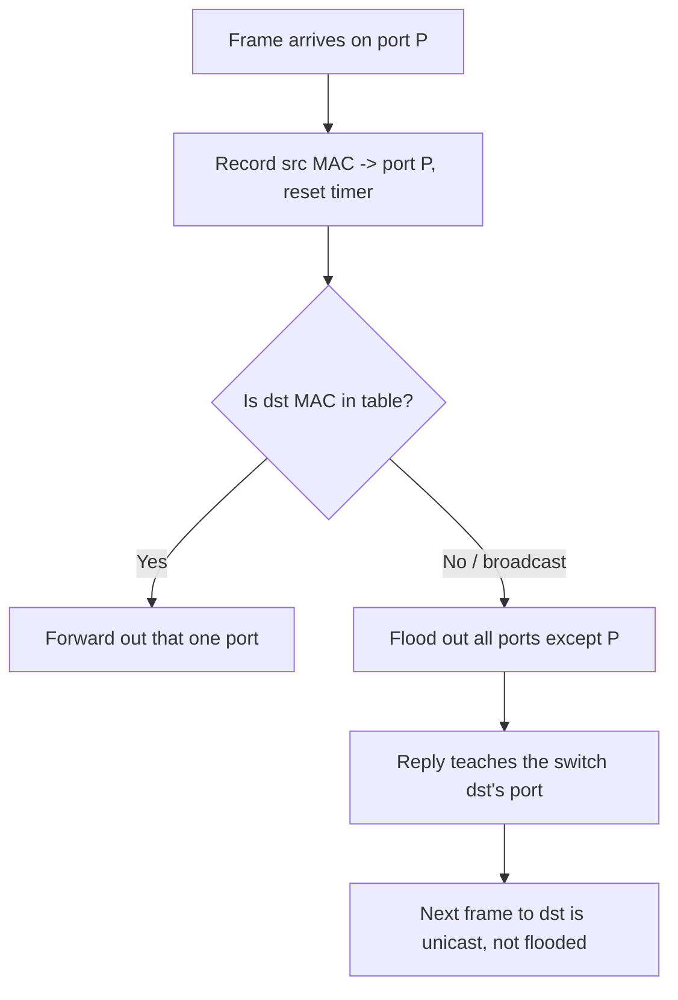

# 🎚️ MAC Addressing & Switch Operation

> [!abstract] Note of [[Switching & the Link Layer]]
> A switch is a device that learns where things are by watching, remembers it in a finite table, and forwards accordingly. This note explains the hardware address, the learning algorithm, the three forwarding decisions, and why the finiteness of that table turns a switch into a wiretap when an attacker fills it.

## Parent Learning Order
Ethernet & Frame Structure -> MAC Addressing & Switch Operation -> ARP & Neighbor Discovery -> VLANs & Trunking -> Spanning Tree & Loop Prevention -> Link Layer Security Controls

## What a MAC Address Is

> *You find `00:0c:29:4a:9b:31` in a capture. What can you say about that device before looking anything up?*
>
> Hold your answer — the section below is the response.

Three things, from the bytes alone. It is a **unicast** address, not multicast. It was **assigned by a vendor** rather than set by software. And the vendor is a virtualization platform — so this is almost certainly a virtual machine, not physical hardware. All of that is readable before any lookup, and the rest of this section is why.

A **MAC (Media Access Control) address** is a 48-bit identifier assigned to a network interface, written as six hex pairs: `00:00:5e:00:53:0e`. It identifies a device on a local segment, and unlike an IP address it is not hierarchical and does not describe location — it is a flat name.

The 48 bits have structure:

- The first three bytes are the **OUI (Organizationally Unique Identifier)**, assigned to the hardware vendor. `00:50:56` belongs to one virtualization vendor, `00:0c:29` to another. This is why a MAC often reveals what *kind* of device you are looking at.
- Two bits in the first byte are flags. The **I/G bit** distinguishes unicast (0) from multicast/broadcast (1). The **U/L bit** marks whether the address is universally assigned by the vendor (0) or locally administered (1).

That U/L bit matters for a practical reason: a locally administered address is one that software set rather than the hardware vendor. A host deliberately changing its MAC — for privacy, or to evade a control — typically sets a locally administered address, and the U/L bit being 1 is a soft signal that an address was assigned by software.

The broadcast address `ff:ff:ff:ff:ff:ff` means "every device on this segment," and is how protocols reach hosts whose address is not yet known.

```bash
ip link show eth0
```

Expected excerpt:

```text
2: eth0: <BROADCAST,MULTICAST,UP,LOWER_UP> mtu 1500
    link/ether 00:0c:29:4a:9b:31 brd ff:ff:ff:ff:ff:ff
```

The `00:0c:29` prefix identifies the interface as virtual, and `brd ff:ff:ff:ff:ff:ff` is the broadcast address for the link.

**Prerequisites:** the Ethernet frame's source and destination address fields.

> [!tip] The analogy, and where it breaks
> A receptionist who learns where people sit purely by noticing which door each person walks in from, and keeps that list on a small notepad. The analogy breaks because of the notepad's size: fill it with thousands of fake names and the receptionist, unable to record anyone new, resorts to shouting every message down every corridor. That is MAC flooding — an interception achieved by exhausting a data structure, with no human equivalent.

**The deliberate break:** MAC addresses are described as "burned into the hardware," which makes them sound like a serial number you cannot argue with. That is why people try to use them for access control.

The address a NIC *ships* with is burned in. The address it **sends** is whatever the driver was told to put in the frame, and changing it takes one command. Nothing on the wire authenticates it, nothing verifies it against the hardware, and the switch you are about to read about will believe it instantly. MAC filtering therefore raises effort by about thirty seconds and provides no authentication at all.

**How you'd spot a spoof:** the same MAC appearing on two switch ports, or a port whose MAC changes without a device being unplugged. Neither happens in normal operation.

## How a Switch Learns

A switch has no map of the network when it powers on. It builds one by **observing the source address of every frame** and recording which physical port that frame arrived on, into a structure called the **MAC address table** or **CAM (Content-Addressable Memory) table**.

The algorithm is three rules:

1. **Learn** — record `source MAC → arrival port` for every frame, refreshing a timer.
2. **Forward** — if the destination MAC is in the table, send the frame out that one port only.
3. **Flood** — if the destination MAC is unknown, or is broadcast/multicast, send the frame out every port except the one it arrived on.

Entries **age out** after a default of about five minutes of silence, so a device that stops transmitting is eventually forgotten and must be relearned.



![[switch-learn-flood.png]]
*Port B receives a frame and the switch records its source against that port — the short connector into the address table. The destination is not yet known, so the frame leaves by A, C and D: every port except the one it arrived on. Three arrowheads, never four.*

The diagram shows why the first frame to a new destination is flooded but the conversation quickly becomes point-to-point: the reply teaches the switch where the destination lives. This is the entire efficiency argument for switches over hubs — a hub floods everything forever, a switch floods only until it has learned.

Inspect the table on a Linux bridge (the software equivalent of a switch):

```bash
sudo bridge fdb show br0
```

Expected excerpt:

```text
00:0c:29:4a:9b:31 dev eth1 master br0
00:0c:29:7b:2c:14 dev eth2 master br0
33:33:00:00:00:01 dev eth1 self permanent
```

Each line maps a hardware address to the port (`dev`) behind which it was learned. The `33:33:...` entry is an IPv6 multicast address and is expected.

## The Finite Table Is the Vulnerability

A CAM table holds a fixed number of entries — thousands to tens of thousands depending on hardware. That limit is the attack surface.

In **MAC flooding**, an attacker transmits a torrent of frames with fabricated, random source addresses. The switch dutifully learns each one, and the table fills. Once full, the switch can no longer record legitimate `MAC → port` mappings. Its only safe behaviour for an unknown destination is to flood — so it begins flooding traffic for legitimate destinations out every port.

The consequence is that a switched network degrades into a hub: the attacker now receives copies of frames destined for other hosts, defeating the confidentiality that switching provided. This is a passive-interception attack achieved entirely by exhausting a data structure, and no packet was "hacked" — the switch behaved exactly as designed under conditions it was not sized for.

```text
Normal:   Host A -> Switch -> only Host B's port receives A's frames to B
Flooded:  table full -> Switch floods -> attacker's port receives A's frames to B too
```

### Watching the table fill

The mechanism is easier to trust once you have watched the counter move. On Meridian's VLAN 10 access switch, with a rogue device on port `Gi0/14` — the port `WS-014` normally uses:

```console
switch# show mac address-table count

Dynamic Address Count  :      412
Total Mac Addresses    :      412
Total Mac Address Space Available: 7780
```

412 real devices, and room for nearly eight thousand. Now the rogue device begins emitting frames with randomised source addresses, and the same command a few seconds later:

```console
switch# show mac address-table count

Dynamic Address Count  :     8192
Total Mac Addresses    :     8192
Total Mac Address Space Available:    0
```

`Available: 0` is the whole attack. Nothing crashed and no vulnerability was exploited — the table reached the size it was built to hold, and every subsequent legitimate address has nowhere to be recorded. From that moment a frame for `WS-014` has no entry, so the switch does the only safe thing it knows and floods it out every port, including the rogue's.

```console
switch# show mac address-table interface Gi0/14 | count
Number of lines which match regexp = 6847
```

![[switch-cam-flood.gif]]
*The table filling under a flood. The three legitimate entries at the top are never displaced — they are simply outnumbered, and once the last row is taken the switch has nowhere to record the next address. Only then does it begin flooding, which is the moment the arrows appear.*

One access port claiming 6,847 addresses is not a device. A workstation presents one, occasionally two if a phone is daisy-chained — and that ratio is the detection, available from a counter without any packet inspection at all.

> [!note] A Linux bridge will not reproduce this
> `bridge fdb` grows dynamically and has no small fixed ceiling, so flooding a software bridge fills memory rather than a table. The exhaustion behaviour above is a property of hardware CAM, which is sized at manufacture. A lab on `br0` demonstrates *learning* faithfully and cannot demonstrate *exhaustion*.

The defence is not encryption of the frame; it is limiting how many addresses a port may present. **Port security** caps the MAC count per port and takes action — restrict, shut down, or alarm — when the cap is exceeded. A cap of one or two on an access port makes flooding impossible, because the flood requires presenting thousands of source addresses through a single port.

## Security Implications

**MAC-based access control is weak.** Some networks permit or deny devices by MAC address. Because the source address is attacker-chosen, an attacker who observes an allowed address can simply adopt it. MAC filtering raises effort marginally and provides no real authentication; treat it as inventory hygiene, not a control.

**MAC addresses enable tracking, and randomization defeats it.** A stable hardware address lets a network — or an eavesdropper — recognize a returning device across time and location. Modern clients randomize their MAC per network specifically to prevent this, which is why the U/L bit is increasingly set on ordinary devices and why MAC-based device inventories drift.

**Flooding is loud but effective.** MAC flooding generates enormous frame volume and is trivially visible to anyone watching table utilization or port statistics. Its value to an attacker is the brief window of interception before detection, which is precisely why proactive port-security limits, rather than reactive alerting, are the right control.

**Table state is forensic evidence.** The CAM table at a point in time places a hardware address behind a physical port, which can locate a rogue device. But entries age out in minutes, so this evidence is perishable and must be captured promptly during an incident.

All flooding, spoofing, and table manipulation described here must be confined to an isolated lab you own. Exhausting a production switch's table degrades service for every user on it and exposes their traffic.

## Summary

You should now be able to:

- Explain what a MAC address is and how it differs from an IP address; describe the switch's learn/forward/flood algorithm in plain language.
- Read a forwarding database, interpret an OUI and the U/L bit, and explain why the first frame to a new host is flooded while the rest of the conversation is unicast.
- Explain how MAC flooding converts a switch into a wiretap by exhausting the CAM table; justify why port-security limits defeat it where encryption does not, and why MAC-based access control provides no real authentication.

---
> 🔼 Up: [[Switching & the Link Layer]]
