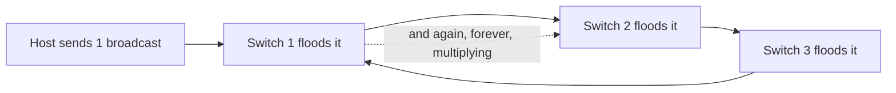

# 🌲 Spanning Tree & Loop Prevention

> [!abstract] Note of [[Switching & the Link Layer]]
> A single physical loop in a switched network does not slow it down — it melts it, in seconds, because Layer 2 has no equivalent of the TTL that saves Layer 3. This note explains why loops are catastrophic, how Spanning Tree prevents them by disabling links, and why the protocol that saves the network is itself an attack surface.

## Parent Learning Order
Ethernet & Frame Structure -> MAC Addressing & Switch Operation -> ARP & Neighbor Discovery -> VLANs & Trunking -> Spanning Tree & Loop Prevention -> Link Layer Security Controls

## Why a Loop Is Fatal at Layer 2

> *A routing loop eventually resolves itself. Why does a switching loop not?*
>
> Hold your answer — the section below is the response.

Redundant links are good engineering — two paths between switches survive a cable failure. But redundancy at Layer 2 creates a **loop**, and a loop is catastrophic, because the Ethernet frame has no field that limits how long it may circulate.

Recall from Layer 3 that an IP packet carries a **TTL** that every router decrements, so a routing loop eventually discards the packet. The Ethernet frame has **no such field**. A frame that enters a loop circulates forever.

Now recall the switch's forwarding rule: a broadcast frame is flooded out every port. Follow one broadcast into a loop:



Switch 1 floods the broadcast to Switch 2, which floods it to Switch 3, which floods it back to Switch 1, which floods it again — and every switch is doing this simultaneously for every broadcast. The frame count doubles at each pass. Within seconds the links are saturated, switch CPUs are pinned, and the network is unusable. This is a **broadcast storm**, and it is the single most destructive Layer 2 failure.

There is a second symptom: **MAC table instability**. As the same frame's source address arrives on different ports around the loop, each switch repeatedly relearns that address on a different port, corrupting its forwarding table and misdirecting even unicast traffic.

**Prerequisites:** how a switch floods broadcast frames, and that Ethernet frames have no TTL.

> [!tip] The analogy, and where it breaks
> A rumour in a room where everyone repeats what they hear to everyone else — with no rule that a rumour eventually dies, it circulates forever and drowns out speech. Spanning Tree appoints a chairperson and closes certain doorways so the rumour cannot loop. The analogy breaks because those closed doorways are not wasted: they reopen automatically the instant an active path fails, which no social protocol does.

## Spanning Tree: Break the Loop Deliberately

**STP (Spanning Tree Protocol)** solves this by computing a loop-free logical topology over a physically looped network, then **disabling** the links that would create loops — holding them in reserve to activate if an active link fails.

The algorithm elects and calculates:

1. **Root bridge** — one switch is elected the reference point, chosen by the lowest **bridge ID**, and all path calculations are relative to it.
2. **Root ports** — each non-root switch selects its single lowest-cost port toward the root.
3. **Designated ports** — one port per segment is chosen to forward.
4. **Blocked ports** — every remaining redundant port is put into a blocking state, logically cut to break the loop while remaining physically connected.

### What a Bridge ID Is Made Of

The bridge ID deserves a closer look, because the whole election turns on it and so does the whole attack.

It is eight bytes: a two-byte **priority** followed by the switch's six-byte MAC address. The MAC is the tiebreaker and is not configurable. The priority is, and it is where the contest is decided — in modern per-VLAN implementations only the top four bits are yours to set, so it moves in steps of 4096, and the remaining twelve bits carry the VLAN number. That is why a bridge running VLAN 10 at default priority reports `32778` rather than `32768`: the VLAN is riding in the low bits.

![[stp-bridge-id.png|Three bridge IDs, eight bytes each. Top and middle are SW-01 and SW-02 at the shipped priority of 32768; bottom is the attacker at 0. The two coloured cells are the priority field — the only part that decides anything. The six to the right are the MAC address, and in this election they are never read.]]

The picture is the argument. Two of these belong to real switches and one to a laptop, and the only place they differ is the pair of cells on the left. Everything to the right — the hardware address, the part people assume identifies a device and settles a tie — is inert here, because a tie is the one thing that does not happen when someone sets their priority to zero.

Every switch ships at priority `32768`. So on an untuned network every candidate has an identical priority and the election falls through to the MAC address — meaning the root is whichever switch happens to have the lowest hardware address, which is to say nobody chose it. And an attacker does not need a low MAC at all. Setting priority to `0` wins outright, in one step, without the tiebreaker ever being consulted.

Switches exchange **BPDUs (Bridge Protocol Data Units)** to run this election and to detect topology changes. If an active link fails, the BPDUs stop arriving on that path, and a blocked port is transitioned back to forwarding to restore connectivity.

`SW-01` and `SW-02` are joined by two trunks, `Gi0/47` and `Gi0/48`, so that either cable can fail without isolating a switch. Those two links are also a loop, which makes this the smallest network where Spanning Tree has something to do. Asked from `SW-02`:

```bash
show spanning-tree vlan 10
```

Expected excerpt:

```text
VLAN0010
  Spanning tree enabled protocol rstp
  Root ID    Priority    32778
             Address     0000.5e00.53f1
             Cost        4
             Port        48 (GigabitEthernet0/48)

  Bridge ID  Priority    32778  (priority 32768 sys-id-ext 10)
             Address     0000.5e00.53f2

Interface        Role Sts Cost      Prio.Nbr Type
---------------- ---- --- --------- -------- --------
Gi0/1            Desg FWD 19        128.1    P2p Edge
Gi0/10           Desg FWD 19        128.10   P2p Edge
Gi0/47           Altn BLK 4         128.47   P2p
Gi0/48           Root FWD 4         128.48   P2p
```

Three lines carry the whole state. The **Root ID** address is `0000.5e00.53f1`, which is `SW-01` — this switch is not the root and knows it. `Gi0/48` is **Root FWD**, the one port pointing toward the root. And `Gi0/47` is **Altn BLK**: physically connected, carrying nothing, waiting. That blocked port is Spanning Tree doing its job. Pull the cable on `Gi0/48` and `Gi0/47` transitions to forwarding, and the only thing anyone notices is a pause.

Note that both bridge priorities read `32778` — neither switch has been tuned, so the root here was decided by which MAC address happened to sort lower. That is the normal state of most networks, and it is why the next section is possible.

**RSTP (Rapid Spanning Tree)** is the modern version, converging in seconds rather than the original's ~30–50 seconds, and is what virtually all current equipment runs. The concepts are identical; only the convergence speed and port-state names differ.

## The Convergence Cost

STP trades capacity and speed for safety. Two consequences matter operationally.

First, blocked links carry no traffic. Half your redundant bandwidth may sit idle waiting for a failure. Technologies like link aggregation and multi-chassis designs exist partly to use those links, but plain STP leaves them dark.

Second, first-time forwarding is **delayed**. When a device connects to a port, classic STP holds the port in listening and learning states before forwarding, to be sure it is not creating a loop. That delay — tens of seconds on classic STP — breaks things that expect instant connectivity, such as a host trying to obtain a DHCP lease the moment its link comes up. The fix for edge ports is **PortFast** (or RSTP edge ports), which skip the delay for ports known to face endpoints rather than switches. And PortFast is precisely where the security problem enters, because a port that forwards immediately is also a port that trusts quickly.

**The deliberate break:** Spanning Tree presents as an availability feature — a resilience protocol that keeps redundant links from melting the network, with no security dimension worth thinking about.

It is an **unauthenticated election that decides where all traffic converges**. The root bridge is chosen by lowest bridge ID, any device that speaks the protocol may advertise one, and the winner becomes the point every path is recalculated toward. A laptop that claims a low enough bridge ID takes a network-wide on-path position without touching a single host, exploiting no bug and sending nothing malformed. A protocol whose entire purpose is to elect a traffic concentration point, with no authentication on the ballot, is a security surface first and a resilience feature second.

**How you'd spot it:** know which switch is your root and alarm when it changes — a network where nobody can name the current root bridge has no way to notice it moved. `show spanning-tree` reporting a root ID that is not your intended core is the finding itself; climbing topology-change counters are the same event in progress. At the edge, a BPDU Guard errdisable is the control working, and it is worth a log entry rather than a silent port reset.

## Security Implications

Spanning Tree assumes every device speaking BPDUs is a trustworthy switch. It has no authentication, so an attacker who sends BPDUs can manipulate the topology.

**Root bridge takeover.** The root is elected by lowest bridge ID, and as the previous section showed, a laptop advertising priority `0` beats every switch on the network in a single step. It wins, all paths are recalculated toward it, and traffic between switches is redirected through the attacker's device — a network-wide on-path position achieved without touching a single host. The same command from before, run after:

```text
VLAN0010
  Spanning tree enabled protocol rstp
  Root ID    Priority    10
             Address     0000.5e00.53de
             Cost        19
             Port        1 (GigabitEthernet0/1)
```

Compare it against the healthy output above and the finding is not subtle. The root's address is `0000.5e00.53de`, which belongs to no switch in the estate. Its priority is `10` — that is `0` with VLAN 10 in the low bits, a value no vendor ships and no administrator sets by accident. And the root port is now `Gi0/1`, an access port: the switch believes the shortest path to the centre of the network runs through a desk.

That last line is the one to internalise. You do not need to recognise the attacker's MAC or know what priority `0` implies. A root port pointing at an edge interface is, on its own, a network that has been rearranged by something that should not have been allowed to vote.

**BPDU flooding.** An attacker floods malformed or rapidly changing BPDUs, forcing constant recalculation. The network never stabilizes, producing a denial of service. This one announces itself in a counter:

```bash
show spanning-tree detail | include changes
```

```text
Number of topology changes 1447 last change occurred 00:00:02 ago
```

A healthy switch accumulates topology changes at the rate cables are moved — a handful a week. Four figures, with the last one two seconds ago, is not a network converging slowly. It is a network being prevented from converging.

The controls are targeted at the edge, where untrusted devices connect:

- **BPDU Guard** disables any access port that receives a BPDU at all. An endpoint port should never see a BPDU, so receiving one means either a misplaced switch or an attack — and the port shuts down immediately, before the election it would have contested ever happens:

  ```text
  %SPANTREE-2-BLOCK_BPDUGUARD: Received BPDU on port GigabitEthernet0/1
    with BPDU Guard enabled. Disabling port.
  %PM-4-ERR_DISABLE: bpduguard error detected on Gi0/1, putting Gi0/1
    in err-disable state
  ```

  This single control defeats both root takeover and BPDU flooding from an access port. It is also the rare control that tells you plainly what it did and why, which is worth an alert rather than a silent port reset.
- **Root Guard** prevents a port from accepting superior BPDUs that would make a neighbour the root, protecting the intended root placement on infrastructure links.
- **BPDU Guard is paired with PortFast**: the same edge ports that skip the forwarding delay are the ones that must never accept a BPDU. The two features are deployed together as standard edge hardening.

A network without BPDU Guard on its access ports is one crafted BPDU away from either an outage or an interception, and the attack requires only a device that can speak Spanning Tree — which any laptop can.

All BPDU injection and topology manipulation described here must be confined to an isolated lab you own. Sending BPDUs on a production network can trigger a network-wide reconvergence or outage affecting every connected system.

## Summary

You should now be able to:

- Explain why a Layer 2 loop is catastrophic while a Layer 3 loop is merely wasteful, and what a broadcast storm is.
- Read Spanning Tree state to identify the root bridge, the root port and blocked ports, explain what a blocked port is doing, and describe why PortFast exists and what it risks.
- Describe what a bridge ID is made of, why every switch shipping at priority 32768 means an untuned election is settled by hardware address, and why an attacker setting priority 0 never reaches the tiebreaker.
- Explain how an attacker takes over the root bridge with a superior BPDU and what that achieves; justify why BPDU Guard on access ports defeats both root takeover and BPDU flooding, and why it is deployed together with PortFast.

---
> 🔼 Up: [[Switching & the Link Layer]]
