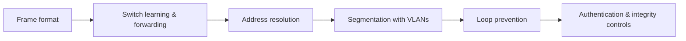

# 🔗 Switching & the Link Layer

> [!abstract] Switching branch
> The layer where frames are built, where switches learn who is where, and where almost every protocol was designed with no authentication whatsoever. Local-segment trust is assumed by default at Layer 2, which is why this branch ends with the controls that replace that assumption with evidence.

## 🗺️ Zero-to-Mastery Learning Path

1. [[Ethernet & Frame Structure]] — read Ethernet II frames; understand preamble, FCS, and MTU effects
2. [[MAC Addressing & Switch Operation]] — trace how a switch builds its CAM table and why flooding is an attack surface
3. [[ARP & Neighbor Discovery]] — follow address resolution and the cache-poisoning surface ARP creates
4. [[VLANs & Trunking]] — segment a switch fabric with 802.1Q; restrict trunk advertisements per port
5. [[Spanning Tree & Loop Prevention]] — prevent broadcast storms; harden STP against topology-manipulation attacks
6. [[Link Layer Security Controls]] — deploy port security, DHCP snooping, DAI, and 802.1X at the access layer

---
> 🔼 Up: [[Networking]]
