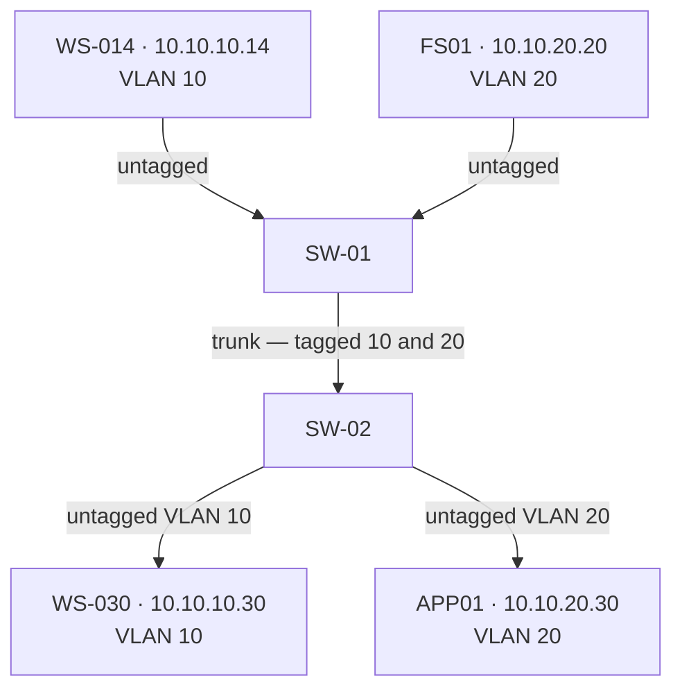

# 🗂️ VLANs & Trunking

> [!abstract] Note of [[Switching & the Link Layer]]
> A VLAN turns one physical switch into several independent networks by tagging frames, and a trunk carries many VLANs down one link. This note explains the 802.1Q tag, the access/trunk distinction, and the two configuration weaknesses — the native VLAN and dynamic trunk negotiation — that let an attacker escape their assigned segment.

## Parent Learning Order
Ethernet & Frame Structure -> MAC Addressing & Switch Operation -> ARP & Neighbor Discovery -> VLANs & Trunking -> Spanning Tree & Loop Prevention -> Link Layer Security Controls

## One Switch, Many Networks

> *Two ports on one switch, one in VLAN 10 and one in VLAN 20. Can they reach each other?*
>
> Hold your answer — the section below is the response.

Without VLANs, a switch is one broadcast domain — every port can reach every other port at Layer 2. A **VLAN (Virtual Local Area Network)** partitions that single switch into multiple logical broadcast domains. Ports assigned to VLAN 10 form one network; ports in VLAN 20 form another; and a frame cannot pass between them without a routing decision.

This is the primary segmentation tool in a wired network. Finance, guests, voice phones, and management can share physical switches while remaining logically isolated, and the isolation is enforced in switch hardware rather than by physical separation. The security value is direct: an attacker who compromises a device in the guest VLAN cannot reach the finance VLAN at Layer 2, because the two are different broadcast domains that meet only at a router where policy applies.

> [!tip] The analogy, and where it breaks
> A VLAN is like colour-coding desks in an open office so only same-colour desks may talk. It captures logical grouping over physical layout. It breaks because the "colour" travels *in the frame* as a tag that can, under weak configuration, be forged or stacked — the analogy has no equivalent of an attacker relabelling their own desk.

## The 802.1Q Tag

How does a switch know which VLAN a frame belongs to when many VLANs share one uplink? It inserts a four-byte **802.1Q tag** into the frame, between the source MAC and the EtherType.

```text
+---------+---------+------------------+----------+---------+-----+
| Dst MAC | Src MAC | 802.1Q tag (4B)  | EtherType| Payload | FCS |
+---------+---------+------------------+----------+---------+-----+
                    |  TPID  | PCP|DEI|VID (12 bits) |
                    | 0x8100 |    |   | VLAN 1-4094  |
```

- **TPID** `0x8100` marks the frame as tagged; it sits where the EtherType normally would, signalling that the real EtherType follows the tag.
- **VID (VLAN Identifier)** is 12 bits, giving 4094 usable VLANs (0 and 4095 are reserved).
- **PCP** carries a priority value for quality of service, and **DEI** is a single bit marking the frame as eligible to be dropped first under congestion. Neither has security significance, but both appear in a capture and are worth recognising rather than puzzling over.

The tag is added and removed by switches, not by hosts. An ordinary endpoint sends and receives *untagged* frames and is unaware VLANs exist; the switch tags the frame on ingress based on the port's VLAN and strips it before delivery.

## Access Ports and Trunk Ports

Every switch port operates in one of two modes, and confusing them is the source of most VLAN incidents.

| Port type | Carries | Tagging | Connects to |
| --- | --- | --- | --- |
| **Access port** | Exactly one VLAN | Frames are untagged toward the device | An endpoint: PC, printer, phone |
| **Trunk port** | Many VLANs | Frames are tagged with their VID | Another switch, a router, a hypervisor |

An access port belongs to a single VLAN. A device plugged into it sends untagged frames, the switch assigns them to that port's VLAN, and the device never sees a tag. This is what an ordinary user connects to.

A trunk port carries multiple VLANs between infrastructure devices, tagging each frame so the far end can sort them back into the right VLANs. The uplink between two switches, or from a switch to a hypervisor hosting VMs in different VLANs, is a trunk.



Read the diagram at the trunk: the single physical link between the switches carries both VLANs simultaneously, kept separate by their tags. The access links on either side are untagged, because the endpoints must not be aware of VLANs. `WS-014` and `FS01` share a switch and cannot reach each other at Layer 2; `WS-014` and `WS-030` are on different switches and can. Physical adjacency has stopped meaning anything — which is the point, and also the reason the whole scheme depends on the switches agreeing about which ports are trunks. That agreement is where the attacks live.

### What the switch actually reports

Two commands settle what a port is, and they are the first thing to run on any switch you have not configured yourself.

```bash
show vlan brief
```

```text
VLAN Name                             Status    Ports
---- -------------------------------- --------- -------------------------------
1    default                          active    Gi0/22, Gi0/23
10   WORKSTATIONS                     active    Gi0/1, Gi0/2, Gi0/3
20   SERVERS                          active    Gi0/10, Gi0/11
30   OPERATIONS                       active    Gi0/20
```

```bash
show interfaces trunk
```

```text
Port        Mode         Encapsulation  Status        Native vlan
Gi0/48      on           802.1q         trunking      1

Port        Vlans allowed on trunk
Gi0/48      1-4094

Port        Vlans allowed and active in management domain
Gi0/48      1,10,20,30
```

Read the trunk output right to left. `Gi0/48` carries every VLAN that exists on the switch, and its native VLAN is `1` — both of those are defaults, and both matter in the next section. The frames themselves are visible from any host with a tagged interface:

```bash
sudo tcpdump -i eth0 -e -n vlan
```

```text
10:14:22.118 00:00:5e:00:53:0e > 00:00:5e:00:53:01, ethertype 802.1Q (0x8100),
  length 102: vlan 10, p 0, ethertype IPv4, 10.10.10.14 > 10.10.20.20: ICMP echo request
```

The tag sits exactly where the frame diagram above puts it: after the addresses, before the EtherType that describes the payload.

## The Native VLAN Is a Default, and the Default Is the Problem

A trunk tags every VLAN it carries with one exception: the **native VLAN**, which crosses the trunk untagged. The mechanism exists for backward compatibility, so that a device which does not understand tags can still exchange traffic across a trunk link.

The security consequence comes from what the native VLAN *is* out of the box. On common switch platforms every access port ships assigned to VLAN 1, and every trunk's native VLAN is also VLAN 1. An untouched switch therefore places the attacker's access port and the trunk's untagged VLAN in the same place — which, as the next section shows, is precisely the precondition for double tagging. The vulnerability is not something an administrator has to introduce; it is what the equipment does before anyone configures it.

```bash
show interfaces GigabitEthernet0/3 switchport
```

```text
Name: Gi0/3
Switchport: Enabled
Administrative Mode: dynamic auto
Operational Mode: static access
Access Mode VLAN: 10 (WORKSTATIONS)
Trunking Native Mode VLAN: 1 (default)
```

Two lines of that output are findings, and neither looks like one. `Administrative Mode: dynamic auto` means the port is *currently* an access port but is willing to become a trunk if something asks convincingly — the operational mode describes today, the administrative mode describes what the port will agree to. `Trunking Native Mode VLAN: 1 (default)` means that if it ever does become a trunk, VLAN 1 crosses it untagged. A port serving a desk should say `static access` and should name a native VLAN nobody uses.

## VLAN Hopping: Escaping Your Segment

An attacker confined to one VLAN wants to reach another. Two techniques exploit configuration weaknesses.

**Switch spoofing.** Some switches default to *negotiating* trunk status automatically. An attacker's device can send the negotiation signals that request a trunk, and if the switch agrees, the attacker's port becomes a trunk carrying *every* VLAN. The attacker can then tag frames for any VLAN and reach all of them. The fix is to disable dynamic trunk negotiation and configure access ports explicitly as access — a port facing an endpoint should never be willing to become a trunk.

**Double tagging.** This exploits the **native VLAN** — the one VLAN a trunk carries *untagged*. An attacker on the native VLAN sends a frame with *two* stacked tags: an outer tag for the native VLAN and an inner tag for the target VLAN. The first switch strips the outer tag (because it matches the native VLAN and native traffic is untagged on the trunk) and forwards the frame, still bearing the inner tag, across the trunk. The second switch reads the inner tag and delivers the frame into the target VLAN.

```mermaid
sequenceDiagram
    participant A as Attacker (native VLAN 1)
    participant S1 as Switch 1
    participant S2 as Switch 2
    participant T as Target VLAN 20
    A->>S1: Frame tagged [outer VLAN 1][inner VLAN 20]
    Note over S1: Native VLAN is untagged on trunk -> strip outer tag
    S1->>S2: Frame still tagged [VLAN 20]
    S2->>T: Deliver into VLAN 20
    Note over A,T: One-way injection; no reply path
```

Double tagging is one-directional — the attacker can inject frames into the target VLAN but receives no replies, because the return path has no matching double-tag trick. That still enables meaningful attacks: injecting into a management VLAN, or triggering a reflected response to a third party. The defence is to make the native VLAN an unused, dedicated VLAN that carries no real traffic and to which no access port is assigned, so an attacker is never on it, and to tag the native VLAN explicitly where the hardware allows.

**The deliberate break:** a VLAN ID reads as a property of the frame — the frame *belongs to* VLAN 20, carries that membership around with it, and switches simply honour it.

The tag is a claim written by whoever built the frame, and what it means depends entirely on the port it arrives at. An access port ignores any tag it receives; a trunk port honours it; the native VLAN strips it. The same bytes therefore mean different things at two consecutive hops — which is precisely why double tagging works, and why a port willing to negotiate itself into a trunk hands over every VLAN on the switch. Segmentation lives in the port configuration, not in the frame.

**How you'd spot it:** audit the ports rather than the design document. `show interfaces <port> switchport` reports an administrative mode alongside the operational one, and any interface reading `dynamic auto` or `dynamic desirable` is willing to become a trunk whatever it happens to be doing today — that willingness is the entire switch-spoofing attack. An access port whose native VLAN matches a VLAN real users sit in is the other half. In traffic, the signature is unmistakable once you know the shape:

```text
10:14:31.902 00:00:5e:00:53:de > ff:ff:ff:ff:ff:ff, ethertype 802.1Q (0x8100),
  length 68: vlan 1, p 0, ethertype 802.1Q (0x8100), vlan 20, p 0, ethertype ARP
```

Two 802.1Q headers stacked in one frame, arriving on a port that serves a desk. Nothing legitimate produces that.

## Security Implications

**A VLAN is only as strong as the configuration around it.** The isolation is real, but it rests on assumptions: that access ports cannot become trunks, that the native VLAN is not an attacker-reachable production VLAN, and that inter-VLAN routing applies policy. Violate any one and the segmentation leaks. VLAN separation should therefore be verified by testing hop attempts, not assumed from a design document.

**VLANs are a segmentation control, not a security boundary for high-value assets.** The consensus in security architecture is that VLANs are appropriate for separating broad traffic classes, but the most sensitive segments — cardholder data, industrial control, management planes — warrant physical separation or firewalled routing rather than reliance on tag integrity alone. A single misconfiguration collapses a VLAN boundary; a routed firewall boundary fails more safely.

**Inter-VLAN routing is where policy actually lives.** VLANs stop Layer 2 adjacency, but the moment a router or Layer 3 switch connects them, whatever that device permits is permitted. A permissive inter-VLAN rule set makes segmented VLANs behave like one flat network for routed traffic. The VLAN design and the routing policy must be reviewed together.

**The voice VLAN is a common weak point.** IP phones are often placed in a dedicated voice VLAN, and the switch port serving a phone carries both the voice VLAN (tagged) and a data VLAN (untagged) for a PC daisy-chained behind the phone. This dual-VLAN access port is a legitimate configuration that also widens the attacker's reachable VLAN set from a single physical port.

All hopping and trunk-negotiation testing described here must occur only on an isolated lab you own. Successfully hopping a VLAN on a production network crosses a segmentation boundary that other systems depend on.

## Summary

You should now be able to:

- Explain what a VLAN accomplishes, the difference between an access port and a trunk port, and why an endpoint never sees a tag.
- Read the 802.1Q tag in a capture, recognise a stacked double tag on sight, and use `show vlan brief`, `show interfaces trunk` and `show interfaces <port> switchport` to establish what a port really is rather than what the documentation claims.
- Explain why the native VLAN exists, why VLAN 1 being the default for both access ports and trunk natives is the condition double tagging depends on, and verify that two VLANs are isolated by testing reachability rather than trusting the design.
- Explain switch spoofing and double tagging in terms of the native VLAN and dynamic trunk negotiation; justify why VLANs are a segmentation control rather than a boundary for the highest-value assets, and why VLAN design and inter-VLAN routing policy must be reviewed together.

---
> 🔼 Up: [[Switching & the Link Layer]]
