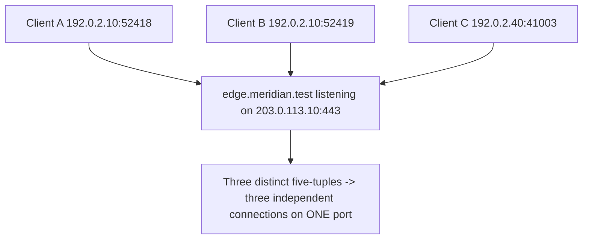

# 🔢 Ports & Sockets

> [!abstract] Note of [[Transport Layer & Sockets]]
> An IP address gets data to a machine; a port gets it to the right program on that machine. This note builds the socket abstraction from that need, explains the five-tuple that makes thousands of simultaneous connections possible, and shows why the difference between binding to one interface and binding to all of them is one of the most consequential single characters in system configuration.

## Parent Learning Order
Ports & Sockets -> TCP Connections & State -> TCP Reliability & Congestion Control -> UDP & Connectionless Transport -> QUIC & Modern Transport -> Transport Layer Threats & Controls

## The Problem an Address Cannot Solve

> *A scan reports port 22 as `filtered`. Is it open or closed?*
>
> Hold your answer — the section below is the response.

A packet arrives at `10.10.20.30`. That machine is running a web server, an SSH daemon, a database, and a dozen background processes. The IP address identified the *host*, but nothing so far identifies which *program* should receive the data.

A **port** solves this. It is a 16-bit number — 0 to 65535 — carried in the transport header, naming a communication endpoint on the host. The receiving kernel reads the destination port and delivers the payload to whichever program registered an interest in it. This is called **demultiplexing**, and it is the transport layer's defining job.

Ports are divided by convention:

| Range | Name | Meaning |
| --- | --- | --- |
| 0–1023 | **Well-known** | Standard services. On Unix-like systems, binding these historically requires elevated privilege. |
| 1024–49151 | **Registered** | Assigned to specific applications by convention (3306 MySQL, 5432 PostgreSQL) |
| 49152–65535 | **Ephemeral** | Temporary source ports the kernel assigns to outbound connections |

The privileged-port convention below 1024 exists so that an unprivileged user cannot start a rogue service on port 22 and impersonate the real SSH daemon. It is a weak control by modern standards — it says nothing about services on high ports, and containers complicate it — but it explains why web servers start as root and then drop privileges after binding.

Ports worth recognizing on sight:

| Port | Service | | Port | Service |
| --- | --- | --- | --- | --- |
| 22 | SSH | | 443 | HTTPS |
| 25 | SMTP | | 445 | SMB |
| 53 | DNS | | 3306 | MySQL |
| 80 | HTTP | | 3389 | RDP |
| 123 | NTP | | 5432 | PostgreSQL |
| 161 | SNMP | | 5985 | WinRM |
| 21 | FTP | | 389 | LDAP |

A port number is a **convention, not a guarantee**. Nothing forces a web server onto 80 or prevents SSH from listening on 4443. Service identification must ultimately come from interacting with the service, not from assuming the port's usual meaning — which is exactly why version detection exists as a separate step from port discovery.

### Two well-known ports in practice: SSH (22) and FTP (21)

The table is abstract until you *use* a port. The two oldest remote-access ports tell the whole story — and the security lesson that separates them.

**SSH — port 22 — encrypted remote shell + file copy.** SSH gives you an encrypted interactive shell on a remote host, and file transfer over the same secure channel:

```shell-session
user@laptop:~$ ssh admin@10.10.20.30
The authenticity of host '10.10.20.30' can't be established.
ED25519 key fingerprint is SHA256:Xr4k...  
Are you sure you want to continue connecting? yes
admin@10.10.20.30's password:
admin@server:~$ whoami
admin
user@laptop:~$ scp report.pdf admin@10.10.20.30:/home/admin/   # copy over the same encrypted channel
report.pdf                          100%  482KB   4.1MB/s   00:00
```

The login, the commands, and the file bytes are all encrypted. The host-key fingerprint prompt is SSH proving the *server's* identity so you aren't talking to an impostor.

**FTP — port 21 — legacy file transfer, cleartext.** FTP predates ubiquitous encryption and sends credentials and data in plaintext:

```shell-session
user@laptop:~$ ftp 10.10.20.30
220 (vsFTPd 3.0.5)
Name (10.10.20.30:user): admin
331 Please specify the password.
Password:                       # ← sent in CLEARTEXT over the wire
230 Login successful.
ftp> ls
150 Here comes the directory listing.
-rw-r--r--    1 0  0  10485760 Aug 10 09:14 backup.tar.gz
ftp> get backup.tar.gz
226 Transfer complete.
ftp> bye
```

FTP also uses a **second port, 20**, for the data channel: the control connection on 21 negotiates a separate data connection, which is why FTP is awkward through firewalls and NAT (active vs. passive mode).

**The security lesson.** Capture both sessions and the contrast needs no interpretation. Watch the FTP control connection first:

```bash
sudo tcpdump -i eth0 -nn -A 'host 10.10.20.30 and port 21'
```

```text
10.10.10.14.51882 > 10.10.20.30.21: Flags [P.], length 12
E..4..@.@.....................USER admin

10.10.10.14.51882 > 10.10.20.30.21: Flags [P.], length 21
E..=..@.@.....................PASS Sp3edw@y-2026!
```

Then the SSH session to the same host, captured the same way:

```bash
sudo tcpdump -i eth0 -nn -A 'host 10.10.20.30 and port 22'
```

```text
10.10.10.14.51884 > 10.10.20.30.22: Flags [P.], length 21
SSH-2.0-OpenSSH_9.6

10.10.10.14.51884 > 10.10.20.30.22: Flags [P.], length 1108
E..L..@.@.......k.<.....}.{.9...."..[..fY..'.....n..*|..1.....Q...
```

Two details are worth more than the general point. The FTP password is not merely *readable*, it is a complete line of ASCII sitting in a packet of its own, because FTP sends each command as its own line — an attacker capturing this does not need to reassemble a stream or understand a format, they need to read English. And the SSH capture is not opaque from the first byte: the version banner `SSH-2.0-OpenSSH_9.6` goes out in the clear, deliberately, so both ends can agree on what they support before any keys exist. Everything after the key exchange is ciphertext, and the boundary between those two states is visible in the capture as the point where the output stops being words.

That banner is also why an SSH port yields a software version to a scanner without a single credential being offered — the same field that makes negotiation possible makes fingerprinting free.

This is why **FTP is deprecated for anything sensitive**; its modern replacement is **SFTP** (file transfer *inside* the SSH channel, on port 22) or FTPS (FTP wrapped in TLS). Recognising `21` on a scan is recognising a plaintext-credential exposure.

```shell-session
user@laptop:~$ sftp admin@10.10.20.30     # same copy, encrypted — rides SSH port 22, not 21
sftp> get backup.tar.gz
Fetching /home/admin/backup.tar.gz to backup.tar.gz   100%   10MB
```

**Prerequisites:** IP addressing, and that a packet reaches a host.

> [!tip] The analogy, and where it breaks
> An apartment building has one street address and many apartment numbers; the address gets mail to the building, the apartment number gets it to the right person. The analogy breaks because the postal worker does not need the *sender's* apartment number to deliver, whereas a network connection is identified by all five values at once — both addresses, both ports, and the protocol. That is what lets thousands of separate conversations share one destination port without confusion.

**The deliberate break:** "port 22 is open on that host" sounds like a fact about the host, the way a door is open or shut.

It is a fact about a **five-tuple** and a vantage point. A port is open *to you, from where you are, right now*: the same port can be open from the LAN, filtered from the DMZ, and closed from the internet, and all three are simultaneously true. A scanner reporting "filtered" has not learned that the port is shut — it has learned that nothing came back, which is what a firewall dropping probes looks like *and* what a dead host looks like.

**How you'd spot the difference:** a closed port answers with RST; a filtered one answers with silence. Silence plus a working route means something is deciding not to reply.

## The Socket and the Five-Tuple

A **socket** is the programming abstraction for a communication endpoint: the object a program reads from and writes to. Concretely, a connection is uniquely identified by five values together — the **five-tuple**:

```text
(protocol, source IP, source port, destination IP, destination port)
```

This is the mechanism that lets one server handle thousands of simultaneous clients on a single port. Every connection to a web server has the same destination IP and destination port (443), but each client contributes a different source IP and source port, so every five-tuple is unique and the kernel can keep the conversations separate.



Note clients A and B: the *same* machine, the *same* server, the *same* port — distinguished only by the ephemeral source port. That single differing value is what allows a browser to open many parallel connections to one site. It also bounds concurrency: a client has roughly 64,000 ephemeral ports per destination tuple, and exhausting them causes connection failures that look like server problems but are local.

Two socket roles exist:

- A **listening socket** waits for incoming connections. It is bound to an address and port and has no peer yet.
- An **established socket** represents one accepted connection, with all five tuple values fixed.

## Reading Socket State

```bash
ss -tulnp
```

Expected excerpt:

```text
Netid State   Local Address:Port   Peer Address:Port  Process
tcp   LISTEN  0.0.0.0:22           0.0.0.0:*          users:(("sshd",pid=812,fd=3))
tcp   LISTEN  127.0.0.1:5432       0.0.0.0:*          users:(("postgres",pid=1104,fd=5))
tcp   LISTEN  [::]:443             [::]:*             users:(("nginx",pid=1520,fd=6))
udp   UNCONN  0.0.0.0:123          0.0.0.0:*          users:(("chronyd",pid=740,fd=5))
```

The flags: `-t` TCP, `-u` UDP, `-l` listening only, `-n` numeric (no name lookup), `-p` show the owning process.

The **most important column is the local address**, and it carries the lesson of this note:

- **`0.0.0.0:22`** — bound to *every* IPv4 interface. Reachable from any network the host is attached to, subject only to firewall policy. This service is exposed.
- **`127.0.0.1:5432`** — bound to loopback only. Reachable exclusively from processes on this host. No network exposure at all, regardless of firewall rules.
- **`[::]:443`** — the IPv6 equivalent of all-interfaces. On most systems this also accepts IPv4 connections via dual-stack mapping, so it is exposed on both families.

The difference between `0.0.0.0` and `127.0.0.1` is the difference between a database anyone on the network can attempt to reach and one only local processes can touch. A database that should be local-only but is bound to `0.0.0.0` is one of the most common and most serious misconfigurations in practice — and no firewall rule is needed to fix it, only a correct bind address. **Bind address is the primary exposure control; the firewall is the secondary one.**

Inspect established connections rather than listeners:

```bash
ss -tnp state established
```

Expected excerpt:

```text
Recv-Q Send-Q   Local Address:Port      Peer Address:Port  Process
     0      0   10.10.10.14:52418      203.0.113.20:443  users:(("firefox",pid=4412,fd=91))
```

`Recv-Q` and `Send-Q` are queue depths. Persistently non-zero values are diagnostic: a large `Send-Q` means data is queued locally and not being acknowledged — the peer or the path is the problem. A large `Recv-Q` means data has arrived but the local application is not reading it fast enough — the application is the problem, not the network.

### The failure this diagnoses

```text
bind: Address already in use
```

Two programs cannot hold the same address-and-port combination. This error means something is already bound there — often a previous instance that did not exit cleanly, or a socket lingering in `TIME-WAIT`. Find the holder rather than guessing:

```bash
sudo ss -tlnp '( sport = :8080 )'
```

Expected excerpt:

```text
tcp LISTEN 0.0.0.0:8080 users:(("old-app",pid=3311,fd=7))
```

The output names the process and PID holding the port, converting a vague error into a specific action.

## Security Implications

**Every listening socket is attack surface.** A port that accepts connections is code that parses untrusted input. Enumerating listeners and justifying each one is among the highest-value hardening activities available, and it is entirely local — no scanning required. The correct question for each is not "is it firewalled?" but "does this need to listen on the network at all?"

**Bind address beats firewall rules for exposure control.** A service bound to loopback cannot be reached remotely even if the firewall is misconfigured, disabled, or bypassed by a rule ordering mistake. Defense in depth means doing both, but the bind address is the stronger and simpler guarantee.

**Port numbers are not identity.** An attacker running a service on an unexpected port evades controls that reason by port number, and a defender who assumes port 80 is HTTP will misread a tunnel. Conversely, a service moved to a non-standard port is not hidden — it is trivially found by scanning and version detection. "Security by unusual port" is not a control.

**Socket state is forensic evidence.** The five-tuple plus owning process ties a network conversation to a specific program and user at a specific time. During incident response, capturing established connections and their owning processes is time-critical: sockets close, and the mapping is lost. `ss -tnp` output is often the fastest way to identify which process is communicating with an unexpected destination.

**Ephemeral port exhaustion is a real availability limit.** A host opening connections faster than they close can exhaust its ephemeral range, causing new connections to fail while the network is perfectly healthy. It presents as an application outage and is diagnosed by counting sockets, not by testing connectivity.

Enumerating sockets on systems you administer is ordinary operations. Scanning ports on hosts you do not own requires authorization, and is covered by the scoping rules of whatever engagement you are operating under.

## Summary

You should now be able to:

- Explain why an IP address alone cannot deliver data to the right program, what a port is, and the difference between a listening and an established socket.
- Read `ss` output to identify exposed versus loopback-only services and their owning processes; diagnose "address already in use" by finding the holder, and interpret `Recv-Q`/`Send-Q` to distinguish an application problem from a network one.
- Explain the five-tuple as the mechanism enabling massive concurrency on one port and the source of ephemeral exhaustion; argue why bind address is a stronger exposure control than firewall policy, and why port numbers are a convention that neither identifies nor hides a service.

---
> 🔼 Up: [[Transport Layer & Sockets]]
