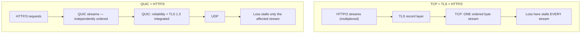

# ⚡ QUIC & Modern Transport

> [!abstract] Note of [[Transport Layer & Sockets]]
> QUIC rebuilt the transport layer on top of UDP, merging reliability, multiplexing, and encryption into one protocol that middleboxes cannot inspect or ossify. This note explains the specific TCP limitations that forced the redesign, what QUIC does differently, and why a transport that hides its own control information changes what network defenders can see.

## Parent Learning Order
Ports & Sockets -> TCP Connections & State -> TCP Reliability & Congestion Control -> UDP & Connectionless Transport -> QUIC & Modern Transport -> Transport Layer Threats & Controls

## Why Replace Something That Works

> *HTTP/2 multiplexes many independent streams over one connection. One packet is lost. How many streams stall?*
>
> Hold your answer — the section below is the response.

TCP works. It has carried the Internet for decades. But three specific problems proved unfixable within TCP itself, and understanding them explains everything QUIC does.

**Head-of-line blocking.** TCP delivers a single ordered byte stream. If one segment is lost, everything behind it waits, even data belonging to a completely unrelated request. HTTP/2 introduced multiplexing — many logical streams over one connection — but those streams share one TCP byte stream, so a single lost packet stalls *all* of them. Multiplexing at the application layer cannot escape ordering enforced at the transport layer.

**Handshake latency.** Establishing a secure connection required a TCP handshake (one round trip) followed by a TLS handshake (one or two more). On a high-latency path, connection setup alone could cost hundreds of milliseconds before a single byte of content moved.

**Ossification.** This is the deepest problem. Because TCP headers are unencrypted, middleboxes everywhere — firewalls, load balancers, carrier equipment, inspection appliances — read and sometimes rewrite them. Many make assumptions about what TCP looks like and mishandle anything unfamiliar. The result is that new TCP options frequently fail to work in practice, not because endpoints reject them but because the network does. TCP became effectively unchangeable: any modification breaks on some fraction of paths, so nobody can deploy one. This is **protocol ossification**, and it is why fixing TCP in place was not viable.

**Prerequisites:** TCP reliability, TLS, and UDP's statelessness.

> [!tip] The analogy, and where it breaks
> Rebuilding a railway's signalling inside sealed shipping containers carried on ordinary roads, because the rail signalling itself could never be upgraded without breaking every station. The analogy breaks on intent: shipping containers are opaque to inspectors by accident, whereas QUIC's encryption of its own control information is deliberate — specifically so middleboxes cannot inspect it, ossify it, and freeze the protocol again.

## What QUIC Changes

**QUIC** is a transport protocol built on UDP, standardized in RFC 9000, and the transport for **HTTP/3**. Building on UDP was a deliberate choice: UDP passes through existing networks, and everything above it is defined by the endpoints, out of reach of middleboxes.

| Problem | TCP | QUIC |
| --- | --- | --- |
| Head-of-line blocking | One byte stream; loss stalls everything | Independent streams; loss stalls only its own stream |
| Handshake cost | TCP handshake + TLS handshake | Combined; often one round trip, zero for resumption |
| Encryption | Optional layer above | **Mandatory and integrated**; headers largely encrypted |
| Connection identity | The five-tuple | A **connection ID** independent of addresses |
| Evolvability | Ossified by middleboxes | Encrypted internals; middleboxes cannot ossify what they cannot read |
| Implementation | In the kernel | Usually in **user space**, so it updates with the application |



The diagram's contrast is the core insight: in the TCP stack, multiplexing sits *above* the ordering constraint and cannot escape it. In QUIC, ordering is per-stream *inside* the transport, so independence is real.

**Connection migration** follows from the connection ID. A TCP connection is identified by its five-tuple, so changing IP address — moving from Wi-Fi to cellular — destroys it and everything must be re-established. QUIC identifies a connection by an ID carried in the packet, so the same connection survives an address change. The session continues seamlessly across networks, which is a substantial improvement for mobile clients and a substantial complication for anything that tracked flows by five-tuple.

**Zero round-trip resumption** lets a client that has connected before send application data in its very first packet, using cached parameters. The performance gain is real, and it comes with a genuine caveat: early data can be replayed by an attacker who captures it, so it must only carry idempotent requests. This is a deliberate, documented trade-off rather than a flaw.

## Observing QUIC

QUIC runs over UDP, typically port 443:

```bash
ss -uan '( sport = :443 or dport = :443 )' | head -5
```

Expected excerpt:

```text
State  Recv-Q Send-Q  Local Address:Port      Peer Address:Port
UNCONN 0      0       10.10.10.14:51284       203.0.113.20:443
```

Note `UNCONN` — the kernel sees only UDP with no connection state, because all connection state lives in user space inside the application. Everything a defender is accustomed to reading from `ss -tin` for TCP — congestion window, retransmissions, round-trip time — simply is not there. The kernel is not a participant.

Capture confirms how little is visible:

```bash
sudo tcpdump -i eth0 -nn -c 4 'udp port 443'
```

Expected excerpt:

```text
IP 10.10.10.14.51284 > 203.0.113.20.443: UDP, length 1252
IP 203.0.113.20.443 > 10.10.10.14.51284: UDP, length 1252
IP 10.10.10.14.51284 > 203.0.113.20.443: UDP, length 44
```

Compare with a TCP capture, which reveals flags, sequence numbers, window sizes, and connection state transitions. Here there is a UDP header and an opaque payload.

"Only a small portion is unencrypted" is worth making exact, because that portion is the entire remaining surface for network-side analysis. Decode the packets rather than counting their lengths:

```bash
sudo tshark -i eth0 -Y quic -T fields \
  -e frame.number -e ip.src -e udp.srcport -e quic.long.packet_type \
  -e quic.dcid -e quic.scid
```

```text
1   10.10.10.14   51284   0 (Initial)   8f2a1c04d9b73e56   -
2   203.0.113.20  443     0 (Initial)   3b70e9a2           8f2a1c04d9b73e56
3   10.10.10.14   51284   -             3b70e9a2           -
4   10.10.10.14   51284   -             3b70e9a2           -
```

Four packets, and the only fields that resolve are the packet type and the connection IDs. There is no sequence number column because the sequence numbers are encrypted; no flags column, no window, no acknowledgment. Frames 3 and 4 do not even report a packet type — those are short-header packets, where everything past the destination connection ID is protected.

Now watch what the connection ID does, which is the part with consequences. `WS-014` is undocked and joins `MERIDIAN-CORP`, so it leaves VLAN 10 for the wireless VLAN and its address changes:

```text
5   10.10.10.14   51284   -             3b70e9a2           -
6   10.10.50.31   57001   -             3b70e9a2           -
```

Different source address, different source port — a different five-tuple in every respect, and therefore a different flow to every device that accounts by five-tuple. The same session, because the connection ID did not change. A flow collector records two conversations, a stateful firewall sees an unsolicited stream arriving from a host it has no state for, and an analyst reading either one sees a session that vanished and an unrelated one that appeared.

That is the single most important operational fact in this note, and it is legible only because `quic.dcid` survives in the clear. Correlating on it is not an optimisation — it is the difference between one session and two ghosts.

### The operational surprise

A network that permits TCP/443 but blocks or rate-limits UDP/443 will find that clients "work" while performing worse than expected. Most browsers attempt QUIC and fall back to TCP when it fails, so the symptom is not an outage but silent extra latency on every first connection. Meanwhile, a firewall rule set written entirely around TCP/443 does not describe the traffic actually flowing. Verifying which transport is in use is now a necessary step:

```bash
curl -sI --http3 https://track.meridian.test | head -1
```

Expected output when QUIC succeeds:

```text
HTTP/3 200
```

**The deliberate break:** QUIC reads as "TCP but faster" — a performance upgrade you adopt and otherwise ignore, since the network below it is unchanged.

It relocates the transport itself. Reliability and ordering move into **user space**, so they ship with the application rather than the kernel; the transport headers are largely **encrypted**, so middleboxes cannot read them; and connection identity moves from the five-tuple to a **connection ID**, so a session survives an address change. Each of those is a performance decision with a network-visibility consequence attached. Every control built on reading transport state — five-tuple flow accounting, TCP stream reassembly in an IDS, a connection-state firewall — is looking at an opaque UDP conversation whose endpoints may change mid-session. QUIC is not a faster TCP; it is a transport your network can no longer inspect or account for the way it did.

**How you'd spot it:** start with what your tooling does with UDP/443, because that single port is the whole migration. In flow data, one user session appearing as several unrelated UDP flows is connection migration rather than several users. The subtler tell is a monitoring regression with no configuration change behind it — HTTP visibility in an IDS quietly falling after a browser update is HTTP/3 taking over from HTTP/2. Blocking UDP/443 to force TCP fallback restores that visibility and is a deliberate downgrade, so it belongs in the risk register rather than in a firewall rule nobody documented.

## Security Implications

**Mandatory encryption is a defensive win and a visibility loss simultaneously.** Every QUIC connection is encrypted with TLS 1.3 semantics — there is no unencrypted mode — which eliminates downgrade and passive interception at the transport layer. The same property means network-based inspection that relied on reading TCP and TLS metadata sees far less. Defenders lose sequence-level visibility, connection-state telemetry, and much of the fingerprinting surface.

**The response is to move inspection to the endpoints.** Because the transport is opaque in transit and terminates in user-space application code, meaningful visibility comes from endpoint telemetry, application logs, and the server side of the connection rather than from mid-path devices. Organizations that built their detection strategy around network inspection of TCP must adapt; this is a strategic shift, not a tuning change.

**Flow tracking by five-tuple is no longer sound.** Connection migration means one logical session can span multiple five-tuples. Correlation must use the connection ID where visible, or endpoint-side session identity — otherwise a single session appears as several unrelated flows, and a session that moves networks appears to vanish and reappear.

**QUIC inherits UDP's amplification concern, and addresses it explicitly.** Because it runs over a connectionless transport, a spoofed initial packet could induce a large response. QUIC mandates **address validation**: a server may not send more than roughly three times the bytes it received from an unvalidated address, and may issue a retry token forcing the client to prove it can receive at the claimed address. This is a protocol-level fix for the structural UDP problem, and it is a useful example of a modern design confronting an old weakness head-on.

**User-space implementation changes the patch model.** TCP fixes arrive with kernel updates, centrally. QUIC implementations ship inside browsers and libraries, so a vulnerability may require updating many applications independently — faster to fix for a given vendor, harder to inventory across an estate.

All testing described here should target systems within an authorized scope; QUIC's opacity does not change scoping obligations, and probing it generates the same telemetry as any other traffic.

## Summary

You should now be able to:

- Name the three TCP limitations QUIC was designed to fix, and explain in plain language what head-of-line blocking is.
- Identify QUIC traffic, verify which transport a client actually used, and recognize the "works but slower" signature of blocked UDP/443 with silent fallback.
- Explain protocol ossification and why it made fixing TCP in place infeasible; describe how connection migration invalidates five-tuple flow tracking, how QUIC's address validation limits amplification inherited from UDP, and why mandatory encryption forces detection strategy from mid-path inspection toward endpoint telemetry.

---
> 🔼 Up: [[Transport Layer & Sockets]]
