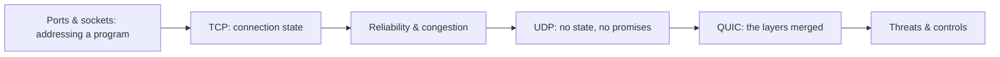

# 🔌 Transport Layer & Sockets

> [!abstract] Transport branch
> The layer that turns "this host" into "this program on this host," and that decides whether delivery is guaranteed or merely attempted. Connection state is created here, which makes this the layer where scanning gets its answers and where exhaustion attacks find a finite resource to consume.

## 🗺️ Zero-to-Mastery Learning Path

1. [[Ports & Sockets]] — map well-known and ephemeral ports to processes; read socket state
2. [[TCP Connections & State]] — trace the three-way handshake, four-way teardown, and the half-open surface
3. [[TCP Reliability & Congestion Control]] — understand retransmission, windowing, and why loss shapes scanning speed
4. [[UDP & Connectionless Transport]] — contrast stateless delivery; identify the amplification and spoofing exposure
5. [[QUIC & Modern Transport]] — follow HTTP/3's encrypted 0-RTT sessions and the visibility gap they create
6. [[Transport Layer Threats & Controls]] — classify SYN flood, RST injection, and session hijack; apply mitigations

---
> 🔼 Up: [[Networking]]
