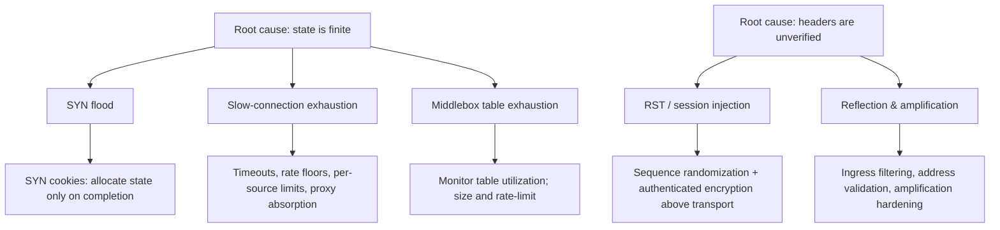

# 🧨 Transport Layer Threats & Controls

> [!abstract] Note of [[Transport Layer & Sockets]]
> Transport attacks target a resource rather than a bug: the finite state every connection consumes, and the trust endpoints place in transport headers they cannot verify. This note consolidates the attack classes across TCP, UDP, and QUIC, and pairs each with the control that removes the resource or the trust it depends on.

## Parent Learning Order
Ports & Sockets -> TCP Connections & State -> TCP Reliability & Congestion Control -> UDP & Connectionless Transport -> QUIC & Modern Transport -> Transport Layer Threats & Controls

## Two Root Causes

> *An attack fills a firewall's session table and legitimate traffic stops. Which memory-corruption bug was exploited?*
>
> Hold your answer — the section below is the response.

Every attack in this note traces to one of two facts.

**State is finite.** Connections, half-open handshakes, translation entries, and firewall sessions all consume memory in a table with a maximum size. An attacker who creates entries faster than they expire fills the table, and the device must then refuse legitimate work. No memory corruption is involved — the system behaves exactly as designed, under conditions it was not sized for.

**Transport headers are unverified.** A source address, a sequence number, or a flag is believed because it arrived and looked plausible. If an attacker can produce plausible-looking headers, the endpoint acts on them.

The controls follow the same split: **remove the resource dependency** (allocate state only after proof of legitimacy) or **remove the trust** (require something the attacker cannot forge).

**Prerequisites:** TCP state, UDP statelessness, and connection tracking.

> [!tip] The analogy, and where it breaks
> A restaurant taking reservations: a flood of bookings that never arrive fills the book and turns real customers away, while a table occupied by someone ordering one olive an hour ties it up just as effectively. The analogy breaks because a restaurant can simply look at the empty room, whereas a server genuinely cannot distinguish a half-open connection from a slow legitimate client — which is why the fix is to allocate no state until the handshake completes.

## Attack Class 1: State Exhaustion

**SYN flooding** sends many SYN segments and never completes the handshake. Each SYN causes the server to allocate a half-open connection and wait. The backlog fills, and legitimate handshakes are refused.

Detection is direct:

```bash
ss -tan state syn-recv | wc -l
netstat -s | grep -i "listen queue\|SYNs to LISTEN"
```

Expected excerpt during an attack:

```text
4096
    18294 SYNs to LISTEN sockets dropped
```

A large `SYN-RECV` count alongside a rising drop counter is the signature. Note that these are half-open, not established — a genuine traffic spike would show growth in `ESTAB` too.

**SYN cookies** are the control, and their design is worth understanding because it is a model for defeating state exhaustion generally. Rather than allocating state on receiving SYN, the server encodes the connection parameters cryptographically into the initial sequence number it returns in the SYN+ACK. It then discards all state. When the client's final ACK arrives, the acknowledgment number contains that encoded value, and the server reconstructs the connection from it. **State is allocated only when the handshake completes**, so an attacker who never sends the final ACK consumes nothing.

```bash
sudo sysctl -w net.ipv4.tcp_syncookies=1
```

The trade-off is honest: cookies have limited room to encode options, so some TCP features may be degraded for connections established under cookie mode. Most stacks enable cookies only when the backlog is under pressure, giving full functionality normally and graceful degradation under attack.

**Slow-connection exhaustion** attacks the opposite resource. Instead of many incomplete handshakes, the attacker completes handshakes and then keeps connections alive while transferring almost nothing — advertising tiny receive windows, or sending request data one byte at a time. Each connection is fully legitimate, so volumetric defenses see nothing unusual, yet the server's connection slots are consumed.

```text
SYN flood         -> many SYN-RECV, near-zero ESTAB, low bandwidth
Slow exhaustion   -> many ESTAB, near-zero throughput, long connection ages
Legitimate spike  -> many ESTAB, proportional throughput
```

Distinguishing these by state distribution and throughput is the diagnostic skill. Controls are per-connection timeouts, minimum data-rate requirements, connection limits per source address, and placing a reverse proxy that absorbs slow clients in front of application servers.

**Middlebox table exhaustion** applies the same principle to the infrastructure. Stateful firewalls, NAT gateways, and load balancers track connections and have finite tables. Exhausting them causes dropped legitimate flows across everything behind the device. Monitoring connection-tracking utilization as a first-class metric is the defense, because it fails long before CPU or bandwidth does:

```bash
sysctl net.netfilter.nf_conntrack_count net.netfilter.nf_conntrack_max
```

## Attack Class 2: Forged Transport Headers

**RST injection** forges a reset for an existing connection. If the five-tuple matches and the sequence number falls within the receiver's acceptable window, the connection is torn down immediately. An on-path attacker can do this reliably. An off-path attacker must guess the sequence window, which modern sequence randomization makes impractical for most cases — the defense here was retrofitted into the protocol's core mechanics precisely because the trust could not be removed otherwise.

**Session injection** forges data segments rather than resets, inserting attacker content into a stream the endpoint accepts as genuine. The same defenses apply, and the definitive control is authenticated encryption above the transport: a TLS session rejects injected data because it fails integrity verification, regardless of whether the TCP layer accepted the segment.

**Reflection and amplification** exploits UDP's lack of a handshake, using spoofed source addresses to direct amplified replies at a victim. Controls are ingress filtering at the source network, service hardening to reduce amplification factors, and per-source rate limiting. QUIC addresses the same structural risk at protocol level through mandatory address validation and a response-size limit for unvalidated peers.



## Reading Scan Traffic as a Defender

Scanning is a transport-layer activity, and its signature is distinctive because it inverts normal traffic ratios. A legitimate client opens few connections to few ports and transfers data. A scanner opens many connection attempts across many ports and transfers almost none.

```bash
sudo tcpdump -i eth0 -nn 'tcp[tcpflags] & (tcp-syn|tcp-ack) == tcp-syn' -c 20
```

Expected excerpt during a scan:

```text
IP 198.51.100.9.41022 > 10.10.20.30.21: Flags [S], seq 1029384756
IP 198.51.100.9.41023 > 10.10.20.30.22: Flags [S], seq 1029384757
IP 198.51.100.9.41024 > 10.10.20.30.23: Flags [S], seq 1029384758
IP 198.51.100.9.41025 > 10.10.20.30.25: Flags [S], seq 1029384759
```

The filter isolates bare SYN segments — connection attempts without ACK. Sequential destination ports from one source in rapid succession is a port sweep. Note the detection is behavioural: no individual packet is malformed or malicious, and each is a perfectly valid connection attempt. This is why transport-layer detection thresholds on connection-attempt rate and port diversity rather than on packet content.

A **slow scan** deliberately spreads probes over hours to stay under such thresholds, which is why correlation windows must be long and why single-packet analysis is insufficient.

**The deliberate break:** denial of service reads as a volume problem — a pipe filled with more traffic than it can carry, defeated by having a bigger pipe or a scrubbing service in front of it.

The resource these attacks consume is **table entries, not bandwidth**. A half-open handshake costs the server a backlog slot and the attacker a single packet; a slow-connection attack completes its handshakes honestly and then holds connection slots open while transferring almost nothing at all. Neither shows up as a volumetric anomaly, because neither is volumetric — a slow-exhaustion attack can take a server down using less bandwidth than one video call. Capacity planning that counts only bits per second is measuring the wrong axis, and every device in the path that tracks connection state inherits the same finite limit.

**How you'd spot it:** classify by the ratio of connection count to throughput, never by throughput alone. Many `SYN-RECV` with near-zero `ESTAB` is a flood; many `ESTAB` with near-zero bytes and long connection ages is slow exhaustion; many `ESTAB` with throughput in proportion is a real traffic spike. Bandwidth graphs cannot separate the second case from an idle server, which is exactly why these attacks are reported as "the site is down but the monitoring looks fine."

## Security Implications

**Availability is the transport layer's primary risk.** Unlike application-layer vulnerabilities that leak data, transport attacks predominantly deny service. Defenses therefore belong in capacity planning and resilience design as much as in security controls — and they must be tested under load, because a control that works at normal volume may itself become the bottleneck.

**Controls have costs, and the honest posture is to state them.** SYN cookies degrade some TCP options. Aggressive connection limits can block legitimate users behind a shared address. Strict reverse-path filtering breaks asymmetric routing. Deploying these without understanding the trade-off converts a security improvement into an outage, which is why each should be tested against real traffic patterns before enforcement.

**Encryption above the transport is the constant backstop.** Just as at the link layer and the routing layer, transport-layer compromise yields metadata and disruption rather than content when the payload is authenticated and encrypted. An attacker who resets a connection causes an interruption; one who injects into a TLS session causes a verification failure, not a compromise. This is the same conclusion reached in every branch of this domain, arrived at independently each time.

**Defense in depth spans the layers.** Ingress filtering (network layer) reduces spoofing that transport attacks depend on. Connection-state monitoring (transport layer) detects exhaustion early. Application-layer rate limiting catches what completes a handshake legitimately. No single layer is sufficient, and the attacker's task is to find the layer that was skipped.

Every technique described here must be exercised only in an isolated laboratory you own. Flooding, exhaustion, and injection all degrade or deny service for legitimate users and are destructive outside a controlled environment.

## Summary

You should now be able to:

- State the two root causes of transport attacks, and explain what a SYN flood consumes.
- Distinguish a SYN flood, a slow-connection exhaustion attack, and a legitimate traffic spike from state distribution and throughput; detect a port sweep from bare-SYN traffic and explain why the detection is behavioural rather than content-based.
- Explain how SYN cookies eliminate the resource dependency without breaking the protocol, and what they cost; describe why sequence randomization defends against off-path injection while authenticated encryption is the definitive control, and articulate the cost of each defense honestly enough to deploy it without causing an outage.

---
> 🔼 Up: [[Transport Layer & Sockets]]
