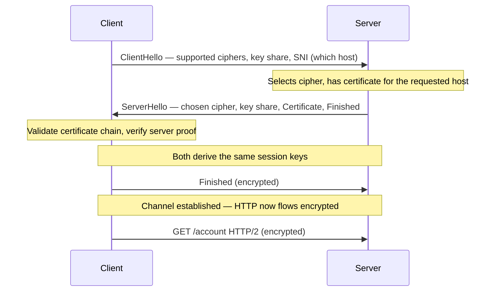

# 🔒 HTTPS & the TLS Handshake

> [!abstract] Note of [[Web & Application Protocols]]
> HTTPS is HTTP carried inside TLS, and TLS delivers three separate guarantees that people collapse into "it's encrypted." This note separates confidentiality, integrity, and authentication, walks the handshake that establishes all three, and explains why the padlock proves identity of the server but nothing about the honesty of the site.

## Parent Learning Order
HTTP Fundamentals -> HTTPS & the TLS Handshake -> Web Architecture & Proxies -> WebSockets & Real-Time Protocols -> REST & Modern API Transport -> Application Delivery & Load Balancing

## Three Guarantees, Not One

Plain HTTP is readable and modifiable by anyone on the path. **HTTPS** fixes this by running HTTP over **TLS (Transport Layer Security)**, which provides three distinct properties. Conflating them is the most common misunderstanding in web security.

| Guarantee | Question it answers | Failure if absent |
| --- | --- | --- |
| **Confidentiality** | Can anyone on the path read this? | Eavesdropping — credentials, content exposed |
| **Integrity** | Was this altered in transit? | Injection — content tampered undetectably |
| **Authentication** | Am I really talking to who I think? | Impersonation — an attacker poses as the server |

Authentication is the one most often forgotten and the most important. Encryption without authentication protects you against a passive eavesdropper but not against an active attacker who simply *is* the other end of your encrypted connection. TLS solves authentication with **certificates**, which is why the certificate system — not the cipher — is where most real-world TLS security lives.

This note is deliberately about TLS as a *transport* — the handshake, certificates, and what the guarantees mean. The cryptographic internals of the ciphers and PKI belong to the Cryptography domain; here the concern is how the secure channel is established and what it does and does not promise.

**Prerequisites:** HTTP, and the idea of an on-path attacker.

> [!tip] The analogy, and where it breaks
> A sealed courier pouch, plus the courier showing photo ID issued by an authority you already trust. The analogy breaks exactly where people over-read the padlock: the ID proves the courier's *name*, not their honesty. A criminal can hold entirely genuine identification, which is why a phishing site displays a perfectly valid padlock and why reading the hostname remains the human's job.

**The deliberate break:** "HTTPS means it's encrypted" collapses three separate guarantees into one, and the three fail independently.

TLS provides **confidentiality** (the path cannot read it), **integrity** (the path cannot alter it undetected), and **authentication** (you are talking to who you think). Only the third involves certificates, and only the third is the one attackers usually defeat. An attacker who obtains a valid certificate for the name gets all three guarantees working perfectly — for their connection to you. Encryption was never the hard part; deciding whose key to encrypt to is.

**How you'd spot the difference:** a browser warning is an *authentication* failure, not an encryption one. The traffic is still encrypted; the question is to whom.

## The Handshake

Before any HTTP flows, TLS negotiates a secure channel. The modern TLS 1.3 handshake completes in a single round trip.



Three elements of this exchange carry the security.

**SNI (Server Name Indication)** in the ClientHello tells the server which hostname the client wants, so one server hosting many HTTPS sites can present the right certificate. Critically, in standard TLS the SNI is sent **before** encryption is established, so it is visible on the wire — a network observer cannot read the page you fetched but can see which host you connected to. Encrypted Client Hello (ECH) is the emerging fix, but classic SNI leakage is why "HTTPS hides everything" is false.

**The key share** lets both sides derive the same session keys using ephemeral values. Because the keys are ephemeral — generated fresh per session and discarded after — recording the encrypted traffic and later stealing the server's private key does *not* decrypt past sessions. This property, **forward secrecy**, is standard in TLS 1.3 and is why long-term key compromise no longer retroactively exposes recorded traffic.

**The certificate** is the server proving its identity, examined next.

## Certificates and the Chain of Trust

A **certificate** binds a public key to a hostname, signed by a **Certificate Authority (CA)** the client already trusts. The client's trust does not extend to the server directly; it extends to a small set of root CAs shipped with the operating system or browser, and the certificate presents a **chain** from the server up to one of those roots.

```bash
echo | openssl s_client -connect shop.example.com:443 -servername shop.example.com 2>/dev/null \
  | openssl x509 -noout -subject -issuer -dates
```

Expected excerpt:

```text
subject=CN = shop.example.com
issuer=C = US, O = Let's Encrypt, CN = R3
notBefore=Jul  1 00:00:00 2026 GMT
notAfter=Sep 29 23:59:59 2026 GMT
```

Validation checks, all of which must pass:

1. **Hostname match** — the certificate's subject or Subject Alternative Names must include the host you requested. A certificate valid for `example.com` presented for `evil.com` fails here.
2. **Chain to a trusted root** — each certificate is signed by the next up to a root the client trusts.
3. **Validity dates** — not before, not after. This is why clock skew breaks TLS: a wrong clock makes valid certificates appear expired.
4. **Not revoked** — the CA has not withdrawn the certificate.

A failure of any check is what produces the browser's certificate warning. That warning is the authentication guarantee doing its job, and clicking through it discards the one guarantee that protects against an active attacker.

## What the Padlock Does and Does Not Mean

The padlock icon means exactly one thing: **the connection to the named server is encrypted, and the server proved it controls a certificate for that hostname.** It means the traffic is confidential and authenticated to that host.

It does **not** mean the site is safe, honest, or run by the organization you have in mind. Anyone can obtain a valid certificate for a domain they control, including a phishing site at `paypa1-secure.com`. That site has a perfectly valid padlock. The padlock authenticates the *hostname*, and reading the hostname is the human's job — TLS proves you reached `paypa1-secure.com`, it does not tell you that is not PayPal. Conflating "encrypted" with "trustworthy" is precisely the confusion phishing relies on.

## Security Implications

**Authentication is the guarantee that defeats the active attacker.** An on-path adversary from any earlier branch — ARP spoofing, rogue DHCP, BGP hijack, FHRP takeover — can position themselves between client and server. TLS is what makes that position worthless: the attacker cannot present a valid certificate for the real hostname, so certificate validation fails and the client refuses. This is why every branch of this domain concluded with "encryption is the backstop" — and it is specifically the *authentication* half of TLS that delivers it, not merely the encryption.

**Downgrade and stripping attacks target the setup, not the crypto.** Rather than break TLS, an attacker prevents it from being used — intercepting the initial plain-HTTP request and keeping the victim on HTTP. **HSTS (HTTP Strict Transport Security)** defeats this by instructing the browser to only ever use HTTPS for a domain, so there is no plaintext request to intercept. HSTS preloading extends this to the very first visit.

**Certificate misissuance is the systemic risk.** The whole model rests on CAs only issuing certificates to legitimate domain holders. A compromised or coerced CA issuing a certificate for a domain it should not undermines everything. **Certificate Transparency** — public, append-only logs of every issued certificate — lets domain owners detect unauthorized certificates for their names, turning a silent failure into a detectable one.

**TLS inspection is a deliberate, consequential trade-off.** Enterprises that must inspect encrypted traffic install their own trusted CA on managed devices and have a proxy terminate and re-originate TLS — a sanctioned on-path position. It provides visibility at the cost of being a single point that sees all plaintext, and it breaks certificate pinning and end-to-end guarantees for those clients. It is sometimes justified and always a reduction of the property TLS exists to provide.

**Weak configuration undoes strong protocols.** Obsolete protocol versions, weak ciphers, missing forward secrecy, and expired or misissued certificates are the common findings. Testing a server's actual configuration matters more than assuming "we use HTTPS."

```bash
nmap --script ssl-enum-ciphers -p 443 <server>
```

All testing described here must target only servers within an authorized scope; certificate and cipher enumeration is reconnaissance and is logged.

## Summary

You should now be able to:

- Name TLS's three guarantees and explain why authentication, not encryption, defeats an active attacker; state precisely what the padlock does and does not prove.
- Inspect a certificate and its chain, explain the four validation checks and why clock skew breaks TLS, and enumerate a server's offered ciphers.
- Explain forward secrecy and why it protects recorded traffic against later key compromise; describe how HSTS defeats stripping, how Certificate Transparency detects misissuance, and why enterprise TLS inspection is a deliberate reduction of the guarantee TLS exists to provide.

---
> 🔼 Up: [[Web & Application Protocols]]
