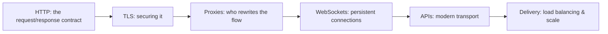

# 🕸️ Web & Application Protocols

> [!abstract] Application branch
> The layer users actually touch, and where most breaches now happen. This branch treats the web as a set of protocols and infrastructure — the request/response contract, the encryption that protects it, the proxies that rewrite it, and the delivery machinery in front of every real service — rather than as a catalogue of vulnerabilities, which live in the offensive and appsec domains.

## 🗺️ Zero-to-Mastery Learning Path

1. [[HTTP Fundamentals]] — dissect methods, headers, status codes, and the stateless request cycle
2. [[HTTPS & the TLS Handshake]] — trace the TLS handshake, certificate chain, and the inspection gap at proxies
3. [[Web Architecture & Proxies]] — position reverse proxies, CDNs, and load balancers in the request path
4. [[WebSockets & Real-Time Protocols]] — understand the upgrade handshake and the persistent bidirectional channel it creates
5. [[REST & Modern API Transport]] — read REST constraints, HTTP verbs as operations, and JSON over the wire
6. [[Application Delivery & Load Balancing]] — compare Layer-4 and Layer-7 balancing; trace health-check and session-persistence logic

---
> 🔼 Up: [[Networking]]
