# 🏗️ Web Architecture & Proxies

> [!abstract] Note of [[Web & Application Protocols]]
> A request to a modern website rarely reaches "the server" — it passes through a chain of proxies, caches, and load balancers, each of which may read, rewrite, cache, or reject it. This note maps that chain, explains why the client's true identity is hard to establish behind it, and why the boundaries between these components are where request smuggling and cache poisoning live.

## Parent Learning Order
HTTP Fundamentals -> HTTPS & the TLS Handshake -> Web Architecture & Proxies -> WebSockets & Real-Time Protocols -> REST & Modern API Transport -> Application Delivery & Load Balancing

## There Is No Single Server

> *Your browser requests a page. How many servers touch it before one generates the response?*
>
> Hold your answer — the section below is the response.

A beginner imagines a browser talking to one web server. Reality is a chain, and each hop has a job:

```mermaid
flowchart LR
    B["Browser"] --> CDN["CDN / edge cache"]
    CDN --> WAF["WAF / reverse proxy"]
    WAF --> LB["Load balancer"]
    LB --> APP["Application server"]
    APP --> DB["Database"]
    style B fill:#1a3a5a
    style APP fill:#3a5a1a
```



Two proxy types with opposite orientations anchor everything.

A **forward proxy** sits in front of *clients* and represents them to the outside world. Users on a corporate network reach the Internet through it; it enforces policy, caches, and logs on the client's behalf. The servers it contacts see the proxy, not the user.

A **reverse proxy** sits in front of *servers* and represents them to the world. Clients connect to it believing it is the website; it terminates TLS, caches responses, filters malicious requests, and distributes load to backends. The clients see the proxy, not the real server.

```text
Forward proxy:  many clients -> [proxy] -> the Internet   (protects/represents clients)
Reverse proxy:  the Internet -> [proxy] -> many servers   (protects/represents servers)
```

Everything in front of the application — CDN, WAF, load balancer — is a form of reverse proxy. This is why "the server" is a simplification: the address a client connects to is almost always an intermediary.

**Prerequisites:** HTTP requests and TLS termination.

> [!tip] The analogy, and where it breaks
> A receptionist who takes your message, carries it to the right office, and brings back the reply — the office only ever meets the receptionist. The analogy breaks at attribution: the receptionist writes down who you *claimed* to be, and if the office trusts that note without checking who wrote it, any visitor can claim to be anyone. That is the forged `X-Forwarded-For` problem in one sentence.

## The Identity Problem

Because a reverse proxy terminates the client's connection and opens a new one to the backend, **the backend sees the proxy's address as the source, not the client's.** Every backend log would attribute all traffic to the proxy, which is useless for security and analytics.

The workaround is a header the proxy adds:

```text
X-Forwarded-For: 192.0.2.10, 203.0.113.10
Forwarded: for=192.0.2.10; proto=https; host=track.meridian.test
```

`X-Forwarded-For` accumulates addresses left to right as the request passes through proxies: `192.0.2.10` is the original client, and `203.0.113.10` is `edge`, which added itself when it forwarded onward. The standardized `Forwarded` header does the same more robustly.

Here is the critical security subtlety: **these headers are trivially forged.** A client can send `X-Forwarded-For: 127.0.0.1` in its very first request, and if any component trusts that header uncritically, the client has just spoofed its own source address at the application layer. Applications that make security decisions on `X-Forwarded-For` — allowlisting "internal" addresses, rate-limiting by client IP, logging for attribution — can be bypassed by forging it.

The correct handling: a proxy must **overwrite**, not append to, the header for untrusted inbound requests, and the application must only trust the header when the immediate connection came from a known proxy. The real client address is "the last address added by a proxy you trust," counting from the right — never the leftmost value a client supplied. Getting this wrong is a recurring, high-impact configuration error.

```bash
curl -H 'X-Forwarded-For: 10.10.10.1' https://track.meridian.test/whoami
```

Expected excerpt from a misconfigured app:

```text
{"client_ip":"10.10.10.1"}
```

That output is the vulnerability: the app believed a header the client wrote. Read the list the app should have seen instead — `192.0.2.10, 203.0.113.10, 10.10.10.1` if the proxy appended rather than overwrote — and the rule becomes mechanical. Walk it from the **right**, discarding entries while they are proxies you operate; the first entry that is not yours is the furthest point you can vouch for. Walking from the left gets you whatever the client typed, every time, because the client wrote the left.

## HTTP Versions Change the Wire, Not the Semantics

The request/response model is constant, but how it travels evolved, and the differences matter for both performance and security.

| Version | Transport | Framing | Key property |
| --- | --- | --- | --- |
| **HTTP/1.1** | TCP | Text, one request at a time per connection | Simple; head-of-line blocking; keep-alive reuses connections |
| **HTTP/2** | TCP | Binary, multiplexed streams | Many streams per connection; still one TCP stream underneath |
| **HTTP/3** | QUIC (UDP) | Binary, independent streams | No TCP head-of-line blocking; encrypted transport |

HTTP/1.1 sends human-readable text and handles one request at a time per connection (with keep-alive to reuse the connection). HTTP/2 makes the framing binary and multiplexes many logical streams over one connection, but they share one TCP byte stream, so a lost packet still stalls all of them. HTTP/3 moves onto QUIC to escape that, as covered in the transport branch.

The security relevance is at the **boundaries between versions**. A chain often speaks HTTP/2 at the edge and HTTP/1.1 to the backend, and the translation between framings is where parsing discrepancies arise — the foundation of request smuggling, below.

## Where the Boundaries Leak

**Request smuggling** exploits disagreement between two servers in a chain about where one request ends and the next begins. HTTP/1.1 offers two ways to state a body's length — `Content-Length` and `Transfer-Encoding: chunked` — and if a front-end proxy and a back-end server resolve a conflicting or ambiguous combination differently, an attacker can craft a request that the front-end sees as one message and the back-end sees as two. The smuggled portion is then prepended to the *next* client's request, poisoning it. The vulnerability is not in either server alone; it is in the **disagreement** between them, which is why it is an architecture problem.

**Cache poisoning** exploits the cache in the chain. If a cache stores a response keyed on parts of the request it should have included in the key but did not — say it ignores a header that the backend uses to build the response — an attacker can craft a request that causes a malicious response to be cached and then served to every subsequent user. Again, the flaw lives at the boundary: the cache and the application disagree about what makes a response unique.

Both share a lesson: **each component parses and keys requests slightly differently, and every difference is an attack surface.** This is the web-layer version of the fragment-reassembly and tag-stacking ambiguities seen lower in the stack — wherever two implementations may interpret the same bytes differently, that gap is exploitable.

### The chain only exists if it cannot be walked around

Before any of that subtlety matters, there is a blunter question: is the chain in the request path at all, or merely in the diagram? Send an obviously hostile request through the front door:

```bash
curl -si "https://track.meridian.test/search?q=' OR 1=1--" | head -1
```

```text
HTTP/1.1 403 Forbidden
```

The WAF at the edge did its job. Now resolve what is behind it and ask the same question directly, supplying the `Host` header the backend expects:

```bash
curl -si --resolve track.meridian.test:443:10.10.20.30 \
  "https://track.meridian.test/search?q=' OR 1=1--" | head -1
```

```text
HTTP/1.1 200 OK
```

Same hostname, same path, same payload, same TLS certificate — and no WAF, because the request never went near it. `APP01` on `10.10.20.30` answered a stranger on the corporate network directly.

Everything else in this note is now moot for that backend. The parser-boundary subtleties assume requests *traverse* the boundaries; smuggling past a front-end is unnecessary when you can decline to use one. And note what the misconfiguration is not: nothing is wrong with the WAF, which blocked exactly what it was asked to block, and nothing is wrong with the application, which has the injection flaw it always had. The defect is that the topology diagram shows one path in and the network offers two.

This is why the audit question is *reachability* rather than configuration. A control that can be bypassed has not failed a test — it was never in the path, and it will keep passing every test you run through it.

**The deliberate break:** adding components to the chain reads as adding defence — a CDN absorbs floods, a WAF filters, a balancer terminates TLS, and each new layer is another control.

Each is also code parsing untrusted input, and every boundary between two of them is a **seam where they may disagree about the same bytes**. Request smuggling and cache poisoning do not live inside the components; they live in the gaps between them, which is why a longer chain buys more enforcement and more attack surface simultaneously. The count of controls is not the useful number — the count of parser boundaries is.

**How you'd spot it:** test the boundary rather than the component. For each backend, establish whether it is genuinely only reachable through the proxy: resolve it and connect directly, because a backend that *assumes* it sits behind the edge while answering anyone is the bypass that makes the whole chain optional. Header trust is the same question wearing different clothes — `X-Forwarded-For` means something only if a defined edge strips and rewrites it, so send one yourself and see what the application believes.

## Security Implications

**The chain is both defense in depth and a larger attack surface.** Each proxy can enforce a control — the WAF filters, the CDN absorbs floods, the load balancer terminates TLS — but each is also code parsing untrusted input, and each boundary between them is a potential smuggling or poisoning point. More components mean more enforcement and more seams.

**Trust boundaries must be explicit.** The single most important architectural decision is which components are trusted and where the untrusted Internet ends. Headers like `X-Forwarded-For`, the real client identity, and internal-only endpoints are all safe only if the boundary between "outside" and "inside" is precisely defined and enforced. A backend that assumes it is only reachable through the proxy, but is actually reachable directly, is a bypass.

**Logging must span the chain with a correlation identifier.** Because a request touches many components, investigating it requires correlating logs across all of them, ideally with a request ID injected at the edge and carried through. Without it, a single request appears as unrelated entries in several systems, and the true client — established only at the trusted edge — cannot be tied to backend activity.

**The edge is the right place for broad controls, the app for specific ones.** Rate limiting, TLS termination, geo-filtering, and volumetric absorption belong at the edge where they scale; authorization and business logic belong at the application where the context exists. Pushing app-specific decisions to the edge (or broad ones to the app) tends to produce both gaps and bottlenecks.

All testing described here must target only systems within an authorized scope. Header forgery, smuggling, and cache-poisoning techniques are intrusive and must be confined to systems you are authorized to assess.

## Summary

You should now be able to:

- Distinguish a forward proxy from a reverse proxy by what each represents, and explain why "the server" a browser reaches is usually an intermediary.
- Explain why the backend sees the proxy's address and how `X-Forwarded-For` recovers the client identity; configure a proxy to set it safely and demonstrate the forgery it prevents.
- Explain how request smuggling and cache poisoning arise from parsing and keying disagreements between components rather than from any single server; argue why trust boundaries must be explicit and why cross-chain correlation is required to attribute activity.

---
> 🔼 Up: [[Web & Application Protocols]]
