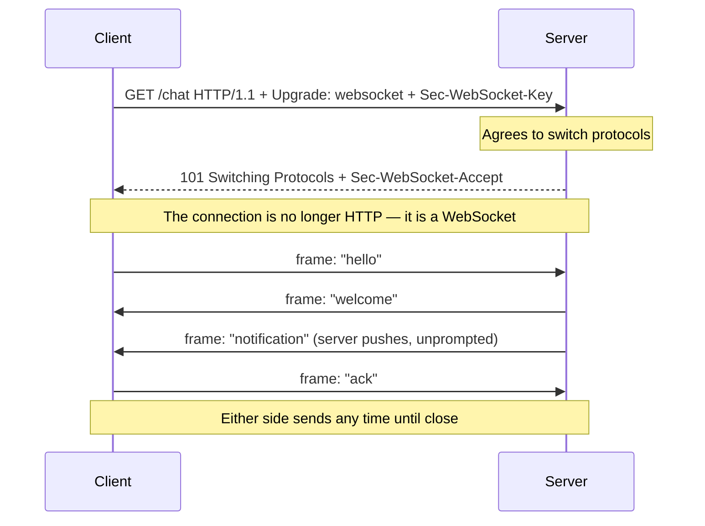

# 🔁 WebSockets & Real-Time Protocols

> [!abstract] Note of [[Web & Application Protocols]]
> HTTP's request/response model cannot push data to a client that did not ask, which real-time applications need. This note covers the mechanisms that solve it — from the WebSocket upgrade that abandons request/response entirely to lighter one-way options — and explains why a persistent, full-duplex channel escapes many of the request-based controls that guard ordinary web traffic.

## Parent Learning Order
HTTP Fundamentals -> HTTPS & the TLS Handshake -> Web Architecture & Proxies -> WebSockets & Real-Time Protocols -> REST & Modern API Transport -> Application Delivery & Load Balancing

## The Problem With Request/Response

> *A chat server has a message for you right now. Using HTTP alone, how does it tell you?*
>
> Hold your answer — the section below is the response.

HTTP's model is strict: the client asks, the server answers, done. The server cannot speak first. For a chat message, a stock tick, a live notification, or a multiplayer game, the server needs to send data the moment it has it — but it has no open channel to do so.

The historical workarounds were all compromises. **Polling** has the client ask "anything new?" repeatedly, wasting requests and adding latency. **Long polling** has the server hold a request open until it has data, which ties up a connection and still incurs a full round trip per message. These bend request/response without escaping it, and they scale poorly.

The real solution is to stop using request/response and open a **persistent, bidirectional channel**.

**Prerequisites:** HTTP request/response and status codes.

> [!tip] The analogy, and where it breaks
> Upgrading from posting letters back and forth to opening a telephone line that simply stays connected, so either side may speak whenever they like. The analogy breaks where security lives: each letter passed the mailroom's inspection individually, but nothing inspects each sentence on an open phone line. That is precisely why per-request controls stop applying and validation must move inside the message handler.

## The WebSocket Upgrade

**WebSocket** establishes a full-duplex connection that begins as an ordinary HTTP request and then *upgrades* into something else entirely.



The handshake is the clever part. The client sends a normal HTTP GET with `Upgrade: websocket` and a random `Sec-WebSocket-Key`. The server responds with **101 Switching Protocols** — the one status code that means "we are abandoning HTTP on this connection." From that point the same TCP (or TLS) connection carries WebSocket **frames**, not HTTP messages, and either side may send at any time.

Because it starts as HTTP, WebSocket traverses existing web infrastructure — the same ports (80, 443), the same proxies, the same TLS. `ws://` is the plaintext scheme; `wss://` is WebSocket over TLS and is the only acceptable form in production, for exactly the confidentiality and integrity reasons HTTPS exists.

```bash
curl -i -N -H "Connection: Upgrade" -H "Upgrade: websocket" \
  -H "Sec-WebSocket-Key: dGhlIHNhbXBsZSBub25jZQ==" \
  -H "Sec-WebSocket-Version: 13" http://track.meridian.test/chat
```

Expected excerpt:

```text
HTTP/1.1 101 Switching Protocols
Upgrade: websocket
Connection: Upgrade
Sec-WebSocket-Accept: s3pPLMBiTxaQ9kYGzzhZRbK+xOo=
```

The `101` is the moment the connection stops being HTTP.

That `Sec-WebSocket-Accept` value is not arbitrary and is worth checking once, because it is the only part of the handshake that proves the server understood what it agreed to. The server takes the client's key, appends the fixed GUID `258EAFA5-E914-47DA-95CA-C5AB0DC85B11`, hashes it with SHA-1 and base64-encodes the result:

```bash
printf '%s258EAFA5-E914-47DA-95CA-C5AB0DC85B11' 'dGhlIHNhbXBsZSBub25jZQ==' \
  | openssl sha1 -binary | openssl base64
```

```text
s3pPLMBiTxaQ9kYGzzhZRbK+xOo=
```

It is not a security mechanism — the GUID is public and the client's key is not secret — and it was never meant to be. Its job is to prevent a cache or a proxy that does not understand `Upgrade` from replaying an old response and accidentally convincing a client that a WebSocket exists where none does. A protocol transition needs a confirmation that could not have been produced by accident, which is a different requirement from a confirmation that could not have been forged.

## Lighter Options: Server-Sent Events

WebSocket is full-duplex, which is more than many applications need. When only the *server* needs to push and the client just receives — a news feed, a progress indicator, a live dashboard — **Server-Sent Events (SSE)** is simpler.

SSE is a single long-lived HTTP response that the server keeps writing to, streaming events as text. It stays within HTTP, so it works with ordinary HTTP tooling, supports automatic reconnection, and needs no protocol upgrade. Its limitation is that it is one-directional (server to client only) and text-only. The engineering rule of thumb: use SSE when only the server pushes, WebSocket when both directions need to send arbitrary data.

| Mechanism | Direction | Transport | Use when |
| --- | --- | --- | --- |
| Polling | Client asks repeatedly | HTTP requests | Rarely; simplicity over efficiency |
| Long polling | Server holds a request | HTTP request | Legacy fallback |
| **SSE** | Server → client only | One long HTTP response | Server pushes, client only listens |
| **WebSocket** | Both directions | Upgraded connection, framed | True bidirectional real-time |

**The deliberate break:** the handshake reads as the checkpoint. It is an ordinary HTTP request, the WAF inspects it, authorisation is decided there, and the connection proceeds having been vetted.

It is the **only** HTTP request in the entire conversation. Everything after it — thousands of messages, in both directions, for as long as the connection lives — never appears as a separate request, so every control that operates per request inspected the doorway and nothing that came through it. Security has to move inside the message handler, validating and authorising each frame as it arrives, because the upstream checks are structurally unable to see them.

To see how completely that is true, send the same hostile string twice — once as the handshake, once as a frame. In the URL, it is an ordinary HTTP request and the edge treats it as one:

```bash
curl -si "https://track.meridian.test/chat?room=' OR 1=1--" \
  -H "Connection: Upgrade" -H "Upgrade: websocket" \
  -H "Sec-WebSocket-Key: dGhlIHNhbXBsZSBub25jZQ==" -H "Sec-WebSocket-Version: 13" | head -1
```

```text
HTTP/1.1 403 Forbidden
```

Now complete a clean handshake to `/chat` and send the identical string as message two:

```text
>>> {"room":"general","q":"' OR 1=1--"}
<<< {"results":[ ... 4,812 rows ... ]}
```

The edge saw one request in this conversation and approved it. It will see no others for as long as the connection lives, however many thousands of messages pass, because there are no others to see — a frame is not a request and never becomes one.

**How you'd spot it:** ask what inspects message number two. If the answer names the WAF or the API gateway, then nothing does. The second question is when authorisation was last evaluated on a connection that has been open for hours — a permission revoked an hour ago is still in force on a channel opened before it, which is how access outlives its entitlement and why long-lived sessions need periodic re-validation rather than a single check at the door.

## Security Implications

**WebSocket escapes request-based controls.** The controls guarding ordinary web traffic — WAF rules, per-request authorization checks, request logging — operate on discrete HTTP requests. A WebSocket is one long connection carrying many messages that never appear as separate HTTP requests, so a WAF that inspects the opening handshake may see nothing of the thousands of messages that follow. Security must move *into* the WebSocket message handler: every message must be validated and authorized as it arrives, because the per-request checks upstream no longer apply. Treating the initial handshake as the only checkpoint is a common and serious gap.

**Cross-Site WebSocket Hijacking exploits the handshake's origin trust.** The WebSocket handshake is an HTTP request, and browsers attach cookies to it automatically — but the **SameSite** and CORS protections that guard ordinary cross-origin requests do not apply to WebSocket the same way. If a server authenticates a WebSocket purely from the cookie and does not validate the **`Origin`** header, a malicious page can open an authenticated WebSocket to your server in the victim's context and read or send data as the victim. The defenses are explicit `Origin` validation on the handshake and authenticating the WebSocket with a token the malicious page cannot obtain, not merely the ambient cookie.

**Persistent connections are a resource commitment.** Each WebSocket holds a connection open indefinitely, consuming server memory and a connection slot for its entire lifetime. A server must bound the number of concurrent connections, enforce idle timeouts, and rate-limit messages per connection — otherwise opening many connections, or flooding messages down one, exhausts the server. This is the same finite-state concern seen at the transport layer, now at the application layer and easier to trigger because each connection is cheap for the client and expensive for the server.

**Authorization can go stale on a long connection.** A permission valid when a WebSocket opened may be revoked hours later while the connection persists. Unlike short requests that re-check authorization each time, a long-lived channel must re-validate authorization periodically or on privilege-relevant actions, or it becomes a way to retain access after it should have been withdrawn.

**Input validation still applies, per message.** Everything true of HTTP request bodies — injection, deserialization risks, malformed input — is true of WebSocket frames. The framing is different; the untrusted-input principle is identical, and each frame is a fresh piece of untrusted data.

All testing described here must target only systems within an authorized scope. WebSocket hijacking and flooding are intrusive and belong in an authorized lab.

## Summary

You should now be able to:

- Explain why HTTP cannot push to a client, what the WebSocket upgrade accomplishes, and when Server-Sent Events is the simpler right choice.
- Perform and read a WebSocket handshake, recognize the `101` transition, and explain why `wss://` is mandatory; contrast SSE and WebSocket by direction and transport.
- Explain why per-request controls miss WebSocket messages and where security must move; describe Cross-Site WebSocket Hijacking and its `Origin`/token defenses, and why long-lived connections require bounded resources and periodic authorization re-validation.

---
> 🔼 Up: [[Web & Application Protocols]]
