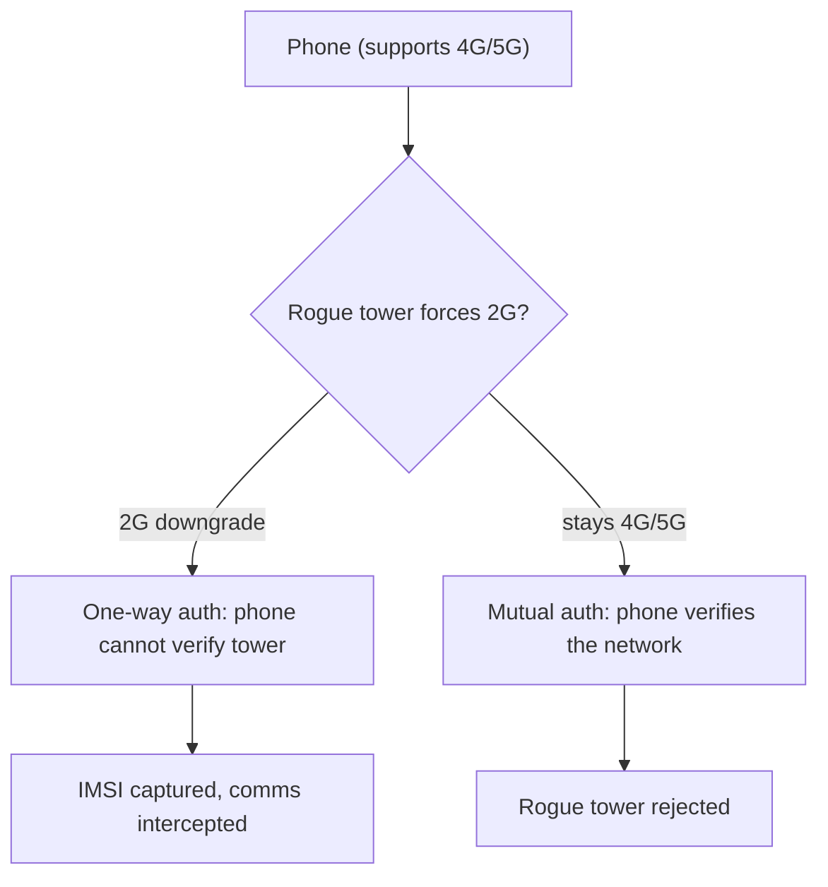

# 📱 Cellular & Long-Range Wireless

> [!abstract] Note of [[Wireless Networking]]
> Beyond Wi-Fi lies a family of wireless systems built for distance rather than a single building — cellular networks carrying phones, and low-power protocols carrying sensors across a city. This note explains how cellular authenticates devices, why generational security improved, and how the same "impersonate the tower" idea from Wi-Fi reappears as the IMSI catcher.

## Parent Learning Order
Wireless Fundamentals & 802.11 -> Wi-Fi Security & WPA -> Wireless Attacks & Rogue Infrastructure -> Cellular & Long-Range Wireless -> Bluetooth & Personal-Area Networks -> Wireless Reconnaissance & Defense

## A Different Design Goal

> *Wi-Fi covers a building; cellular covers a country. Which design constraint forces the difference?*
>
> Hold your answer — the section below is the response.

Wi-Fi serves a building; **cellular** serves a country. The design constraints are different — devices move at speed between towers, the operator is a licensed carrier rather than a local admin, and the network must authenticate millions of subscribers. This produces a very different architecture, but the security ideas rhyme with Wi-Fi.

Cellular networks are labelled by generation, and each generation improved security among other things:

| Generation | Era | Security character |
| --- | --- | --- |
| **2G (GSM)** | 1990s | Weak: one-way authentication, breakable encryption |
| **3G** | 2000s | Mutual authentication introduced |
| **4G (LTE)** | 2010s | Stronger crypto, all-IP network |
| **5G** | 2020s | Encrypted subscriber identity, stronger mutual auth |

The identity at the heart of cellular is the **IMSI (International Mobile Subscriber Identity)** — a unique number identifying a subscriber, stored on the **SIM card**. The SIM is a small secure element holding a secret key that never leaves it, and authentication works by the network challenging the SIM to prove it holds that key without transmitting it. This is a hardware-rooted authentication far stronger than a Wi-Fi passphrase, and it is why cloning a modern SIM is hard.

**Prerequisites:** wireless fundamentals and the evil-twin concept.

> [!tip] The analogy, and where it breaks
> A national phone network where your SIM is a tamper-proof key card that proves who you are to the tower. The analogy breaks on the direction of proof: in the oldest generation the tower never had to prove itself back, so a van with the right equipment could impersonate one. Newer generations made the proof mutual, but the old, weaker mode still exists for compatibility — and can be forced.

## The Generational Weakness and Its Fix

The critical security evolution across generations is **mutual authentication**.

In **2G/GSM**, authentication was **one-way**: the network verified the phone, but the phone did *not* verify the network. The phone would connect to any tower claiming to be its carrier, trusting it blindly. This is exactly the Wi-Fi evil-twin problem — the client cannot verify the infrastructure — and it enables the cellular equivalent.

An **IMSI catcher** (often called by the brand-name "stingray") is a rogue cell tower. It broadcasts a strong signal impersonating a legitimate carrier tower, and nearby phones — unable to verify it in 2G — connect to it. Once a phone attaches, the catcher can capture its IMSI (identifying and tracking the subscriber), and in 2G can often downgrade the connection to weak or no encryption and intercept communications. A key technique is a **downgrade attack**: even a modern phone can be forced down to 2G by a rogue tower that refuses higher generations, reintroducing the one-way-authentication weakness the newer generations fixed.



**3G onward introduced mutual authentication**: the phone verifies the network as the network verifies the phone, using the shared SIM key. A rogue tower that cannot prove it holds the carrier's key is rejected. This is the same fix as WPA-Enterprise certificate validation — make the client verify the infrastructure — and it defeats the basic IMSI catcher on those generations.

**5G goes further** by encrypting the subscriber identity itself. In earlier generations the IMSI was sent in the clear during initial attachment, which is what let catchers harvest it. 5G encrypts it (as a concealed identifier), so a passive catcher cannot simply read subscriber identities off the air. The residual risk is downgrade — forcing a device to an older generation — which is why disabling 2G fallback on devices that support it is a meaningful hardening step.

## Long-Range, Low-Power Wireless

A different branch of long-range wireless serves not phones but *things* — sensors, meters, trackers — that send tiny amounts of data over long distances on tiny batteries. **LoRaWAN** is the prominent example, reaching kilometres at very low power and data rate.

The design trade-off is severe and security-relevant: to save power and reach distance, these protocols minimize everything, including cryptographic overhead. Security depends on key management that constrained devices often implement poorly — keys hardcoded in firmware, weak provisioning, or no update path. A sensor deployed for a decade on a coin cell cannot run heavy cryptography or receive frequent security updates, so the security posture is set at manufacture and rarely improves.

This is the same pattern seen with IoT generally: devices too constrained for strong, updatable security, deployed in large numbers, in physically accessible locations. The networking concern is that these long-range links extend an organization's attack surface across a wide area, often with weak per-device security, and often unmonitored.

## Worked Example: What the Modem Reports About Its Serving Cell

A phone's own modem exposes the two facts an IMSI-catcher cannot hide: which
generation it has been persuaded to use, and which cell it is attached to.

> [!note] Representative output
> Reconstructed from a lab of this shape rather than copied from one capture. Field layouts and flag names match the named tool; addresses and identifiers are synthetic.

**Normal attachment.** On a healthy modern network the modem reports mutual
authentication and a current radio technology:

```shell-session
analyst@lab:~$ mmcli -m 0
  --------------------------------
  Status   |             state: connected
           |       power state: on
           |       access tech: lte
           |    signal quality: 71% (recent)
  --------------------------------
  3GPP     |      operator id: 23415
           |    operator name: Example Mobile
           |     registration: home
```

```shell-session
analyst@lab:~$ mmcli -m 0 --location-get
  --------------------------------
  3GPP location |    operator code: 23415
                |          tracking area code: 0A1C
                |                     cell id: 01A2B3C4
```

`access tech: lte` matters more than the signal quality. From 4G onward the
network must prove itself to the device as well as the reverse, so a device that
stays on LTE or 5G cannot be attached to a tower that does not hold the operator's
keys.

**A forced downgrade.** The same modem, moments later, in the presence of a
device suppressing the LTE bands:

```shell-session
analyst@lab:~$ mmcli -m 0
  --------------------------------
  Status   |             state: connected
           |       access tech: gsm
           |    signal quality: 94% (recent)
  --------------------------------
  3GPP     |      operator id: 23415
           |     registration: home
```

```shell-session
analyst@lab:~$ mmcli -m 0 --location-get
  --------------------------------
  3GPP location |          cell id: 0F00FF01
```

Three signals together tell the story, and no single one is conclusive. The
access technology has dropped to `gsm`, where the network never authenticates
itself to the phone. The signal quality has jumped to 94% — a nearby transmitter,
not a distant tower. And the cell ID is one never previously seen in this area.
A phone showing full bars on a two-generation-old technology in a city with LTE
coverage everywhere is reporting an anomaly, even though every individual field
looks like a normal successful connection.

This is why the fix was generational rather than a patch: the vulnerability is
that an older protocol *without* mutual authentication remains reachable, so the
defence is refusing to speak it. A device configured to require LTE or better
simply fails to attach instead of attaching to an impostor.

## Security Implications

**"Impersonate the infrastructure" is universal.** The IMSI catcher is the evil twin at cellular scale, and its defeat — mutual authentication so the client verifies the network — is the same fix as Enterprise Wi-Fi certificate validation. Across Wi-Fi and cellular, the security of a wireless client rests on whether it can cryptographically verify the infrastructure it connects to. Where it cannot (2G, misconfigured Enterprise, open Wi-Fi), impersonation succeeds.

**Downgrade attacks defeat generational improvements.** Newer generations fixed the weaknesses, but backward compatibility lets an attacker force a device to an older, weaker generation. This mirrors WPA3 transition-mode downgrades and TLS downgrade attacks — the pattern of "force the victim to the weakest mutually supported option" recurs across every protocol with a compatibility fallback. The defense is the same: disable the weak fallback where the device population allows.

**Encryption backstop, again.** Whatever the cellular link's security, end-to-end encryption above it protects content. A phone on a compromised or intercepted cellular link still has confidential communication if its apps use properly validated TLS — the messaging app's encryption does not depend on the carrier link being secure. This is why the domain's repeated conclusion holds even against a nation-state IMSI catcher: the link is not the content.

**Constrained long-range devices are a wide, weak attack surface.** LoRaWAN and similar deployments spread many weakly secured, rarely updated devices across large areas. They are hard to monitor and hard to patch, and their security is largely fixed at manufacture. Treating them as untrusted, segmenting them from sensitive systems, and monitoring their behaviour is the realistic posture, since strengthening the devices themselves is often impossible.

**Metadata exposure is inherent.** Even with strong encryption, cellular networks know device location (by tower), and IMSI catchers exploit identity exposure for tracking. Location and identity metadata are a privacy concern that encryption of content does not address, which is why identity encryption was a headline 5G improvement.

This note is conceptual. Operating a rogue tower or intercepting cellular traffic is unlawful and requires licensed spectrum; the lab below stays within legal, observational bounds and does not transmit on cellular frequencies.

## Summary

You should now be able to:

- Explain how cellular differs from Wi-Fi in design goal, what the IMSI and SIM are, and what an IMSI catcher does.
- Explain why 2G's one-way authentication enabled IMSI catchers and how mutual authentication in 3G+ defeats the basic version; describe why downgrade attacks reintroduce the weakness and how disabling 2G helps.
- Connect the IMSI catcher to the Wi-Fi evil twin as one "impersonate the infrastructure" pattern with one fix (client verifies infrastructure); explain 5G identity encryption, why the encryption backstop holds even on a compromised link, and why constrained long-range devices are a wide, weak surface best handled by segmentation.

---
> 🔼 Up: [[Wireless Networking]]
