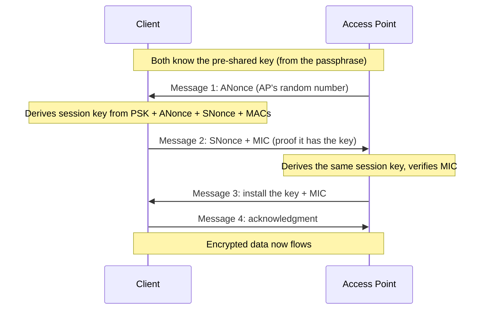

# 🔐 Wi-Fi Security & WPA

> [!abstract] Note of [[Wireless Networking]]
> Because anyone in range hears every frame, wireless security lives or dies on its encryption, and that encryption has been broken and rebuilt three times. This note traces WEP to WPA3, explains the four-way handshake that everything hinges on, and distinguishes personal from enterprise authentication — the single most important design choice for an organization's Wi-Fi.

## Parent Learning Order
Wireless Fundamentals & 802.11 -> Wi-Fi Security & WPA -> Wireless Attacks & Rogue Infrastructure -> Cellular & Long-Range Wireless -> Bluetooth & Personal-Area Networks -> Wireless Reconnaissance & Defense

## Why the Encryption Is Everything

> *"WPA2 was cracked." What, precisely, did the attacker break?*
>
> Hold your answer — the section below is the response.

On the shared radio medium, a passive listener captures every frame. The only thing standing between that listener and your traffic is encryption. If the encryption is weak, the physical exposure becomes a full compromise; if it is strong, the listener gets ciphertext. This is why Wi-Fi security *is* Wi-Fi encryption, and why the history of Wi-Fi is a history of encryption schemes being broken and replaced.

| Scheme | Era | Status |
| --- | --- | --- |
| **WEP** | 1997 | Catastrophically broken — crackable in minutes |
| **WPA** | 2003 | Interim fix, also weak, deprecated |
| **WPA2** | 2004 | Long-standing standard; strong but with known weaknesses |
| **WPA3** | 2018 | Current; fixes WPA2's core handshake weakness |

**WEP (Wired Equivalent Privacy)** promised, by its name, wired-equivalent security and failed completely. Its flaws let an attacker recover the key by passively collecting enough traffic — crackable in minutes with commodity tools. WEP is a museum piece, and its lesson is permanent: an encryption scheme is only as good as its cryptographic design, and "we use encryption" means nothing if the scheme is broken.

**WPA2** became the workhorse for over a decade, using strong AES-based encryption. It is genuinely strong for the data, but its *handshake* has a weakness that WPA3 was created to fix, examined below.

**WPA3** is the current standard, and its central improvement is replacing the vulnerable handshake with one that resists the offline attacks that plague WPA2.

**Prerequisites:** 802.11 frames, association, and why the medium is shared.

> [!tip] The analogy, and where it breaks
> Two ways to control entry: a single shared door code everyone in the building knows, versus a personal keycard issued to each employee. The analogy breaks on what an eavesdropper can do afterwards — with the shared code, overhearing one person's entry sequence lets an attacker guess the code offline, at leisure, forever, with no lockout. That offline guessing has no physical equivalent, and it is exactly the WPA2 weakness.

**The deliberate break:** "WPA2 was cracked" gets repeated constantly, and it implies the encryption is broken and any WPA2 network is readable.

The encryption is not broken. What an attacker captures is the **four-way handshake**, which contains a value derived from the passphrase — and then guesses passphrases offline, at whatever speed their hardware allows. Nothing about WPA2's cryptography fails; the passphrase does. A network with a long random passphrase is not meaningfully attackable this way, and a network with `Summer2024!` was never protected by its encryption in the first place.

**How you'd spot the exposure:** the question is never "is it WPA2" but "how was the passphrase chosen, and how many people know it". For WPA2-Personal, one shared secret protects everyone on it.

## The Four-Way Handshake

Everything in WPA2 security depends on one exchange: the **four-way handshake** that occurs after association, establishing the encryption keys for the session.

The starting point is a shared secret. In **WPA2-Personal**, that secret derives from the network **passphrase** everyone knows. The handshake uses it to derive a unique per-session key without ever sending the passphrase over the air.



The design is clever — the passphrase never crosses the air, and each session gets a fresh key. But there is a fatal exposure: **the handshake contains enough information for an offline attack.** An attacker who captures the four-way handshake can take it away and, offline, guess passphrases — for each candidate, derive what the key would be and check whether it produces the captured handshake's verification value. No further interaction with the network is needed.

This is the defining WPA2 weakness. The attacker does not need to break the encryption; they need to capture one handshake and then guess the passphrase offline, forever, with no lockout. To capture a handshake, an attacker often forces a connected client to reconnect using a forged deauthentication frame (the management-frame weakness from the previous leaf), then captures the resulting handshake — the two flaws chaining together.

`MERIDIAN-GUEST` runs WPA2-Personal, so it is the one to watch. In monitor mode the four messages arrive as EAPOL frames and are unmistakable:

```bash
sudo tcpdump -i wlan0 -e -nn 'ether proto 0x888e'
```

```text
00:00:5e:00:53:c1 > 00:00:5e:00:53:30, EAPOL key (1/4), replay 1, ANonce
00:00:5e:00:53:30 > 00:00:5e:00:53:c1, EAPOL key (2/4), replay 1, SNonce + MIC
00:00:5e:00:53:c1 > 00:00:5e:00:53:30, EAPOL key (3/4), replay 2, install + MIC
00:00:5e:00:53:30 > 00:00:5e:00:53:c1, EAPOL key (4/4), replay 2, MIC
```

Four frames, captured passively, and the attack is now entirely offline. Nothing further touches the network — no more radio, no logs, no rate limit, no lockout. The AP has no way to know it happened.

### How fast "offline" actually is

"At whatever speed their hardware allows" is where the argument usually stops, and it is the wrong place to stop, because the speed is what decides whether any of this matters. WPA2 does not hash the passphrase once; it runs PBKDF2 with 4,096 iterations, deliberately slow. A strong single GPU manages roughly a million candidates per second — not billions:

| What the passphrase is | Candidates | Time at 1,000,000/s |
|:--|--:|--:|
| in a rule-mangled wordlist (`Summer2024!`) | 10⁹ | **17 minutes** |
| 8 random characters, mixed case and digits | 2.2 × 10¹⁴ | 7 years |
| 4 random dictionary words | 3.7 × 10¹⁵ | 116 years |
| 10 random characters | 8.4 × 10¹⁷ | 27,000 years |
| 12 random characters | 3.2 × 10²¹ | 100 million years |

Read the first row against the rest. `Summer2024!` has an uppercase letter, digits and a symbol — it satisfies every complexity policy ever written — and it falls in under twenty minutes, because it is not being guessed character by character. It is being read from a list of known passwords with predictable mangling rules applied, and the search space is the *list*, not the alphabet.

Everything below the first row is unreachable, and by an enormous margin. Rent a thousand GPUs and the 12-character row still runs to a hundred thousand years. So the honest conclusion is narrower than "use a strong passphrase": the offline attack is not a threat to a passphrase that was **randomly generated**, and it is close to a certainty against one a person invented. Length matters because it multiplies the space; complexity rules mostly do not, because they shape passwords people can remember, which is the same thing as passwords the wordlist already has.

WPA3 fixes exactly this. It replaces the handshake with **SAE (Simultaneous Authentication of Equals)**, a design that does not expose a capturable value an attacker can guess against offline. Each guess requires a fresh interaction with the network, which is slow, rate-limitable, and detectable — turning an unlimited offline attack into a bounded online one. WPA3 also provides forward secrecy, so capturing traffic and later learning the passphrase does not decrypt past sessions.

## Personal Versus Enterprise: The Real Decision

The passphrase model has a structural problem no encryption strength fixes: **everyone shares one secret.** In WPA2/WPA3-Personal, every device uses the same passphrase, which means:

- A departing employee still knows it.
- A compromised device exposes it.
- Changing it requires reconfiguring every device.
- One captured handshake plus that shared passphrase compromises everyone.

**WPA-Enterprise** solves this by giving every user or device **individual credentials**, validated against a central **RADIUS** server using the **802.1X** framework from the security-architecture branch. There is no shared passphrase. Each user authenticates with their own identity (a username and password, or a certificate), the RADIUS server validates it, and each session's keys are unique to that authenticated identity.

```text
Personal:    one passphrase, everyone shares it, offline-crackable if captured
Enterprise:  per-user credentials via 802.1X/RADIUS, individually revocable, no shared secret
```

Meridian runs one of each, which makes the difference concrete. `MERIDIAN-CORP` is WPA2-Enterprise: `r.okonkwo` authenticates as herself against RADIUS, and if she leaves, one account is disabled and nobody else notices. `MERIDIAN-GUEST` is WPA2-Personal with a passphrase printed on a card at reception — captured once, guessed offline, and it stays valid until someone reprints the card and reconfigures every device that used it. The guest network is on `10.10.51.0/24` with no path to any corporate segment precisely because its authentication cannot be trusted to identify anyone.

The consequences are decisive for any organization:

- **Revocation** — disable one user without touching anyone else's access.
- **Attribution** — sessions tie to identities, so logs name a person, not just a device.
- **No shared secret to capture and crack** — the personal-mode offline attack does not apply.
- **Posture and policy** — RADIUS can enforce device health and assign VLANs by identity, exactly as in wired 802.1X.

The trade-off is infrastructure: Enterprise requires a RADIUS server and a credential system, which is why homes and small offices use Personal. For any organization of size, Enterprise is the correct choice, and Personal is a liability that scales badly.

The same filter that captured the guest network's handshake distinguishes the two, because both modes speak EAPOL and only one of them says anything first:

```bash
sudo tcpdump -i wlan0 -nn 'ether proto 0x888e'
```

Expected excerpt on `MERIDIAN-CORP` (Enterprise):

```text
EAPOL (802.1X), Request, Identity
EAP, Response, Identity  (r.okonkwo@meridian.test)
EAP, Request, TLS
```

An identity exchange and a TLS tunnel to the RADIUS server come *before* any key derivation, and only then does a four-way handshake follow. On `MERIDIAN-GUEST` there is no identity exchange at all — the four EAPOL key frames are the entire authentication, because the network has nothing to ask. That difference is visible in one capture and it is the whole architectural distinction: one network authenticates a person, the other confirms that somebody knows a shared string.

## Security Implications

**Passphrase strength is the whole game in Personal mode.** Because the handshake is offline-crackable in WPA2-Personal, the only defense is a passphrase strong enough to resist offline guessing — long and random, not a dictionary word or a predictable pattern. A weak passphrase on WPA2-Personal is effectively no security once a handshake is captured, which takes seconds. WPA3 raises this bar dramatically by making guessing require online interaction.

**Deprecate WEP and WPA absolutely, and move off WPA2-Personal where feasible.** WEP and original WPA are broken and must never be used. WPA2 remains widely deployed and acceptable with a strong passphrase and Protected Management Frames, but WPA3 is the target, and the handshake weakness is the concrete reason. Networks offering a WPA2 fallback for compatibility retain the WPA2 weakness for those clients.

**Enterprise is the architectural answer for organizations.** The shared-secret problem of Personal mode is not a strength issue but a management and blast-radius issue, and only per-user credentials solve it. This connects wireless directly to the identity-based, zero-trust direction of the security-architecture branch: access should be per-identity and revocable, on wireless exactly as on wired.

**Transition modes reintroduce old weaknesses.** WPA3 networks that also accept WPA2 clients for compatibility ("transition mode") can be downgraded by an attacker forcing WPA2, reopening the handshake attack. Where the client base allows, WPA3-only is stronger than a mixed mode.

**Encryption protects the data, not the metadata.** Even strong Wi-Fi encryption leaves management frames and traffic patterns observable. Who is connected, when, and how much they transmit remains visible, which is why the reconnaissance and defense leaf treats metadata as its own concern.

All handshake capture and cracking described here must target only networks you own or are explicitly authorized to test. Capturing and attacking handshakes on networks you do not control is unlawful interception.

## Summary

You should now be able to:

- Explain why Wi-Fi security is fundamentally about encryption, name the WEP→WPA3 progression, and state what the four-way handshake establishes.
- Capture a WPA2 handshake and explain the offline attack it enables; distinguish Personal from Enterprise by the presence of an 802.1X/EAP exchange and explain why the shared passphrase is a management liability.
- Explain precisely why the WPA2 handshake is offline-crackable and how WPA3's SAE removes that exposure; argue Enterprise as the organizational answer for revocation and attribution, and why transition modes and WPA2 fallback reintroduce the old weakness.

---
> 🔼 Up: [[Wireless Networking]]
