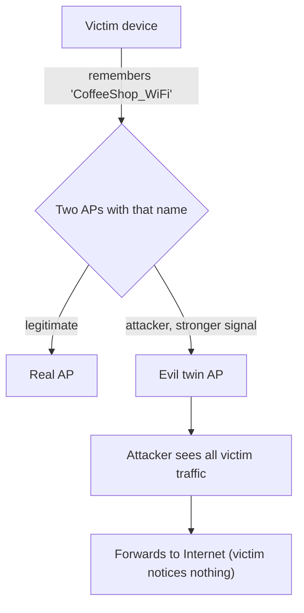

# 😈 Wireless Attacks & Rogue Infrastructure

> [!abstract] Note of [[Wireless Networking]]
> The most effective wireless attacks do not break encryption — they impersonate the network so the victim connects to the attacker willingly. This note covers the rogue-AP family, from the evil twin to karma attacks, and explains why a client's own eagerness to reconnect to familiar networks is the vulnerability being exploited.

## Parent Learning Order
Wireless Fundamentals & 802.11 -> Wi-Fi Security & WPA -> Wireless Attacks & Rogue Infrastructure -> Cellular & Long-Range Wireless -> Bluetooth & Personal-Area Networks -> Wireless Reconnaissance & Defense

## Don't Break In, Be the Door

> *Cracking a WPA3 passphrase is hard. What is the easier route to the same on-path position?*
>
> Hold your answer — the section below is the response.

Cracking a strong WPA3 passphrase is hard. Convincing a victim to connect to *your* access point is easy, and yields the same on-path position without touching the encryption. This is the strategic insight of wireless attacks: **impersonate the infrastructure rather than defeat the cryptography.**

The reason it works is a client behaviour that seems helpful and is exploitable. Devices remember networks they have joined and **automatically reconnect** to any network broadcasting a matching SSID. Your laptop, seeing "CoffeeShop_WiFi," connects without asking, because it joined a network by that name before. But an SSID is just a name — nothing stops an attacker from naming *their* access point "CoffeeShop_WiFi." The client cannot tell the difference by name alone, and connects to the attacker.

**Prerequisites:** association, Wi-Fi encryption modes, and management frames.

> [!tip] The analogy, and where it breaks
> Someone putting up a convincing sign reading 'Staff Entrance' over their own doorway. Nobody breaks a lock; people walk in willingly because the sign matches what they expect. The analogy breaks because your device reads the sign *automatically and silently* — it reconnects to a remembered name without asking you, so the victim never even makes a decision to be fooled.

## The Rogue Access Point Family

A **rogue access point** is any AP an attacker controls that a victim connects to believing it legitimate. Several variants exploit different angles.

**The evil twin** clones a legitimate network — same SSID, often a stronger signal — so clients in range prefer it or reconnect to it. Once a victim associates, the attacker is the client's gateway, occupying an on-path position for all the victim's traffic.



**The deauthentication attack** is the evil twin's accomplice. Because management frames are unauthenticated (the fundamentals-leaf weakness), an attacker forges deauth frames that kick a victim off the legitimate AP. The victim's device, now disconnected, automatically hunts for a network by that name — and the evil twin, broadcasting the same SSID with a strong signal, wins the reconnection. Deauth turns a passive lure into an active push.

**The karma attack** exploits probe requests directly. Recall that clients broadcast probe requests asking "is network X here?" for networks they remember. A karma-style rogue AP listens for these probes and simply *answers yes to all of them* — "yes, I am the network you are looking for" — for whatever name the client asks. A device probing for a familiar home or office network is answered by the attacker and connects, no cloning of a specific known network required. Modern devices probe less aggressively to mitigate this, but the technique illustrates that the client's memory of networks is the exposure.

**The captive portal attack** adds a credential-harvesting layer. After a victim connects to the rogue AP, the attacker presents a fake login or "sign-in to continue" page — mimicking a hotel, airport, or corporate portal — to capture credentials the victim types. The connection was the foothold; the portal is the harvest.

## Why Encryption Does Not Always Save the Victim

A natural objection: if the real network uses WPA-Enterprise or WPA3, can the attacker really impersonate it? This is where the details matter.

For an **open network** (coffee shops, many public Wi-Fi), there is no mutual authentication at all — the client has no way to verify the AP, so an evil twin is trivial and complete. Open networks are the softest target.

For a **WPA-Personal** network, the attacker who knows the shared passphrase (often posted on a wall, or previously cracked) can stand up a perfect evil twin, because the passphrase is all the "authentication" there is.

For **WPA-Enterprise**, the picture improves *if configured correctly*: the client can validate the RADIUS server's certificate, which an attacker cannot forge. But if clients are misconfigured to not validate the server certificate — a distressingly common default — the attacker stands up a rogue Enterprise AP, the client authenticates to it without checking the certificate, and the attacker captures the credentials or relays the authentication. **The defense exists but depends on client-side certificate validation being enforced**, which is the recurring Enterprise Wi-Fi failure.

The general principle: the evil twin succeeds wherever the client cannot, or does not, cryptographically verify the AP's identity. Strong, correctly configured mutual authentication is what defeats it; anything less leaves the door open.

## Worked Example: Two Access Points, One Name

An evil twin is not subtle in a capture. It is subtle only to the client, which
selects by name.

> [!note] Representative output
> Reconstructed from a lab of this shape rather than copied from one capture. Field layouts and flag names match the named tool; addresses and identifiers are synthetic.

**The airspace, with both APs present:**

```shell-session
analyst@lab:~$ sudo airodump-ng wlan0mon

 CH  6 ][ Elapsed: 2 mins ][ 2026-04-12 15:04

 BSSID              PWR  Beacons  #Data, #/s  CH   MB   ENC  CIPHER AUTH ESSID

 A4:2B:8C:11:0D:E2  -62      184      12    0   6  130   WPA2 CCMP   PSK  corp-wifi
 00:11:22:33:44:55  -31      612     104    3  11   54e  WPA2 CCMP   PSK  corp-wifi
 A4:2B:8C:11:0D:E3  -63      181       0    0   6  130   WPA2 CCMP   MGT  corp-guest
```

Two rows advertise `corp-wifi` with different BSSIDs, and four fields separate
them. The second is **31 dB stronger**, which at these levels means far closer.
Its **max rate is 54e**, the signature of a software access point on a generic
adapter rather than the 130 Mbit/s of the real enterprise hardware. It sits on a
**different channel**, and its **beacon count is more than triple** the
legitimate AP's over the same window — an impatient transmitter advertising hard.
The first three octets also differ: `A4:2B:8C` is a real vendor allocation shared
with the guest SSID on the same physical AP, while `00:11:22` is a placeholder
that appears in no vendor registry.

**The client moving across.** A deauthentication frame arrives, and the
association that follows lands on the wrong BSSID:

```shell-session
analyst@lab:~$ sudo tcpdump -i wlan0mon -e -n 'wlan type mgt' -c 4
15:06:22.104881 BSSID:a4:2b:8c:11:0d:e2 SA:a4:2b:8c:11:0d:e2 DA:9c:b6:d0:44:1f:07
    DeAuthentication (7): Class 3 frame received from nonassociated STA
15:06:22.118440 BSSID:00:11:22:33:44:55 SA:9c:b6:d0:44:1f:07 DA:00:11:22:33:44:55
    Assoc Request (corp-wifi) [1.0 2.0 5.5 11.0 Mbit]
15:06:22.121973 BSSID:00:11:22:33:44:55 SA:00:11:22:33:44:55 DA:9c:b6:d0:44:1f:07
    Assoc Response AID(1) :: Successful
```

The deauthentication claims to come from the legitimate AP — the source address
is simply written, exactly as with an Ethernet frame, and management frames on an
open or PSK network carry no authentication of their own. Fourteen milliseconds
later the client has associated with the impostor and its user has noticed
nothing, because from the client's perspective it reconnected to a network it
knows by name.

The decisive detail is what the client compared before choosing: an SSID string
and a signal strength. It never asked the access point to prove it was the same
one as yesterday, because on a PSK network there is nothing it could have asked.

## Security Implications

**The client's automatic behaviour is the root vulnerability.** Auto-reconnect and probing for remembered networks are conveniences that let an attacker impersonate a network the victim trusts. The user does nothing wrong and often nothing visible — the device connects silently. This is why user education alone is a weak defense and why technical controls (certificate validation, disabling auto-join for open networks) matter more.

**On-path is the prize, exactly as in every earlier branch.** A successful rogue AP gives the attacker the same on-path position as ARP spoofing, a rogue gateway, or a BGP hijack — and the same conclusion applies: **transport-layer encryption is the backstop.** A victim connected through an evil twin who then uses properly validated HTTPS gives the attacker only metadata and TLS-stripping attempts that HSTS and certificate validation defeat. The evil twin owns the path; it does not automatically own the content. This is the domain's recurring thesis appearing once more, and it is why VPNs are recommended on untrusted Wi-Fi — they re-establish a verified encrypted tunnel over the hostile link.

**Detection is possible and asymmetric.** A rogue AP broadcasting a legitimate SSID is detectable: two APs claiming the same network with different hardware addresses, unexpected signal characteristics, or deauth floods are all signatures. Wireless intrusion detection systems watch for exactly these, and defenders have the advantage that a rogue AP must transmit to function, revealing itself. The reconnaissance-and-defense leaf develops this.

**Enterprise misconfiguration undoes Enterprise security.** The single most important control against Enterprise evil twins — client certificate validation of the RADIUS server — is frequently disabled or unenforced, converting a strong architecture into a vulnerable one. Auditing client configuration for enforced server-certificate validation is high-value and frequently neglected.

Every technique in this note must be performed only against networks and devices you own or are explicitly authorized to test. Standing up a rogue AP that lures other people's devices, forging deauthentication frames on networks you do not own, and harvesting credentials are unlawful outside a controlled, authorized lab.

## Summary

You should now be able to:

- Explain why impersonating a network beats cracking its encryption, and how auto-reconnect lets an evil twin work.
- Describe the evil twin, deauthentication, karma, and captive-portal techniques and how they chain; explain why open networks are the softest target.
- Explain why the evil twin succeeds wherever the client cannot verify the AP, and why enforced RADIUS server-certificate validation is the decisive Enterprise control; connect the on-path outcome to the encryption backstop and the recommendation to use a VPN on untrusted Wi-Fi.

---
> 🔼 Up: [[Wireless Networking]]
