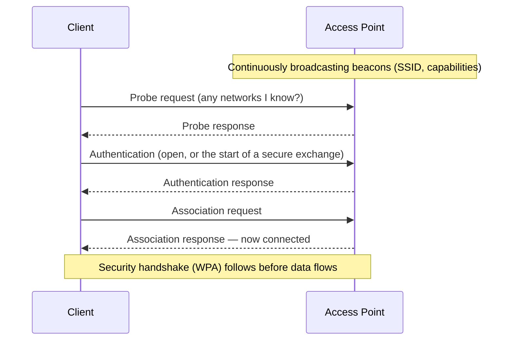

# 📡 Wireless Fundamentals & 802.11

> [!abstract] Note of [[Wireless Networking]]
> Wi-Fi replaces a wire with radio, and that single change removes the physical boundary every wired control assumed. This note builds 802.11 from the radio up — bands, channels, frames, and association — so a reader understands why the medium is shared with anyone in range, and why that is the root fact behind every wireless security concern.

## Parent Learning Order
Wireless Fundamentals & 802.11 -> Wi-Fi Security & WPA -> Wireless Attacks & Rogue Infrastructure -> Cellular & Long-Range Wireless -> Bluetooth & Personal-Area Networks -> Wireless Reconnaissance & Defense

## A Wire You Cannot See or Contain

> *Ten more people join your Wi-Fi channel. What happens to the total throughput?*
>
> Hold your answer — the section below is the response.

On a wired network, a frame travels down a cable to a switch that delivers it only where it should go. To intercept it, an attacker must physically tap the cable. The wire is a boundary.

Wireless has no wire. **802.11** — the family of standards marketed as **Wi-Fi** — transmits frames as radio waves that propagate in all directions, through walls, past property lines, into the parking lot. Every device within range receives every transmission at the physical layer; the network relies on addressing and encryption, not physics, to keep frames private.

This is the foundational fact of wireless security: **the medium is shared and uncontainable.** A wired attacker needs physical access to a cable; a wireless attacker needs only to be within radio range, which extends far beyond the walls. Every topic in this branch descends from that difference.

Wi-Fi operates in unlicensed radio **bands**:

| Band | Character | Trade-off |
| --- | --- | --- |
| **2.4 GHz** | Longer range, penetrates walls | Crowded, slower, few non-overlapping channels |
| **5 GHz** | Faster, more channels | Shorter range, weaker through walls |
| **6 GHz** (Wi-Fi 6E) | Much more spectrum, clean | Newest, shortest range |

Each band is divided into **channels**. The classic gotcha is in 2.4 GHz: its channels overlap, and only channels 1, 6, and 11 do not interfere with each other. Neighbouring access points on overlapping channels degrade each other, which is why a congested apartment building has terrible Wi-Fi regardless of equipment quality — a physical-layer interference problem, not a configuration one.

**Prerequisites:** Ethernet framing, MAC addresses, and broadcast domains.

> [!tip] The analogy, and where it breaks
> Swapping private conversations along a corridor for a public address system in an open square — everyone within earshot hears everything, and the square extends past your property line. The analogy breaks because the loudspeaker also *announces itself continuously*, which is how your device finds networks without being told; there is no quiet equivalent in a wired world.

## The Network's Identity and Structure

An **access point (AP)** bridges the wireless medium to the wired network. The network it offers is named by an **SSID (Service Set Identifier)** — the human-readable network name you select.

The AP announces itself by broadcasting **beacon frames** many times per second, advertising the SSID, supported rates, and security capabilities. This beaconing is why networks appear in your device's list without any action — the AP is continuously shouting "I am here, this is my name, here is how to join." It is also why "hiding" an SSID by not including it in beacons provides almost no security: the name still travels in other frames whenever a client connects, and is trivially captured.

```bash
sudo iw dev wlan0 scan | grep -E "^BSS|SSID|freq|signal" | head -12
```

Expected excerpt:

```text
BSS 00:00:5e:00:53:c0
	freq: 2437
	signal: -42.00 dBm
	SSID: MERIDIAN-CORP
BSS 00:00:5e:00:53:c0
	freq: 5180
	signal: -67.00 dBm
	SSID: MERIDIAN-CORP
BSS 00:00:5e:00:53:c1
	freq: 2412
	signal: -71.00 dBm
	SSID: MERIDIAN-GUEST
```

`freq: 2437` is channel 6; `signal: -42 dBm` is strong (closer to zero is stronger, so -42 beats -71). Reading signal strength in dBm is basic wireless literacy: roughly, -30 is excellent, -67 is usable for most things, -80 is marginal, -90 is unusable.

Read the first column too, because it is the one that means something. `MERIDIAN-CORP` appears twice with the same **BSSID** — the AP's own hardware address — on two different frequencies: the same radio serving 2.4 and 5 GHz. The SSID is a name anyone may type into any access point, and later notes in this branch turn entirely on that; the BSSID is what a specific box actually transmits from. Two entries sharing an SSID and *differing* in BSSID would be a completely different observation.

**The deliberate break:** Wi-Fi is presented as wireless Ethernet, so it is natural to expect it to behave like a switch — each client gets its own path, and adding clients adds capacity.

It behaves like a **hub on a shared half-duplex medium**. Only one device on a channel may transmit at a time; everyone else waits. Bandwidth is divided among active devices and total throughput *falls* as the room fills, because collision avoidance overhead grows. And because the medium is shared and broadcast, every device in range receives every frame — the encryption is what stops them reading it, not the topology.

**How you'd spot it:** watch throughput per client as the room fills. Switched Ethernet holds steady; a Wi-Fi channel degrades for everyone.

The opening question deserves a number rather than "it falls", and the number comes from adding up airtime. Every frame costs a fixed amount of channel time before and after its payload, whatever that payload is:

```text
DIFS (wait before transmitting)                 28 us
average backoff (7.5 slots x 9 us)              68 us
PLCP preamble and header                        20 us
SIFS (gap before the acknowledgement)           10 us
ACK frame                                       24 us
                                          ----------
fixed overhead per frame                       150 us

1500-byte payload at 72 Mbps                   167 us
                                          ----------
total airtime for one full frame               317 us   -> 53% efficient
```

Half the channel is spent on the protocol before a second device is even present. Now shrink the payload, which is what a room full of phones, sensors and voice handsets actually sends:

```text
64-byte payload at 72 Mbps                       7 us
fixed overhead per frame                       150 us
                                          ----------
total airtime                                  157 us   -> 5% efficient
```

That is the whole answer. The channel's ceiling is not really bits per second, it is roughly three thousand frames per second, and each device claims one frame's worth of airtime at a time regardless of how little it has to say. Ten more clients therefore do not divide the throughput ten ways and leave the total intact — the total *falls*, because more contenders mean longer average backoff, and because a channel shared between many quiet devices spends nearly all its airtime on overhead.

The assumptions above are one common configuration and the exact figures vary by standard, guard interval and rate; the ratio is the durable part.

## How Frames Share the Air

Wired Ethernet detects collisions after they happen. Radio cannot — a transmitting device cannot simultaneously listen for a collision on the same frequency. So 802.11 uses **CSMA/CA (Carrier Sense Multiple Access with Collision Avoidance)**: a device listens first, and if the medium is busy, waits a random interval before trying, actively *avoiding* collisions rather than detecting them.

This has a performance consequence people find counterintuitive: **wireless bandwidth is shared among all devices on a channel, and it degrades as more devices join**, because they must take turns on one medium. A wired switch gives each port its own collision domain; a wireless AP is more like an old hub, with everyone sharing the air.

802.11 also defines three frame types, and the distinction matters enormously for security:

- **Data frames** carry actual traffic — these are encrypted when security is enabled.
- **Control frames** manage medium access (acknowledgments, clear-to-send).
- **Management frames** handle the network relationship — beacons, association, authentication, and **deauthentication**.

Here is the critical historical weakness: in the original standards, **management frames were not authenticated or encrypted**. That means an attacker can forge a deauthentication frame telling a client it has been disconnected, and the client obeys. This one gap enables a whole class of attacks and is addressed only by the later **Protected Management Frames** feature.

## Association: Joining a Network



The sequence shows that joining a network is a conversation of management frames *before* any encryption is established. That pre-encryption window — beacons, probes, authentication, association — is visible to anyone listening and is where much wireless reconnaissance and attack occurs.

Put the interface into monitor mode and the whole exchange is readable without joining anything:

```bash
sudo iw dev wlan0 set type monitor && sudo ip link set wlan0 up
sudo tcpdump -i wlan0 -e -s0 'type mgt'
```

```text
1  Beacon (MERIDIAN-CORP) BSSID:00:00:5e:00:53:c0  -42dBm
2  Probe Request (MERIDIAN-CORP) SA:00:00:5e:00:53:0e
3  Probe Request (Heathrow_Free_WiFi) SA:00:00:5e:00:53:0e
4  Probe Request (BA-Lounge) SA:00:00:5e:00:53:0e
5  Probe Response (MERIDIAN-CORP) BSSID:00:00:5e:00:53:c0 -> 00:00:5e:00:53:0e
6  Authentication  00:00:5e:00:53:0e -> 00:00:5e:00:53:c0
7  Assoc Request (MERIDIAN-CORP) 00:00:5e:00:53:0e -> 00:00:5e:00:53:c0
8  Assoc Response 00:00:5e:00:53:c0 -> 00:00:5e:00:53:0e (status 0)
```

Every frame here is in the clear, and none of it required being on the network — the capture is passive, from radio range.

Frames 3 and 4 are the ones worth stopping on. `WS-014` did not only ask for `MERIDIAN-CORP`; it asked, out loud and by name, for every network in its saved list. Anyone in range now knows this device has previously connected at an airport and an airline lounge, which is a travel history obtained without touching the device, and — combined with the source address in every frame — a way to recognise the same laptop in a different city. It is also the raw material for an evil twin: a network name a device will connect to on sight is one an attacker can simply offer.

Modern clients mitigate this with randomised source addresses and by probing without naming networks where they can, but the behaviour persists widely, and the reconnaissance leaf takes it further.

## Security Implications

**No physical boundary means no perimeter.** Every wired security assumption that relied on controlling physical access fails for wireless. An attacker in the parking lot is, from the radio's perspective, on your network's doorstep. This is why wireless demands strong encryption and authentication as a baseline rather than as an enhancement — there is no wall doing the work.

**Unauthenticated management frames are a design flaw with lasting consequences.** Because deauthentication and other management frames were forgeable, an attacker can disconnect clients at will (denial of service) and force reconnections that expose the security handshake to capture. Protected Management Frames, mandatory in the latest standards, close this, but it took decades and vast numbers of devices remain vulnerable.

**Hidden SSIDs and MAC filtering are not security.** Not broadcasting the SSID hides it from casual view but not from anyone capturing frames, and it makes clients *more* trackable because they must probe for it explicitly. MAC address filtering is defeated by spoofing an observed allowed address, exactly as at the link layer. Both are obscurity, not control, and relying on them is a common mistake.

**Signal reach is an attack surface to be measured.** Because the signal extends beyond the intended area, part of securing wireless is knowing how far it actually reaches. An AP whose usable signal extends into a public street has enlarged its attack surface, and reducing transmit power or positioning APs to contain the signal is a genuine, if partial, control.

**Shared medium enables passive collection.** Anyone in range can capture all wireless frames at the physical layer without joining the network. Data is protected only by encryption, so the strength of that encryption — the subject of the next leaf — is what stands between a passive listener and your traffic.

All scanning and capture described here must target only networks you own or are explicitly authorized to assess. Capturing wireless frames intercepts other parties' communications, and doing so on networks you do not own is unlawful.

## Summary

You should now be able to:

- Explain why wireless has no physical boundary, what an SSID and a beacon frame are, and why bandwidth is shared among devices on a channel.
- Scan for networks and read channel and signal strength; capture management frames and identify beacons, probes, and the association exchange, explaining what is visible before encryption.
- Explain why unauthenticated management frames enable deauthentication and handshake-capture attacks and what Protected Management Frames fix; argue why hidden SSIDs and MAC filtering are obscurity rather than control, and why signal reach is a measurable attack surface.

---
> 🔼 Up: [[Wireless Networking]]
