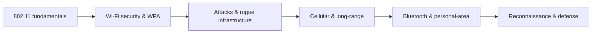

# 📶 Wireless Networking

> [!abstract] Wireless branch
> Wireless replaces the cable with a shared medium anyone within range can hear, which changes the threat model completely: there is no physical boundary to defend. This branch covers how radio networks work, how their security evolved from broken to strong, and the attacks that exploit the one thing wireless cannot hide — that its signal reaches beyond the wall.

## 🗺️ Zero-to-Mastery Learning Path

1. [[Wireless Fundamentals & 802.11]] — understand SSID, BSSID, channels, bands, and the shared-medium exposure
2. [[Wi-Fi Security & WPA]] — compare WPA2/WPA3 handshake security, PMKID capture, and 4-way auth
3. [[Wireless Attacks & Rogue Infrastructure]] — execute evil-twin, deauth, and captive-portal attacks against authorized targets
4. [[Cellular & Long-Range Wireless]] — overview LTE, 5G, LPWAN, and the IMSI-catcher/IMSI-catching attack class
5. [[Bluetooth & Personal-Area Networks]] — compare BR/EDR and BLE pairing models and the proximity attack surface
6. [[Wireless Reconnaissance & Defense]] — map RF landscape with airodump-ng; detect rogue APs and deauth events

---
> 🔼 Up: [[Networking]]
