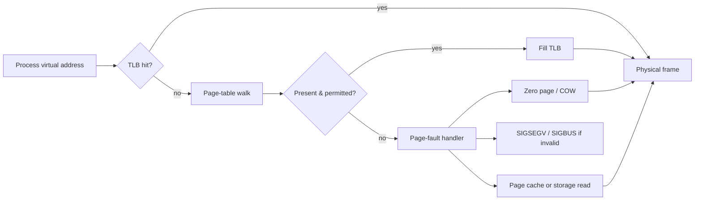

# 🧠 Linux Memory & Storage Internals

> [!abstract] Master Note of [[Linux]]
> Linux turns virtual addresses into physical pages and application writes into durable blocks through layered subsystems. Mastery means understanding caches, allocators, pressure, filesystems, volume mapping, encryption, and what “written” actually means after a crash.

## Parent Learning Order
Linux Introduction & Distributions -> Linux CLI & Core Commands -> Linux I-O Redirection & Piping -> Linux File System Hierarchy & Editors -> Linux Boot Process & systemd -> Linux Permissions & Process Management -> Linux Memory & Storage Internals -> Linux Networking, Transfers & Curl -> Linux Security Controls & Hardening -> Linux Observability, Logging & Forensics -> Linux Advanced Mechanics & Privilege Escalation -> Linux Kernel Internals -> Linux Documentation & Note-Taking

## Start from zero — working bytes versus persistent bytes

**Memory** is the fast working state used while instructions execute; **storage** is the durable medium expected to retain data across power loss. A process does not normally address physical RAM directly. It sees a private **virtual address space** divided into pages. The kernel and CPU translate virtual pages to physical page frames, create mappings on demand, and reclaim or move data under pressure. Storage is reached through filesystems and block devices rather than by ordinary applications choosing disk sectors.

Four similar words must remain distinct. A **page** is a fixed-size virtual-memory unit; a **frame** is its physical-RAM backing. A **cache** keeps a reusable copy to avoid slower work. A **buffer** temporarily holds data moving between components. A **filesystem** organizes persistent objects and metadata, while a **block layer** schedules requests to block-addressable devices. `free` reporting low unused RAM is not automatically a problem because Linux deliberately uses spare memory as cache.

Prerequisites are files, processes, binary units, and the difference between volatile and persistent data. Start by tracing one file read rather than memorizing tunables. Ask whether a byte currently exists in a process page, page cache, pending writeback, filesystem journal, device cache, or stable media; expert diagnosis depends on that exact state.

> [!tip] The analogy, and where it breaks
> A workshop with a small bench (RAM) and a large warehouse (disk), where recently used items stay on the bench and a stack of labelled boxes can be re-labelled into one long shelf. The analogy breaks at encryption and layering — the warehouse can be a stack of translations (partition, LVM, dm-crypt, filesystem) where each layer only sees the one below, so a failure at any level looks like corruption at the top.

## Virtual memory from process to DRAM

Each process sees a private virtual address space divided into mappings: executable text, data, heap, shared libraries, anonymous regions, thread stacks, and memory-mapped files. Page tables translate virtual page numbers to physical frames and carry access bits such as present, writable, executable, user, dirty, and accessed. The CPU's Translation Lookaside Buffer caches recent translations. A TLB miss triggers hardware page-table walking; a missing or protection-violating mapping raises a page fault and transfers control to the kernel.

A **minor fault** can be satisfied without storage I/O—for example, by allocating a zero-filled anonymous page or mapping an existing page-cache page. A **major fault** requires reading from storage. Demand paging avoids loading unused data. Copy-on-write lets parent and child initially share read-only pages after `fork`; a write fault allocates and copies only the changed page. Shared mappings intentionally reference common physical pages.



`/proc/<pid>/maps` lists ranges and permissions; `smaps` adds resident, proportional, anonymous, swap, huge-page, and sharing details. RSS is resident memory charged to a process but double-counts shared pages across processes. PSS apportions shared pages. Virtual size is address space, not physical consumption.

```shell-session
$ grep -E 'Vm(Size|RSS|Swap)|Threads' /proc/$$/status
VmSize:    10244 kB
VmRSS:      5160 kB
VmSwap:        0 kB
Threads:       1
$ /usr/bin/time -v sh -c 'dd if=/dev/zero of=/dev/null bs=1M count=64' 2>&1 | grep -E 'Maximum|page faults'
Maximum resident set size (kbytes): 1968
Minor (reclaiming a frame) page faults: 211
Major (requiring I/O) page faults: 0
```

**The deliberate break:** run `free -h` on a healthy Linux server and it will report almost no free memory. The reasonable conclusion — the box needs more RAM — is wrong often enough that it has its own website.

Most of what looks consumed is **page cache**: copies of file data the kernel is holding because the memory was otherwise idle, and which it will hand back the instant anything asks. Unused RAM is wasted RAM, so Linux deliberately fills it. The number that answers "am I short of memory" is the **`available`** column, which already accounts for what is reclaimable — not `free`.

**How you'd spot real pressure:** `available` approaching zero, swap actively being written, or `pgscan`/`pgsteal` climbing in `/proc/vmstat`. A full `free` column with healthy `available` is a working system, not a sick one.

## Physical allocation: buddy, SLUB & huge pages

The page allocator organizes free physical pages by order using the **buddy allocator**. Adjacent free buddies combine into larger power-of-two blocks; allocations split larger blocks as needed. Fragmentation can prevent high-order allocations even when total free memory appears sufficient. Zones represent addressing and device constraints, while NUMA nodes represent locality to CPU and memory controllers.

The kernel allocates many small objects—dentrites, inodes, task structures, sockets—through slab allocators. **SLUB** maintains object caches and per-CPU freelists to reduce locking and fragmentation. `/proc/slabinfo` and `slabtop` show cache usage. Security hardening can randomize freelists, initialize allocations, and add redzones or sanitizers at performance cost.

Transparent Huge Pages may combine mappings into larger pages, reducing TLB pressure but potentially increasing latency from compaction and copy-on-write. Explicit HugeTLB pages are reserved and managed separately. Workload measurement, not a universal rule, should drive configuration.

## Page cache, writeback & memory pressure

Regular file I/O normally passes through the page cache. A read may hit cached pages; otherwise the kernel schedules storage I/O and caches the result. A write usually dirties cached pages and returns before durable media commit. Background writeback later flushes them. `fsync` or `fdatasync` requests persistence for file data and required metadata, while directory `fsync` may be required to make rename/create operations durable. Device caches and barriers also affect guarantees.

Linux uses free memory as cache and reclaims it under pressure. `MemAvailable` is more useful than `MemFree`. Reclaim may drop clean cache, write dirty pages, compact memory, or swap anonymous pages. When allocation cannot be satisfied, the global or cgroup OOM killer selects a victim using badness scoring influenced by footprint and `oom_score_adj`.

```shell-session
$ free -h
               total        used        free      shared  buff/cache   available
Mem:            31Gi        8.2Gi       2.1Gi       410Mi        21Gi        22Gi
Swap:          4.0Gi       128Mi       3.9Gi
$ grep -E 'Dirty|Writeback|Cached|MemAvailable' /proc/meminfo
MemAvailable:   23100248 kB
Cached:         18602440 kB
Dirty:             32128 kB
Writeback:             0 kB
$ cat /proc/pressure/memory
some avg10=0.04 avg60=0.02 avg300=0.01 total=1442209
```

Do not clear caches as a routine tuning action. It destroys useful state and masks root causes. Diagnose working sets, reclaim, faults, I/O latency, cgroup limits, and application behavior.

## The block stack & device mapper

Applications issue filesystem operations; filesystems map logical file ranges to blocks; the block layer merges and schedules requests; device-mapper targets transform them; drivers submit commands to physical or virtual devices. LVM uses device mapper to combine physical volumes into volume groups and carve logical volumes. Snapshots use copy-on-write metadata and have capacity/performance implications. Multipath, thin provisioning, RAID, integrity, and encryption can all appear as stacked devices.

`dm-crypt` transforms sectors through a cipher. **LUKS** standardizes headers, keyslots, salts, KDF parameters, and metadata so multiple passphrases or tokens can unlock one volume key. The passphrase does not encrypt every sector directly; it derives a key-encryption key that unlocks protected key material. Header backups are sensitive and operationally vital. Encryption at rest does not protect data after the volume is unlocked or secrets exposed through applications, memory, logs, or backups.

```shell-session
$ lsblk -o NAME,TYPE,FSTYPE,SIZE,MOUNTPOINTS
nvme0n1          disk              477G
├─nvme0n1p1      part vfat         512M /boot/efi
├─nvme0n1p2      part ext4           2G /boot
└─nvme0n1p3      part crypto_LUKS 474G
  └─cryptroot    crypt LVM2_member 474G
    ├─vg-root    lvm  ext4         120G /
    └─vg-home    lvm  xfs          340G /home
$ sudo cryptsetup luksDump /dev/nvme0n1p3 | grep -E 'Version|PBKDF|Cipher'
Version:        2
Cipher:         aes-xts-plain64
PBKDF:          argon2id
```

## Filesystem behavior: ext4, XFS, Btrfs & OverlayFS

**ext4** uses extents, allocation groups, delayed allocation, and a journal for metadata consistency. Journal modes trade ordering and performance. **XFS** scales through allocation groups, extent-based metadata, delayed allocation, and sophisticated online operation; it requires its own repair workflow. **Btrfs** is copy-on-write, checksums data and metadata, supports subvolumes, snapshots, send/receive, compression, and integrated multi-device features. Copy-on-write changes fragmentation, free-space, and overwrite assumptions.

**OverlayFS** merges a read-only lower tree with writable upper and work directories. Containers use it for image layers. A file modified from a lower layer is copied up; deletion creates whiteout metadata. Forensic analysis must inspect all layers and mount configuration rather than only the merged view.

Filesystem journaling is not backup, and snapshots are not immutable unless protected. A journal aims for crash consistency, not recovery from deletion, corruption, compromise, or storage failure. Use independent, tested backups with retention and integrity validation.

```shell-session
$ findmnt -no SOURCE,FSTYPE,OPTIONS /
/dev/mapper/vg-root ext4 rw,relatime,errors=remount-ro
$ sudo filefrag -v /var/lib/app/database | sed -n '1,8p'
Filesystem type is: ef53
File size of /var/lib/app/database is 104857600 (25600 blocks of 4096 bytes)
 ext: logical_offset: physical_offset: length: expected: flags:
   0: 0..1023: 8810496..8811519: 1024:
$ sudo xfs_info /home | head -3
meta-data=/dev/mapper/vg-home isize=512 agcount=4, agsize=22282240 blks
```

## Troubleshooting memory & storage pressure

Begin with symptoms, not a single utilization percentage. For memory, compare `MemAvailable`, swap activity, page-fault rate, reclaim, cgroup limits, PSI, and OOM records. High page cache with healthy `MemAvailable` is normal. Repeated major faults and sustained memory PSI indicate workload stalls; a cgroup can be out of memory while the host still has free RAM. Identify the responsible allocation domain before tuning global virtual-memory settings.

For storage, separate capacity, inode exhaustion, latency, queueing, filesystem errors, and durability. `df -h` shows blocks, `df -i` shows inodes, `iostat -xz` shows device pressure, and `findmnt` identifies the stack. Kernel logs may reveal resets or filesystem remediation. Trace a mapped device through LVM, dm-crypt, multipath, and physical devices with `lsblk -o NAME,TYPE,FSTYPE,MOUNTPOINTS,PKNAME`.

```shell-session
$ cat /proc/pressure/memory
some avg10=12.40 avg60=8.31 avg300=2.77 total=98112203
full avg10=4.18 avg60=2.10 avg300=0.71 total=24300991
$ systemctl show api.service -p MemoryCurrent -p MemoryHigh -p MemoryMax
MemoryCurrent=510656512
MemoryHigh=536870912
MemoryMax=671088640
```

This points to service-local pressure approaching `MemoryHigh`; it does not justify dropping caches or adding swap blindly. Reproduce safely, correlate workload and writeback, change one limit or behavior, then verify latency and data integrity.

## NUMA, swap & encrypted-memory realities

On NUMA systems, memory latency depends on which CPU socket owns the page. The kernel attempts local allocation and may migrate pages or tasks, but poor affinity and oversized working sets create remote accesses. Inspect topology and policy with `numactl --hardware`, `numastat`, and `/proc/<pid>/numa_maps`. Pinning blindly can worsen balance; profile before applying CPU or memory bindings.

Swap extends anonymous-memory capacity and permits cold pages to leave DRAM. It can prevent abrupt OOM but adds latency and may place secrets on persistent media. Encrypted root usually protects a swap logical volume inside the encrypted mapping; standalone swap needs its own cryptographic design. Hibernation intentionally writes RAM to storage and requires a stable resume key/path, changing the threat model. `zram` keeps compressed swap in RAM, trading CPU for capacity without persistent plaintext.

```shell-session
$ swapon --show --output=NAME,TYPE,SIZE,USED,PRIO
NAME           TYPE SIZE USED PRIO
/dev/dm-2      part   4G 128M   -2
$ numactl --hardware | sed -n '1,8p'
available: 2 nodes (0-1)
node 0 cpus: 0 1 2 3 4 5 6 7
node 0 size: 16048 MB
node 1 cpus: 8 9 10 11 12 13 14 15
node 1 size: 16120 MB
```

Core dumps, hibernation, swap, crash dumps, and virtual-machine snapshots can each preserve memory secrets. Apply consistent encryption, access, retention, and destruction controls to every representation—not only the live process.

## Security implications

Memory can leak credentials through core dumps, swap, hibernation, use-after-free, or overbroad process inspection. Storage can lose confidentiality through unlocked volumes, copied LUKS headers, snapshots, discarded container layers, or unencrypted backups. Availability depends on cgroup limits, OOM policy, free-space monitoring, snapshot capacity, writeback health, and tested recovery. Never infer durability from a successful `write`; understand application `fsync`, filesystem guarantees, device caches, and failure domain.

## Summary

You should now be able to:

- distinguish virtual from resident memory, cache from free space, filesystem from block device, and encryption from authentication.
- diagnose faults, reclaim, PSI, OOM, writeback, filesystems, LVM, and LUKS using measured evidence.
- reason from page tables and allocators through page cache, journaling, device mapper, and durable storage semantics; design pressure controls, encrypted layouts, and recoverable backups.

---
> 🔼 Up: [[Linux]]
