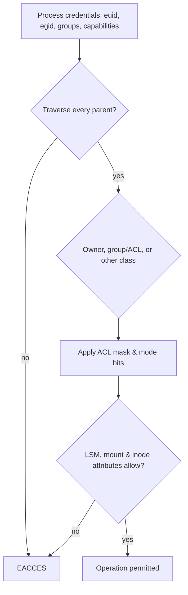

# 🔐 Linux Permissions & Process Management

> [!abstract] Master Note of [[Linux]]
> Permissions are the heart of Linux security — and the root of most privilege escalation. Processes are the system in motion. Control both and you control the box.

## Parent Learning Order
Linux Introduction & Distributions -> Linux CLI & Core Commands -> Linux I-O Redirection & Piping -> Linux File System Hierarchy & Editors -> Linux Boot Process & systemd -> Linux Permissions & Process Management -> Linux Memory & Storage Internals -> Linux Networking, Transfers & Curl -> Linux Security Controls & Hardening -> Linux Observability, Logging & Forensics -> Linux Advanced Mechanics & Privilege Escalation -> Linux Kernel Internals -> Linux Documentation & Note-Taking

## Start from zero — subject, object & requested action

Every access decision can be reduced to three questions: **who is asking**, **which object is targeted**, and **what operation is requested**. The asking subject is normally a process carrying a real and effective user ID, group IDs, supplementary groups, capabilities, and security labels. The object may be a file, directory, process, socket, device, or kernel interface. The action may be read, write, execute, traverse, signal, bind, mount, or administer.

A **program** is executable content stored somewhere; a **process** is one running instance with a PID, memory, credentials, open descriptors, and execution state. A user account does not directly read a file—the kernel evaluates the credentials of a process acting for that user. This distinction explains why changing group membership may require a new login and why SUID execution changes effective identity without changing the human operator.

Prerequisites are paths, users, groups, and binary notation. Begin with files you own in a temporary directory. For every experiment, record `id`, `ls -ld`, the attempted command, its exit status, and the exact error. Never use `chmod 777` or root as a diagnostic shortcut; those destroy the evidence needed to understand the failed authorization decision.

> [!tip] The analogy, and where it breaks
> Building passes with owner, department, and everyone-else access levels. The analogy breaks with SUID: a normal pass that temporarily grants the caretaker's authority for the duration of one specific task. No building would issue that, and it is exactly why SUID binaries are scrutinised so heavily — the escalation is designed in, and its safety depends entirely on the program behaving.

## Reading the permission string
`ls -l` shows a 10-character mode. Learn to read it at a glance:

![[lnx_permission_bits.svg]]

```
-rwxr-x---  1  alice  devs  4096  Jul 18  script.sh
│└┬┘└┬┘└┬┘      owner  group
│ │  │  └ others : ---   (no access)
│ │  └── group  : r-x   (read + execute)
│ └───── owner  : rwx   (read + write + execute)
└─────── type   : - file   d dir   l symlink   c/b device
```
Three triads — **owner / group / others** — each granting **r**ead, **w**rite, e**x**ecute. On a **directory**, `x` means "may enter/traverse" and `w` means "may create/delete files inside" (so write on a dir is powerful even without write on its files).

## Octal — the number every admin thinks in
Each permission is a bit: **r=4, w=2, x=1**. Add them per triad:
| Octal | Symbolic | Meaning |
| --- | --- | --- |
| `7` | `rwx` | read + write + execute |
| `6` | `rw-` | read + write |
| `5` | `r-x` | read + execute |
| `4` | `r--` | read only |
| `0` | `---` | nothing |

So `chmod 750` = owner `rwx` (7), group `r-x` (5), others `---` (0).

## chmod & chown
```shell-session
$ chmod 750 script.sh        # numeric (absolute)
$ chmod u+x,g-w,o-r file     # symbolic: +x owner, ‑w group, ‑r others
$ chmod +x exploit.sh        # make a script runnable
$ chmod -R 755 /var/www      # recursive
$ chown alice:devs file      # set owner:group   (root only)
$ chgrp devs file            # set group only
$ umask 027                  # default mask → new files 640, dirs 750
```
> [!danger] `chmod 777` is a finding
> "Everyone can read, write, and execute" is almost always a misconfiguration. A world-writable script run by root is a straight path to privilege escalation (see **Advanced Mechanics & PrivEsc**). Least privilege always.

## The special bits
Beyond `rwx`, three bits change *who/how* a program runs:
| Bit | Octal | Effect | In `ls -l` |
| --- | --- | --- | --- |
| **SUID** | `4000` | run as file **owner** (often root) | `-rwsr-xr-x` (`s` in owner-exec) |
| **SGID** | `2000` | run as file **group**; on a dir, new files inherit the group | `-rwxr-sr-x` |
| **Sticky** | `1000` | in a dir, only a file's **owner** can delete it (e.g. `/tmp`) | `drwxrwxrwt` (`t` in others-exec) |

SUID/SGID are the single most important Linux privesc concept — they get the full treatment (with exploitation) in **Advanced Mechanics & PrivEsc**. Here, just *recognise* the `s`: `-rwsr-xr-x` means SUID is set.

## Process management
A **process** is a running program with a **PID** and an owner. Managing them is core to both operating a box and hunting intruders.
```shell-session
$ ps aux                    # EVERY process: user, PID, %CPU/MEM, full command line
root  931  0.0  0.2  /usr/sbin/sshd -D
www   1440 2.1  1.0  /usr/sbin/apache2 -k start
$ ps -ef                    # alternate format, shows parent PID (PPID)
$ pstree -p                 # the process TREE with PIDs (see parent→child)
$ top          # or htop     # live, sorted resource view — q to quit
$ pgrep -af nginx           # find PIDs by name, with command line
```
`ps aux` is a recon goldmine — it reveals **services running as root** and can catch **credentials passed on a command line** (`mysql -u root -pS3cret`).

### Signals — how you talk to a process
`kill` sends a **signal**, not necessarily "death":
| Signal | Number | Effect |
| --- | --- | --- |
| `SIGTERM` | 15 | polite "please stop" (default) — allows cleanup |
| `SIGKILL` | 9 | forced, uncatchable kill — last resort |
| `SIGHUP` | 1 | hang-up — many daemons **reload config** on this |
| `SIGSTOP`/`SIGCONT` | 19/18 | pause / resume |

```shell-session
$ kill 24507                # SIGTERM by PID
$ kill -9 24507            # SIGKILL (force)
$ pkill -f suspicious.py    # kill by matched command line
$ killall firefox           # kill every process by exact name
```

### Job control & backgrounding
```shell-session
$ python3 -m http.server 8000 &   # start in background (&) → prints a job id
[1] 24507
$ jobs                            # list this shell's background jobs
$ fg %1                           # bring job 1 to the foreground
$ bg %1                           # resume a stopped job in the background
$ nohup ./long_scan.sh &          # keep running after you log out
$ disown -h %1                    # detach a job from the shell
```
Press **`Ctrl+Z`** to suspend the foreground job, then `bg` to continue it in the background — the everyday way to free your prompt without killing the task.

> [!tip] Crook → Root
> **Crook** reboots when something hangs. **Root** finds the offender with `ps aux | grep`, understands *why* it runs and as whom, and `kill`s precisely — or, on the blue-team side, spots the rogue process that shouldn't be there at all (a shell spawned by a web server is a red flag).

## Identity checks, ACLs & permission resolution

The kernel checks the process's effective credentials against the target inode. Root is powerful but not magical: capabilities, user namespaces, read-only mounts, immutable attributes, LSM policy, and filesystem support can still deny an operation. For ordinary mode bits, the kernel selects exactly one class—owner, matching group, or other—rather than combining classes. Supplementary groups come from the process credential set, not a fresh read of `/etc/group` on every access.

POSIX ACLs add named users and groups. The ACL **mask** limits all named users, named groups, and the owning group; `ls -l` shows a `+` when an ACL exists. Default ACLs on directories seed ACLs for new children.

```shell-session
$ setfacl -m u:analyst:r-- /srv/reports/q3.txt
$ getfacl /srv/reports/q3.txt
user::rw-
user:analyst:r--
group::---
mask::r--
other::---
$ namei -l /srv/reports/q3.txt
f: /srv/reports/q3.txt
drwxr-xr-x root root /
drwxr-xr-x root root srv
drwxr-x--- root audit reports
-rw-r----- root audit q3.txt
```

`namei -l` is invaluable because every directory component requires execute/traverse permission. A readable file remains inaccessible if the caller cannot traverse a parent directory. `umask` subtracts permissions from an application's requested mode; it cannot grant permissions the application did not request.



## Process anatomy, states & relationships

A process has a PID, parent PID, credential set, address space, open-descriptor table, signal dispositions, namespaces, cgroup membership, and scheduler state. Threads share most resources but each has a task ID and execution context. Common states shown by `ps` are `R` running/runnable, `S` interruptible sleep, `D` uninterruptible sleep, `T` stopped/traced, and `Z` zombie. A zombie has exited but its parent has not collected the status with `wait`; killing the zombie is meaningless—fix or terminate the parent.

```shell-session
$ ps -eo user,pid,ppid,stat,ni,etimes,cmd --forest | head
USER       PID  PPID STAT  NI ELAPSED CMD
root         1     0 Ss     0   84210 /sbin/init
root       812     1 Ss     0   84197 /usr/sbin/sshd -D
alice     4218   812 Ss     0    1220  \_ sshd: alice@pts/0
alice     4221  4218 S      0    1219      \_ -bash
$ tr '\0' ' ' </proc/4221/cmdline; echo
-bash
```

Linux exposes process details under `/proc/<pid>`. `status` gives credentials and capabilities; `fd/` reveals open files and sockets; `maps` shows mapped memory; `environ` may expose secrets if access controls permit. `lsof -p PID` joins descriptors to paths and network endpoints. Use these interfaces responsibly because inspection itself can expose credentials.

## Signals, sessions & reliable job control

Signals are asynchronous notifications. A process may catch or ignore most signals, but not `SIGKILL` or `SIGSTOP`. `SIGCHLD` tells a parent that a child changed state. `SIGINT` usually comes from `Ctrl+C`; `SIGTSTP` from `Ctrl+Z`. A process group lets the terminal deliver signals to an entire foreground pipeline. Sessions and controlling terminals explain why some jobs receive `SIGHUP` when SSH disconnects.

Use the least disruptive signal first and verify state after each step:

```shell-session
$ kill -TERM 4218
$ timeout 5 tail --pid=4218 -f /dev/null || kill -KILL 4218
$ ps -p 4218 -o pid,stat,cmd
  PID STAT CMD
```

`nice` influences CPU scheduling priority; `ionice` influences I/O class. It does not replace cgroup resource controls. A process stuck in `D` state often waits on storage or network filesystem I/O and will not react to `SIGKILL` until the kernel operation returns.

## systemd units as process policy

systemd starts services in cgroups and applies dependencies, restart policy, environment, credentials, namespaces, capabilities, and sandboxing. A unit is declarative process supervision—not merely a startup script. Inspect the effective definition, including drop-ins, before editing:

```shell-session
$ systemctl cat ssh.service
$ systemctl show ssh.service -p User -p Group -p MainPID -p ControlGroup
User=
Group=
MainPID=812
ControlGroup=/system.slice/ssh.service
$ systemd-analyze security ssh.service | head
  NAME                    DESCRIPTION                         EXPOSURE
✗ PrivateNetwork=         Service has access to host network     0.5
```

After creating a drop-in with `systemctl edit`, run `systemd-analyze verify`, then `daemon-reload` and restart only in an approved maintenance window. Hardening directives include `NoNewPrivileges=yes`, `PrivateTmp=yes`, `ProtectSystem=strict`, `ProtectHome=read-only`, `RestrictAddressFamilies=`, `CapabilityBoundingSet=`, and `SystemCallFilter=`. Validate application needs; aggressive settings can break services.

## Troubleshooting authorization & process failures

For access failures, capture the process identity with `id` and `/proc/<pid>/status`, then walk the path with `namei -l`. Inspect mode bits, ACL mask, ownership, mount options, immutable attributes, capabilities, and LSM denials in that order. A process may retain old supplementary groups until it starts a new login session. A container's UID may map to a different host UID, so compare `/proc/<pid>/uid_map` before concluding that numeric identity means the same principal.

For process failures, identify state before sending signals. High CPU (`R`) calls for stack or profile evidence; uninterruptible sleep (`D`) usually indicates a kernel or I/O wait that `SIGKILL` cannot resolve immediately; stopped (`T`) tasks may be job-controlled or traced; zombies (`Z`) require the parent to reap them. Inspect PPID, elapsed time, wait channel, descriptors, cgroup, service unit, and recent logs.

```shell-session
$ ps -o pid,ppid,user,stat,wchan:24,cmd -p 4812
  PID  PPID USER STAT WCHAN                    CMD
 4812     1 app  D    wait_on_page_writeback   /usr/local/bin/worker
$ cat /proc/4812/cgroup; systemctl status 4812 --no-pager
0::/system.slice/worker.service
```

Do not escalate from `TERM` to `KILL` automatically. First determine whether systemd will restart the process, whether data is being committed, and whether a blocked dependency—not the process itself—is the actual fault.

## Hands-On Lab: Modes, SUID & Signals You Can Watch

> [!info] Runs on any Linux machine — the SUID step uses a copy in `/tmp`, never a system binary
> Nothing outside `/tmp/perm-lab` is modified. Step 6 removes it all.

### Step 1 — Read and change a mode

```bash
mkdir -p /tmp/perm-lab && cd /tmp/perm-lab
echo secret > data.txt && chmod 640 data.txt && ls -l data.txt
stat -c '%A  %a  owner=%U group=%G' data.txt
```

```text
-rw-r----- 1 you you 7 Aug  4 16:40 data.txt
-rw-r-----  640  owner=you group=you
```

The three triads are owner / group / other. `640` = owner read+write (6), group read (4), other nothing (0). Prove the last digit matters:

```bash
chmod 604 data.txt; sudo -u nobody cat data.txt 2>&1
chmod 640 data.txt; sudo -u nobody cat data.txt 2>&1
```

```text
secret
cat: data.txt: Permission denied
```

One digit decided whether an unrelated user could read the file.

### Step 2 — Directory `x` is permission to *traverse*, not to list

```bash
mkdir -p dir/inner && echo hi > dir/inner/file.txt
chmod 644 dir            # readable, but NOT executable
sudo -u nobody ls dir 2>&1
sudo -u nobody cat dir/inner/file.txt 2>&1
```

```text
inner
cat: dir/inner/file.txt: Permission denied
```

`nobody` can **list** the directory but cannot **enter** it. On a directory, `r` lets you see names and `x` lets you pass through — which is why a file with permissive mode can still be unreachable, and why `namei -l` is the right diagnostic.

```bash
chmod 755 dir; sudo -u nobody cat dir/inner/file.txt 2>&1
```

```text
hi
```

### Step 3 — Watch SUID actually change identity

```bash
cp /usr/bin/id ./myid && sudo chown root:root myid && sudo chmod 4755 myid
ls -l myid | cut -c1-11
./myid -u                # real user
./myid -u -r 2>/dev/null || true
id -u
```

```text
-rwsr-xr-x
0
1000
1000
```

The `s` in `-rwsr-xr-x` is the SUID bit. Running `./myid -u` reports **0 (root)** even though you are user 1000 — the process took the *file owner's* identity. This is the mechanism behind legitimate tools like `passwd`, and the reason any writable or misused SUID binary is a privilege-escalation path.

### Step 4 — Signals, watched live

```bash
sleep 300 & PID=$!
grep State /proc/$PID/status
kill -STOP $PID; sleep 1; grep State /proc/$PID/status
kill -CONT $PID; sleep 1; grep State /proc/$PID/status
```

```text
State:	S (sleeping)
State:	T (stopped)
State:	S (sleeping)
```

`SIGSTOP` froze the process and `SIGCONT` resumed it — the state letter is the kernel's own view. Now the distinction that matters:

```bash
kill -TERM $PID; sleep 1; ps -p $PID >/dev/null 2>&1 && echo "still alive" || echo "terminated"
```

```text
terminated
```

`SIGTERM` **asks** a process to exit and can be caught or ignored; `SIGKILL` cannot be caught but gives the process no chance to clean up. Reach for TERM first.

### Step 5 — See process lineage

```bash
sleep 200 & CH=$!
ps -o pid,ppid,user,stat,comm -p $CH
ps -o pid,comm -p $(ps -o ppid= -p $CH | tr -d ' ')
```

```text
    PID    PPID USER     STAT COMMAND
  21903   21455 you      S    sleep
    PID COMMAND
  21455 bash
```

Every process records its **parent**, which is how an investigator reconstructs "what launched this" — the single most useful question when a suspicious process appears.

### Step 6 — Cleanup

```bash
kill %1 %2 2>/dev/null; wait 2>/dev/null
cd /tmp && sudo rm -rf /tmp/perm-lab && ls -d /tmp/perm-lab 2>&1
```

```text
ls: cannot access '/tmp/perm-lab': No such file or directory
```

`sudo` is required because Step 3 created a root-owned SUID file. Removing it matters — a stray SUID binary is exactly the artifact you should never leave behind.

**What you should now be able to do:** explain directory `x` versus `r` from your own denial, describe what SUID changed about your identity, and choose TERM over KILL with a reason.

## Security implications

Permission failures are layered decisions, not an invitation to disable controls. World-writable directories without sticky bit, privileged services with writable units, inherited ACL mistakes, secrets in process arguments, and excessive service capabilities create real compromise paths. Defenders should reason from credentials through path traversal, mode/ACL, mount, capability, and LSM checks. Operators should preserve process lineage and use scoped service sandboxing instead of blanket privilege.

### Crook → Operator → Root checkpoint

- **Crook:** read symbolic/octal permissions, manage jobs, and use signals safely.
- **Operator:** diagnose ACL and traversal behavior, inspect `/proc`, understand states and lineage, and manage systemd units with validation.
- **Root:** model the complete access decision, explain sessions/process groups and uninterruptible sleep, and design least-privileged, resource-controlled service execution.

---
> 🔼 Up: [[Linux]]
