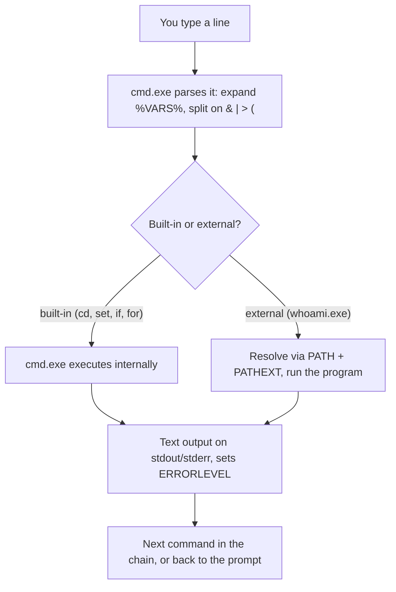

# 🪟 Windows Command Prompt & Batch

> [!abstract] Note of [[Windows]]
> `cmd.exe` is the classic Windows command interpreter: a text-oriented shell that runs native utilities and batch scripts. It is old, quirky, and still indispensable — it works in recovery consoles, minimal installs, and constrained systems where nothing else is available. This note starts from "what is a command prompt" and ends at the parsing internals and injection classes that make batch a security-relevant skill.

> [!warning] Authorized use only
> Run these commands only on systems you own or are explicitly authorized to manage. Prefer disposable labs, least privilege, read-only forms, and explicit cleanup of any files you create.

## Parent Learning Order
Windows Architecture & Kernel -> Windows Memory Internals & Exploit Mitigations -> Windows Drivers I-O & Kernel Debugging -> Windows Processes, Services & Boot -> Windows File System & Registry -> Windows Networking Internals -> Windows Security & Access Control -> Windows Identity, Credentials & Authentication -> Windows Active Directory & Domains -> Windows Command Prompt & Batch -> Windows PowerShell -> Windows Logging & Auditing -> Windows Diagnostics, Crash Dumps & Performance -> Windows Sysinternals & Troubleshooting

## Start at Zero: What a Command Prompt Is

A **shell** is a program that reads text you type, figures out what command you meant, runs it, and shows you the result. The **Command Prompt** — the program `cmd.exe` — is the traditional Windows shell. When you open it you see a **prompt** like `C:\Users\you>` followed by a blinking cursor waiting for a command.

Open one by pressing `Win+R`, typing `cmd`, and pressing Enter. You now have a window where you type one command per line. Try the three commands every beginner should know first:

```cmd
whoami
cd
dir
```

- `whoami` prints who you are logged in as (e.g. `win-lab01\analyst`).
- `cd` with no argument prints the **current directory** — where you "are" in the filesystem.
- `dir` lists the files and folders in that directory.

That is the entire loop: you are somewhere in the filesystem, you type a command, it acts (often relative to where you are), and it prints text. Everything else is vocabulary and grammar on top of this.

One concept to grasp immediately: a command is either **built into `cmd.exe`** or is a **separate program** on disk. `cd`, `dir`, `set`, `echo`, and `if` are built in — they only exist inside the shell. `whoami`, `ping`, and `ipconfig` are separate `.exe` files the shell finds and runs. This distinction explains confusing errors later, so hold onto it.

> [!tip] The analogy, and where it breaks
> Writing instructions for someone who reads the whole page aloud before starting, substituting every name they see at that moment — which is why a value you change halfway down was already fixed when the page was read. The analogy breaks because you can explicitly ask for the live value instead (`!VAR!`), an option no reader-aloud offers, and forgetting to ask for it is the single most common batch bug.

## Orienting on a Host

CMD's enduring value is fast host orientation with tools that are always present. These read state and are safe to run:

| Command | What it reveals |
| --- | --- |
| `whoami /all` | your user, groups, **privileges**, and SID |
| `systeminfo` | OS version, build, and installed hotfixes |
| `ipconfig /all` · `arp -a` | addresses, DNS, domain, link-layer neighbours |
| `net user` · `net localgroup administrators` | local accounts and who is an admin |
| `netstat -abon` | active connections with the owning process ID |
| `sc query` · `tasklist /v` | services and running processes |

```cmd
whoami /priv
```

Expected excerpt:

```text
PRIVILEGES INFORMATION
----------------------
Privilege Name                Description                    State
============================= ============================== =======
SeChangeNotifyPrivilege       Bypass traverse checking       Enabled
SeShutdownPrivilege           Shut down the system           Disabled
```

Reading privileges matters because some of them (for example the impersonation privileges) are the difference between an ordinary account and one that can be leveraged toward higher access. The command *reads* your token; it changes nothing.

## How CMD Parses a Line

CMD's grammar is unlike a Unix shell and unlike PowerShell, and misunderstanding it is the source of most batch bugs.

- `%NAME%` expands an environment variable **while the line is parsed**.
- `^` escapes the next special character.
- `&` runs one command then the next; `&&` runs the next only if the first **succeeded**; `||` runs the next only if the first **failed**.
- `|` connects one command's text output to the next command's input.
- `>` sends output to a file (truncating it); `>>` appends; `2>` redirects error output.
- `(` `)` group commands, which introduces expansion subtleties covered below.

```cmd
echo Start && whoami > "%TEMP%\me.txt" 2>&1 && echo Wrote file || echo Something failed
```

This chains four ideas: run `echo`, then on success write `whoami` output (and its errors, via `2>&1`) to a file in the temp directory, then report success — or report failure if any step failed. The `%TEMP%` expands to your per-user temp folder as the line is parsed.

### The redirection-order trap

Order matters in a way that catches everyone once:

```cmd
command 2>&1 >file      REM stderr goes to the OLD stdout (the console), then stdout goes to file
command >file 2>&1      REM stdout goes to file, THEN stderr follows stdout to the file
```

Only the second form captures both streams into the file. `2>&1` means "make stderr point at wherever stdout points *right now*," so it must come **after** the `>file` redirection. This single ordering rule explains countless "my log is missing the errors" incidents.

## Variables, Expansion, and the Delayed-Expansion Gotcha

`set NAME=value` creates a variable. The trap is that `%NAME%` is expanded when a **whole compound command is parsed**, not when each line runs — so inside a parenthesized block, every `%VAR%` is frozen to its value at the moment the block was read.

```cmd
@echo off
setlocal EnableDelayedExpansion
set COUNT=0
for %%F in (a b c) do (
    set /a COUNT+=1
    echo Frozen: %COUNT%   Live: !COUNT!
)
endlocal
```

Expected output:

```text
Frozen: 0   Live: 1
Frozen: 0   Live: 2
Frozen: 0   Live: 3
```

`%COUNT%` stays `0` because the block was parsed once with `COUNT=0`. `!COUNT!` uses **delayed expansion**, evaluated as each iteration runs, so it shows the live value. Any batch script that counts, accumulates, or builds strings inside a loop needs `setlocal EnableDelayedExpansion` — and must then be careful that literal `!` characters in data are not misread.

## The `for` Command and Batch Control Flow

`for` is CMD's workhorse, with several modes:

- `for %%F in (...)` iterates values or wildcard matches.
- `for /d` iterates directories, `for /r` walks a tree recursively.
- `for /l %%N in (start,step,end)` produces a numeric sequence.
- `for /f` parses lines from files, strings, or **command output**.

Note the doubled percent: interactive use is `%F`, but inside a `.bat`/`.cmd` file it must be `%%F`.

```cmd
@echo off
setlocal
for /f "usebackq tokens=1,* delims=:" %%A in (`sc.exe query state^= all ^| findstr /b /c:"SERVICE_NAME"`) do (
    echo Service:%%B
)
endlocal
```

`for /f` runs the backtick command in another CMD parse, which is why the `=` and `|` inside it must be escaped with `^`. This nesting of parsers is exactly where batch becomes error-prone and where injected data can change meaning.

Conditionals and subroutines complete the language:

```cmd
@echo off
setlocal
if "%~1"=="" (echo Usage: %~nx0 PATH & exit /b 64)
if not exist "%~1" (echo Not found: %~1 & exit /b 2)
echo FullPath=%~f1  Name=%~nx1  Size=%~z1 bytes
exit /b 0
```

`%~1` strips quotes from the first argument; `%~f1` is its full path, `%~nx1` its filename, `%~z1` its size. `exit /b N` returns a meaningful code. `if errorlevel N` means "greater than or equal to N," so test descending or compare `%ERRORLEVEL%` explicitly.



## Command Resolution and Shell State

Because commands are either built-in or external, diagnosing "command not found" requires knowing which you have:

```cmd
where whoami
help cd
echo %COMSPEC%
```

`where whoami` finds `C:\Windows\System32\whoami.exe` because it is a real program. `where cd` finds **nothing** — `cd` is built into `cmd.exe`, so `help cd` documents it instead. External programs resolve through the current directory and `PATH`, using extensions from `PATHEXT` (`.COM`, `.EXE`, `.BAT`, `.CMD`). Always confirm the resolved executable before using an ambiguous name in privileged automation, because a same-named program earlier in `PATH` or in the current directory can be run instead of the one you intended.

The shell tracks a current directory **per drive**: `D:` switches drive but keeps that drive's remembered directory, whereas `cd /d D:\Evidence` changes both at once. `pushd`/`popd` save and restore locations and can even map a UNC path to a temporary drive letter.

## Reliable Batch Automation and Native Command Families

For dependable scripts:

1. Start with `@echo off`, `setlocal`, and explicit argument validation.
2. Quote assignments as `set "NAME=value"` so trailing spaces do not leak in.
3. Use absolute paths for security-sensitive executables.
4. Capture `%ERRORLEVEL%` **immediately** — the next command overwrites it.
5. Interpret exit codes correctly (robocopy uses a bit field; values under 8 are success-with-differences, not failure).
6. Return meaningful codes with `exit /b N` and clean up temporary files explicitly.

The native families worth knowing, all available when PowerShell modules are not:

| Purpose | Commands |
| --- | --- |
| Identity | `whoami`, `net user`, `net localgroup`, `klist` |
| Processes/services | `tasklist`, `taskkill`, `sc.exe`, `net start` |
| Tasks | `schtasks.exe` |
| Network | `ipconfig`, `route`, `arp`, `netstat`, `nslookup`, `netsh` |
| Events/registry | `wevtutil`, `reg.exe` |
| Permissions | `icacls`, `takeown`, `whoami /priv` |
| Boot/repair | `bcdedit`, `dism`, `sfc`, `reagentc` |

```cmd
sc.exe qc EventLog
```

Expected excerpt:

```text
SERVICE_NAME: EventLog
        TYPE               : 20  WIN32_SHARE_PROCESS
        START_TYPE         : 2   AUTO_START
        SERVICE_START_NAME : NT AUTHORITY\LocalService
```

## Failure Modes and Troubleshooting

- **Log is missing errors** → the `2>&1` came before `>file`. Reorder so redirection of stdout precedes it.
- **Counter stuck at its initial value** → you used `%VAR%` inside a parenthesized block without delayed expansion; switch to `!VAR!` with `setlocal EnableDelayedExpansion`.
- **`for /f` output empty or truncated** → unescaped `|`/`=`/`>` inside the backtick command, or wrong `tokens=`/`delims=`. Escape metacharacters with `^` and check the parsing options.
- **Wrong program runs** → an executable of the same name is earlier in `PATH` or in the current directory. Verify with `where` and use absolute paths.
- **Garbled non-ASCII output** → console code page mismatch. `chcp` reports it, but it cannot force every program's encoding; redirected output may differ from console output.
- **`if errorlevel 1` behaves oddly** → remember it means "≥ 1"; compare `%ERRORLEVEL%` explicitly when you need equality.

## Security Implications

**Command lines encode intent, and that makes them both evidence and attack surface.** Defensive analysts watch process creation for suspicious `cmd.exe` invocations — encoded arguments, chained utilities, output redirected to unusual paths — but string matching alone is weak, so it is correlated with process ancestry, user token, and file writes.

**Batch is prone to injection when untrusted data is concatenated into a command.** Because CMD re-expands and re-parses in several places (compound lines, `for /f` backticks, delayed expansion), a filename or variable containing `&`, `|`, `%`, or `!` can change what actually executes. The defense is the same principle as everywhere in this vault: never concatenate untrusted text into a command expression. Quote expansions, canonicalize paths with `%~f` modifiers, and validate arguments before use.

**Quoting is genuinely hard because Windows passes a single command-line string**, not an argument array — `CreateProcess` gives the new process one string, and each runtime (the C runtime, `cmd`, MSI, scheduled tasks) splits it by its own rules. A security review must test the *actual* consumer rather than assume one universal escaping algorithm.

**CMD is a favourite of "living off the land"** because its utilities are always present and trusted. `certutil` can download files, `bcdedit` can weaken boot integrity, `reg` can alter security-relevant keys, and `wevtutil cl` can clear logs. Each is legitimate for administration and abusable for intrusion, which is why their use is worth logging and baselining rather than blocking outright.

## Hands-On Lab: The Three Batch Mistakes Everyone Makes Once

> [!info] Runs on any Windows machine — creates files under `%TEMP%\cmdlab`, removed in Step 6
> Every command is complete. Paste them into a Command Prompt window in order.

### Step 1 — A sandbox and the exit-code habit

```cmd
mkdir "%TEMP%\cmdlab" & cd /d "%TEMP%\cmdlab"
whoami & echo exit code: %ERRORLEVEL%
```

```text
win-lab01\analyst
exit code: 0
```

`%ERRORLEVEL%` is the variable every batch decision branches on — `0` means success. Capture it **immediately**, because the very next command overwrites it.

### Step 2 — The redirection-order trap

```cmd
dir nosuchfile.txt 2>&1 > wrong.txt & echo --- wrong.txt --- & type wrong.txt
dir nosuchfile.txt > right.txt 2>&1 & echo --- right.txt --- & type right.txt
```

```text
File Not Found
--- wrong.txt ---
 Volume in drive C has no label.
--- right.txt ---
File Not Found
```

Identical-looking syntax, different result. In `wrong.txt` the error went to the console because `2>&1` was aimed at stdout **before** stdout was redirected. `2>&1` must come **after** `>file`. This one rule explains most "my log is missing the errors" bugs.

### Step 3 — The delayed-expansion trap

```cmd
setlocal EnableDelayedExpansion
set COUNT=0
for %F in (a b c) do (
    set /a COUNT+=1
    echo Frozen: %COUNT%   Live: !COUNT!
)
```

```text
Frozen: 0   Live: 1
Frozen: 0   Live: 2
Frozen: 0   Live: 3
```

`%COUNT%` is stuck at `0` because the whole parenthesized block was parsed once, freezing every `%VAR%`. `!COUNT!` uses delayed expansion, evaluated as each line runs. Any loop that counts or accumulates needs this.

### Step 4 — Parse command output with `for /f`

```cmd
for /f "tokens=2 delims=:" %A in ('findstr /c:"SERVICE_NAME" ^< nul 2^>nul ^& sc query eventlog ^| findstr STATE') do echo State token:%A
sc query eventlog | findstr /c:"STATE"
```

```text
State token: 4  RUNNING
        STATE              : 4  RUNNING
```

`for /f` runs the command in another CMD parse, which is why `|`, `<`, `&` inside it must be escaped with `^`. That nested parsing is where batch becomes fragile and where injected data can change meaning.

### Step 5 — A validated mini-script

```cmd
(echo @echo off
echo if "%%~1"=="" ^(echo Usage: %%~nx0 NAME ^& exit /b 64^)
echo echo Hello %%~1 from %%COMPUTERNAME%%
echo exit /b 0) > greet.cmd
call greet.cmd
call greet.cmd World
```

```text
Usage: greet.cmd NAME
Hello World from WIN-LAB01
```

Called with no argument it exits with code 64 and a usage message; with an argument it works. Argument validation is the difference between a script and a foot-gun.

### Step 6 — Cleanup

```cmd
cd /d "%TEMP%" & rmdir /s /q "%TEMP%\cmdlab" & if exist "%TEMP%\cmdlab" (echo still there) else (echo removed)
```

```text
removed
```

Note `cd /d "%TEMP%"` first — you cannot remove the directory you are standing in.

**What you should now be able to do:** explain why `2>&1 >file` and `>file 2>&1` differ, why a loop counter needs delayed expansion, and why `for /f` requires escaping.

## Crook → Operator → Root Checkpoint

- **Crook:** Open a Command Prompt, explain what the prompt and current directory mean, run `whoami`/`cd`/`dir`, and state the difference between a built-in and an external command.
- **Operator:** Chain commands with `&&`/`||`, redirect both streams correctly, write a validated batch script with `for` loops and delayed expansion, and diagnose the common parsing and encoding failures.
- **Root:** Explain why Windows' single-command-line model makes quoting parser-dependent, how re-expansion in compound lines and `for /f` enables batch injection, and why native utilities are both administration tools and living-off-the-land tradecraft that must be logged rather than trusted.

---
> 🔼 Up: [[Windows]]
