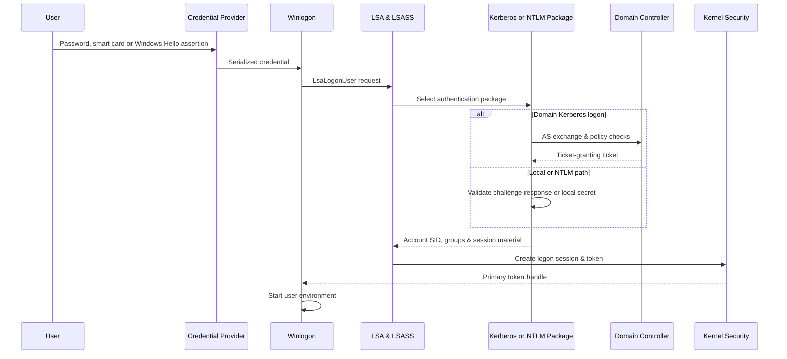

# 🪟 Windows Identity Credentials & Authentication

> [!abstract] Note of [[Windows]]
> Windows identity begins with principals and credentials, becomes a logon session inside LSA, and reaches applications as tokens, tickets, challenge-response material, certificates, and protected secrets. This note separates authentication from authorization and follows each major credential path.

## Parent Learning Order
Windows Architecture & Kernel -> Windows Memory Internals & Exploit Mitigations -> Windows Drivers I-O & Kernel Debugging -> Windows Processes, Services & Boot -> Windows File System & Registry -> Windows Networking Internals -> Windows Security & Access Control -> Windows Identity, Credentials & Authentication -> Windows Active Directory & Domains -> Windows Command Prompt & Batch -> Windows PowerShell -> Windows Logging & Auditing -> Windows Diagnostics, Crash Dumps & Performance -> Windows Sysinternals & Troubleshooting

## Start at Zero: Identity Is Not a Password

An **identity** is a principal the system can name; a **credential** is evidence used to authenticate it; a **logon session** is local state created after authentication; and a **token** carries authorization data to access checks. Passwords are only one credential form alongside keys, certificates, PIN-backed keys, and federated assertions. Authentication proves or asserts who initiated a session. Authorization separately decides what that session may do. Keeping these stages separate makes Kerberos tickets, NTLM challenge-response, DPAPI protection, Windows Hello, and access tokens much easier to reason about.

> [!tip] The analogy, and where it breaks
> A ticket office that issues time-limited passes so you never hand your master password to each department. The analogy breaks in where the danger sits: the ticket office keeps working material in memory, so an attacker with sufficient access on that machine may steal *tickets* rather than passwords — which is why credential theft is about protecting a running process, not just choosing a strong password.

## Principals, Authorities & Logon Sessions

A principal is identified by a Security Identifier rather than a display name. Local accounts are governed by the local Security Accounts Manager; domain accounts are governed by Active Directory. The Local Security Authority coordinates logon policy and authentication packages. `lsass.exe` hosts major LSA functionality in user mode, while kernel security mechanisms enforce resulting access decisions.

An interactive logon begins with a credential provider collecting a secret or assertion. Winlogon passes the serialized material to LSA, which selects an authentication package. Successful authentication creates an LSA logon session identified by a locally unique identifier and yields an access token. The token contains user and group SIDs, privileges, integrity information, restrictions, and default security state. Applications receive handles to tokens, not the user's plaintext password.



Logon types describe how credentials entered the system: interactive, network, batch, service, unlock, remote interactive, cached interactive, and others. A network logon generally does not create the same reusable local credential state as an interactive session. Understanding logon type prevents simplistic conclusions such as “Event 4624 always means someone opened a desktop.”

```powershell
whoami /user
whoami /groups
whoami /priv
klist sessions
```

Expected excerpt:

```text
USER INFORMATION
User Name           SID
=================== =============================================
CORP\analyst        S-1-5-21-111111111-222222222-333333333-1107

Privilege Name                State
============================= ========
SeChangeNotifyPrivilege       Enabled
SeIncreaseWorkingSetPrivilege Disabled
```

## Local Secrets: SAM, LSA & Cached Logons

The SAM database stores local account verifier material, including NT password hashes, protected using system secrets. It does not normally store recoverable plaintext passwords. The SYSTEM hive contributes boot-key material required to protect local secrets. The SECURITY hive contains LSA policy data and secrets used by services or the system. ACLs and exclusive locks protect these live hives, while backup and recovery mechanisms require equivalent protection because copied hives retain sensitive material.

Domain-joined systems can cache domain logon verifiers so users can sign in while a controller is unavailable. These cached values are deliberately slow verifier material rather than reusable NT hashes, but weak passwords remain vulnerable to offline guessing. Local Administrator Password Solution policies reduce shared local-administrator password reuse by maintaining unique managed secrets with controlled retrieval and auditing.

## Kerberos Mechanics

Kerberos provides mutual authentication using tickets and symmetric cryptography. The Authentication Service exchange issues a ticket-granting ticket. The Ticket Granting Service exchange uses that TGT to request a service ticket for an SPN. The client presents the service ticket in an application exchange. Authenticators include timestamps to resist replay, making reliable time and service identity essential.

The TGT is encrypted for the `krbtgt` account so clients cannot alter its authorization data. A service ticket is encrypted for the target service account or computer account. The Privilege Attribute Certificate carries authorization claims signed by the domain. Delegation allows services to act for users under controlled conditions, but unconstrained or carelessly configured delegation expands credential exposure.

```powershell
klist
```

Expected excerpt:

```text
Current LogonId is 0:0x8a351
Cached Tickets: (2)
#0> Client: analyst @ CORP.EXAMPLE
    Server: krbtgt/CORP.EXAMPLE @ CORP.EXAMPLE
    KerbTicket Encryption Type: AES-256-CTS-HMAC-SHA1-96
#1> Server: cifs/files01.corp.example @ CORP.EXAMPLE
```

Service accounts need strong, managed secrets because service-ticket material can be requested by authenticated users and tested offline. Group Managed Service Accounts replace human-managed static passwords with automatically rotated high-entropy secrets. AES should be preferred where the environment supports it; legacy RC4 exposure often reflects old account configuration or compatibility debt.

## NTLM Challenge Response

NTLM authenticates by proving knowledge of a password-derived key without transmitting the password. The server provides a challenge; the client computes a response using credential-derived material and negotiated context. NTLMv2 binds additional values such as target information and timestamp into the response, but it still lacks Kerberos's service-ticket model and can be relayed when channel binding, signing, or protocol protections are absent.

Pass-the-hash works because certain NTLM operations accept proof derived from the NT hash; the plaintext is not always necessary. Relay differs: an adversary forwards a live authentication exchange to another service rather than cracking or reusing the hash directly. SMB signing, Extended Protection for Authentication, LDAP signing and channel binding, disabling unnecessary NTLM, and preventing coercion paths reduce this risk.

## DPAPI, Windows Hello & Credential Guard

Data Protection API lets applications protect secrets using keys tied to a user or machine. User master keys are protected by credentials and stored in the profile; domain backup keys can enable enterprise recovery. Browser secrets, saved credentials, certificates, wireless profiles, and application tokens may rely on DPAPI. Security therefore depends on who can access the ciphertext, the user's key material, and any recovery authority—not on the API name alone.

Windows Hello for Business replaces reusable password authentication with asymmetric keys protected by TPM hardware and user gesture. The verifier receives proof from a key rather than a password-equivalent secret. Credential Guard uses VBS to isolate selected credential material in `LsaIso`, reducing what a normal kernel or LSASS memory read can recover. LSA protection runs LSASS as a protected process and restricts untrusted code from opening or loading into it. These controls complement one another but do not protect credentials voluntarily entered into an untrusted application.

```powershell
Get-CimInstance -ClassName Win32_DeviceGuard -Namespace root\Microsoft\Windows\DeviceGuard |
  Select-Object VirtualizationBasedSecurityStatus,SecurityServicesRunning
Get-ItemProperty 'HKLM:\SYSTEM\CurrentControlSet\Control\Lsa' -Name RunAsPPL -ErrorAction SilentlyContinue
```

Expected pattern on a hardened lab:

```text
VirtualizationBasedSecurityStatus : 2
SecurityServicesRunning           : {1, 2}
RunAsPPL                           : 1
```

## CloudAP, Web Authentication & Modern Credential Paths

Hybrid Windows endpoints add authentication paths beyond classic Kerberos and NTLM. **CloudAP** is an LSA authentication package involved in Microsoft Entra joined and hybrid-joined sign-in. After suitable authentication, the device can maintain a Primary Refresh Token–based session used to obtain cloud access tokens under policy. The PRT is not simply a reusable bearer string stored beside a password; its use is bound to protected key material, device state, account state, and token-broker workflows. Investigation must distinguish local logon, domain ticketing, cloud token acquisition, and application single sign-on.

**Windows Hello for Business** replaces routine password presentation with asymmetric credentials protected by TPM or software-backed keys. A PIN unlocks a local key; it is not transmitted as the domain password. **WebAuthn/FIDO2** uses origin-bound public-key credentials and a signed challenge, resisting credential replay to a lookalike origin. Registration, recovery, attestation, and fallback authentication remain part of the threat model.

Useful read-only context includes join state and ticket state:

```cmd
dsregcmd /status
klist
```

```text
AzureAdJoined : YES
DomainJoined  : YES
AzureAdPrt    : YES
```

Experts correlate these outputs with device identity, TPM health, Conditional Access, sign-in records, and local logon events rather than treating “PRT present” as proof of either compromise or health.

## Cybersecurity Implications

Credential exposure is a lifecycle problem. Secrets can appear during collection, authentication, delegation, caching, application storage, backup, recovery, and administrative troubleshooting. Hardening prioritizes phishing-resistant authentication, unique managed service secrets, minimal interactive logons on sensitive systems, restricted delegation, NTLM reduction, LSASS protection, VBS, careful DPAPI recovery governance, and tiered administration.

Investigation correlates account, source host, target service, logon type, authentication package, ticket encryption, delegation state, and subsequent process activity. Important events include 4624 and 4625 for logons, 4648 for explicit credentials, 4672 for special privileges, 4768 and 4769 for Kerberos tickets, 4776 for NTLM validation, and directory-service events on controllers. An individual event is context, not a verdict.

## Hands-On Lab: Where Windows Credentials Live

> [!info] Runs on any Windows machine — read-only inspection, run PowerShell as Administrator
> No credentials are extracted. The lab shows *where* secrets live and why that location is the target.

### Step 1 — Identify the credential-guarding processes

```powershell
Get-Process lsass | Select-Object Name,Id,@{n='Handles';e={$_.HandleCount}}
"LSASS is PID {0} - the process that holds authentication secrets in memory" -f (Get-Process lsass).Id
```

```text
Name   Id Handles
----   -- -------
lsass 812    1847

LSASS is PID 812 - the process that holds authentication secrets in memory
```

`lsass.exe` is where authentication material lives while you are logged on. Credential theft is fundamentally about reading **this process's memory** — which is why the attack is about protecting a running process, not choosing a strong password.

### Step 2 — Check whether LSASS is protected

```powershell
$run = Get-ItemProperty 'HKLM:\SYSTEM\CurrentControlSet\Control\Lsa' -Name RunAsPPL -ErrorAction SilentlyContinue
"LSASS runs as protected process (RunAsPPL): {0}" -f ($run.RunAsPPL -eq 1)
```

```text
LSASS runs as protected process (RunAsPPL): True
```

`RunAsPPL=1` makes LSASS a protected process, so even an administrator cannot casually read its memory. Its absence is a hardening gap an attacker looks for first.

### Step 3 — See your Kerberos tickets

```powershell
klist | Select-String 'Client|Server|End Time' | Select-Object -First 3
```

```text
        Client: analyst @ CORP.EXAMPLE
        Server: krbtgt/CORP.EXAMPLE @ CORP.EXAMPLE
        End Time: 8/4/2026 18:12:44
```

The `krbtgt` ticket is your ticket-granting ticket — steal it and you can mint access without a password until it expires. Time-limited tickets are why Kerberos depends on synchronized clocks.

### Step 4 — Check Credential Guard

```powershell
$dg = Get-CimInstance -ClassName Win32_DeviceGuard -Namespace root\Microsoft\Windows\DeviceGuard
"Credential Guard running: {0}" -f ($dg.SecurityServicesRunning -contains 1)
```

```text
Credential Guard running: True
```

Credential Guard isolates secrets in a virtualization-based enclave that even the kernel cannot read — the strongest defense against credential dumping. Confirming it is running is a key hardening check.

### Step 5 — List where saved credentials are stored

```powershell
cmdkey /list | Select-String 'Target' | Select-Object -First 3
```

```text
    Target: LegacyGeneric:target=MicrosoftOffice16_Data:...
    Target: WindowsLive:target=virtualapp/didlogical
```

Saved credentials live in the Credential Manager vault, protected by DPAPI keyed to your logon. This is another store an attacker enumerates after a foothold.

**Cleanup:** none — every command read state only. No secret was extracted.

**What you should now be able to do:** explain why LSASS memory is the credential-theft target, verify RunAsPPL and Credential Guard, read your Kerberos tickets, and locate the credential vault.

## Crook → Operator → Root Checkpoint

- **Crook:** Distinguish identity, credential, authentication, logon session, token, and authorization.
- **Operator:** Read Kerberos ticket state, identify NTLM risk conditions, interpret logon types, explain SAM/LSA/DPAPI boundaries, and verify LSA protection.
- **Root:** Design an identity tiering and credential-protection architecture, trace one authentication end to end, identify relay/delegation/reuse exposure, and map each control to the precise secret or trust boundary it protects.

### Credential Exposure Matrix

| Secret or proof | Typical lifetime | Primary boundary | Failure consequence |
| --- | --- | --- | --- |
| Password | Human rotation interval | User knowledge, credential provider, protected channel | Reusable authentication across services if policy permits |
| NT hash | Until password change | SAM or domain database, LSA protections | NTLM proof and offline guessing exposure |
| Kerberos TGT | Hours plus renewal policy | Logon session, ticket cache, KDC keys | Service-ticket acquisition as the represented identity |
| Service ticket | Service-ticket lifetime | Client cache and service account key | Access to one SPN; offline testing risk for weak service secrets |
| DPAPI master key | Profile and recovery lifecycle | User credential, machine/domain protectors | Decryption of application-protected data in scope |
| Hello private key | Device registration lifecycle | TPM, PIN/biometric gesture, policy | Device-bound authentication proof rather than reusable password |

Root-level architecture minimizes where each row exists, who can request or recover it, how it is rotated or revoked, and which telemetry proves use. Passwordless deployment is incomplete when fallback passwords, legacy NTLM, unconstrained delegation, or help-desk recovery silently reintroduce reusable secrets.

---
> 🔼 Up: [[Windows]]
