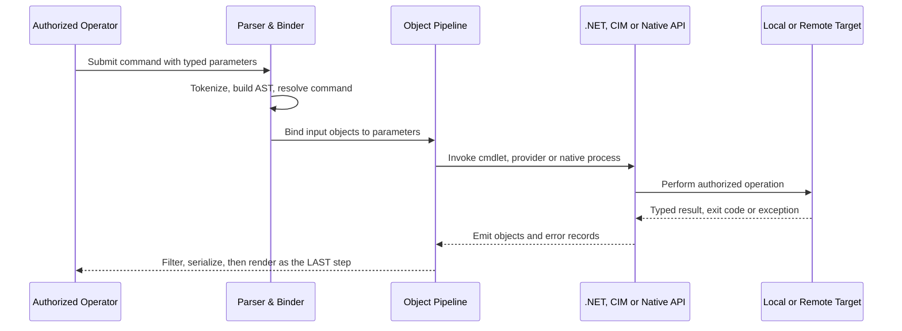

# 🪟 Windows PowerShell

> [!abstract] Note of [[Windows]]
> PowerShell is not a better command prompt — it is an automation language built on .NET in which commands pass **typed objects** rather than text. That single design choice changes filtering, scripting, error handling, and remoting. This note starts from the first cmdlet you ever run and ends at remoting internals, constrained endpoints, and the security model that makes PowerShell both the best administration tool and the most-watched one.

> [!warning] Authorized use only
> Run administrative and remoting examples only on systems you own or are explicitly authorized to manage. Prefer read-only laboratories, least-privilege identities, `-WhatIf` for changes, explicit cleanup, and approved change windows.

## Parent Learning Order
Windows Architecture & Kernel -> Windows Memory Internals & Exploit Mitigations -> Windows Drivers I-O & Kernel Debugging -> Windows Processes, Services & Boot -> Windows File System & Registry -> Windows Networking Internals -> Windows Security & Access Control -> Windows Identity, Credentials & Authentication -> Windows Active Directory & Domains -> Windows Command Prompt & Batch -> Windows PowerShell -> Windows Logging & Auditing -> Windows Diagnostics, Crash Dumps & Performance -> Windows Sysinternals & Troubleshooting

## Objects, Not Text

Open PowerShell (`Win+R`, type `powershell`, Enter) and run your first command:

```powershell
Get-Process
```

You get a table of running processes. So far this looks like any shell printing text — but it is not text. PowerShell commands are called **cmdlets**, they are named `Verb-Noun` (`Get-Process`, `Stop-Service`, `New-Item`), and they emit **.NET objects** with real properties. What you see on screen is only a rendering of those objects, produced at the very last step.

This is the one idea that makes everything else make sense. Prove it:

```powershell
Get-Process | Get-Member
```

Expected excerpt:

```text
   TypeName: System.Diagnostics.Process

Name        MemberType     Definition
----        ----------     ----------
Kill        Method         void Kill()
CPU         ScriptProperty System.Object CPU {get=...}
Id          Property       int Id {get;}
```

`Get-Member` reveals the type and every property and method available. Because the pipeline carries these objects, you filter on real, typed properties instead of scraping text:

```powershell
Get-Process | Where-Object CPU -gt 100 | Sort-Object CPU -Descending | Select-Object -First 5 Name,Id,CPU
```

In a text shell you would be cutting columns and hoping the spacing never changes. Here `CPU -gt 100` is a genuine numeric comparison. **Three cmdlets replace memorization entirely**: `Get-Command` (what commands exist), `Get-Help` (how to use one), `Get-Member` (what an object contains).

```powershell
Get-Command -Verb Get -Noun '*Service*'
Get-Help Get-CimInstance -Full
```

> [!tip] The analogy, and where it breaks
> A conveyor carrying labelled crates rather than a chute of loose paper: each item keeps its structure until someone finally prints a summary. The analogy breaks in a way beginners must internalise — printing that summary *destroys* the crates. Once you format for display, the structured contents are gone, which is why formatting must always be the very last step.

## The Pipeline and Why Formatting Comes Last

Objects flow through the pipeline until something renders them. `Where-Object`, `Select-Object`, `Sort-Object`, `Group-Object`, `Measure-Object`, and `ForEach-Object` all operate on typed properties.



The critical rule is in that last line: **formatting is terminal**. `Format-Table` and `Format-List` produce formatting records, not data. `Format-Table | Export-Csv` exports the formatting objects and yields useless output. Always filter, calculate, and serialize on the original objects, then format only for human display:

```powershell
Get-Process |
  Where-Object WorkingSet64 -gt 500MB |
  Select-Object Name,Id,@{n='WorkingSetMB';e={[math]::Round($_.WorkingSet64/1MB,1)}} |
  Export-Csv C:\Lab\big-processes.csv -NoTypeInformation -Encoding utf8
```

Pipeline input binds **by value** when the type matches, then **by property name**. `Get-Help <Command> -Parameter <Name>` tells you which a parameter accepts — the definitive answer when a pipeline "does nothing."

## Types, Collections, and Custom Objects

Variables hold any .NET object, and type constraints validate or convert:

```powershell
[int]$port = 443
[datetime]$since = (Get-Date).AddHours(-1)

$record = [pscustomobject][ordered]@{
  ComputerName = $env:COMPUTERNAME
  CollectedAt  = Get-Date
  Port         = $port
  Listening    = [bool](Get-NetTCPConnection -State Listen -LocalPort $port -ErrorAction SilentlyContinue)
}
$record | Format-List
```

Expected output:

```text
ComputerName : WIN-LAB01
CollectedAt  : 8/4/2026 15:40:18
Port         : 443
Listening    : True
```

`PSCustomObject` is how you emit record-shaped results — the right output for any function meant to be consumed by other commands. Operators include comparison (`-eq`, `-like`, `-match`, `-in`), logical (`-and`, `-or`), type (`-is`, `-as`), and `-replace`. Note that many operators **enumerate** a left-hand collection rather than returning one Boolean:

```powershell
'WinRM','W32Time','BITS' -match '^W'    # returns the matching strings, not $true
443 -in @(80,443,5986)                  # returns True
```

Single quotes are literal; double quotes expand `$variables` and `$()` subexpressions. The escape character is the backtick, but splatting and typed parameters are clearer than dense escaping.

## Functions, Validation, and Safe Change

An advanced function declares parameters, validates input, supports `-WhatIf`, and returns objects:

```powershell
function Set-C2RServiceStartMode {
  [CmdletBinding(SupportsShouldProcess, ConfirmImpact='Medium')]
  param(
    [Parameter(Mandatory,ValueFromPipelineByPropertyName)]
    [ValidateNotNullOrEmpty()][string]$Name,

    [Parameter(Mandatory)]
    [ValidateSet('Automatic','Manual','Disabled')]
    [string]$StartupType
  )
  process {
    $service = Get-Service -Name $Name -ErrorAction Stop
    if ($PSCmdlet.ShouldProcess($service.Name, "Set startup type to $StartupType")) {
      Set-Service -Name $service.Name -StartupType $StartupType -ErrorAction Stop
      Get-Service -Name $service.Name
    }
  }
}

[pscustomobject]@{Name='C2RLabService'} | Set-C2RServiceStartMode -StartupType Manual -WhatIf
```

Expected output:

```text
What if: Performing the operation "Set startup type to Manual" on target "C2RLabService".
```

`SupportsShouldProcess` giving you `-WhatIf` is a safety property worth insisting on for anything that changes state — it lets you prove what a script *would* do before it does it.

## Providers, CIM, and Event Querying

**Providers** expose the Registry, certificate stores, environment, and filesystem through the same item cmdlets. Convenience does not erase provider-specific semantics — Registry values are not files despite path-like syntax, and 32-bit versus 64-bit views differ.

```powershell
Get-ItemProperty 'HKLM:\SOFTWARE\Microsoft\Windows NT\CurrentVersion' |
  Select-Object ProductName,DisplayVersion,CurrentBuild
Get-ChildItem Cert:\LocalMachine\My | Select-Object Subject,Thumbprint,NotAfter,HasPrivateKey
```

**CIM** is the modern management interface (prefer it over deprecated WMI cmdlets). Filter at the provider rather than retrieving everything and filtering locally:

```powershell
Get-CimInstance Win32_LogicalDisk -Filter "DriveType=3" |
  Select-Object DeviceID,@{n='FreeGB';e={[math]::Round($_.FreeSpace/1GB,1)}}
```

**`Get-WinEvent`** with a filter hashtable performs server-side selection — far faster than filtering after retrieval:

```powershell
Get-WinEvent -FilterHashtable @{LogName='System'; Level=1,2; StartTime=(Get-Date).AddHours(-2)} -ErrorAction Stop |
  Select-Object TimeCreated,Id,ProviderName,LevelDisplayName
```

For event data, call `.ToXml()` and parse `EventData` nodes rather than scraping the localized `Message`, which changes with display language.

## Error Handling and Debugging

PowerShell errors are structured `ErrorRecord` objects. Crucially, **most errors are non-terminating and do not trigger `catch`** unless you request it:

```powershell
try {
  $item = Get-Item 'C:\Lab\required.json' -ErrorAction Stop
  $data = Get-Content $item.FullName -Raw -ErrorAction Stop | ConvertFrom-Json -ErrorAction Stop
} catch [System.Management.Automation.ItemNotFoundException] {
  Write-Error "Required input is missing: $($_.Exception.Message)"; exit 2
} catch {
  Write-Error ("Unexpected {0}: {1}" -f $_.Exception.GetType().FullName, $_.Exception.Message); exit 1
} finally {
  Write-Verbose 'Collection attempt complete'
}
```

`-ErrorAction Stop` is what converts a non-terminating error into a catchable one — omitting it is the single most common reason a `try/catch` "does not work." `$LASTEXITCODE` holds the last **native** program's exit code; `$?` describes the last pipeline's success.

Use `Set-StrictMode -Version Latest` to catch references to undefined variables, `Set-PSBreakpoint` and `Get-PSCallStack` to debug, and Pester to test — including failure paths, hostile strings, Unicode paths, and that changing functions honour `-WhatIf`.

## Remoting: WinRM, the Second Hop, and JEA

PowerShell Remoting creates authenticated remote runspaces, commonly over **WinRM** (ports 5985/5986).

```powershell
Test-WSMan server01.corp.example
$session = New-PSSession -ComputerName server01.corp.example
Invoke-Command -Session $session -ScriptBlock {
  [pscustomobject]@{
    Host         = $env:COMPUTERNAME
    User         = [System.Security.Principal.WindowsIdentity]::GetCurrent().Name
    LanguageMode = $ExecutionContext.SessionState.LanguageMode
  }
}
Remove-PSSession $session
```

Expected output:

```text
Host     User          LanguageMode
----     ----          ------------
SERVER01 CORP\analyst  FullLanguage
```

Three internals matter:

- **HTTP transport does not mean cleartext credentials.** Authentication (typically Kerberos in a domain) provides message confidentiality and integrity; HTTPS additionally authenticates the server channel.
- **Remoting output is serialized.** Results arrive as `Deserialized.*` objects that keep properties but lose live methods. Do method-dependent work *remotely* and return purpose-built records.
- **The "second hop"** occurs when a remote session must reach a further resource as the caller, but no delegable credential exists. Secure answers are Kerberos constrained delegation, resource-based constrained delegation, or a narrowly scoped credential under governance — broad CredSSP expands credential exposure and should not be the default.

**JEA (Just Enough Administration)** endpoints expose only selected commands, running under a constrained virtual or group-managed identity. A good endpoint controls who may connect, which commands and language mode exist, what identity executes, what that identity can reach, and where transcripts are retained. It is the practical application of least privilege to administration itself.

## The Security Model — and What Execution Policy Is Not

**Execution policy is not a security boundary.** It reduces accidental execution of script files under some workflows and is trivially bypassed by design (piping script text, `-Command`, etc.). Saying "we set execution policy to Restricted, so we are protected" is a category error.

```powershell
Get-ExecutionPolicy -List
Get-AuthenticodeSignature C:\Lab\Survey.ps1
```

Real trust comes from a stack: code signing, controlled repositories, **WDAC or AppLocker** application control, least privilege, constrained endpoints, protected module paths, and logging. **Language mode** (`FullLanguage`, `ConstrainedLanguage`, `RestrictedLanguage`, `NoLanguage`) limits access to arbitrary .NET types when enforced through a supported application-control design — but it is not the same as running as a lower-privileged user.

**PowerShell is heavily instrumented, which is why attackers try to evade it and defenders should ensure it is enabled:**

| Telemetry | What it captures |
| --- | --- |
| Script-block logging (event 4104) | Parsed script content, often after basic deobfuscation |
| Module logging | Pipeline execution details per module |
| Transcription | Host-visible interactive session records |
| AMSI | Submits script content to registered anti-malware for inspection |
| WinRM operational log | Remoting session establishment and configuration |

Each covers a different slice — transcription may miss non-interactive API paths, script-block logging catches content that never touched disk. Together they make PowerShell one of the most observable execution environments on Windows, which is precisely why "fileless" tradecraft favours it and why these logs are high-value.

For reproducibility, record `$PSVersionTable`, edition, language mode, module versions, and OS build; use `-NoProfile` in automation; and pin module versions. Note that **Windows PowerShell 5.1 and PowerShell 7 differ** in runtime, modules, and remoting — security tooling must identify the host actually used.

## Failure Modes and Troubleshooting

- **`try/catch` never fires** → the error was non-terminating; add `-ErrorAction Stop`.
- **Exported CSV contains junk columns** → you piped through `Format-*` before exporting; export the original objects instead.
- **A pipeline "does nothing"** → the parameter does not accept pipeline input by value or property name; check `Get-Help -Parameter`.
- **Remote method call fails** → the object is `Deserialized.*` and has no live methods; perform the operation inside the remote script block.
- **Script works locally, fails remotely** → language mode, JEA restrictions, or missing modules on the target; inspect `$ExecutionContext.SessionState.LanguageMode` remotely.
- **Native command arguments mangled** → argument passing differs between 5.1 and 7 (`$PSNativeCommandArgumentPassing`); use the call operator with an argument array and test the actual consumer.
- **Garbled file output** → encoding defaults differ between editions and cmdlets; specify `-Encoding utf8` explicitly at file boundaries.

## Security Implications

**PowerShell is dual-use in the sharpest possible way.** It is the premier Windows administration tool and, for the same reasons — trusted, signed, present everywhere, capable of in-memory execution and remote operation — a favourite of intrusion tradecraft. It cannot be removed, so the posture is to **constrain and observe**: application control, constrained language mode, JEA endpoints, and full logging, rather than blocking a binary that legitimate administration depends on.

**Avoid dangerous primitives instead of quoting around them.** `Invoke-Expression` reparses text as code and should never handle data. Never concatenate untrusted input into a command or script block; pass typed arguments to APIs, validate paths after canonicalization, and keep a strict separation between data and code. This eliminates injection classes rather than trying to escape them perfectly.

**Detection must correlate, not string-match.** Command-line text alone is weak evidence — obfuscation is easy. Effective detection joins script-block content, process ancestry, the user token, module loads, network destinations, file writes, and remoting events into one picture, which is why the logging stack above matters more than any single signature.

**Remoting is an authorization decision, not a convenience.** Who may connect, to which endpoint configuration, as which identity, with what delegation, and reaching which resources — each is a distinct control. A broadly reachable `Microsoft.PowerShell` endpoint with full language for ordinary administrators is a lateral-movement path; a JEA endpoint exposing five task-specific functions is not.

## Summary

You should now be able to:

- Run a cmdlet, explain `Verb-Noun` naming, use `Get-Command`/`Get-Help`/`Get-Member`, and state why the pipeline carries objects rather than text.
- Build filtering pipelines on typed properties, write validated advanced functions with `-WhatIf`, handle non-terminating versus terminating errors, query CIM and events efficiently, and use WinRM sessions correctly.
- Explain why execution policy is not a security boundary and what the real trust stack is; design JEA endpoints and reason about the second hop and delegation; and map PowerShell telemetry (4104, module logging, AMSI, transcription) to what each does and does not capture.

---
> 🔼 Up: [[Windows]]
