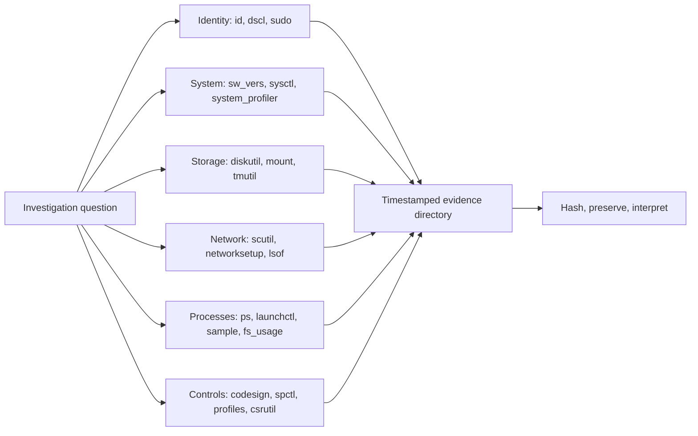

# 🍎 macOS CLI & Unix Backend

> [!abstract] Note of [[macOS]]
> macOS is Unix-certified, but it is not GNU/Linux wearing a graphical shell. This masterclass develops safe Zsh fluency, maps the BSD userland, teaches Apple-specific administration, and turns native commands into a repeatable security investigation workflow.

## Parent Learning Order
macOS Darwin & XNU Kernel -> macOS CLI & Unix Backend -> macOS APFS & File System -> macOS Processes & Daemons -> macOS Identity, Keychain & Credentials -> macOS Networking Internals -> macOS Security Mechanisms -> macOS Binaries & Runtime Loading -> macOS Observability, Incident Response & Forensics

## Crook — Zsh, Unix Semantics & Safe Command Work

### Vocabulary & First Mental Model

A **terminal emulator** is the window that displays a text session. A **shell** is the program inside that session that reads commands; modern macOS uses Zsh by default. A **command** resolves to a shell keyword, function, alias, built-in, script, or executable. An **argument** is one value passed to that command. The **working directory** is the process's current location in the filesystem. An **environment variable** is inherited process configuration; `PATH` is the ordered list of directories searched for executable names. **Standard input**, **standard output**, and **standard error** are streams numbered 0, 1, and 2. An **exit status** of zero conventionally means success; a nonzero value describes failure or a special result.

Use this mental model for every shell line: Zsh first parses and expands the text, resolves the command, constructs an argument vector and redirections, launches or runs the command, then records its exit status. Quoting errors therefore happen before the target utility starts, while utility errors happen after it receives arguments. Distinguishing those phases is the foundation of reliable administration and incident collection.

The default interactive shell is `/bin/zsh`. Login shells read `/etc/zprofile` and then `~/.zprofile`; interactive shells read `/etc/zshrc` and `~/.zshrc`. Environment setup belongs in `.zprofile`, while aliases and interactive behavior normally belong in `.zshrc`. This distinction matters when a command works in Terminal but fails in a LaunchAgent: background jobs do not inherit the same interactive startup files or `PATH`.

```bash
echo "$SHELL"
echo "$ZSH_VERSION"
print -l $path
setopt | sort | sed -n '1,20p'
```

Expected output:

```text
/bin/zsh
5.9
/opt/homebrew/bin
/usr/local/bin
/usr/bin
/bin
/usr/sbin
/sbin
```

Zsh arrays are one-indexed by default, glob qualifiers can select files by metadata, and unquoted glob failures produce `no matches found`. Defensive scripts should use explicit quoting, absolute paths for privileged operations, `set -euo pipefail` where semantics are understood, and a controlled `PATH`. Never assume Linux flags. macOS ships BSD variants of `sed`, `stat`, `date`, `ps`, and other tools; GNU documentation may describe incompatible options.

```bash
# Safe inventory pattern: no changes, explicit paths, timestamped output.
case_dir="$PWD/macos-lab-$(date +%Y%m%d-%H%M%S)"
mkdir -p "$case_dir"
/usr/bin/sw_vers > "$case_dir/sw_vers.txt"
/usr/sbin/system_profiler SPHardwareDataType > "$case_dir/hardware.txt"
/usr/bin/id > "$case_dir/identity.txt"
/usr/bin/shasum -a 256 "$case_dir"/*.txt
```

Basic file investigation combines `file`, `stat`, extended attributes, ACLs, and hashes:

```bash
file /Applications/TextEdit.app/Contents/MacOS/TextEdit
stat -x /Applications/TextEdit.app
ls -leO@ ~/Downloads
xattr -l ~/Downloads/sample.pkg
shasum -a 256 ~/Downloads/sample.pkg
```

`ls -l` does not show the full authorization picture. `-e` prints ACLs, `-O` prints BSD flags, and `-@` prints extended attributes. A quarantined download may therefore look ordinary until `com.apple.quarantine` is examined.

> [!tip] The analogy, and where it breaks
> A polished storefront with a fully equipped workshop behind it — the graphical layer and the Unix command line acting on the same underlying goods. The analogy breaks because the storefront sometimes enforces rules the workshop must also respect: privacy consent prompts can block a command-line action, so the terminal is not an unrestricted back door.

## Operator — Native Administration Map

### System Identity & Hardware

```bash
sw_vers
uname -m
sysctl -n machdep.cpu.brand_string 2>/dev/null || true
system_profiler SPHardwareDataType SPSoftwareDataType
scutil --get ComputerName
scutil --get LocalHostName
hostname
```

`sw_vers` provides the product version and build. `uname` provides the Darwin view. `system_profiler` provides rich structured inventory but can be slow, so query only needed data types. `ioreg` traverses IOKit registry data and is valuable for hardware and power investigations.

### Users, Groups & Directory Services

Local identity is resolved through Open Directory, not merely `/etc/passwd`:

```bash
id
dscl . -list /Users UniqueID
dscl . -read /Users/$(id -un)
dscacheutil -q user -a name "$(id -un)"
groups "$(id -un)"
sudo -l
```

System accounts commonly use UIDs below 500 and names beginning with `_`; do not label every such record suspicious. In enterprise fleets, directory search paths may include local and network nodes. `dscl /Search -read /Users/name` reflects that broader search policy.

### Disks, APFS & Mounts

`diskutil` is the supported high-level storage interface. Read-only enumeration should precede any operation that changes a disk:

```bash
diskutil list
diskutil apfs list
diskutil info /
mount
df -h
tmutil listlocalsnapshots /
```

Expected APFS excerpt:

```text
APFS Container (1 found)
|
+-- Container disk3 7A1F...
    Capacity Ceiling (Size): 494.4 GB
    +-> Volume disk3s1 Macintosh HD
    +-> Volume disk3s5 Macintosh HD - Data
```

Commands such as `diskutil eraseDisk`, `apfs deleteVolume`, and `repairVolume` are intentionally excluded from the lab because they can destroy evidence or data.

### Preferences, Property Lists & Profiles

```bash
defaults domains | tr ',' '\n' | sed -n '1,20p'
defaults read com.apple.finder
plutil -p ~/Library/Preferences/com.apple.finder.plist
profiles status -type enrollment
profiles show -type configuration | sed -n '1,80p'
```

`defaults` operates on preference domains and can interact with `cfprefsd`; directly editing a plist while its owning application runs may be overwritten. `plutil` validates and converts XML or binary property lists. Configuration profiles can enforce security controls, VPN settings, certificates, and privacy permissions, so assessment context must include MDM enrollment.

### Network Configuration

```bash
networksetup -listallhardwareports
networksetup -listallnetworkservices
networksetup -getinfo Wi-Fi
networksetup -getdnsservers Wi-Fi
scutil --dns
route -n get default
netstat -rn -f inet
ifconfig
```

Hardware-port names, service names, and BSD interfaces are different namespaces: the service `Wi-Fi` may map to `en0`. `scutil --dns` is more authoritative than reading `/etc/resolv.conf` because macOS uses a dynamic resolver with scoped configurations.

### Processes, Files & Search

```bash
ps aux
pgrep -alf 'process-name'
lsof -nP -iTCP -sTCP:LISTEN
lsof -p 1234
mdfind 'kMDItemFSName == "*.mobileconfig"c'
find ~/Library -type f -mtime -2 -print 2>/dev/null
fs_usage -w -f filesystem 1234
sample 1234 3 1
```

Spotlight (`mdfind`) is fast but reflects indexed data, exclusions, and metadata latency. `find` walks the filesystem directly. Use both and document the limitations.



## Root — Homebrew, Architecture Boundaries & Automation

Homebrew installs to `/opt/homebrew` on Apple Silicon and `/usr/local` on Intel. A formula provides command-line software; a cask manages graphical applications or vendor packages; `brew services` integrates selected software with `launchd`.

```bash
brew --prefix
brew config
brew doctor
brew list --versions
brew services list
brew leaves
```

Expected Apple Silicon output begins with:

```text
HOMEBREW_VERSION: 4.x
ORIGIN: https://github.com/Homebrew/brew
HOMEBREW_PREFIX: /opt/homebrew
CPU: octa-core 64-bit arm_firestorm_icestorm
Rosetta 2: false
```

Security hinges on ownership, provenance, and execution context. A user-writable Homebrew binary must never be called by a root LaunchDaemon through an ambiguous `PATH`. Audit scripts for `sudo brew`, unpinned taps, automatic service startup, and shell initialization that prepends untrusted directories.

```bash
ls -ld "$(brew --prefix)" "$(brew --prefix)/bin"
find "$(brew --prefix)/bin" -type l -maxdepth 1 -print | sed -n '1,20p'
codesign -dv --verbose=4 "$(command -v some-tool)" 2>&1
```

Rosetta introduces another boundary. `arch` reports the current execution architecture, while `file` reveals available binary slices:

```bash
arch
file "$(command -v zsh)"
sysctl -in sysctl.proc_translated 2>/dev/null || echo native
```

For repeatable collection, prefer a script that emits command, timestamp, exit status, and output without modifying the host:

```zsh
#!/bin/zsh
set -u
out="${1:-./macos-triage}"
mkdir -p "$out"
run() {
  local name="$1"; shift
  {
    print -r -- "timestamp=$(date -u +%FT%TZ)"
    print -r -- "command=$*"
    "$@"
    print -r -- "exit_status=$?"
  } >"$out/$name.txt" 2>&1
}
run version /usr/bin/sw_vers
run identity /usr/bin/id
run listeners /usr/sbin/lsof -nP -iTCP -sTCP:LISTEN
run extensions /usr/bin/systemextensionsctl list
/usr/bin/shasum -a 256 "$out"/*.txt >"$out/SHA256SUMS"
```

### Shell Parsing, Quoting & Privilege Boundaries

The shell performs expansions before a program receives its argument vector: parameter expansion, command substitution, arithmetic expansion, word splitting in specific contexts, pathname generation, and redirection. Security bugs appear when untrusted text is rebuilt into shell syntax rather than passed as one quoted argument. Prefer arrays and direct execution:

```zsh
files=("$HOME/Library/Application Support"/*.plist(N))
for f in "${files[@]}"; do
  /usr/bin/stat -x "$f"
done
```

Do not use `eval` to process filenames, and do not parse `ls`. NUL-delimited pipelines preserve spaces and newlines where tools support them. Before `sudo`, determine which variables survive, which working directory is used, and which executable path will resolve. A secure privileged script establishes a minimal environment and validates that every path is absolute, expected, and not a symlink when that distinction matters.

```bash
type -a python3
command -v python3
sudo -V | grep -E 'Environment|Path' | sed -n '1,20p'
```

Shell history is useful but incomplete evidence: users can disable it, Zsh may share history among sessions, commands can begin with configured ignore patterns, and secrets may be exposed accidentally. Preserve it under authorization, correlate it with process and file evidence, and never treat absence as proof a command did not run.

## Hands-On Lab: The Terminal Is Not an Unrestricted Back Door

> [!info] Runs on any Mac — creates files under a temp dir removed in Step 6
> The key macOS lesson: the command line must still obey privacy and integrity controls the GUI enforces.

### Step 1 — Standard Unix, as expected

```bash
LAB=$(mktemp -d); cd "$LAB"; pwd
echo "ok" > file.txt && ls -l@ file.txt
```

```text
/var/folders/xy/.../T/tmp.AbC123
-rw-r--r--  1 you  staff  3 Aug  4 18:30 file.txt
```

The BSD userland behaves like any Unix — but note `ls -l@`, which shows **extended attributes**, a macOS addition that carries metadata like quarantine flags.

### Step 2 — Watch macOS tag a "downloaded" file

```bash
xattr -w com.apple.quarantine "0083;00000000;Safari;" file.txt
xattr -l file.txt
```

```text
com.apple.quarantine: 0083;00000000;Safari;
```

The quarantine attribute is macOS's mark-of-the-web. A file carrying it triggers Gatekeeper checks on first open — and it persists as forensic evidence of where the file came from, all visible from the CLI.

### Step 3 — The CLI hits a privacy wall the GUI also hits

```bash
ls ~/Library/Messages/ 2>&1 | head -1
```

```text
ls: /Users/you/Library/Messages/: Operation not permitted
```

This is the surprise: `ls` — running as **you**, on **your** files — is refused. TCC (Transparency, Consent & Control) protects sensitive directories regardless of Unix permissions. The terminal is not a bypass; it is subject to the same consent framework as any app.

### Step 4 — See which security context the shell runs in

```bash
csrutil status
codesign -dv /bin/zsh 2>&1 | grep -E 'Identifier|Authority' | head -2
```

```text
System Integrity Protection status: enabled.
Identifier=com.apple.zsh
Authority=Software Signing
```

Even the shell binary is code-signed by Apple. SIP plus code signing mean the CLI operates inside the same integrity guarantees as the rest of the system.

### Step 5 — Use native macOS-specific tooling

```bash
sw_vers
system_profiler SPHardwareDataType 2>/dev/null | grep -E 'Chip|Memory' | head -2
```

```text
ProductName:		macOS
ProductVersion:		15.0
BuildVersion:		24A335
      Chip: Apple M1 Pro
      Memory: 16 GB
```

`sw_vers` and `system_profiler` are the macOS-native equivalents of Linux's `/etc/os-release` and `lshw` — the correct tools for identifying a Mac.

### Step 6 — Cleanup

```bash
cd /tmp && rm -rf "$LAB" && ls -d "$LAB" 2>&1
```

```text
ls: /var/folders/.../tmp.AbC123: No such file or directory
```

**What you should now be able to do:** read extended attributes and the quarantine flag, explain why the CLI is blocked from TCC-protected directories despite Unix permissions, and identify a Mac with native tools.

## Troubleshooting Workflow

Start with context rather than repeating commands: record architecture, macOS build, shell, effective identity, current directory, `PATH`, active Homebrew prefix, and whether the process runs locally, through SSH, or under launchd. Use `type -a`, `command -v`, `file`, and `codesign -dv` to identify what will actually execute. Compare exit status, stdout, and stderr separately. When a command behaves differently in a script, inspect quoting, glob expansion, locale, permissions, environment inheritance, and Apple Silicon versus Rosetta execution before modifying the system.

## Cybersecurity Implications

- BSD/GNU differences can invalidate collection scripts and quietly omit evidence.
- Interactive shell startup files are common persistence and command-hijacking surfaces.
- `diskutil`, `scutil`, Directory Services, profiles, and extended attributes reveal macOS state that Linux-only workflows miss.
- Absolute paths and controlled environments protect privileged automation from `PATH` substitution.
- Native collection tools reduce deployment friction but still require timestamps, hashes, error capture, and documented limitations.

## Crook → Operator → Root Checkpoint

- **Crook:** Navigate Zsh safely and explain why BSD flags differ from GNU/Linux.
- **Operator:** Build a non-destructive inventory using native identity, storage, network, process, and control commands with realistic output interpretation.
- **Root:** Automate forensic-quality collection across Intel and Apple Silicon while controlling `PATH`, architecture translation, privileges, provenance, and evidence integrity.

---
> 🔼 Up: [[macOS]]
