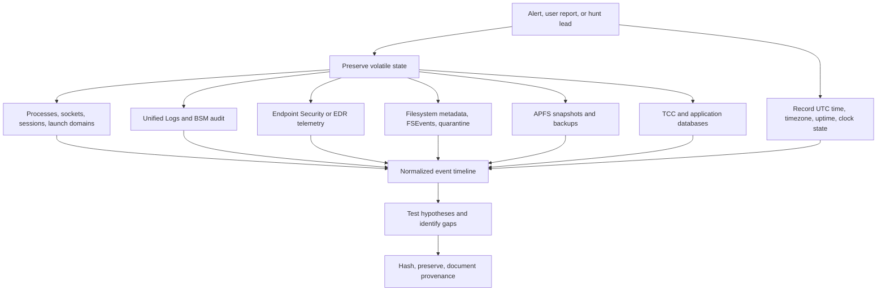

# 🍎 macOS Observability, Incident Response & Forensics

> [!abstract] Note of [[macOS]]
> macOS evidence is distributed across Unified Logging, Endpoint Security, FSEvents, APFS snapshots, quarantine metadata, TCC, `launchd`, application databases, BSM audit data, and volatile state. This masterclass builds an evidence-first workflow that preserves context, correlates independent sources, and states limitations honestly.

## Parent Learning Order
macOS Darwin & XNU Kernel -> macOS CLI & Unix Backend -> macOS APFS & File System -> macOS Processes & Daemons -> macOS Identity, Keychain & Credentials -> macOS Networking Internals -> macOS Security Mechanisms -> macOS Binaries & Runtime Loading -> macOS Observability, Incident Response & Forensics

## Evidence Sources & Time

> *A suspect Mac is in front of you and still powered on. What do you collect first, and why does the order matter?*
>
> Hold your answer — the section below is the response.

### Vocabulary & First Mental Model

An **event** is something that happened; an **artifact** is durable or recoverable state left behind; **telemetry** is data intentionally emitted about activity; **evidence** is information collected and interpreted for a question. **Volatile** evidence disappears or changes quickly, while **persistent** evidence survives shutdown or process exit. A **timeline** places observations on a normalized clock. **Provenance** records where an artifact came from and how it was obtained. **Chain of custody** records control and transfer. A **hash** detects later byte changes but does not prove the source was complete, authentic, or correctly interpreted.

The first-response model is: establish authority and time context, preserve the most volatile state, collect independent sources with documented commands, hash the resulting artifacts, normalize timestamps, correlate observations into hypotheses, and state confidence plus gaps. Collection is not analysis, and one log line is not a conclusion. macOS adds platform-specific complications—privacy redaction, APFS snapshots, FSEvents coalescing, code identity, TCC, and protected processes—that must remain visible in every finding.

An incident timeline is not “the logs.” It is a hypothesis supported by several imperfect sources. Unified Logs may record process and subsystem messages but apply privacy redaction and retention. FSEvents records directory-tree change notifications, not every operation or complete file content. Quarantine records download provenance only when the acquiring application participates. APFS snapshots preserve selected earlier filesystem states while present. TCC records privacy decisions. `launchd` definitions show configured persistence, while process and Endpoint Security data show execution. Browser and application databases add user context.



Time normalization is foundational. Record UTC and local time, timezone, uptime, sleep/wake evidence, and clock synchronization. APFS metadata may carry high-resolution timestamps; databases may use Unix, Cocoa, WebKit, or custom epochs; Unified Logging queries display according to command options. Never merge timestamps before documenting conversion.

```bash
date -u '+%Y-%m-%dT%H:%M:%SZ'
date '+%Y-%m-%dT%H:%M:%S%z %Z'
systemsetup -gettimezone 2>/dev/null
uptime
pmset -g log | tail -20
systemsetup -getusingnetworktime 2>/dev/null
```

Expected context:

```text
2026-07-31T12:30:11Z
2026-07-31T15:30:11+0300 +03
Time Zone: Europe/Istanbul
15:30  up 4 days,  3:21, 2 users, load averages: 2.01 1.88 1.74
Network Time: On
```

> [!tip] The analogy, and where it breaks
> Reconstructing an event from several partial records — the door log, the CCTV, and a delivery manifest — none of which alone tells the story. The analogy breaks because some of these records are privacy-protected by the system itself, so an investigator may need explicit authorisation to read evidence that exists on a machine they already control.

## Unified Logging & Live Triage

### Unified Logging

The Unified Logging system stores structured events in a tracev3-backed log archive and memory buffers. Entries have timestamp, process, subsystem, category, message type, activity context, and privacy handling. `log stream` observes live events; `log show` queries retained history; `log collect` creates a portable log archive.

```bash
log show --last 30m --style compact --info \
  --predicate 'process == "sshd" OR subsystem == "com.apple.TCC"'
log stream --style compact --level info \
  --predicate 'eventMessage CONTAINS[c] "authentication"'
log collect --last 1h --output ~/case/system-1h.logarchive
log show ~/case/system-1h.logarchive --style json \
  --predicate 'process == "syspolicyd"' > ~/case/syspolicyd.json
```

Typical line:

```text
2026-07-31 15:04:27.651 Df tccd[422:19b2] [com.apple.TCC:access] AUTHREQ_ATTRIBUTION: responsible={identifier=com.example.app, pid=7120, auid=501}
```

Predicates support fields such as process, processIdentifier, subsystem, category, eventMessage, messageType, and senderImagePath. Begin narrow and expand deliberately. `--info` and `--debug` increase coverage but also volume. `<private>` fields cannot be reconstructed from a collected archive merely by changing query options.

### Volatile Triage

Collect before terminating suspicious processes or disconnecting networking when safety permits:

```bash
ps -axo pid,ppid,uid,start,time,state,command > processes.txt
lsof -nP > lsof-all.txt
lsof -nP -i > network.txt
launchctl print system > launch-system.txt
launchctl print gui/$(id -u) > launch-gui.txt
systemextensionsctl list > system-extensions.txt
scutil --dns > dns.txt
netstat -rn > routes.txt
vm_stat > vm-stat.txt
```

For a specific PID, preserve executable path, command line, parent, open files, network endpoints, signature, entitlements, memory map, and sample before action:

```bash
pid=7120
ps -p "$pid" -ww -o pid,ppid,user,lstart,command
lsof -nP -p "$pid"
vmmap "$pid" | sed -n '1,120p'
sample "$pid" 3 1 -file "sample-$pid.txt"
exe=$(lsof -a -p "$pid" -d txt -Fn | sed -n 's/^n//p' | head -1)
codesign -dv --verbose=4 "$exe" 2>&1
shasum -a 256 "$exe"
```

Memory acquisition may be constrained by entitlements, Hardened Runtime, SIP, and product capability. Document inability as a collection limitation rather than weakening platform protections on an active case.

## Filesystem, Persistence & Correlation

### FSEvents

FSEvents records changes at directory-tree granularity in per-volume journals. Events can indicate created, removed, renamed, modified, metadata-changed, or root-changed conditions depending on flags and API use. Coalescing means one event can summarize many operations; gaps and journal wrapping are possible. FSEvents is excellent for discovering paths that changed around an incident but does not prove which process performed each operation.

Native APIs and approved forensic tooling can parse journal data. On a live host, `fs_usage` observes current calls, while metadata and snapshots help reconstruct earlier state:

```bash
sudo fs_usage -w -f filesystem | sed -n '1,30p'
mdfind 'kMDItemFSCreationDate >= $time.today(-2)' | sed -n '1,50p'
find ~/Library/LaunchAgents /Library/LaunchAgents /Library/LaunchDaemons \
  -type f -mtime -7 -print 2>/dev/null
```

### Quarantine & Download Provenance

```bash
artifact=~/Downloads/Example.dmg
ls -leO@ "$artifact"
xattr -l "$artifact"
mdls "$artifact"
shasum -a 256 "$artifact"
```

Quarantine event identifiers can correlate file attributes with LaunchServices quarantine databases where legally and technically available. Browser history, download records, Spotlight `kMDItemWhereFroms`, and application logs provide independent corroboration. Missing quarantine does not prove a file was created locally; command-line downloaders and copied archives may not propagate the attribute.

### TCC, Persistence & Execution

Review privacy decisions and autostart surfaces as linked but distinct evidence:

```bash
log show --last 24h --predicate 'subsystem == "com.apple.TCC"' --style compact
find ~/Library/LaunchAgents /Library/LaunchAgents /Library/LaunchDaemons \
  -type f -name '*.plist' -print 2>/dev/null
sfltool dumpbtm 2>/dev/null | sed -n '1,160p'
ls -la /Library/PrivilegedHelperTools
```

For each launch item, preserve plist and executable, then correlate:

1. filesystem creation/modification metadata;
2. FSEvents path activity;
3. quarantine or download provenance;
4. signature and notarization identity;
5. `launchctl` registration and PID state;
6. Unified Log or Endpoint Security execution;
7. network connections and child processes;
8. APFS snapshot presence before and after installation.

Configuration alone proves persistence capability, not execution. A running PID proves execution at collection time, not original installation time. Strong conclusions require several sources.

### APFS Snapshots

```bash
tmutil listlocalsnapshots /
diskutil apfs listSnapshots /
```

Record snapshot name/UUID, transaction ID, volume UUID, and collection time. Access snapshots through supported forensic or backup workflows; do not delete or mount read-write during analysis. A snapshot can preserve an earlier plist or binary that was removed from the live namespace. It can also contain sensitive user data and must inherit case controls.

### BSM Audit & Endpoint Security

OpenBSM audit records can provide selected security-relevant events where audit policy captured them:

```bash
sudo praudit -l /var/audit/current 2>/dev/null | sed -n '1,40p'
sudo audit -s 2>/dev/null
```

Endpoint Security products may record process execution, fork, exit, file operations, authentication, mount, and other events with code identity. Product retention, muting, cache policy, sensor health, and clock alignment must be documented. Absence of an EDR event can mean no activity, no subscribed event, muted path/process, dropped telemetry, expired retention, or unhealthy sensor.

### Evidence Packaging

Create a manifest and hash every collected artifact:

```bash
case_dir="$PWD/C2R-MAC-2026-001"
mkdir -p "$case_dir"
date -u '+collection_utc=%Y-%m-%dT%H:%M:%SZ' > "$case_dir/manifest.txt"
sw_vers >> "$case_dir/manifest.txt"
system_profiler SPHardwareDataType >> "$case_dir/manifest.txt"
shasum -a 256 "$case_dir"/* > "$case_dir/SHA256SUMS"
tar -czf "$case_dir.tar.gz" "$case_dir"
shasum -a 256 "$case_dir.tar.gz"
```

Record collector, authority, host identifier, commands, tool versions, start/end times, timezone, errors, transformations, storage location, and transfers. A hash proves later bytes match; it does not prove the original collection was complete or correct.

## Troubleshooting Workflow

If evidence sources disagree, normalize time zone and clock offset, preserve the original query, and determine each source’s retention and collection boundary. Unified Log absence can mean expiration, privacy redaction, disabled persistence, or an incorrect predicate—not proof that an action never occurred. Corroborate process, file, quarantine, FSEvents, TCC, launchd, network, and APFS evidence by stable identifiers and time windows. Re-run collection on a known benign event to validate the method before drawing an incident conclusion.

**The deliberate break:** the unified log reads as the log — comprehensive by design, so if an event is not in it, the event did not happen.

Much of it is **memory-backed and ephemeral**, retention is short and varies with pressure, and a large share of the interesting fields are `<private>` by default. Absence is therefore very weak evidence on this platform: the event may have occurred, been recorded, and rolled off within hours, or be present with the field you needed withheld. Reasoning from silence here produces confident conclusions that the data never supported.

**How you'd spot it:** establish what you can actually see before concluding anything — `log show` with an explicit time bound, and note every `<private>` redaction, which means the field exists and is being withheld rather than that nothing was captured. Collect volatile state first for the same reason: retention on a busy machine can be hours, so a triage collection or a snapshot taken now outlives the log you were planning to read tomorrow.

## Cybersecurity Implications

- No macOS source is complete; independent evidence must be correlated.
- Collection order matters because processes, sockets, memory, and logs are volatile.
- Privacy redaction, journal coalescing, retention, sleep, and clock conversion create explicit limitations.
- Launch definitions show capability; execution evidence shows activity; network and file evidence show consequences.
- APFS snapshots can recover prior states but are mutable evidence subject to purging.
- Evidence handling must protect credentials, personal data, and enterprise secrets encountered during collection.

## Summary

You should now be able to:

- Identify Unified Logs, FSEvents, quarantine, TCC, launch items, APFS snapshots, and process/network state.
- Perform non-destructive live triage, preserve context, query targeted logs, hash evidence, and build a sourced timeline.
- Reconstruct a multi-stage incident across volatile state, code identity, persistence, privacy decisions, filesystem history, snapshots, and network evidence while quantifying every gap, contradiction, and confidence level.

---
> 🔼 Up: [[macOS]]
