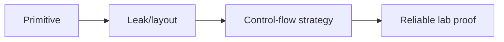

# Exploit Construction & Control Flow

## 🗺️ Zero-to-Mastery Learning Path

1. [[Shellcode Engineering]]
2. [[Code-Reuse Attacks (ROP, JOP & SROP)]]
3. [[Exploit Reliability & Mitigation Engineering]]

---
> 🔼 Up: [[Exploit Development]]
