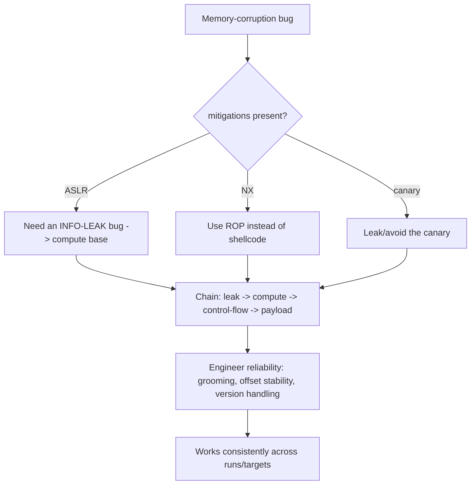

# 🎯 Exploit Reliability & Mitigation Engineering

> [!danger] Authorized simulation / lab binaries only
> Practise on binaries you own. This note is the arms race between exploit mitigations and their bypasses — understanding it is what makes both offensive research and defensive hardening effective. Never target unauthorized systems.

## Parent Learning Order
Shellcode Engineering -> Code-Reuse Attacks (ROP, JOP & SROP) -> Exploit Reliability & Mitigation Engineering

## From "It Crashed" to "It Works Every Time"

A proof-of-concept that hijacks execution once, on your machine, is not an exploit — it is a demo. **Exploit reliability engineering** is the discipline of turning a fragile crash into something that works **consistently, across environments, against modern mitigations**. This is where exploit development actually gets hard, because every technique in the previous leaves assumed conditions (known addresses, executable memory, no canary) that real targets deliberately break. This note is the *arms race*: each mitigation (ASLR, DEP, canaries, CFI, CET) and the class of bypass it provokes, plus the engineering (info-leaks, heap grooming, NOP sleds, offset stability) that makes an exploit reproducible.

The organizing truth: **modern exploitation is rarely one bug — it is a chain**, because a single mitigation (ASLR) usually forces you to find a *second* bug (an info-leak) just to make the first one reliable.

> [!tip] The analogy, and where it breaks
> Mitigations are like a bank adding defenses over the years — cameras, time-locked vaults, randomized guard rotations — and each one forces the robber to add a step: case the schedule, disable a camera, wait out the timer. The analogy breaks on cost asymmetry: a physical robber's effort grows linearly, whereas security mitigations aim to make each added defense force an *exponentially* harder or entirely separate capability (a whole extra bug), so the goal isn't perfect prevention but raising the cost until exploitation is impractical.

**Prerequisites:** all prior Exploit-Dev leaves (the techniques mitigations target).

## The Mitigation ↔ Bypass Arms Race

| Mitigation | What it stops | The bypass it forces |
|---|---|---|
| **NX / DEP** | Executing injected shellcode | Code reuse (ROP/JOP) |
| **ASLR / PIE** | Hardcoded addresses | An **info-leak** to compute the base |
| **Stack canary** | Return-address overflow | Leak the canary, or a below-canary/targeted write |
| **Full RELRO** | GOT overwrite | Target a different writable pointer |
| **CFI** | Arbitrary indirect calls | Call only "legal" targets; find a permissive one |
| **CET shadow stack** | Corrupted return (ROP) | JOP, or a non-return primitive |
| **CET IBT** | Arbitrary jump targets | Land only on `endbr` instructions |

The pattern is clear: **no single mitigation is a wall; each converts one easy technique into a harder one, and stacked together they force a chain of bugs.** The most important consequence is that **ASLR turns exploitation into a two-bug problem** — you need a memory-disclosure bug to leak an address before your control-flow bug can use a known target.

## Reliability Engineering

Beyond bypassing mitigations, an exploit must be *reproducible*:

- **Info-leaks** — read a stack/libc/PIE address to defeat ASLR; the single most important reliability primitive.
- **Heap grooming determinism** — arrange allocations so the vulnerable object lands predictably (feed the allocator, reset state between attempts).
- **Offset stability** — environment variables, argv, and stack alignment shift addresses; prefer *leaked/relative* addresses over hardcoded ones.
- **NOP sleds** — a run of no-ops before shellcode widens the margin of error for an imprecise jump (less relevant with precise ROP, but classic).
- **Cross-version robustness** — different libc/OS builds move offsets; a professional exploit detects the target version or brute-forces within a known set.



## Worked Example: Why a Working Exploit Needs Two Bugs

An exploit that hardcodes an address is not an exploit; it is a coin flip. The
reason is visible in three runs of a program that does nothing but print where a
libc function landed.

```shell-session
analyst@lab:/tmp/rel-lab$ for i in 1 2 3; do ./leak; done
0x7f3a2c1b4e40
0x7f9c81a35e40
0x7f14b6d02e40
```

Three runs, three addresses. That is ASLR: the loader picks a new base for the
shared library each execution, so `printf` — the same function, in the same
library, in the same binary — is never twice in the same place.

Look closely at what *did* stay constant, though: every address ends in `e40`.
The randomisation happens at page granularity, so the low twelve bits are fixed
by the offset within the library. An attacker who learns any single libc address
therefore learns them all, because the distances between functions inside the
library never change.

**That is exactly what a leak buys**, and disabling ASLR shows the world the
attacker is trying to reach:

```shell-session
analyst@lab:/tmp/rel-lab$ for i in 1 2 3; do setarch "$(uname -m)" -R ./leak; done
0x7ffff7a5ee40
0x7ffff7a5ee40
0x7ffff7a5ee40
```

Identical every run, so any address computed from it is deterministic and the
exploit fires every time.

**This is the two-bug requirement**, and it is the single most important
structural fact about modern exploitation. The first bug leaks an address — a
format string reading up the stack, an uninitialised buffer returning stale heap
data, an off-by-one that lets a length field be read back. The second bug
converts that knowledge into control. Neither is sufficient alone: a leak without
a write is an information disclosure, and a write without a leak is a crash.

It also reframes what mitigations do. ASLR does not make exploitation impossible;
it makes it *conditional*, by adding a required prerequisite that the attacker
must satisfy with a second vulnerability. That is why hardening a target often
means hunting information disclosures with the same seriousness as memory
corruption — removing the leak removes the exploit even when the corruption bug
survives.

## Why a working PoC dies on the next host

- **"Works on my machine."** A PoC tuned to local env vars/offsets fails elsewhere — the hallmark of an unreliable exploit; use leaks and relative offsets.
- **Ignoring ASLR's two-bug requirement.** Trying to use a hardcoded libc address against ASLR just crashes; you *must* leak first.
- **Non-deterministic heap.** Skipping grooming yields an exploit that works ~10% of the time; reliability requires controlling allocation order and resetting state.
- **Brute-forcing the wrong thing.** 32-bit ASLR has little entropy (brute-forceable); 64-bit generally does not — know when brute force is viable versus when you need a leak.
- **One mitigation assumed absent.** Assuming no CET/CFI on a modern target invalidates a classic ROP chain — enumerate the *actual* mitigations (`checksec`) before designing.

## Security Implications — the Defender's View

- **Stack mitigations in depth:** enabling NX, ASLR/PIE, canaries, Full RELRO, CFI, and CET together is the point — each forces the attacker to find and chain more, raising cost sharply. This is defense-in-depth's clearest win.
- **Deny info-leaks:** since ASLR's value collapses once an address leaks, fixing memory-disclosure bugs and reducing pointer exposure (e.g. not logging addresses) protects the whole scheme.
- **Maximize entropy:** high-entropy ASLR (and per-boot/per-exec randomization) defeats brute force; low-entropy configs (32-bit) are weak.
- **Memory-safe languages** end the arms race for new code by removing the corruption bugs entirely — the strategic defense.
- **Detection:** repeated crashes (a brute-force/unreliable exploit failing), RWX allocations, and ROP-like flow are the runtime signals mitigations turn into loud, catchable events.

## Summary

You should now be able to:

- Explain why a one-time crash is not an exploit and what "reliability" means.
- Map mitigations (NX/ASLR/canary/CFI/CET) to their bypasses, and demonstrate why ASLR requires an info-leak by observing address randomization.
- Explain why modern exploitation is a *chain* of bugs, how info-leaks/grooming/offset-stability engineer reliability, and why stacked mitigations plus memory-safe languages are the decisive defenses.

---
> 🔼 Up: [[Exploit Construction & Control Flow]]
