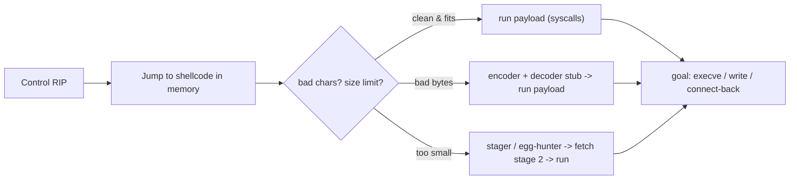

# 🐚 Shellcode Engineering

> [!danger] Authorized simulation / lab binaries only
> Practise on binaries and buffers you own. The lab shellcode here does a benign `write` of a canary string — never a real shell. Understanding shellcode drives detection engineering; never deploy it against systems you are not authorized to test.

## Parent Learning Order
Shellcode Engineering -> Code-Reuse Attacks (ROP, JOP & SROP) -> Exploit Reliability & Mitigation Engineering

## The Payload That Runs After You Take Control

> *You compile a C program that spawns a shell and extract the bytes. Why will it not work as shellcode?*
>
> Hold your answer — the section below is the response.

The memory-corruption leaves showed how to *redirect execution*. **Shellcode** is *what you redirect execution to*: a compact blob of machine code that accomplishes the attacker's goal — classically spawning a shell (`execve("/bin/sh")`), hence the name, but really any action expressed directly in CPU instructions and OS **syscalls**. Shellcode engineering is the craft of writing code that runs in a hostile, constrained environment: it usually cannot rely on a loader, must be **position-independent** (it doesn't know its own address), must **avoid forbidden bytes** the input path would mangle, and must be small. This note is where "control of RIP" becomes "arbitrary action."

The defining constraint: shellcode executes as a **raw byte string injected into someone else's memory**, so every convenience a normal program enjoys — a known load address, a linker, a clean data section — is gone. Everything must be self-contained and byte-clean.

> [!tip] The analogy, and where it breaks
> Shellcode is like a message you must smuggle to an agent inside a facility written only in gestures the guards won't notice — no paper, no fixed address to mail it to, and certain "banned words" (bad bytes) that trigger alarms. The analogy breaks on the audience: the agent is the CPU, which will execute *anything* handed to it with zero suspicion, so unlike a wary human, the machine faithfully performs whatever byte sequence lands in its instruction pointer — the smuggling is hard, the execution is guaranteed.

**Prerequisites:** **CPU, Assembly & the ABI** (registers, syscalls) and **Binary Exploitation Fundamentals** (how execution reaches the shellcode).

## What Makes Code "Shellcode"

| Property | Why | How |
|---|---|---|
| **Position-independent** | It doesn't know its runtime address | RIP-relative addressing (`lea rsi, [rip+msg]`), no absolute pointers |
| **Self-contained** | No loader/linker resolves anything | Do everything via syscalls; embed data inline |
| **Bad-char-free** | Input path mangles bytes like `\x00`, `\x0a` | choose instructions/encodings that avoid them; or encode |
| **Small** | Fits in the available buffer | terse instruction choices; stagers |
| **Syscall-driven** | No libc to call | invoke the kernel directly (`syscall`; RAX = number) |

A Linux x86-64 syscall: put the syscall number in **RAX** and arguments in **RDI, RSI, RDX**, then `syscall`. `write` is 1, `execve` is 59, `exit` is 60. That is enough to build most payloads.

**The deliberate break:** shellcode is machine code that spawns a shell, so writing it is a compilation problem — build the C, extract the bytes, done.

Shellcode is machine code with **constraints imposed by the delivery path**, and those constraints are the entire discipline. It must be position-independent, because you rarely control where it lands. It must avoid the bytes the vulnerable function will not carry: a single `\x00` ends a `strcpy` early, and a newline ends a line-based read — which is why `xor eax, eax` exists in shellcode where a compiler would happily emit `mov eax, 0` and a null byte with it. It must often survive an encoder and decode itself in place.

The compiler's output is correct code and usually unusable payload, because the compiler was never told about the buffer it has to travel through.

**How you'd spot the constraint:** send a byte-sequence probe covering the full range and diff what actually arrived in memory against what you sent. Every byte that vanished or truncated the input is a bad character, and finding them first saves debugging a payload that was never delivered intact.

## Bad Characters, Encoders, and Stagers

The input path that carries your shellcode (a `strcpy`, an HTTP field, a filename) often **forbids certain bytes**: `\x00` terminates C strings, `\x0a`/`\x0d` end lines, and protocol parsers may reject others. Two responses:

- **Avoid them at the source** — e.g. zero a register with `xor eax, eax` instead of `mov eax, 0` (which contains null bytes).
- **Encode** — wrap the payload in an encoder (e.g. XOR) plus a tiny **decoder stub** that is itself bad-char-free and unpacks the real payload at runtime.

When the buffer is too small for the full payload, a **stager** is a minimal first-stage shellcode that reads/receives the larger second stage (over the same socket, or by searching memory — an **egg hunter** — for a marker tag placed elsewhere).



## Worked Example: Shellcode That Works Wherever It Lands

Shellcode has constraints ordinary code does not: it cannot assume where it was
loaded, and it usually cannot contain certain bytes.

**Position independence** is the first. This payload reaches its own data via
`RIP`-relative addressing rather than an absolute address:

```gas
.intel_syntax noprefix
.global _start
_start:
    lea  rsi, [rip+msg]     # RIP-relative — no absolute address anywhere
    mov  rdi, 1             # fd = stdout
    mov  rdx, 25            # length
    xor  rax, rax
    mov  al, 1              # syscall 1 = write
    syscall
    xor  rdi, rdi
    mov  rax, 60            # syscall 60 = exit
    syscall
msg:
    .ascii "SHELLCODE-RUN\n"
```

```shell-session
analyst@lab:/tmp/sc-lab$ gcc -c sc.s -o sc.o && objcopy -O binary -j .text sc.o sc.bin
analyst@lab:/tmp/sc-lab$ wc -c < sc.bin
49
```

Forty-nine bytes, and not one of them is an address. `lea rsi, [rip+msg]` encodes
a *displacement* from wherever the instruction happens to be, so the same bytes
work at any address — which matters because the attacker rarely knows where their
buffer landed.

**Byte hygiene** is the second constraint, and it explains an otherwise strange
instruction pair:

```shell-session
analyst@lab:/tmp/sc-lab$ xxd sc.bin | head -2
00000000: 488d 3512 0000 00bf 0100 0000 ba19 0000  H.5.............
00000010: 0031 c0b0 0189 c2b2 190f 0548 31ff b83c  .1.........H1..<
```

`31 c0 b0 01` is `xor rax,rax; mov al,1` — a two-instruction way to put 1 in
`RAX`. The obvious `mov rax, 1` would assemble to `48 c7 c0 01 00 00 00`, which
contains three null bytes. If this payload travels through `strcpy`, the copy
stops at the first `00` and the shellcode is truncated into garbage. The same
reasoning drives null-free, newline-free and alphanumeric-only encodings: the
transport decides which bytes are legal, and the shellcode must be written
around it.

This build still contains nulls in its length and displacement fields, which is
exactly the kind of thing to check before assuming a payload will survive its
delivery path.

## The bytes that silently truncate your payload

- **Null bytes truncating the payload.** A single `\x00` from a naive `mov reg,0` ends a string-copy early — use `xor` and check the assembled bytes.
- **Position-dependent addressing.** Hardcoding the address of an inline string fails because the shellcode's load address is unknown — use RIP-relative loads.
- **Wrong syscall ABI.** Using the libc-call convention instead of the syscall convention (or the wrong syscall number for the arch) silently misbehaves.
- **NX makes injected shellcode unrunnable.** If the region isn't executable, the CPU faults on your bytes — you then need a code-reuse chain (next leaf) to first make memory executable.
- **Over-large payload.** Shellcode bigger than the buffer overwrites past your control or fails to fit — measure and stage.

## Security Implications — the Defender's View

- **W^X / NX is the primary structural defense:** if no memory is both writable and executable, injected shellcode cannot run — forcing attackers into code-reuse (which other defenses then target).
- **EDR/exploit-guard detect shellcode behavior:** RWX allocations, a network daemon spawning a shell, direct syscalls from non-libc regions, and known encoder/stager patterns are high-signal.
- **ASLR/CET reduce the reliability** of reaching and running shellcode; memory-safe languages remove the corruption that delivers it.
- **Detection of encoders:** signature and entropy analysis of network/file payloads flags encoded shellcode and common decoder stubs.

## Summary

You should now be able to:

- Explain what shellcode is and why it must be position-independent and self-contained.
- Write, assemble, and run benign syscall shellcode, and explain bad-char avoidance (`xor` vs `mov 0`), encoders, and stagers/egg-hunters.
- Explain why NX/W^X defeats injected shellcode (forcing ROP), how ASLR/CET reduce reliability, and what shellcode behavior EDR detects.

---
> 🔼 Up: [[Exploit Construction & Control Flow]]
