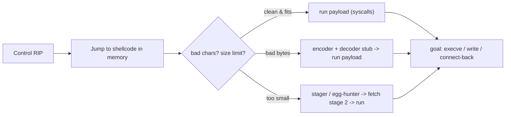

# 🐚 Shellcode Engineering

> [!danger] Authorized simulation / lab binaries only
> Practise on binaries and buffers you own. The lab shellcode here does a benign `write` of a canary string — never a real shell. Understanding shellcode drives detection engineering; never deploy it against systems you are not authorized to test.

## Parent Learning Order
Shellcode Engineering -> Code-Reuse Attacks (ROP, JOP & SROP) -> Exploit Reliability & Mitigation Engineering

## Start at Zero: The Payload That Runs After You Take Control

The memory-corruption leaves showed how to *redirect execution*. **Shellcode** is *what you redirect execution to*: a compact blob of machine code that accomplishes the attacker's goal — classically spawning a shell (`execve("/bin/sh")`), hence the name, but really any action expressed directly in CPU instructions and OS **syscalls**. Shellcode engineering is the craft of writing code that runs in a hostile, constrained environment: it usually cannot rely on a loader, must be **position-independent** (it doesn't know its own address), must **avoid forbidden bytes** the input path would mangle, and must be small. This note is where "control of RIP" becomes "arbitrary action."

The defining constraint: shellcode executes as a **raw byte string injected into someone else's memory**, so every convenience a normal program enjoys — a known load address, a linker, a clean data section — is gone. Everything must be self-contained and byte-clean.

> [!tip] The analogy, and where it breaks
> Shellcode is like a message you must smuggle to an agent inside a facility written only in gestures the guards won't notice — no paper, no fixed address to mail it to, and certain "banned words" (bad bytes) that trigger alarms. The analogy breaks on the audience: the agent is the CPU, which will execute *anything* handed to it with zero suspicion, so unlike a wary human, the machine faithfully performs whatever byte sequence lands in its instruction pointer — the smuggling is hard, the execution is guaranteed.

**Prerequisites:** **CPU, Assembly & the ABI** (registers, syscalls) and **Binary Exploitation Fundamentals** (how execution reaches the shellcode).

## What Makes Code "Shellcode"

| Property | Why | How |
|---|---|---|
| **Position-independent** | It doesn't know its runtime address | RIP-relative addressing (`lea rsi, [rip+msg]`), no absolute pointers |
| **Self-contained** | No loader/linker resolves anything | Do everything via syscalls; embed data inline |
| **Bad-char-free** | Input path mangles bytes like `\x00`, `\x0a` | choose instructions/encodings that avoid them; or encode |
| **Small** | Fits in the available buffer | terse instruction choices; stagers |
| **Syscall-driven** | No libc to call | invoke the kernel directly (`syscall`; RAX = number) |

A Linux x86-64 syscall: put the syscall number in **RAX** and arguments in **RDI, RSI, RDX**, then `syscall`. `write` is 1, `execve` is 59, `exit` is 60. That is enough to build most payloads.

## Bad Characters, Encoders, and Stagers

The input path that carries your shellcode (a `strcpy`, an HTTP field, a filename) often **forbids certain bytes**: `\x00` terminates C strings, `\x0a`/`\x0d` end lines, and protocol parsers may reject others. Two responses:

- **Avoid them at the source** — e.g. zero a register with `xor eax, eax` instead of `mov eax, 0` (which contains null bytes).
- **Encode** — wrap the payload in an encoder (e.g. XOR) plus a tiny **decoder stub** that is itself bad-char-free and unpacks the real payload at runtime.

When the buffer is too small for the full payload, a **stager** is a minimal first-stage shellcode that reads/receives the larger second stage (over the same socket, or by searching memory — an **egg hunter** — for a marker tag placed elsewhere).



## Failure Modes and Interpretation

- **Null bytes truncating the payload.** A single `\x00` from a naive `mov reg,0` ends a string-copy early — use `xor` and check the assembled bytes.
- **Position-dependent addressing.** Hardcoding the address of an inline string fails because the shellcode's load address is unknown — use RIP-relative loads.
- **Wrong syscall ABI.** Using the libc-call convention instead of the syscall convention (or the wrong syscall number for the arch) silently misbehaves.
- **NX makes injected shellcode unrunnable.** If the region isn't executable, the CPU faults on your bytes — you then need a code-reuse chain (next leaf) to first make memory executable.
- **Over-large payload.** Shellcode bigger than the buffer overwrites past your control or fails to fit — measure and stage.

## Security Implications — the Defender's View

- **W^X / NX is the primary structural defense:** if no memory is both writable and executable, injected shellcode cannot run — forcing attackers into code-reuse (which other defenses then target).
- **EDR/exploit-guard detect shellcode behavior:** RWX allocations, a network daemon spawning a shell, direct syscalls from non-libc regions, and known encoder/stager patterns are high-signal.
- **ASLR/CET reduce the reliability** of reaching and running shellcode; memory-safe languages remove the corruption that delivers it.
- **Detection of encoders:** signature and entropy analysis of network/file payloads flags encoded shellcode and common decoder stubs.

## Authorized Lab: Assemble and Run Benign Syscall Shellcode

> [!info] Runs on one Linux machine with gcc + binutils — write position-independent shellcode that prints a canary via the write syscall, extract its raw bytes, and execute them from a loader
> The shellcode does `write`+`exit` only — no shell. Step 5 cleans up.

### Step 1 — Position-independent shellcode (write a canary, then exit)

```bash
mkdir -p /tmp/sc-lab && cd /tmp/sc-lab
cat > sc.s <<'EOF'
.intel_syntax noprefix
.global _start
_start:
    lea  rsi, [rip+msg]     # RIP-relative: position-independent
    mov  rdi, 1             # fd = stdout
    mov  rdx, 25            # length
    xor  rax, rax
    mov  al, 1              # syscall 1 = write (xor+mov avoids null bytes)
    syscall
    xor  rdi, rdi           # status 0
    mov  rax, 60            # syscall 60 = exit
    syscall
msg:
    .ascii "C2R-CANARY-SHELLCODE-RUN\n"
EOF
gcc -c sc.s -o sc.o && objcopy -O binary -j .text sc.o sc.bin
echo "shellcode bytes: $(wc -c < sc.bin)"
```

```text
shellcode bytes: 49
```

### Step 2 — Inspect the raw bytes (and note bad-char awareness)

```bash
cd /tmp/sc-lab
xxd sc.bin | head -3
```

```text
00000000: 488d 3512 0000 00bf 0100 0000 ba19 0000  H.5.............
00000010: 0031 c0b0 0189 ... 
```

The bytes *do* contain some `00`s here (this is a teaching build); a real exploit through a `strcpy` would require a null-free variant — the point of `xor rax,rax; mov al,1` is exactly that kind of byte hygiene.

### Step 3 — Execute the shellcode from a loader (RWX region)

```bash
cd /tmp/sc-lab
cat > loader.c <<'EOF'
#include <stdio.h>
#include <sys/mman.h>
int main(int argc, char**argv){
  FILE*f=fopen(argv[1],"rb"); fseek(f,0,SEEK_END); long n=ftell(f); fseek(f,0,SEEK_SET);
  void*m=mmap(0,n,PROT_READ|PROT_WRITE|PROT_EXEC,MAP_PRIVATE|MAP_ANONYMOUS,-1,0);
  if(fread(m,1,n,f)!=(size_t)n) return 1;
  ((void(*)(void))m)();              // jump into the shellcode
  return 0;
}
EOF
gcc -w loader.c -o loader && ./loader sc.bin
```

```text
C2R-CANARY-SHELLCODE-RUN
```

The loader mapped an RWX region, copied the raw shellcode bytes in, and jumped to them — the shellcode issued the `write` syscall directly (no libc) and printed the canary. This is exactly what runs after a real exploit redirects RIP into injected code.

### Step 4 — State the finding

```bash
echo "Proven: raw position-independent bytes execute via direct syscalls with no loader/libc."
echo "Real constraints: strip null/newline bad chars, stay small, and RWX is required -> which is why NX/W^X breaks this and forces ROP (next leaf)."
```

```text
Proven: raw position-independent bytes execute via direct syscalls with no loader/libc.
Real constraints: strip null/newline bad chars, stay small, and RWX is required -> which is why NX/W^X breaks this and forces ROP (next leaf).
```

### Step 5 — Cleanup

```bash
cd /; rm -rf /tmp/sc-lab; ls -d /tmp/sc-lab 2>&1 | tail -1
```

```text
ls: cannot access '/tmp/sc-lab': No such file or directory
```

**What you should now be able to do:** explain what makes code "shellcode" (position-independent, self-contained, bad-char-free, syscall-driven), write and assemble a benign syscall shellcode, execute it from an RWX region, and explain bad-char avoidance, encoders, and stagers — plus why NX defeats injected shellcode and forces code reuse.

## Crook → Operator → Root Checkpoint

- **Crook:** Explain what shellcode is and why it must be position-independent and self-contained.
- **Operator:** Write, assemble, and run benign syscall shellcode, and explain bad-char avoidance (`xor` vs `mov 0`), encoders, and stagers/egg-hunters.
- **Root:** Explain why NX/W^X defeats injected shellcode (forcing ROP), how ASLR/CET reduce reliability, and what shellcode behavior EDR detects.

---
> 🔼 Up: [[Exploit Construction & Control Flow]]
