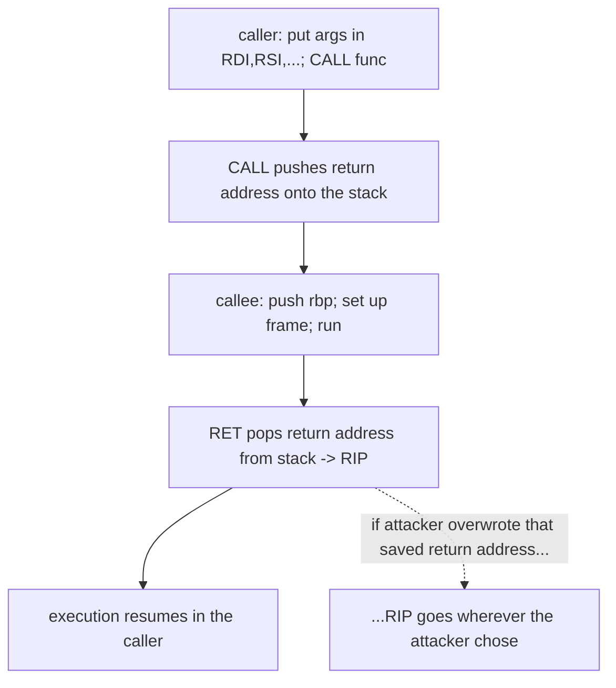

# 🧮 CPU, Assembly & the ABI

> [!warning] Lab binaries only
> Everything here is practised on programs you compile yourself or on deliberately-vulnerable practice binaries you own. Understanding the machine model is what makes exploitation *and* detection engineering possible; apply it only to authorized targets.

## Parent Learning Order
CPU, Assembly & the ABI -> Executable Formats: ELF, PE & Mach-O -> Binary Exploitation Fundamentals

## Start at Zero: The Machine Underneath the Program

Exploit development is the art of making a program do something its author never intended — and you cannot do that while thinking in C or Python. You have to think in the terms the CPU actually executes: **registers** (the CPU's handful of tiny, fast storage slots), **instructions** (the atomic operations assembly expresses), and the **ABI / calling convention** (the rulebook for how functions pass arguments, return values, and use the stack). This note builds that machine model from zero, because every memory-corruption exploit is ultimately about *controlling a register* — specifically the instruction pointer — by understanding exactly how the CPU and the ABI arranged memory.

The single most important idea: the CPU has one register that decides *what runs next* (**RIP** on x86-64), and the whole game of binary exploitation is getting attacker-controlled data into that register.

> [!tip] The analogy, and where it breaks
> The CPU is like a short-order cook who can only follow one instruction card at a time, keeping a few ingredients on the counter (registers) and a stack of order tickets spiked on a spindle (the call stack) — finish an order, pull the ticket off the spindle, and do whatever the next ticket says. The analogy breaks on trust: the cook blindly obeys whatever ticket is on top of the spindle, so if you can slip *your own* ticket onto the spindle (overwrite the return address), the cook will faithfully cook your dish — the machine has no notion that a ticket might be forged.

**Prerequisites:** the OS Internals process/memory-layout leaves, and basic C (what a function, pointer, and buffer are).

## Registers: The CPU's Working Set

On x86-64, a handful of 64-bit general-purpose registers do the work. The ones that matter constantly in exploitation:

| Register | Role |
| --- | --- |
| **RAX** | Return value; syscall number |
| **RDI, RSI, RDX, RCX, R8, R9** | First six integer/pointer **function arguments** (in that order) |
| **RSP** | **Stack pointer** — points at the top of the stack |
| **RBP** | Base/frame pointer — anchors the current stack frame |
| **RIP** | **Instruction pointer** — the address of the next instruction to execute (*the prize*) |

You cannot write directly to RIP with a `mov` — you change it only through control-flow instructions (`call`, `ret`, `jmp`). That indirection is exactly why exploitation targets the *stack* (which `ret` reads) rather than RIP directly.

![[off_x86_64_registers.svg]]

The top bar shows sub-register aliasing (`RAX` ⊃ `EAX` ⊃ `AX` ⊃ `AL`) — writing `AL` changes the low byte of `RAX`. The grid labels each general-purpose register with its System V ABI role, and the right-hand panel fixes the argument order `RDI, RSI, RDX, RCX, R8, R9` with the return value in `RAX`. This is the single most-referenced picture in exploit development: to make a target call `system("/bin/sh")`, you must first get the string's address into `RDI`.

## Assembly: What the CPU Actually Runs

Assembly is a thin, human-readable layer over machine code. A few instruction families cover most of what you read while exploiting:

```asm
mov  rdi, rax      ; copy rax into rdi (set up an argument)
lea  rdi, [rip+0x2e04] ; load an ADDRESS (e.g. a string) into rdi
push rbp           ; put rbp on the stack (RSP -= 8), start a frame
call 0x1149        ; push the return address, jump to the function
ret                ; pop the top of the stack into RIP and jump there
```

The `call`/`ret` pair is the heart of it: **`call` pushes the address of the instruction *after* it (the return address) onto the stack** and jumps; **`ret` pops that address off the stack into RIP.** So the return address — where execution resumes after a function finishes — lives *on the stack*, right where a buffer overflow can reach it.

## The ABI and Calling Conventions

The **Application Binary Interface (ABI)** is the contract that lets separately-compiled code interoperate: how arguments are passed, who cleans up the stack, how the stack must be aligned, and which registers a callee must preserve. The dominant ones:

| Platform | Convention | First args | Return |
|---|---|---|---|
| **Linux/macOS x86-64** | System V AMD64 | RDI, RSI, RDX, RCX, R8, R9 | RAX |
| **Windows x86-64** | Microsoft x64 | RCX, RDX, R8, R9 | RAX |
| **32-bit x86 (cdecl)** | Stack-based | pushed onto the stack (right-to-left) | EAX |

This matters enormously for exploitation: to make a program call `system("/bin/sh")` via a ROP chain, you must place the pointer to `"/bin/sh"` in **RDI** (System V) or **RCX** (Windows) — get the convention wrong and your chain calls the right function with garbage arguments. The ABI is not trivia; it is the wiring diagram for every code-reuse attack.



## Failure Modes and Interpretation

- **Confusing registers across conventions.** Setting up RDI on Windows (which uses RCX) yields a call with the wrong argument — a silent, confusing failure. Always confirm the target's ABI.
- **Stack alignment.** System V requires 16-byte stack alignment at a `call`; a misaligned stack crashes inside library functions (e.g. `movaps` faults). ROP chains often need an extra `ret` gadget to realign.
- **32-bit vs 64-bit thinking.** In 32-bit cdecl, arguments are on the *stack* (easy to control via overflow); in 64-bit they are in *registers* (you need gadgets to load them). Mixing the two models breaks exploits.
- **Reading assembly syntax wrong.** Intel (`mov dst, src`) vs AT&T (`mov src, dst`) reverse operand order — misreading a gadget inverts your logic.
- **Assuming `mov` to RIP works.** RIP is only reachable via control-flow transfer; this is *why* the stack-stored return address is the exploitation target.

## Security Implications — the Defender's View

- **Mitigations attack this exact model:** stack canaries guard the saved return address, shadow stacks (Intel CET) keep a protected copy of return addresses so a corrupted stack `ret` is detected, and CET's indirect-branch tracking constrains where `call`/`jmp` may land — each defends a specific step of the CPU/ABI flow.
- **Compiler hardening** (`-fstack-protector`, control-flow integrity) inserts checks around the call/return machinery an attacker abuses.
- **Detection engineers read assembly and register state too:** recognizing ROP-like control flow, `execve` syscall setup (RAX=59, RDI=/bin/sh), or an unexpected RWX allocation depends on the same machine model — offense and defense share this literacy.

## Authorized Lab: See the Machine Model Directly

> [!info] Runs on one Linux machine with gcc + gdb — you compile a tiny program and watch registers, the stack, and the return address
> No exploitation yet — this is the model every later exploit assumes. Step 4 cleans up.

### Step 1 — A minimal program with a function call

```bash
mkdir -p /tmp/cpu-lab && cd /tmp/cpu-lab
cat > demo.c <<'EOF'
#include <stdio.h>
int add(int a, int b){ return a + b; }
int main(void){ printf("%d\n", add(2, 3)); return 0; }
EOF
gcc -O0 -no-pie -fno-stack-protector demo.c -o demo && echo "compiled"
```

```text
compiled
```

### Step 2 — Read the ABI in the disassembly

```bash
cd /tmp/cpu-lab
objdump -d --disassemble=main -M intel demo | grep -E 'mov|call|edi|esi' | head -6
```

```text
  ...:  be 03 00 00 00        mov    esi,0x3          ; 2nd arg (b) -> ESI/RSI
  ...:  bf 02 00 00 00        mov    edi,0x2          ; 1st arg (a) -> EDI/RDI
  ...:  e8 .. .. .. ..        call   <add>            ; CALL pushes return addr
```

There it is: `main` loads the first argument into **EDI** and the second into **ESI** — exactly the System V convention — then `call` transfers control (and pushes the return address). The ABI is not abstract; it is written into the machine code.

### Step 3 — Watch the return address on the stack in GDB

```bash
cd /tmp/cpu-lab
gdb -q -batch \
  -ex 'break add' -ex 'run' \
  -ex 'info registers rsp rip' \
  -ex 'x/1xg $rsp' \
  ./demo 2>/dev/null | grep -E 'rsp|rip|0x7ff'
```

```text
rsp            0x7fffffffe3c8      0x7fffffffe3c8
rip            0x401126            0x401126 <add+4>
0x7fffffffe3c8: 0x0000000000401160
```

At the top of `add`'s stack (`RSP`) sits `0x401160` — the **return address** back into `main`. When `add` finishes, `ret` will pop *that value* into RIP. An overflow that overwrites this stack slot is the entire premise of the next leaves.

### Step 4 — Cleanup

```bash
cd /; rm -rf /tmp/cpu-lab; ls -d /tmp/cpu-lab 2>&1 | tail -1
```

```text
ls: cannot access '/tmp/cpu-lab': No such file or directory
```

**What you should now be able to do:** name the key x86-64 registers and RIP's special role, read basic assembly including `call`/`ret`, explain the System V and Windows calling conventions and why they matter for code-reuse attacks, and locate a return address on the stack in GDB.

## Crook → Operator → Root Checkpoint

- **Crook:** Explain what registers, RIP, and the stack are, and why the return address lives on the stack.
- **Operator:** Read a disassembly to identify argument registers and the `call`/`ret` flow, and find the saved return address in GDB.
- **Root:** Explain why the calling convention determines how a ROP chain sets up arguments, how stack alignment and 32- vs 64-bit change exploitation, and how CET/canaries/CFI defend the exact CPU-ABI mechanics attackers abuse.

---
> 🔼 Up: [[Exploit Foundations & Architecture]]
