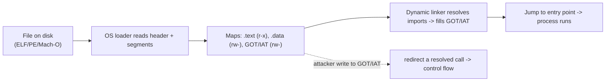

# 📦 Executable Formats: ELF, PE & Mach-O

> [!warning] Lab binaries only
> Inspect only binaries you own or deliberately-vulnerable practice files. Format literacy powers both exploitation and malware analysis/detection — apply it to authorized targets.

## Parent Learning Order
CPU, Assembly & the ABI -> Executable Formats: ELF, PE & Mach-O -> Binary Exploitation Fundamentals

## Start at Zero: How a File Becomes a Running Process

A program on disk is not raw machine code — it is a **structured container** that tells the operating-system loader how to build a process: which bytes are code, which are data, where execution starts, which libraries to load, and what memory permissions each region gets. The three formats you meet are **ELF** (Linux/Unix), **PE** (Windows `.exe`/`.dll`), and **Mach-O** (macOS/iOS). Understanding them is foundational for exploit development because *the format defines the memory layout you will attack* — where the code is, whether it is relocatable (PIE/ASLR), which sections are writable, and where the tables an exploit abuses (the GOT/PLT, import tables) live.

The unifying idea across all three: a **header** describes the file, **sections** organize it for the linker, and **segments** tell the loader what to map into memory and with what permissions (`r-x` code, `rw-` data). Exploitation lives in the gap between what *should* be writable and what actually is.

> [!tip] The analogy, and where it breaks
> An executable format is like a shipping container with a manifest: the manifest (header) says what's inside, the packing list (sections) is for the warehouse (linker), and the loading plan (segments) tells the crane operator (OS loader) which crates go where and which are fragile (permissions). The analogy breaks on self-modification: a real container is inert once packed, whereas a running program keeps *live tables* (like the GOT) that get written to as it runs — and an attacker who corrupts those tables redirects the program's own future function calls, something no physical manifest allows.

**Prerequisites:** **CPU, Assembly & the ABI** (registers, code vs data) and the OS Internals process-memory leaves.

## The Three Formats at a Glance

| Aspect | ELF (Linux) | PE (Windows) | Mach-O (macOS) |
|---|---|---|---|
| Header | ELF header | DOS stub + PE/COFF header | Mach header |
| Code/data units | Sections (link) / Segments (load) | Sections (`.text`, `.data`, `.rdata`) | Segments / Sections |
| Entry point | `e_entry` | `AddressOfEntryPoint` | `LC_MAIN` |
| Dynamic linking | GOT + PLT | Import Address Table (IAT) | lazy/stub binding + `__got` |
| Inspect with | `readelf`, `objdump`, `nm` | `dumpbin`, PE-bear | `otool`, `nm` |

They differ in vocabulary but share the same skeleton: **header → tables of sections/segments → symbol/relocation info → dynamic-linking tables.** Learn one deeply (ELF, because it is inspectable on Linux with standard tools) and the others transfer.

![[off_executable_formats.svg]]

Read each column top-down: a magic number identifies the file, a header/command table describes the segments, then code (`.text` / `__TEXT`) and data land in separate regions the loader maps with different permissions (code executable and read-only, data writable and non-executable — W^X / NX). The point of the side-by-side view is that the *same conceptual slots* — header, segment/section table, code, data, link metadata — recur across ELF, PE, and Mach-O, so learning one transfers to the others.

## The Tables Exploits Care About

Dynamic linking is where exploitation and formats intersect hardest:

- **PLT (Procedure Linkage Table)** — stubs the program calls for external functions like `printf`.
- **GOT (Global Offset Table)** — a *writable* table of resolved function addresses the PLT jumps through. Because it is written at runtime and lives in a writable segment, an attacker who can write to the GOT can redirect any library call (a **GOT overwrite**) — a classic technique enabled purely by understanding the format.
- **PE Import Address Table (IAT)** — the Windows equivalent, and a favorite of both exploits and malware (IAT hooking).

This is why the format is not academic: knowing *where* the GOT/IAT is and *whether* it is writable (Full RELRO makes the GOT read-only) directly decides whether a write-what-where primitive becomes code execution.



## Failure Modes and Interpretation

- **Assuming the GOT is writable.** Modern binaries built with **Full RELRO** map the GOT read-only after startup, defeating GOT-overwrite — check (`readelf -l`, look for `GNU_RELRO`) before planning it.
- **PIE vs non-PIE.** A **PIE** binary is loaded at a randomized base (ASLR applies to the binary itself); a non-PIE binary has fixed addresses. Confusing the two makes every hardcoded address wrong.
- **Section vs segment confusion.** Sections are for the *linker* (may be absent in a stripped binary); segments are what the *loader* maps. Exploit reasoning uses segments and their permissions.
- **Stripped binaries.** No symbol table means `nm` shows nothing; you work from addresses and reversing, not names.
- **Cross-format assumptions.** GOT (ELF) and IAT (PE) behave differently under their respective hardening; don't port a Linux technique to Windows without checking the PE specifics.

## Security Implications — the Defender's View

- **Format hardening is a mitigation layer:** Full RELRO (read-only GOT), PIE/ASLR (randomized base), and W^X (no segment both writable and executable) each remove a format-level exploitation primitive.
- **Malware analysis uses the same literacy:** unusual sections, RWX segments, packed/obfuscated headers, and suspicious imports (IAT full of `VirtualAlloc`/`WriteProcessMemory`) are triage signals — reading the format is a core blue-team skill too.
- **Integrity and signing:** code signing (Mach-O/PE Authenticode) and secure boot verify the file's integrity before it runs, attacking the "load an arbitrary binary" step.
- **Detection of tampering:** comparing a binary's on-disk sections and imports against a known-good baseline catches implanted code and IAT/GOT manipulation.

## Authorized Lab: Dissect an ELF and Find Its GOT

> [!info] Runs on one Linux machine with gcc + binutils — inspect a real ELF's header, segments, permissions, and dynamic tables
> ELF is inspected live; PE/Mach-O behavior is described (they need their own platforms). Step 4 cleans up.

### Step 1 — Build a dynamically-linked ELF

```bash
mkdir -p /tmp/fmt-lab && cd /tmp/fmt-lab
printf '#include <stdio.h>\nint main(void){ puts("hi"); return 0; }\n' > p.c
gcc -no-pie p.c -o p && echo "built non-PIE ELF"
```

```text
built non-PIE ELF
```

### Step 2 — Read the header and entry point

```bash
cd /tmp/fmt-lab
readelf -h p | grep -E 'Type|Entry point|Machine'
```

```text
  Type:                              EXEC (Executable file)
  Machine:                           Advanced Micro Devices X86-64
  Entry point address:               0x401050
```

`EXEC` (not `DYN`) confirms this is a non-PIE binary with a *fixed* entry point at `0x401050` — addresses are stable, which changes how you'd exploit it versus a PIE build.

### Step 3 — Find the GOT and check segment permissions

```bash
cd /tmp/fmt-lab
echo "--- GOT entries (writable table the PLT jumps through) ---"
readelf -r p | grep -iE 'puts|GLOB_DAT|JUMP_SLOT' | head -3
echo "--- segment permissions (E=execute, W=write) ---"
readelf -l p | grep -A1 -E 'LOAD|GNU_RELRO' | grep -E 'LOAD|RELRO|R E|RW' | head -4
```

```text
--- GOT entries (writable table the PLT jumps through) ---
000000404018  ...  R_X86_64_JUMP_SLOT   puts@GLIBC_...
--- segment permissions (E=execute, W=write) ---
  LOAD  ... R E     ; .text : readable + executable, NOT writable (W^X)
  LOAD  ... RW      ; .data/.got : writable
```

The `puts` call resolves through a **JUMP_SLOT** in the GOT at `0x404018`, which sits in a **writable** LOAD segment — so a write primitive to that address could redirect every future `puts` call. Meanwhile `.text` is `R E` (never writable): W^X in action. Whether Full RELRO would lock that GOT is the exact check an exploit plan must make.

### Step 4 — Cleanup

```bash
cd /; rm -rf /tmp/fmt-lab; ls -d /tmp/fmt-lab 2>&1 | tail -1
```

```text
ls: cannot access '/tmp/fmt-lab': No such file or directory
```

**What you should now be able to do:** describe ELF/PE/Mach-O as header + sections/segments + dynamic tables, explain the GOT/PLT (and PE's IAT) and why the GOT is an exploitation target, inspect an ELF's header/permissions/relocations with `readelf`, and name the format hardening (RELRO, PIE, W^X) that defends each primitive.

## Crook → Operator → Root Checkpoint

- **Crook:** Explain why an executable is a structured container and what the loader does with a header, segments, and permissions.
- **Operator:** Inspect an ELF with `readelf`/`objdump` to find the entry point, segment permissions, and GOT/PLT, and distinguish PIE from non-PIE.
- **Root:** Explain why the GOT/IAT is an exploitation target, how Full RELRO / PIE / W^X remove format-level primitives, and how the same format literacy drives malware triage and tamper detection.

---
> 🔼 Up: [[Exploit Foundations & Architecture]]
