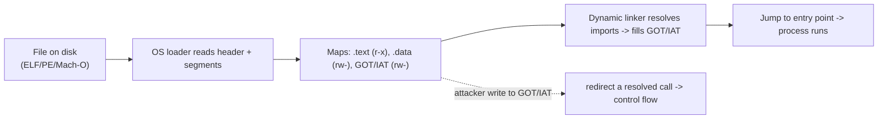

# 📦 Executable Formats: ELF, PE & Mach-O

> [!warning] Lab binaries only
> Inspect only binaries you own or deliberately-vulnerable practice files. Format literacy powers both exploitation and malware analysis/detection — apply it to authorized targets.

## Parent Learning Order
CPU, Assembly & the ABI -> Executable Formats: ELF, PE & Mach-O -> Binary Exploitation Fundamentals

## How a File Becomes a Running Process

> *Is the `.exe` sitting on disk machine code the CPU can run directly?*
>
> Hold your answer — the section below is the response.

A program on disk is not raw machine code — it is a **structured container** that tells the operating-system loader how to build a process: which bytes are code, which are data, where execution starts, which libraries to load, and what memory permissions each region gets. The three formats you meet are **ELF** (Linux/Unix), **PE** (Windows `.exe`/`.dll`), and **Mach-O** (macOS/iOS). Understanding them is foundational for exploit development because *the format defines the memory layout you will attack* — where the code is, whether it is relocatable (PIE/ASLR), which sections are writable, and where the tables an exploit abuses (the GOT/PLT, import tables) live.

The unifying idea across all three: a **header** describes the file, **sections** organize it for the linker, and **segments** tell the loader what to map into memory and with what permissions (`r-x` code, `rw-` data). Exploitation lives in the gap between what *should* be writable and what actually is.

> [!tip] The analogy, and where it breaks
> An executable format is like a shipping container with a manifest: the manifest (header) says what's inside, the packing list (sections) is for the warehouse (linker), and the loading plan (segments) tells the crane operator (OS loader) which crates go where and which are fragile (permissions). The analogy breaks on self-modification: a real container is inert once packed, whereas a running program keeps *live tables* (like the GOT) that get written to as it runs — and an attacker who corrupts those tables redirects the program's own future function calls, something no physical manifest allows.

**Prerequisites:** **CPU, Assembly & the ABI** (registers, code vs data) and the OS Internals process-memory leaves.

## The Three Formats at a Glance

| Aspect | ELF (Linux) | PE (Windows) | Mach-O (macOS) |
|---|---|---|---|
| Header | ELF header | DOS stub + PE/COFF header | Mach header |
| Code/data units | Sections (link) / Segments (load) | Sections (`.text`, `.data`, `.rdata`) | Segments / Sections |
| Entry point | `e_entry` | `AddressOfEntryPoint` | `LC_MAIN` |
| Dynamic linking | GOT + PLT | Import Address Table (IAT) | lazy/stub binding + `__got` |
| Inspect with | `readelf`, `objdump`, `nm` | `dumpbin`, PE-bear | `otool`, `nm` |

They differ in vocabulary but share the same skeleton: **header → tables of sections/segments → symbol/relocation info → dynamic-linking tables.** Learn one deeply (ELF, because it is inspectable on Linux with standard tools) and the others transfer.

Read each column top-down: a magic number identifies the file, a header/command table describes the segments, then code (`.text` / `__TEXT`) and data land in separate regions the loader maps with different permissions (code executable and read-only, data writable and non-executable — W^X / NX). The point of the side-by-side view is that the *same conceptual slots* — header, segment/section table, code, data, link metadata — recur across ELF, PE, and Mach-O, so learning one transfers to the others.

## The Tables Exploits Care About

Dynamic linking is where exploitation and formats intersect hardest:

- **PLT (Procedure Linkage Table)** — stubs the program calls for external functions like `printf`.
- **GOT (Global Offset Table)** — a *writable* table of resolved function addresses the PLT jumps through. Because it is written at runtime and lives in a writable segment, an attacker who can write to the GOT can redirect any library call (a **GOT overwrite**) — a classic technique enabled purely by understanding the format.
- **PE Import Address Table (IAT)** — the Windows equivalent, and a favorite of both exploits and malware (IAT hooking).

This is why the format is not academic: knowing *where* the GOT/IAT is and *whether* it is writable (Full RELRO makes the GOT read-only) directly decides whether a write-what-where primitive becomes code execution.



## Worked Example: Reading a Binary for Its Attack Surface

Before any exploit plan, the format itself answers three questions: are the
addresses fixed, which memory is writable, and which writable memory is
dereferenced as code.

**Is it PIE?**

```shell-session
analyst@lab:/tmp/fmt-lab$ readelf -h p | grep -E 'Type|Entry point|Machine'
  Type:                              EXEC (Executable file)
  Machine:                           Advanced Micro Devices X86-64
  Entry point address:               0x401050
```

`EXEC` rather than `DYN` means this binary is **not** position-independent, so it
loads at a fixed base and `0x401050` is where it starts every single run. Every
address inside it is therefore a constant an exploit can hardcode. A `DYN` type
would mean the loader relocates it and those addresses change per execution,
which turns a one-line chain into a problem requiring an information leak first.

**Which writable memory gets called as code?**

```shell-session
analyst@lab:/tmp/fmt-lab$ readelf -r p | grep -iE 'JUMP_SLOT'
000000404018  000100000007 R_X86_64_JUMP_SLOT  0000000000000000 puts@GLIBC_2.2.5 + 0

analyst@lab:/tmp/fmt-lab$ readelf -l p | grep -E 'LOAD|GNU_RELRO'
  LOAD    0x0000000000001000  ...  R E
  LOAD    0x0000000000003db8  ...  RW
  GNU_RELRO 0x0000000000003db8 ...  R
```

The `puts` call does not jump directly to libc. It jumps through a slot in the
Global Offset Table at `0x404018`, and that slot lives in the `RW` LOAD segment.
So a write primitive that reaches `0x404018` redirects every future `puts` call
in the program — no stack corruption required.

Meanwhile `.text` is `R E`: readable and executable but never writable. That is
W^X, and it is why injected shellcode on the stack does not run and why code
reuse became the dominant technique.

The `GNU_RELRO` line is the one that decides whether the GOT attack is available
at all. RELRO marks part of that writable region read-only after the dynamic
linker finishes. Under **Full** RELRO the GOT is resolved eagerly and then locked,
and the write target disappears; under **Partial** RELRO it stays writable for
lazy binding. Checking which one you are facing is not a formality — it is the
difference between a working plan and a wasted afternoon.

## GOT assumptions that modern binaries break

- **Assuming the GOT is writable.** Modern binaries built with **Full RELRO** map the GOT read-only after startup, defeating GOT-overwrite — check (`readelf -l`, look for `GNU_RELRO`) before planning it.
- **PIE vs non-PIE.** A **PIE** binary is loaded at a randomized base (ASLR applies to the binary itself); a non-PIE binary has fixed addresses. Confusing the two makes every hardcoded address wrong.
- **Section vs segment confusion.** Sections are for the *linker* (may be absent in a stripped binary); segments are what the *loader* maps. Exploit reasoning uses segments and their permissions.
- **Stripped binaries.** No symbol table means `nm` shows nothing; you work from addresses and reversing, not names.
- **Cross-format assumptions.** GOT (ELF) and IAT (PE) behave differently under their respective hardening; don't port a Linux technique to Windows without checking the PE specifics.

**The deliberate break:** an executable reads as machine code — the bytes the CPU will run, stored in a file.

It is a **structured description of how to build a process**: which regions are code and which are data, where execution begins, which libraries must be resolved, and what memory permissions each region receives. The parts that matter most to exploitation are the tables the loader *writes at runtime* — the GOT and PLT, the import address table — because those are mutable loader state rather than program code, which is exactly why they are targeted and exactly why making them read-only is a mitigation at all.

**How you'd spot it:** read the headers before the disassembly. `checksec` and `readelf -d` state in one line whether the GOT is writable, whether the binary is position-independent, and what it depends on — which bounds what an exploit against it can do. The same literacy inverts cleanly for triage: an RWX segment, a malformed or stripped header, and an import table dominated by `VirtualAlloc` and `WriteProcessMemory` are signals available from the format alone, before anything is executed.

## Security Implications — the Defender's View

- **Format hardening is a mitigation layer:** Full RELRO (read-only GOT), PIE/ASLR (randomized base), and W^X (no segment both writable and executable) each remove a format-level exploitation primitive.
- **Malware analysis uses the same literacy:** unusual sections, RWX segments, packed/obfuscated headers, and suspicious imports (IAT full of `VirtualAlloc`/`WriteProcessMemory`) are triage signals — reading the format is a core blue-team skill too.
- **Integrity and signing:** code signing (Mach-O/PE Authenticode) and secure boot verify the file's integrity before it runs, attacking the "load an arbitrary binary" step.
- **Detection of tampering:** comparing a binary's on-disk sections and imports against a known-good baseline catches implanted code and IAT/GOT manipulation.

## Summary

You should now be able to:

- Explain why an executable is a structured container and what the loader does with a header, segments, and permissions.
- Inspect an ELF with `readelf`/`objdump` to find the entry point, segment permissions, and GOT/PLT, and distinguish PIE from non-PIE.
- Explain why the GOT/IAT is an exploitation target, how Full RELRO / PIE / W^X remove format-level primitives, and how the same format literacy drives malware triage and tamper detection.

---
> 🔼 Up: [[Exploit Foundations & Architecture]]
