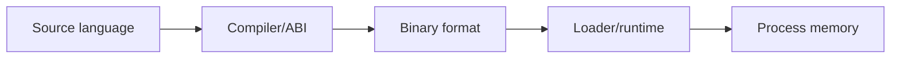

# Exploit Foundations & Architecture

## 🗺️ Zero-to-Mastery Learning Path

1. [[CPU, Assembly & the ABI]]
2. [[Executable Formats: ELF, PE & Mach-O]]
3. [[Binary Exploitation Fundamentals]]

---
> 🔼 Up: [[Exploit Development]]
