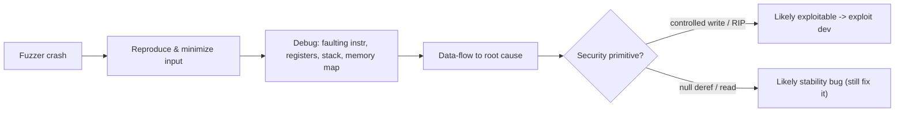

# 🐛 Fuzzing, Debugging & Crash Triage

> [!danger] Authorized simulation / lab binaries only
> Fuzz only software you own or are authorized to test. The lab fuzzes a program you compile. Fuzzing can find real 0-days — handle any findings responsibly. Never fuzz production or third-party systems without authorization.

## Parent Learning Order
Exploit Foundations & Architecture -> Fuzzing, Debugging & Crash Triage -> Memory Corruption Exploitation -> Exploit Construction & Control Flow -> Platform Exploitation

## Finding the Bug Before You Exploit It

> *Your fuzzer produced 4,000 crashes overnight. How many are exploits?*
>
> Hold your answer — the section below is the response.

Every exploit-dev leaf so far assumed you *already had* a vulnerability. This note is how you *find* one and *understand* it — the front of the pipeline. **Fuzzing** automatically feeds a program huge volumes of malformed/mutated input to make it crash; **debugging and crash triage** then analyze each crash to answer the only question that matters: *is this crash exploitable, and what is the root cause?* The two belong together because they are one loop — fuzz until it crashes, triage the crash, minimize the input, fix or weaponize, repeat. This is how most real memory-corruption CVEs are actually discovered.

The core insight: **a crash is not a bug report, it is a lead.** Thousands of fuzzer crashes may collapse to a handful of unique root causes, and only some are exploitable — triage is the skill that separates a null-pointer dereference (a stability bug) from a controlled memory write (a weapon).

> [!tip] The analogy, and where it breaks
> Fuzzing is like stress-testing a dam by hurling millions of random objects at it and watching for leaks; crash triage is the engineer who inspects each leak to decide whether it's a harmless drip or a crack that will burst. The analogy breaks on *coverage*: random objects mostly bounce off, whereas a modern **coverage-guided** fuzzer *learns* — it keeps inputs that reach new code, steering itself deeper into the dam like an attacker who remembers which throws found weak spots, so it explores far more efficiently than blind randomness.

**Prerequisites:** **CPU, Assembly & the ABI** (registers/gdb), **Binary Exploitation Fundamentals** (what a controlled crash means), C basics.

## Fuzzing: Types and What Makes It Work

Fuzzers vary by how they generate inputs and whether they use feedback:

| Type | How it works | Best for |
|---|---|---|
| **Black-box (dumb)** | Random/mutated inputs, no feedback | Quick, simple targets |
| **Coverage-guided** | Keeps inputs that reach new code (AFL++, libFuzzer) | The modern default — finds deep bugs |
| **Grammar/structure-aware** | Generates valid-ish structured input | Parsers, languages, protocols |
| **Differential** | Compares two implementations' outputs | Finding spec/logic divergences |
| **Stateful / network** | Drives protocol state machines | Servers, network daemons |

The decisive factor is **harness quality**: a good harness removes nondeterminism, resets state between runs, caps resources, seeds a valid **corpus**, and reaches the target code quickly. Coupled with a **sanitizer** (ASan/UBSan) that turns silent corruption into an immediate, precise crash, coverage-guided fuzzing is extraordinarily effective.

**The deliberate break:** the fuzzer found crashes, so the fuzzer found vulnerabilities. Thousands of them, judging by the output directory.

Most crashes are worth nothing, and the ones that are worth something are usually a handful. A null-pointer dereference crashes reliably and grants no control. Thousands of "unique" crashes routinely deduplicate to three bugs reached by different inputs. And a crash far from the corrupting write — an integer overflow that produces a bad size, crashing later inside `memcpy` — will point your investigation at innocent code if you trust the crash site.

**Triage is the actual skill**, and it is the step people skip because the crash count feels like progress. The question is never "did it crash" but "**what does the crash let me control**" — the instruction pointer, an allocation size, the contents of a write, and where the corruption originally happened rather than where the program noticed.

**How you'd spot a real one:** ask whether the faulting address is attacker-influenced. A dereference of `0x0` is a bug; a dereference of `0x4141414141414141` is a weapon, and the difference costs one glance at the register.

## Crash Triage: From Crash to Verdict

Triage answers reproducibility, faulting instruction, corrupted state, input offset, root cause, and — crucially — **exploitability**:



Collect the exact build ID, symbols, the crashing input, environment, sanitizer output, registers, stack, and memory map. Distinguish a **read** fault (often info-leak/DoS) from a **write** fault (often exploitable) from **RIP control** (very likely exploitable). Deduplicate crashes by root cause — many inputs, one bug.

## Worked Example: A Crash, and Deciding Whether It Matters

Fuzzing produces crashes cheaply. Triage is the part that decides which of them
are worth a week of exploit development, and the question it answers is narrow:
did the crash hand the attacker the instruction pointer?

**The target** copies input into a fixed buffer with no bounds check:

```c
void process(char *p){ char b[64]; strcpy(b, p); }
int main(void){ char in[1024]; ssize_t n = read(0, in, sizeof(in)-1);
                in[n>0?n:0] = 0; process(in); return 0; }
```

**A fuzzer at its smallest** — mutate, run, watch for a signal:

```python
for n in range(8, 300, 8):
    r = subprocess.run(["./target"], input=b"A"*n)
    if r.returncode and r.returncode < 0:      # negative = killed by a signal
        print(f"CRASH at input length {n}: signal {-r.returncode}")
        open("crash.bin","wb").write(b"A"*n)
        break
```

```shell-session
analyst@lab:/tmp/fuzz-lab$ python3 fuzz.py
CRASH at input length 72: signal 11 (11=SIGSEGV)
```

Seventy-two bytes is a lead, not a finding. A coverage-guided fuzzer such as
AFL++ would find far subtler bugs than a length sweep, but the loop is identical:
mutate the input, detect the crash, save the reproducer.

**Triage** pushes further past the return address and asks what `RIP` holds:

```shell-session
analyst@lab:/tmp/fuzz-lab$ python3 -c "open('crash2.bin','wb').write(b'A'*88)"
analyst@lab:/tmp/fuzz-lab$ gdb -q -batch -ex 'run < crash2.bin' -ex 'info registers rip' ./target
Program received signal SIGSEGV, Segmentation fault.
rip            0x4141414141414141  0x4141414141414141
```

**That is the verdict.** `RIP` contains attacker bytes, so this crash is not a
null-dereference or a failed allocation — it is a write that reached the return
address, and the instruction pointer is already under external control. In triage
terms that is the highest-severity class, and it justifies exploit development.

The distinction matters because most fuzzer crashes are not this. A SIGSEGV
reading address `0x0`, or one where `RIP` holds a valid code address and a data
pointer is corrupt, may still be a denial of service and still worth fixing — but
it does not demonstrate control-flow hijack, and treating every crash as
equally severe is how triage backlogs become useless.

The root cause here is an unbounded `strcpy` into a 64-byte stack buffer. Running
the same fuzzer under AddressSanitizer would have caught the overflow at the
moment of the write rather than at the eventual crash, naming the exact line —
which is why ASan in CI finds these before an attacker's fuzzer does.

## WinDbg Crash Triage: The Windows Workflow

The Linux workflow (GDB + ASan) works on ELF targets. OSED-track binaries run on Windows, and Windows has its own debugger, its own crash classification extension, and its own offset/gadget toolkit. The concepts are identical; the commands differ.

**WinDbg** is the Windows kernel and user-mode debugger of choice for exploit development — leaner than Visual Studio, command-driven, and aware of Windows internals (PEB, TEB, pool, kernel objects). You attach it to a crashing process or launch the target directly.

### `!exploitable` — automated crash classification

`!exploitable` (shipped as MSEC.dll, part of the [WinDbg extension pack](https://github.com/nicowillis/exploitable)) inspects the current exception and classifies it in one pass:

| Rating | Meaning |
|---|---|
| **EXPLOITABLE** | EIP/RIP under attacker control, or a heap/stack overwrite with a clear control primitive |
| **PROBABLY_EXPLOITABLE** | Corruption is present; a control path is plausible but not directly demonstrated |
| **PROBABLY_NOT_EXPLOITABLE** | Null-deref, read-AV at a valid address — stability bug, likely not a weapon |
| **UNKNOWN** | Insufficient info (missing symbols, kernel context) — rerun with symbols loaded |

It does not replace manual triage — but it collapses 4,000 crash files to a short list of EXPLOITABLE cases in seconds.

### mona.py — the exploit-dev Swiss army knife

`mona.py` is a Python plugin for Immunity Debugger (and compatible with WinDbg via pwndbg bridges) that automates the mechanical steps between "crash found" and "shellcode lands":

| Task | mona command |
|---|---|
| Generate cyclic pattern | `!mona pattern_create 300` |
| Find offset from EIP value | `!mona pattern_offset 41386341` |
| Generate bad-char byte array | `!mona bytearray` |
| Compare memory to byte array | `!mona compare -f bytearray.bin -a <ESP addr>` |
| Find modules without mitigations | `!mona modules` |
| Find JMP ESP gadget | `!mona find -s "\xff\xe4" -m vulnsvc.exe` |
| Generate ROP chain | `!mona rop -m kernel32.dll` |

### Workflow side-by-side

| Step | Linux — GDB + ASan | Windows — WinDbg + mona |
|---|---|---|
| Launch / attach | `gdb ./target` → `run < crash.bin` | `windbg -g target.exe` or `attach <PID>` |
| Register dump | `info registers` | `r` |
| Call stack | `backtrace` | `kb` |
| Exploitability | manual read of RIP | `!exploitable` |
| Cyclic pattern | Python cyclic() | `!mona pattern_create 300` |
| Offset | Python cyclic_find() | `!mona pattern_offset <EIP val>` |
| Bad chars | manual send + compare | `!mona bytearray` + `!mona compare` |
| Module safety | `checksec` | `!mona modules` |
| Return gadget | ROPgadget / ropper | `!mona find -s "\xff\xe4"` |

### Worked example — VulnSvc on WS-014

**Target:** VulnSvc, a deliberately vulnerable TCP listener on WS-014 (10.10.10.14:9999), compiled without ASLR and without SafeSEH.

```
Step 1 — Attach and fuzz to crash
```

```windbg
; Launch: windbg -g vulnsvc.exe   (or File → Attach to Process)
; Send 300-byte payload from fuzzer — service crashes
; WinDbg breaks in at the access violation

(1a2c.4f0): Access violation - code c0000005 (!!! second chance !!!)
eip=41414141 esp=0192fa44 ebp=41414141
```

```
Step 2 — Classify the crash
```

```windbg
0:000> !exploitable
Exploitability Classification: EXPLOITABLE
Recommended Bug Title: Exploitable - Stack Buffer Overrun starting at
  vulnsvc!process+0x00000041 (Hash=0x4f5c1b2a.0x1f3a9c87)
```

```
Step 3 — Find the offset
```

```windbg
0:000> !mona pattern_create 300
; Output saved to pattern.txt — resend as payload, crash again

0:000> r eip
eip=41386341

0:000> !mona pattern_offset 41386341
Pattern 41386341 (As 'A8cA') found in cyclic pattern at position 112
; → 112 bytes of padding reach the return address
```

```
Step 4 — Bad-char sweep
```

```windbg
0:000> !mona bytearray
; Sends ...ÿ to the stack region after EIP

0:000> !mona compare -f bytearray.bin -a 0192fa44
; Bad chars identified:  
 (null and newline stripped by the service)
```

```
Step 5 — Module and gadget selection
```

```windbg
0:000> !mona modules
; Columns: Rebase | SafeSEH | ASLR | NXCompat | OS DLL
; vulnsvc.exe: False | False | False | False | False  ← ideal for a static JMP ESP

0:000> !mona find -s "\xff\xe4" -m vulnsvc.exe
0x10014c7f : "\xff\xe4"  | vulnsvc.exe
; → redirect EIP here, ESP already points at shellcode
```

**Triage verdict:** EIP is attacker-controlled at offset 112. The module has no mitigations. A single JMP ESP gadget at a predictable address redirects execution to ESP-resident shellcode. This crash is EXPLOITABLE and moves directly to shellcode development in Memory Corruption Exploitation.

## Why a crash is not yet a weapon

- **Crash ≠ exploitable.** A null-pointer dereference crashes but usually isn't a weapon; triage classifies severity — don't over- or under-claim.
- **Duplicate crashes.** Thousands of fuzzer crashes often share a few root causes; failing to deduplicate wastes triage time.
- **Bad harness = shallow bugs.** A harness that doesn't reset state, seeds nothing, or can't reach deep code finds only trivial bugs — harness quality dominates results.
- **Nondeterminism hides bugs.** Time/random/threads make crashes unreproducible; control them or triage is impossible.
- **Sanitizer off.** Without ASan, memory corruption may not crash at the moment it happens, masking the real root cause far from the symptom.

## Security Implications — the Defender's View

- **Fuzzing is a defensive tool first:** running coverage-guided fuzzers with sanitizers in CI (OSS-Fuzz-style) finds memory bugs before attackers do — arguably the highest-ROI secure-development practice for C/C++.
- **Sanitizers in testing** (ASan/UBSan/MSan) surface undefined behavior precisely, turning latent corruption into an actionable, root-caused report.
- **Triaging your own crashes** lets defenders prioritize fixes by exploitability, not just by crash count.
- **Memory-safe languages** remove the entire class the fuzzer hunts — the strategic complement to fuzzing legacy code.
- **Detection tie-in:** a service crashing repeatedly under malformed input is *itself* an attack signal (someone fuzzing you in production) — monitor for it.

## Summary

You should now be able to:

- Explain what fuzzing does, why a crash is a lead not a verdict, and the fuzz→triage loop.
- Fuzz a target to produce a crash, then triage it in a debugger — GDB on Linux or WinDbg with `!exploitable` and mona.py on Windows — to determine whether it yields RIP/write control, find the offset, clear bad chars, and identify a return gadget.
- Explain why coverage-guidance + sanitizers + a good harness dominate results, how to classify exploitability, and why fuzzing-in-CI and memory-safe languages are the decisive defenses.

---
> 🔼 Up: [[Exploit Development]]
