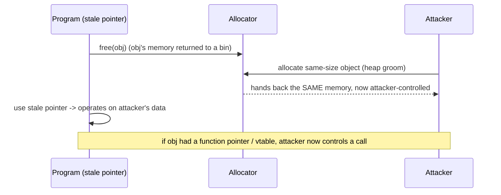

# 🧩 Heap Exploitation & Use-After-Free

> [!danger] Authorized simulation / lab binaries only
> Practise on binaries you compile or own. Heap-bug literacy powers exploitation, allocator hardening, and crash-triage. Never target software you are not authorized to test.

## Parent Learning Order
Stack Corruption -> Heap Exploitation & Use-After-Free -> Integer, Type Confusion & Format String Bugs

## Start at Zero: Corruption Where Objects Live

The stack holds a function's short-lived locals; the **heap** holds dynamically-allocated objects that outlive a single call (`malloc`/`new`). Heap exploitation is harder and more powerful than stack work because you attack not one frame but the **allocator's bookkeeping** and the **relationships between objects** — and modern software (browsers, kernels, servers) is dominated by heap bugs. This note covers the heap corruption family together with its most important member, **use-after-free (UAF)**, because they share one root cause: *a program's assumptions about an object's memory no longer match reality*.

The unifying idea: on the heap you rarely get to pick addresses directly. Instead you **groom** the layout — allocate and free objects to arrange memory so that a corruption or a stale pointer lands on an object you control. Exploitation becomes *choreography*, not a single overflow.

> [!tip] The analogy, and where it breaks
> The heap is like a coat-check room: you hand over coats (allocate), get tickets (pointers), and reclaim them (free). A **use-after-free** is using a ticket for a coat you already collected — meanwhile the attendant gave that hook to *someone else's* coat, so your old ticket now controls a stranger's belongings. The analogy breaks on determinism: a coat-check is orderly, whereas an attacker deliberately *manipulates* which hook gets reused (heap grooming) so the reclaimed slot holds exactly the malicious object they planted — turning a mistake into a controlled primitive.

**Prerequisites:** **Binary Exploitation Fundamentals**, **Stack Corruption**, and the C memory model (pointers, `malloc`/`free`).

## The Heap Bug Family

| Bug | What happens | Primitive it yields |
|---|---|---|
| **Heap overflow** | Write past a chunk into the next chunk's data/metadata | Corrupt an adjacent object or allocator metadata |
| **Use-after-free (UAF)** | Use a pointer after its object was freed | Read/write a *reused* allocation you now control |
| **Double free** | Free the same chunk twice | Corrupt free-list/bin metadata → arbitrary allocation |
| **Invalid/wild free** | Free a non-heap or offset pointer | Allocator metadata corruption |
| **Uninitialized use** | Read a freshly-allocated chunk holding stale data | Info leak |

Allocators (glibc's ptmalloc, etc.) track free chunks in **bins/free-lists** using inline metadata. Corrupting that metadata (via overflow or double-free) can trick the allocator into returning a chunk overlapping another object or an arbitrary address — the powerful primitives behind real heap exploits.

![[off_heap_chunk.svg]]

Both chunks share the `prev_size`/`size` header (the low three bits of `size` are flags; `P` = prev_inuse). The decisive detail is on the right: once a chunk is freed, the first two words of its former *user data* are reused as the `fd`/`bk` free-list pointers. That overlap is what makes heap corruption so powerful — a use-after-free or an overflow into a freed chunk lets an attacker forge those pointers, and a forged `fd` makes the next `malloc()` return an address of the attacker's choosing.

## Why Use-After-Free Is So Exploitable

A UAF is the archetypal object-lifetime bug: a reference **outlives** its object.



The killer case: the freed object contained a **function pointer or C++ vtable**. After the free, the attacker reallocates the slot with data whose "vtable pointer" points at their gadget; when the program uses the stale pointer to make a virtual call, control flow is hijacked. Dangling pointers also arise from stale callbacks, iterator invalidation, and cross-thread/race lifetime errors.

## Failure Modes and Interpretation

- **Non-deterministic layout.** Heap state depends on prior allocations; an exploit that works once may fail as layout shifts. Grooming and allocating in the right order is the skill — expect to reset state between attempts.
- **Allocator differences.** ptmalloc, tcmalloc, jemalloc, and Windows' segment heap behave differently; a technique for one bin/allocator won't transfer blindly.
- **Hardened allocators.** Safe-linking, pointer mangling, and heap cookies (glibc tcache/`__free_hook` removal, hardened allocators) break classic metadata attacks — verify what the target uses.
- **UAF window may be tiny.** Race-driven UAFs need precise timing; a single-threaded reproduction may hide a bug that only fires under concurrency.
- **Overwrite vs. control.** Corrupting an adjacent object's *data* is not the same as controlling a *function pointer*; identify what the reclaimed memory actually governs.

## Security Implications — the Defender's View

- **Memory-safe languages eliminate UAF/heap bugs** (Rust's ownership, garbage-collected languages) — the decisive long-term fix for the class that dominates browser/kernel CVEs.
- **Hardened allocators & sanitizers:** safe-linking, delayed/quarantined free (GWP-ASan, hardened_malloc), and AddressSanitizer/`MALLOC_CHECK_` in testing catch UAF/overflow at the moment of misuse.
- **Compiler/CFI defenses:** Control-Flow Integrity and vtable verification blunt the "reclaimed vtable → hijack" step even when a UAF exists.
- **Detection:** repeated allocator aborts, heap-corruption crashes, and ASan reports in fuzzing are the pre-ship signals; unusual allocation patterns can indicate grooming at runtime.

## Authorized Lab: A Use-After-Free That Hijacks a Call

> [!info] Runs on one Linux machine with gcc — a freed object's slot is reclaimed by attacker data, redirecting a function-pointer call to a canary
> Deterministic, single-threaded teaching version. Step 5 cleans up.

### Step 1 — A program with a use-after-free on a function-pointer object

```bash
mkdir -p /tmp/uaf-lab && cd /tmp/uaf-lab
cat > uaf.c <<'EOF'
#include <stdio.h>
#include <stdlib.h>
#include <string.h>
typedef struct { void (*action)(void); char name[24]; } Obj;
void normal(void){ puts("normal action"); }
void win(void){ puts("C2R-CANARY-UAF-HIJACK"); }
int main(void){
    Obj *o = malloc(sizeof(Obj));
    o->action = normal;
    free(o);                                  // (1) object freed -> dangling pointer 'o'
    char *reclaim = malloc(sizeof(Obj));      // (2) same-size alloc reclaims the SAME memory
    *(void**)reclaim = (void*)win;            // (3) attacker writes a pointer where 'action' was
    o->action();                              // (4) USE-AFTER-FREE: stale pointer calls attacker data
    return 0;
}
EOF
gcc -O0 -w uaf.c -o uaf && echo "built"
```

```text
built
```

### Step 2 — Run it: the freed object's call is hijacked

```bash
cd /tmp/uaf-lab
./uaf
```

```text
C2R-CANARY-UAF-HIJACK
```

The `free(o)` returned the object's memory to the allocator; the next same-size `malloc` handed that *exact* slot back as `reclaim`; writing a pointer at its start overwrote where `action` used to live; and calling `o->action()` through the stale pointer executed attacker-chosen code — proven with the canary. In a real target `win` would be a gadget/shellcode.

### Step 3 — Show the reclaim is what makes it work (same address)

```bash
cd /tmp/uaf-lab
cat > addr.c <<'EOF'
#include <stdio.h>
#include <stdlib.h>
int main(void){ void*a=malloc(32); free(a); void*b=malloc(32);
  printf("freed=%p  reallocated=%p  same=%s\n", a, b, a==b?"YES":"no"); return 0; }
EOF
gcc -O0 addr.c -o addr && ./addr
```

```text
freed=0x... reallocated=0x...  same=YES
```

Same address reused — the mechanism behind every UAF: freed memory is *recycled*, and a stale pointer then aliases the new owner.

### Step 4 — State the finding and defense

```bash
echo "Finding: dangling pointer + attacker-controlled reallocation -> control of a function pointer -> code execution."
echo "Fix: null the pointer after free; memory-safe language (Rust) removes the class; ASan/hardened allocator + CFI detect/blunt it."
```

```text
Finding: dangling pointer + attacker-controlled reallocation -> control of a function pointer -> code execution.
Fix: null the pointer after free; memory-safe language (Rust) removes the class; ASan/hardened allocator + CFI detect/blunt it.
```

### Step 5 — Cleanup

```bash
cd /; rm -rf /tmp/uaf-lab; ls -d /tmp/uaf-lab 2>&1 | tail -1
```

```text
ls: cannot access '/tmp/uaf-lab': No such file or directory
```

**What you should now be able to do:** name the heap-bug family and the primitives each yields, explain heap grooming and why heap exploitation is choreography, demonstrate a UAF that reclaims a freed slot to hijack a function-pointer call, and name the safe-language/hardened-allocator/CFI defenses.

## Crook → Operator → Root Checkpoint

- **Crook:** Explain the difference between stack and heap, and what a use-after-free is.
- **Operator:** Demonstrate a UAF where a freed object's slot is reclaimed by attacker data to hijack a call, and explain heap grooming.
- **Root:** Explain the heap-bug family and their primitives, why layout non-determinism and allocator differences complicate exploitation, and how memory-safe languages, hardened allocators, sanitizers, and CFI defend the class.

---
> 🔼 Up: [[Memory Corruption Exploitation]]
