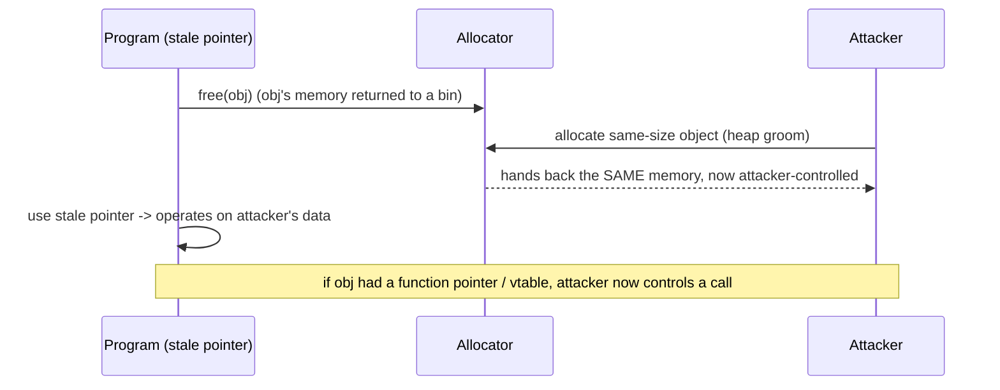

# 🧩 Heap Exploitation & Use-After-Free

> [!danger] Authorized simulation / lab binaries only
> Practise on binaries you compile or own. Heap-bug literacy powers exploitation, allocator hardening, and crash-triage. Never target software you are not authorized to test.

## Parent Learning Order
Stack Corruption -> Heap Exploitation & Use-After-Free -> Integer, Type Confusion & Format String Bugs

## Corruption Where Objects Live

> *A stack overflow corrupts one function's frame. What does a heap overflow corrupt?*
>
> Hold your answer — the section below is the response.

The stack holds a function's short-lived locals; the **heap** holds dynamically-allocated objects that outlive a single call (`malloc`/`new`). Heap exploitation is harder and more powerful than stack work because you attack not one frame but the **allocator's bookkeeping** and the **relationships between objects** — and modern software (browsers, kernels, servers) is dominated by heap bugs. This note covers the heap corruption family together with its most important member, **use-after-free (UAF)**, because they share one root cause: *a program's assumptions about an object's memory no longer match reality*.

The unifying idea: on the heap you rarely get to pick addresses directly. Instead you **groom** the layout — allocate and free objects to arrange memory so that a corruption or a stale pointer lands on an object you control. Exploitation becomes *choreography*, not a single overflow.

> [!tip] The analogy, and where it breaks
> The heap is like a coat-check room: you hand over coats (allocate), get tickets (pointers), and reclaim them (free). A **use-after-free** is using a ticket for a coat you already collected — meanwhile the attendant gave that hook to *someone else's* coat, so your old ticket now controls a stranger's belongings. The analogy breaks on determinism: a coat-check is orderly, whereas an attacker deliberately *manipulates* which hook gets reused (heap grooming) so the reclaimed slot holds exactly the malicious object they planted — turning a mistake into a controlled primitive.

**Prerequisites:** **Binary Exploitation Fundamentals**, **Stack Corruption**, and the C memory model (pointers, `malloc`/`free`).

## The Heap Bug Family

| Bug | What happens | Primitive it yields |
|---|---|---|
| **Heap overflow** | Write past a chunk into the next chunk's data/metadata | Corrupt an adjacent object or allocator metadata |
| **Use-after-free (UAF)** | Use a pointer after its object was freed | Read/write a *reused* allocation you now control |
| **Double free** | Free the same chunk twice | Corrupt free-list/bin metadata → arbitrary allocation |
| **Invalid/wild free** | Free a non-heap or offset pointer | Allocator metadata corruption |
| **Uninitialized use** | Read a freshly-allocated chunk holding stale data | Info leak |

Allocators (glibc's ptmalloc, etc.) track free chunks in **bins/free-lists** using inline metadata. Corrupting that metadata (via overflow or double-free) can trick the allocator into returning a chunk overlapping another object or an arbitrary address — the powerful primitives behind real heap exploits.

Both chunks share the `prev_size`/`size` header (the low three bits of `size` are flags; `P` = prev_inuse). The decisive detail is on the right: once a chunk is freed, the first two words of its former *user data* are reused as the `fd`/`bk` free-list pointers. That overlap is what makes heap corruption so powerful — a use-after-free or an overflow into a freed chunk lets an attacker forge those pointers, and a forged `fd` makes the next `malloc()` return an address of the attacker's choosing.

## Why Use-After-Free Is So Exploitable

A UAF is the archetypal object-lifetime bug: a reference **outlives** its object.



The killer case: the freed object contained a **function pointer or C++ vtable**. After the free, the attacker reallocates the slot with data whose "vtable pointer" points at their gadget; when the program uses the stale pointer to make a virtual call, control flow is hijacked. Dangling pointers also arise from stale callbacks, iterator invalidation, and cross-thread/race lifetime errors.

## Worked Example: Freed Memory Comes Back, and the Stale Pointer Still Works

A use-after-free needs two things the allocator provides for free: memory that
gets recycled, and a pointer nobody invalidated.

**The specimen.** A struct whose first member is a function pointer:

```c
typedef struct { void (*action)(void); char name[24]; } Obj;
void normal(void){ puts("normal action"); }
void win(void){ puts("UAF-HIJACK"); }

int main(void){
    Obj *o = malloc(sizeof(Obj));
    o->action = normal;
    free(o);                              // (1) freed — 'o' is now dangling
    char *reclaim = malloc(sizeof(Obj));  // (2) same size reclaims the same slot
    *(void**)reclaim = (void*)win;        // (3) write a pointer where 'action' was
    o->action();                          // (4) call through the stale pointer
    return 0;
}
```

```shell-session
analyst@lab:/tmp/uaf-lab$ gcc -O0 -w uaf.c -o uaf && ./uaf
UAF-HIJACK
```

Four lines, four steps, and the program executed a function it never intended to
call. `free(o)` returned the object's memory to the allocator but left `o`
holding the address. The next same-size `malloc` handed that exact slot back.
Writing eight bytes at its start landed precisely where `action` used to live,
because `action` is the first member. Calling `o->action()` then dereferenced a
pointer the attacker chose.

**The reclaim is the whole mechanism**, and it is easy to prove in isolation:

```shell-session
analyst@lab:/tmp/uaf-lab$ ./addr
freed=0x55a4f82a02a0  reallocated=0x55a4f82a02a0  same=YES
```

Same address. Allocators recycle aggressively because it is fast and cache-
friendly — a freed chunk of a given size is the first candidate for the next
request of that size. That behaviour is correct and desirable; the bug is
entirely in the stale pointer that still aliases it.

Note what makes this class harder to defend than a stack overflow: nothing was
overflowed, no bounds were exceeded, and no canary sits between anything. The
write was perfectly in-bounds for `reclaim`. Nulling the pointer after `free`
closes this specific case; a memory-safe language removes the class; and in
between, a hardened allocator that delays reuse plus CFI on indirect calls raises
the cost without eliminating it.

## When the heap layout refuses to repeat

- **Non-deterministic layout.** Heap state depends on prior allocations; an exploit that works once may fail as layout shifts. Grooming and allocating in the right order is the skill — expect to reset state between attempts.
- **Allocator differences.** ptmalloc, tcmalloc, jemalloc, and Windows' segment heap behave differently; a technique for one bin/allocator won't transfer blindly.
- **Hardened allocators.** Safe-linking, pointer mangling, and heap cookies (glibc tcache/`__free_hook` removal, hardened allocators) break classic metadata attacks — verify what the target uses.
- **UAF window may be tiny.** Race-driven UAFs need precise timing; a single-threaded reproduction may hide a bug that only fires under concurrency.
- **Overwrite vs. control.** Corrupting an adjacent object's *data* is not the same as controlling a *function pointer*; identify what the reclaimed memory actually governs.

**The deliberate break:** use-after-free reads as reading garbage — the memory was released, so the stale pointer now sees leftover rubbish and the program probably crashes.

The danger is that the allocator **reuses** that memory, and reuse is something an attacker can arrange. Cause an allocation of the right size between the free and the use, and the stale pointer no longer reads garbage — it reads content you placed there, through a pointer the program still fully trusts. In C++ that content is frequently a vtable pointer, which turns a dangling reference into control of the next indirect call. The bug is not the reading; it is the window between free and use.

**How you'd spot it:** the exploitability question is whether anything attacker-influenced can allocate inside that window, so look for an allocation of controllable size reachable between the two events. AddressSanitizer answers this directly where a plain crash does not: a heap-use-after-free report names both the free site and the use site together, and that pair is what tells you how wide the window is and who else can reach it.

## Security Implications — the Defender's View

- **Memory-safe languages eliminate UAF/heap bugs** (Rust's ownership, garbage-collected languages) — the decisive long-term fix for the class that dominates browser/kernel CVEs.
- **Hardened allocators & sanitizers:** safe-linking, delayed/quarantined free (GWP-ASan, hardened_malloc), and AddressSanitizer/`MALLOC_CHECK_` in testing catch UAF/overflow at the moment of misuse.
- **Compiler/CFI defenses:** Control-Flow Integrity and vtable verification blunt the "reclaimed vtable → hijack" step even when a UAF exists.
- **Detection:** repeated allocator aborts, heap-corruption crashes, and ASan reports in fuzzing are the pre-ship signals; unusual allocation patterns can indicate grooming at runtime.

## Summary

You should now be able to:

- Explain the difference between stack and heap, and what a use-after-free is.
- Demonstrate a UAF where a freed object's slot is reclaimed by attacker data to hijack a call, and explain heap grooming.
- Explain the heap-bug family and their primitives, why layout non-determinism and allocator differences complicate exploitation, and how memory-safe languages, hardened allocators, sanitizers, and CFI defend the class.

---
> 🔼 Up: [[Memory Corruption Exploitation]]
