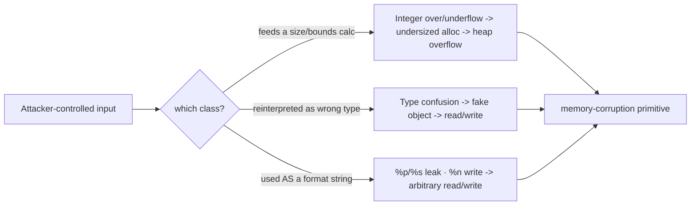

# 🔢 Integer, Type Confusion & Format String Bugs

> [!danger] Authorized simulation / lab binaries only
> Practise on binaries you compile or own. These bug classes underpin many real CVEs; understanding them drives secure coding and detection. Never target software you are not authorized to test.

## Parent Learning Order
Stack Corruption -> Heap Exploitation & Use-After-Free -> Integer, Type Confusion & Format String Bugs

## Start at Zero: Bugs That Become Memory Corruption Indirectly

Stack and heap overflows corrupt memory *directly*. This note covers the subtler classes where **valid-looking logic silently turns into a memory-safety violation**: an **integer** miscalculation that produces a wrong size, a **type confusion** that treats one object as another, and a **format string** flaw that hands an attacker a read/write primitive through `printf`. They are grouped because they share a theme — *the corruption is a second-order consequence of a logic/parsing mistake*, not an obvious buffer overrun — which is exactly why they slip past casual review and produce so many high-severity CVEs.

The unifying insight: **the program trusts a computed value or a declared type, and the attacker controls the input that makes that value or type wrong.**

> [!tip] The analogy, and where it breaks
> These bugs are like a warehouse that orders boxes based on a clerk's arithmetic: if you trick the clerk into computing "0 boxes needed" for a huge shipment (integer overflow), the goods spill onto the floor (heap overflow); a format string is like handing the clerk a label-printer template that also lets you *read and rewrite* any shelf's contents. The analogy breaks on visibility: a warehouse error is obvious when goods spill, whereas these bugs often produce *no visible symptom until exploited* — the arithmetic looked fine and the printf "worked," so they hide in code that passed review and tests.

**Prerequisites:** **Binary Exploitation Fundamentals**, **Heap Exploitation & Use-After-Free** (integer bugs usually lead to heap overflows), and C integer/format semantics.

## Integer Bugs → Memory Corruption

Integers are fixed-width, so arithmetic can **overflow, underflow, truncate, or flip sign** — and when the wrong result feeds an allocation size or a bounds check, memory corruption follows:

```c
// ❌ integer overflow in a size calculation
void *buf = malloc(count * size);   // count*size wraps to a small number...
memcpy(buf, src, count * size);     // ...but the copy uses the huge intended length -> heap overflow
```

Common variants: **signedness** (a negative length passed to a function expecting `size_t` becomes enormous), **truncation** (a 64-bit length stored in a 32-bit field), and **allocation arithmetic** (`n*sizeof(x)` wrapping). The bug is in the *math*; the crash is in a later copy — which is why they are hard to spot.

## Type Confusion

**Type confusion** occurs when code treats a chunk of memory as the *wrong type* — e.g. a script hands an object of type `A` to code that assumes type `B`, so a field that is an integer in `A` is dereferenced as a pointer in `B`. This is endemic in language runtimes and browsers (JS engines), where a single confused type gives an attacker a fake object with attacker-chosen "pointers," yielding read/write primitives. The root cause is a missing or bypassed type check, not a buffer size.

## Format String: A Read/Write Primitive from printf

When user input becomes the *format string* itself — `printf(user_input)` instead of `printf("%s", user_input)` — the attacker controls format specifiers:

- `%p`/`%x` — **leak** stack memory (defeat ASLR/canary by reading addresses).
- `%s` — **read** arbitrary memory (dereference a pointer on the stack).
- `%n` — **write** the number of bytes printed so far to a pointed-at address → an arbitrary write.

A format string is uniquely powerful: one bug gives *both* read (leak) and write (`%n`) primitives, often enough for full exploitation on its own.



## Failure Modes and Interpretation

- **Blaming the crash site, not the cause.** An integer-overflow heap corruption crashes in `memcpy`, far from the buggy arithmetic — trace the *size* back to its computation.
- **Assuming `%n` is available.** Many libc builds and hardened configs disable `%n` in writable format strings (`_FORTIFY_SOURCE`), so a format bug may be leak-only — test the read primitive first.
- **Signedness confusion in your own exploit.** Off-by-sign errors while crafting the malicious length are easy to make; verify the value the program actually computes.
- **Type confusion needs the runtime's model.** Exploiting it requires understanding the specific engine's object layout — it is not a generic byte overflow.
- **`printf("%s", user)` is safe.** The bug is *only* when input is the format argument; correctly-used printf is fine — don't over-report.

## Security Implications — the Defender's View

- **Compiler & libc hardening:** `-Wformat -Wformat-security` (and `-Werror`) reject format-string bugs at build; `_FORTIFY_SOURCE` restricts `%n`; `-ftrapv`/`-fsanitize=integer` catch integer overflow.
- **Checked arithmetic & safe types:** `__builtin_mul_overflow`, `size_t` discipline, and languages with checked/big integers remove the size-calculation class.
- **Type safety:** strongly-typed/memory-safe languages and runtime type checks eliminate type confusion — the reason browser vendors invest in it heavily.
- **Detection:** static analysis flags `printf(user)` and unchecked `a*b` sizes; fuzzing with ASan/UBSan catches integer and type bugs at the point of undefined behavior.

## Authorized Lab: Leak Memory with a Format String

> [!info] Runs on one Linux machine with gcc — a `printf(user)` bug leaks stack memory including a planted canary value
> Read-primitive demo (leak), which is safe and deterministic. Step 5 cleans up.

### Step 1 — A program with a format-string bug and a secret on the stack

```bash
mkdir -p /tmp/fmt-lab && cd /tmp/fmt-lab
cat > fmt.c <<'EOF'
#include <stdio.h>
int main(void){
    unsigned int secret = 0xC0DECAFE;   // a "canary" value on the stack
    char in[128];
    printf("say something: ");
    if (fgets(in, sizeof in, stdin)) printf(in);   // ❌ user input as the format string
    printf("\n(secret was 0x%X)\n", secret);
    return 0;
}
EOF
gcc -O0 -w -fno-stack-protector fmt.c -o fmt && echo "built"
```

```text
built
```

### Step 2 — Confirm the bug: format specifiers are interpreted

```bash
cd /tmp/fmt-lab
echo 'AAAA %p %p %p %p' | ./fmt | head -1
```

```text
say something: AAAA 0x... 0x... 0x... 0x7fff...
```

The `%p`s were interpreted (not printed literally) — the program is reading and printing stack slots the attacker never provided. That is the leak primitive.

### Step 3 — Walk the stack to leak the secret (0xC0DECAFE)

```bash
cd /tmp/fmt-lab
for i in 1 2 3 4 5 6 7 8 9 10; do
  out=$(printf '%%%d$x' $i | ./fmt 2>/dev/null | head -1)
  echo "$out" | grep -qi 'c0decafe' && { echo "LEAKED at position $i: $out"; break; }
done
```

```text
LEAKED at position <n>: say something: c0decafe
```

Using positional format specifiers (`%N$x`), the attacker walked the stack and read the secret `0xC0DECAFE` directly — demonstrating an arbitrary *read* from a single `printf` misuse. On a real target this leaks a stack canary or a libc address to defeat ASLR; adding `%n` would give an arbitrary *write*.

### Step 4 — Fix and confirm

```bash
cd /tmp/fmt-lab
sed 's/printf(in)/printf("%s", in)/' fmt.c > fmt_fixed.c
gcc -O0 -w fmt_fixed.c -o fmt_fixed
echo 'AAAA %p %p %p' | ./fmt_fixed | head -1
echo "Fixed: specifiers now printed literally -> no leak. Build with -Wformat-security to reject this at compile time."
```

```text
say something: AAAA %p %p %p
Fixed: specifiers now printed literally -> no leak. Build with -Wformat-security to reject this at compile time.
```

### Step 5 — Cleanup

```bash
cd /; rm -rf /tmp/fmt-lab; ls -d /tmp/fmt-lab 2>&1 | tail -1
```

```text
ls: cannot access '/tmp/fmt-lab': No such file or directory
```

**What you should now be able to do:** explain how integer overflow/truncation/signedness turns a size calc into a heap overflow, what type confusion is and why runtimes are prone to it, how a format-string bug yields both read (`%p`/`%s`) and write (`%n`) primitives, leak stack memory via positional specifiers, and name the compiler/libc/type-safety defenses.

## Crook → Operator → Root Checkpoint

- **Crook:** Explain why these bugs cause corruption *indirectly* (a wrong value or type), and what `printf(user_input)` allows.
- **Operator:** Leak stack memory (including a secret) with positional format specifiers, and explain how an integer overflow in a size calc leads to a heap overflow.
- **Root:** Explain the read+write power of `%n`/`%s`, why type confusion needs the runtime's object model, and how `-Wformat-security`, checked arithmetic, `_FORTIFY_SOURCE`, and memory-/type-safe languages defend each class.

---
> 🔼 Up: [[Memory Corruption Exploitation]]
